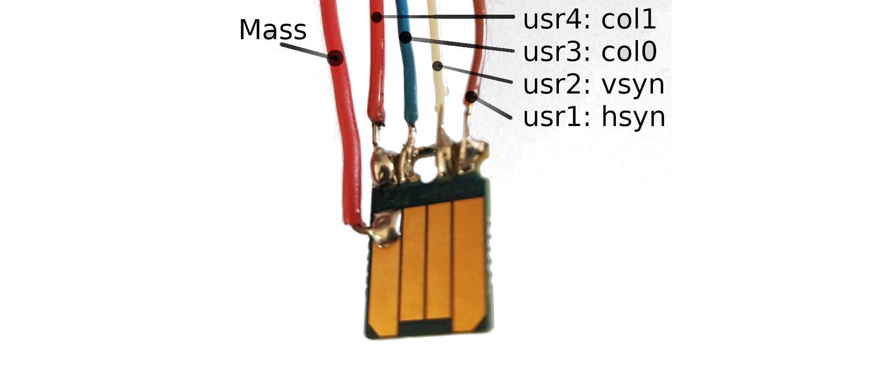
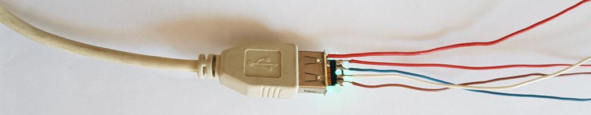

# FOMU VGA
_Generate hypnotic graphics with the FOMU_

Step 0: install development toolchain
-------------------------------------

See FOMU instructions [here](https://github.com/BrunoLevy/learn-fpga/blob/master/FemtoRV/TUTORIALS/toolchain.md).


Step 1: graft wires to the FOMU
--------------------------------



The FOMU has four pads `user_1`,...,`user_4` connected to FPGA pins
E4,D5,E5,F5. We can use them to generate the HSync and VSync VGA signals
plus two bits of color data. You will need to solder a wire to each pad, 
plus a wire to the mass, as shown on the image (five wires in total).
I observed that rigid wires with a single core are easier to solder.
Make sure the FOMU is held firmly by something (I'm using a "third
hand"), take a deep breath, everything will go fine, yes you can do it 
(with probably a result cleaner than mine) ! Then check with a
magnifying glass that there is no shortcircuit.

Step 2: VGA connector
---------------------



Connect to the VGA connector as shown on the image:
  - connect the mass to pins 5,6,7,8,9,10
  - connect `user_1` (HSync) to pin 13
  - connect `user_2` (VSync) to pin 14
  - pick the two colors you prefer among R (pin 1),G (pin 2),B (pin 3) 
    and connect them to `user_3` and `user_4`. 

Here I'm using a VGA connector with easy-to-use connections,
alternatively you can sacrify an old VGA wire, and use a continuity
tester to find which wire is connected to which pin. I'm also using 
a breadboard here for other experiments, such as using a resistor 
ladder to generate 4 levels of grayscale (coming next).

Step 4: Plug the FOMU to the computer
-------------------------------------


For easier insertion and removal, I'm using an USB chord. Install the
plastic cover on the FOMU, and insert it gently into the USB chord. 
Then plug the other end of the USB chord to your computer. Normally the
LED of the FOMU will beat slowly. 

Now you can plug your screen to the VGA connector.

Step 3: Program
---------------
```
$ cd learn-fpga/Basic/FOMU/FOMU_VGA
$ ./make_it.sh
```

If everything goes well, hypnotic circles and something that
ressembles a scrolling circuit will be displayed on the screen.

Step 4: How it works / playing with the program
-----------------------------------------------

Now it is time to write your own designs. To do so, you can modify
`vga.v`, and use `./make_it.sh` to synthethize the design and send it 
to the device, but there is something you need to know: 
you need to unplug / replug the FOMU before re-programing
it, so that it is reset in DFU mode.

Let us take a look at `vga.v`. First the interface of the module:
```
module vga (
   input  clki,     // ->48 Mhz clock input
   output rgb0,     // \
   output rgb1,     //  >LED
   output rgb2,     // /
   output user_1,   // ->hsync
   output user_2,   // ->vsync
   output user_3,   // ->color0
   output user_4,   // ->color1
   output usb_dp,   // \
   output usb_dn,   //  >USB pins (should be driven low if not used)
   output usb_dp_pu // /
   );
   
```
Here we have the 48 MHz clock `clki`, 
the four pads `user_1`,...`user_4` that we will use to generate our VGA signal,
the three wires that control the multicolor LED,
and three wires for the USB that should be set to 0 if not used. 

Next section of the file is a VGA generator. I have implemented three different
modes (640x480, 1024x768, 1280x1024). Each mode defines some parameters
(width, height of course, plus some timings for horizontal and
vertical sync, plus the frequency of the pixel clock). To generate the
pixel clock, you will need to transform the 48 MHz clock of the FOMU
into another frequency (for instance, 25 MHz for 640x480). This is done
by a special FPGA primitive (`SB_PLL40_CORE` for the ICE40UP5k used by
the FOMU). To find the correct parameters, you can use the `icepll`
utility. For instance, for 640x480, you need a 25 MHz pixel clock, then
`icepll -i 48 -o 25` will give you the parameters to configure the
`SB_PLL40_CORE`.

The generic part of the VGA generator, that will scan all `VGA_X` and
`VGA_Y` positions in the screen. In fact, it scans an area that is larger than
the screen (what's outside the screen corresponds to the hsync and vsync
signals). The `VGA_DrawArea` signals tells you whether you are in the
screen (1) or generating sync signals (0). There is also a `VGA_Frame`
counter used to display animations. Finally, there is a two-bits `out_color`
register that stores the color of the current pixel (remember, we can
only use two wires out of R,G,B). 

Then, there is the code that computes the actual graphic effect. Two
effects are implemented: animated concentric circles and XOR-modulo
"alien-art":
   - concentric circles: using the hardware DSP blocks of the
     Ice40-UP5K, it is possible to compute multiplications in 1 cycle.
     DSP blocks are automatically inferred by YOSYS (just need to pass
     the `-dsp` flag to yoysys, see `makeit.sh`).
   - dithering: the concentric circles demo uses Bayer ordered dithering
     to simulate 16 colors from the 4.
   - XOR-modulo: `(VGA_X ^ VGA_Y) % something` generates interesting
     patterns. I'm using `VGA_frame` to make it scroll, and two
     different "parallax planes" to have a more interesting effect. Note
     that it eats-up most of the LUTs because of the modulo operator !

Finally, there is a special `SB_IO` block, that uses the flipflops
associated with the IO pins:
```
   SB_IO #(
      .PIN_TYPE(5'b0101_00) // 0101: latched output  00: no input
   ) user_IO[3:0] (         // Yes, in Verilog you can declare 4 pins in 1 decl
       .PACKAGE_PIN({user_1,user_2,user_3,user_4}),
       .D_OUT_0({VGA_hSync, VGA_vSync, VGA_DrawArea ? out_color : 2'b00}),
       .OUTPUT_CLK({4{pixel_clk}})
   );
```
It ensures that the VGA signals are properly synchronized. Without it
the design mostly works at 640x480, but has many glitches at higher
resolution. The glitches are due to tiny differences in the propagation 
delays between the four generated signals. Using the flipflops integrated 
in the IO pins drivers greatly improves the stability of the signals and 
the quality of the image. 

Links / inspiration
-------------------

 - [[1] Lukas Hartmann tweet 1](https://twitter.com/mntmn/status/1281632873448124417)
 - [[2] Lukas Hartmann tweet 2](https://twitter.com/foone/status/1281740047461396480)
 - [[3] Lukas Hartmann github](https://github.com/mntmn/fomu-vga)
 - [[4] FPGA4fun](https://www.fpga4fun.com/PongGame.html)


