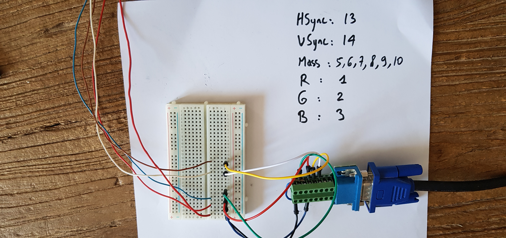

# FOMU VGA
_Generate hypnotic graphics with the FOMU_

Step 0: install development toolchain
-------------------------------------

See FOMU instructions [here](https://github.com/BrunoLevy/learn-fpga/blob/master/FemtoRV/TUTORIALS/toolchain.md).

Step 1: graft wires to the FOMU
--------------------------------

The FOMU has four pads `user_1`,...,`user_4` connected to FPGA pins
E4,D5,E5,F5. We can use them to generate the HSync and VSync VGA signals
plus two bits of color data. You will need to solder a wire to each pad, 
plus a wire to the mass, as shown on the image (five wires in total).
I observed that rigid wires with a single core are easier to solder.

Step 2: VGA connector
---------------------

Connect to the VGA connector as shown on the image:
  - connect the mass to pins 5,6,7,8,9,10
  - connect `user_1` (HSync) to pin 13
  - connect `user_2` (VSync) to pin 14
  - pick the two colors you prefer among R (pin 1),G (pin 2),B (pin 3) 
    and connect them to `user_3` and `user_4`. 

Here I'm using a VGA connector with easy-to-use connections,
alternatively you can sacrify an old VGA wire, and use a continuity
tester to find which wire is connected to which pin. I'm also using 
a breadboard here for other experiments, such as using a resistor 
ladder to generate 4 levels of grayscale (coming next).

