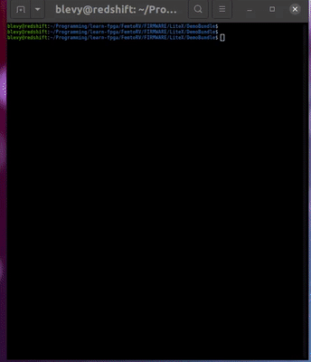

Demo bundle firmware for LiteX
===============================




This firmware for LiteX contains a bundle of small demo programs, that can be used to
test and benchmark different cores. Some of them display graphic effects on the SSD1331
OLED display if it is plugged and configured. Some others (tinyraytracer and mandebrot)
display the result on the OLED screen (if configured) and in the 
console (using ANSI color codes, this makes BIG pixels !).

| demo           | description                            | comments                       |
|----------------|----------------------------------------|--------------------------------|
|tinyraytracer   | raytracer by Dmitry Sololov            | textmode (+ OLED if configured)|
|mandelbrot      | fixed-point Mandelbrot set             | textmode (+ OLED if configured)|
|raystones       | raytracer perf test                    | can be used to benchmark cores |
|oled_test       | tests OLED screen                      | only if OLED configured        |
|oled_riscv_logo | 90-ish rotozoom demo                   | only if OLED configured        |
|oled_julia      | animated Julia set by Sylvain Lefebvre | only if OLED configured        |


tinyraytracer / raystones
-------------------------
It is a C version of Dmitry Sokolov's [tinyraytracer](https://github.com/ssloy/tinyraytracer), adapted to LiteX.
It can be used to benchmark different cores running on LiteX.
Raytracing is interesting for benchmarking cores, because it
massively uses floating point operations, either implemented in
software or by an FPU.

Step 0: synthethize
-------------------
Follow the instructions [here](https://github.com/BrunoLevy/learn-fpga/blob/master/FemtoRV/TUTORIALS/litex.md).
If you have the small OLED display plugged on the ULX3S (reference `SSD1331`), 
you can add the `--with-oled` option to the command line. 

Step 1: compile
---------------
```
$ make BUILD_DIR=<path where you synthesized LiteX> 
```
(for instance, `LiteX/build/radiona_ulx3s`). 

Alternatively, you can edit `Makefile` and hardwire `LITEX_DIR` and `LITEX_PLATFORM`.

If everything goes well, this will generate `demo.bin`.

Step 2: execute
---------------

```
$ lxterminal --kernel demo.bin /dev/ttyUSBnn
litex> reboot
litex-demo-bundle> tinyraytracer
```
This will display the result in the terminal window (with BIG pixels
!). This is text mode, with escape sequences to change the background
color. If you have the small OLED display plugged in and configured, 
you will see also the image on it. 

Alternatively, you can use:
```
litex-demo-bundle> raystones
```
This will compute the image without rendering in the terminal
(rendering in the terminal takes time for some reasons, and if you 
want to compare the performances of cores, you want timings that are
as precise as possible).

Performance is measured in "raystones", i.e. pixels per seconds per
MHz (not an official unit !).

If you have the small SSD1331 OLED screen connected on the ULX3S, and if
you have synthesized LiteX with the flag to support it (`--with-oled`), 
then the firmware comes with other graphic demos, type `help` to see the list.

If you test multiple cores, do not forget to recompile the software:
```
$ make clean all
```

Compilation flags are adapted to the configured core (for instance,
RV32I, RV32IM, RV32IMC, RV32IMFC ...). If it crashes, it may be 
because you executed code compiled with flags that are not supported
by the configured core (for instance, play with femtorv32-petitbateau
that supports RV32IMFC, then switch to femtorv32-quark but load the
software that was compiled for petitbateau).


Other cores with FPU
--------------------

VexRiscV is a more efficient core that optionally has a FPU. To
generate LiteX with VexRiscV and a FPU, you will need to modify a
bit the core definition file (because there is currently no way
of passing the options to generate the FPU), but it is easy:

- edit `litex/litex/soc/cores/cpu/vexriscv_smp/core.py`
- set `dcache_width` and `icache_width` to `64` (lines 52 and 53)
- set `with_fpu` to `True` (line 57)

Then generate LiteX with the `vexriscv_smp` processor (adapt to your own device and sdram module):
```
python3 -m litex_boards.targets.radiona_ulx3s --cpu-type=vexriscv_smp --build --load --device LFE5U-85F --sdram-module AS4C32M16 --with-oled 
```

Recompile the firmware (`make clean all`) and load it (`make terminal` then `reboot`).


LiteX framebuffer on the ULX3S
------------------------------

Depending on your version of ULX3S and version of LiteX, you may have to tinker a bit
before having a framebuffer that works:
- `litex-boards/litex_boards/platforms/radiona_ulx3s.py`: if your board
  is a recent one (ver >= 1.7), which is very likely, make sure `data0_p` 
  is mapped to pin `A16` and `data2_p` is mapped to pin `A12`. This
  made me bang my head against the wall ! (R,G,B) wires were swapped
  between early versions and more recent ones. Since `dataO_p` also
  transmits hsync and vsync, you will get no image if it is wrong !
- `litex/litex/soc/integration/soc.py`: in `add_video_framebuffer()`,
   add `fifo_depth = 25600` to the parameters of `VideoFrameBuffer`
   constructor (I think this fifo determines the latency of DMA,
   25600 or any multiple of 640x4 bytes will result in shifting 
   the image vertically instead of wrecking the scanlines)
- it seems LiteX DMA will not respect timings for a 64MBytes SDRAM.
  If you have an `AS4C32M16` SDRAM chip, pretend it is an `AS4C16M16`
  (`--sdram-module AS4C16M16` on LiteX command line when synthesizing).
- `litex-boards/litex_boards/targets/radiona_ulx3s.py`: on my monitor,
   `640x480@74Hz` is more stable than `640x480@60Hz`.
- `--sdram-rate 1:2` results in slightly improved performance. Note:
  there may be a bug that swaps RGB/BGR when you do that.

To summarize, here is the command line I'm using to synthesize LiteX:
```
python3 -m litex_boards.targets.radiona_ulx3s --cpu-type femtorv --cpu-variant petitbateau --build --load --device LFE5U-85F --sdram-module AS4C16M16 --sdram-rate 1:2 --with-video-framebuffer --with-oled --ecppack-compress

```
(replace `--device LFE5U-85F` and `--sdram-module AS4C16M16` with values adapted to your board).

SDCard access
-------------

If you have a recent ULX3S, you will also need to tinker a bit to enable SDCard access. The SDCard
can be either driven by the on-board ESP32 (for instance to be able to send files on it through
Wifi, cool feature) or by the FPGA. For now, let us see how to hardwire FPGA more:

- `litex-boards/litex_boards/platforms/radiona_ulx3s.py`: add the end of the `_io_2_0` block,
add the following pin:
```
  ("wifi_en", 0, Pins("F1"), IOStandard("LVCMOS33"), Misc("PULLMODE=UP"), Misc("DRIVE=4")),
```
- `litex-boards/litex_boards/targets/radiona_ulx3s.py`, at the end of the `__init__()` function
  of `BaseSoc`, add the following one:
```
    self.comb += platform.request("wifi_en").eq(0)  
```

Now you can synthesize the bitstream, with the `--with-spi-sdcard` flag. Note: there is also a `--with-sdcard` mode,
that has faster transfer rate, but I did not manage to make it work (so we'll stick to spi mode for now).

Then you can re-build the demo program, this will add a new `catalog` command that lists the files
present on the SDCard.

LiteX system libraries have everything necessary to access files on
the SDCard, wonderful ! Take a look at `commands.c`, function
`catalog()` that implements the eponym command. The filesystem API is in
`litex/litex/soc/software/libfats/ff.h`. It has all the `<stdio.h>` functions you are
used to, except that you need to insert an underscore: `f_open()` instead of `fopen()`.

Let us see now how we can add a CSR to switch-on / switch-off the ESP32.
We first create a new class in `litex-boards/litex_boards/targets/radiona_ulx3s.py`:

```
class ESP32(Module, AutoCSR):
    def __init__(self, platform):
       self._enable = CSRStorage()
       self.comb += platform.request("wifi_en").eq(self._enable.storage)
```

In the `__init__()` function of `BaseSoc`, replace the 
line we added right before(`self.comb += platform.request("wifi_en").eq(0)`)
with creating an instance of `ESP32`:
```
  self.submodules.esp32 = ESP32(platform)
```

Re-synthesize the design. If you take a look now at `build/radiona-ulx3s/software/include/generated/csr.h`,
you will see that LiteX has automatically generated functions to manipulate the CSR for you:
```
...
/* esp32 */
#define CSR_ESP32_BASE (CSR_BASE + 0x800L)
#define CSR_ESP32_ENABLE_ADDR (CSR_BASE + 0x800L)
#define CSR_ESP32_ENABLE_SIZE 1
static inline uint32_t esp32_enable_read(void) {
	return csr_read_simple(CSR_BASE + 0x800L);
}
static inline void esp32_enable_write(uint32_t v) {
	csr_write_simple(v, CSR_BASE + 0x800L);
}
...
```

So we can create a new command (in `commands.c`):
```
#ifdef CSR_ESP32_BASE
static void esp32(int nb_args, char** args) {
   if (nb_args < 1) {
      printf("esp32 on|off\n");
      return;
   }
   if(!strcmp(args[0],"on")) {
       esp32_enable_write(1);
   } else if(!strcmp(args[0],"off")) {
       esp32_enable_write(0);
   } else {
       printf("esp32 on|off");
   }
}
define_command(esp32, esp32, "turn ESP32 on/off", 0);
#endif
```

Now we are able to switch the ESP32 on and off, and to access files on the SDCard. Note that if the ESP32
is switched on, SDCard file access will fail.

RayStones performances of various cores
---------------------------------------

The table below show the "raystones" score (pixel/s/MHz) for several cores.
LUTs and FFs measured on an ULX3S (ECP5) with the following command:

```
python3 -m litex_boards.targets.radiona_ulx3s --cpu-type=xxxx --cpu-variant=yyyy --build --load --device LFE5U-85F --sdram-module AS4C32M16
```
TODO: need to recompute the stats with framebuffer active and AS4C16M16


 | core                 | instr set  | raystones |  total LUTs | total FFs   | 
 |----------------------|------------|-----------|-------------|-------------|
 | serv                 | rv32i      |   0.111   |  3381       |  2664       |
 |                      |            |           |             |             |
 | picorv32-minimal     | rv32i      |   1.45    |  4333       |  3320       |
 | picorv32-standard    | rv32im     |   2.352   |  5974       |  4632       |
 |                      |            |           |             |             | 
 | femtorv-quark        | rv32i      |   1.99    |  3721       |  2898       | 
 | femtorv-electron     | rv32im     |   3.373   |  4874       |  3270       | 
 | femtorv-gracilis     | rv32imc    |   3.516   |  5416       |  3528       | 
 | femtorv-petitbateau  | rv32imfc   |  45.159   |  8677       |  4234       |
 |                      |            |           |             |             | 
 | vexriscv imac        | rv32imac   |   7.987   |  6348       |  5804       |
 | vexriscv_smp         | rv32imafd  | 124.121   |  9792       | 10024       |

(nearly) bare core on ULX3S:

| variant     | LUTs  | FFs   |
|-------------|-------|-------|
| quark       | 1226  | 430   | 
| electron    | 2150  | 802   | 
| gracilis    | 2799  | 1018  | 
| petitbateau | 6197  | 1724  | 

comparing with LiteX numbers, we can deduce that LiteX SOC weights approximatively 2500 LUTs
and 2500 FFs. Then we can measure "raystones density", that is, `raystones/(LUT+FF)*10^6`:

 | core                 | instr set  | raystones |  core LUTs  |  core FFs   | raystones density | 
 |----------------------|------------|-----------|-------------|-------------|-------------------|
 | serv                 | rv32i      |   0.111   |   881       |   164       | 106               |
 |                      |            |           |             |             |                   | 
 | picorv32-minimal     | rv32i      |   1.45    |  1833       |   820       | 546               |
 | picorv32-standard    | rv32im     |   2.352   |  3474       |  2132       | 419               |
 |                      |            |           |             |             |                   | 
 | femtorv-quark        | rv32i      |   1.99    |  1221       |   398       | 1229              | 
 | femtorv-electron     | rv32im     |   3.373   |  2364       |   770       | 1076              | 
 | femtorv-gracilis     | rv32imc    |   3.516   |  2916       |  1028       | 891               | 
 | femtorv-petitbateau  | rv32imfc   |  45.159   |  6177       |  1734       | 5708              |
 |                      |            |           |             |             |                   |  
 | vexriscv imac        | rv32imac   |   7.987   |  3848       |  3304       | 1116              |
 | vexriscv_smp         | rv32imafd  | 124.121   |  7292       |  7524       | 8377              |

(note: since I estimated the weight of the SOC and subtracted it, 
these numbers are probably wrong, especially for SERV that is super
small, and that has probably at least 200 raytsones density I'd have
expected).
