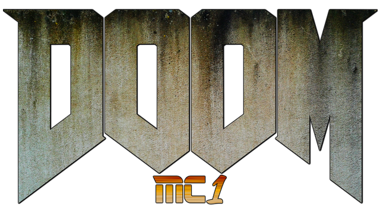

# MC1-DOOM

This is the classic game DOOM (by id Software) ported to the
[MRISC32](https://mrisc32.bitsnbites.eu/)-based computer
[MC1](https://github.com/mrisc32/mc1).

## Origins & License

MC1-DOOM is based on the original linuxdoom v1.10 code base from 1997, with
some bugfixes and alterations to make it work on MRISC32, and of course
graphics and I/O routines for the MC1 computer.

Original [README.TXT](iddoc/README.TXT).

The source code is released under the GNU General Public License, as
outlined in [DOOMLIC.TXT](iddoc/DOOMLIC.TXT).

## Building for MC1

In order to build MC1-DOOM for an MC1 target, you need the MRISC32 GNU
toolchain installed. You can find it [here](https://github.com/mrisc32/mrisc32-gnu-toolchain).

```bash
$ mkdir src/out
$ cd src/out
$ cmake -G Ninja -DCMAKE_TOOLCHAIN_FILE=../mc1-toolchain.cmake -DCMAKE_BUILD_TYPE=Release ..
$ ninja
```

The resulting binary is `src/out/mc1doom.bin`.

## Building for other platforms

For testing purposes, you can also build MC1-DOOM for other platforms,
such as Linux.

To install dependencies on Ubuntu:

```bash
$ sudo apt install libasound2-dev libsdl2-dev
```

To build:

```bash
$ mkdir src/out-host
$ cd src/out-host
$ cmake -G Ninja -DCMAKE_BUILD_TYPE=Debug ..
$ ninja
```

## Game data

To run Doom you need a game WAD file. For instance the
[shareware version of Doom 1](https://doomwiki.org/wiki/DOOM1.WAD).

`mc1doom` will search for a valid WAD file in the current working directory
(i.e. the folder from which the program is started).
