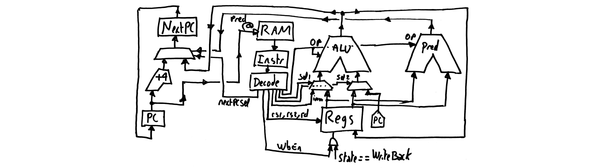

Episode VIII: Adding the branch instructions
-----------------------------------------

Now, to make things more interesting, we add branch instructions. With
branch instructions, we will have enough to create a blinky (yeha !!).
Let us see how to do that. It will require more drastic changes in the
design, as can be seen from the schematic. 

First, on the left part, the value of `NextPC` is now selected from a
mux, that uses either `PC+4` or the output of the ALU. This mux is
driven by both the result of the predicate (right part of the
schematic) and a new signal from the instruction decoder. Now on the
right part of the schematic, the predicate is wired to the two outputs
of the register file. Now when the branch is taken, `PC` should be set
to `PC + imm`. To do that, we reuse the adder of the ALU. The two muxes
select `imm` on the left, and `PC` on the right. In addition, `op` is
forced to zero (which means `ADD`) by an additional signal (not shown
here) from the decoder. 

At this point, we have implemented 3 instructions (out of 9), but we
can do interesting things with this processor. Since for now it cannot
store values to the memory, it cannot output anything, but it is
possible to wire signals from one of the registers, and connect these
signals to the LEDs. Then you can program two nested loops (the inner
one is a delay) to implement a blinky. To generate the initial content
of the RAM, you can use the gnu risc-v assembly, then the `objcopy`
command to convert an object file into raw hexadecimal that can be
understood by the `readmemh` command of verilog. Believe me or not,
when your own processor starts executing risc-v code compiled by the 
gnu assembly, even if it is only blinking a couple of LEDs, it is a
fantastic experience !

TODO: changes in the state machine.

TODO: restore the designs, assembly programs, test bench.

Now we are 6 instructions away from a complete RV32I processor (minus
`FENCE` and `SYSTEM`, but we can live without them). We need to
implement the four weird instructions (as I like to call them). They
are not that weird, and easy to implement. Then we will need to
implement the different variants of `load` and `store` (more
difficult).

[Next](FemtoRV32_IX.md)
