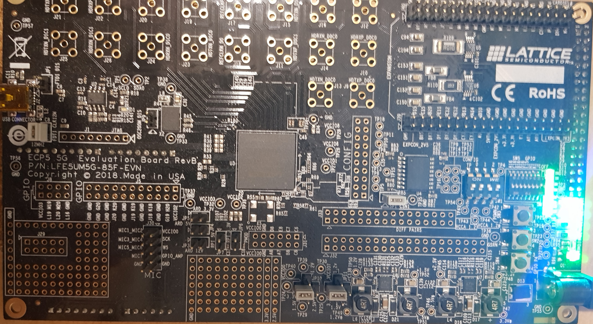
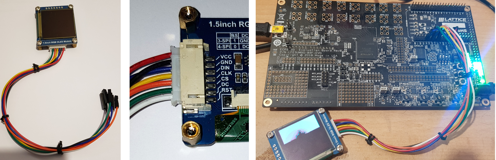

ECP5 evaluation board - Tutorial
================================



This tutorial will show you how to install FPGA development tools,
synthesize a RISC-V core, compile and install programs and run them
on a ECP5 evaluation board.

_Note: the following instructions are for Linux (I'm using Ubuntu).
Windows users can run the tutorial using WSL. It requires some
adaptation, as explained [here](WSL.md)._

Before starting, you will need to install the OpenSource FPGA
development tools, Yosys (Verilog synthesis), Trellis (tools for
Lattice ECP5 FPGA), NextPNR (Place and Route), ujprog (tool to send the
bitstream to the ECP5 evaluation board). Although there 
exists some precompiled packages, I highly recommend to get fresh
source versions from the repository, because the tools quickly 
evolve.

Step 0: install FemtoRV
=======================
```
$ git clone https://github.com/BrunoLevy/learn-fpga.git
```

Step 1: install FPGA development tools
======================================

Yosys
-----

Follow setup instructions from [yosys website](https://github.com/YosysHQ/yosys)

*TL;DR*

Install prerequisites:
```
$ sudo apt-get install build-essential clang bison flex \
  libreadline-dev gawk tcl-dev libffi-dev git \
  graphviz xdot pkg-config python3 libboost-system-dev \
  libboost-python-dev libboost-filesystem-dev zlib1g-dev
```
Get the sources:
```
$ git clone https://github.com/YosysHQ/yosys.git
```
Compile and install it:
```
$ cd yosys
$ make
$ sudo make install
```

Project Trellis
---------------

Follow setup instructions from [project trellis website](https://github.com/YosysHQ/prjtrellis)

*TL;DR*

Get the sources:
```
$ git clone --recursive https://github.com/YosysHQ/prjtrellis
```

Compile and install it:
```
$ cd libtrellis
$ cmake -DCMAKE_INSTALL_PREFIX=/usr/local .
$ make
$ sudo make install
```

NextPNR
-------

Follow setup instructions from [nextpnr website](https://github.com/YosysHQ/nextpnr)

*TL;DR*


Get the sources:
```
$ git clone https://github.com/YosysHQ/nextpnr.git
```
Compile and install it:
```
$ cd nextpnr
$ cmake -DARCH=ecp5 -DTRELLIS_INSTALL_PREFIX=/usr/local -DCMAKE_INSTALL_PREFIX=/usr/local .
$ make -j 4
$ sudo make install
```

ujprog
------
Now you need a program to send bitstreams to the board.
I'm using ujprog, because I found it easier to setup. Pre-installed
binairies can be obtained as follows:
```
git clone https://github.com/emard/ulx3s-bin
sudo cp ulx3s-bin/usb-jtag/linux-amd64/ujprog /usr/local/bin
```

Note that there are several alternatives, such as OpenOCD. If you prefer to use OpenOCD,
you will need to edit `Makefile` (see commented-out line in 
`ECP5_EVN.prog` target)

Step 2: Configure USB rules
===========================
We need to let normal users program the ULX3S through USB. This
can be done by creating in `/etc/udev/rules.d` a file `80-fpga-ulx3s.rules`
with the following content:
```
# this is for usb-serial tty device
SUBSYSTEM=="tty", ATTRS{idVendor}=="0403", ATTRS{idProduct}=="6015", \
  MODE="664", GROUP="dialout"
# this is for ujprog libusb access
ATTRS{idVendor}=="0403", ATTRS{idProduct}=="6015", \
  GROUP="dialout", MODE="666"
```

Step 3: Configure femtosoc and femtorv32
========================================
Time to edit `learn-fpga/FemtoRV/RTL/femtosoc_config.v`. This file lets you define what type
of RISC-V processor you will create, and which device drivers in the
associated system-on-chip. For now we activate the LEDs (for visual
debugging) and the UART (to talk with the system through a
terminal-over-USB connection). We use 256 Kbytes of RAM. It is not 
very much, but for now I'm not able to use the DRAM on the ULX3S
(but plan to integrate @sylefeb's SLICE memory controller).
You will see that
with 256kb of RAM, you can still program nice and interesting RISC-V
demos. 

We configure `FemtoRV/RTL/femtosoc_config.v` as follows (we keep unused options as commented-out lines):
```
/*
 * Optional mapped IO devices
 */
`define NRV_IO_LEDS         // Mapped IO, LEDs D1,D2,D3,D4 (D5 is used to display errors)
//`define NRV_IO_UART         // Mapped IO, virtual UART (USB)
//`define NRV_IO_SSD1351      // Mapped IO, 128x128x64K OLed screen
//`define NRV_IO_MAX2719      // Mapped IO, 8x8 led matrix
//`define NRV_IO_SPI_FLASH    // Mapped IO, SPI flash  
//`define NRV_IO_SPI_SDCARD   // Mapped IO, SPI SDCARD
//`define NRV_IO_BUTTONS      // Mapped IO, buttons

`define NRV_FREQ 50        // Frequency in MHz. You can try overclocking (up to 100 MHz)
                                                  
// Quantity of RAM in bytes. Needs to be a multiple of 4. 
// Can be decreased if running out of LUTs (address decoding consumes some LUTs).
// 6K max on the ICEstick
//`define NRV_RAM 393216       // bigger config for ULX3S
`define NRV_RAM 262144       // default for ULX3S 
//`define NRV_RAM 6144         // default for IceStick (maximum)
//`define NRV_RAM 4096         // smaller for IceStick (to save LUTs)

`define NRV_CSR         // Uncomment if using something below (counters,...)
`define NRV_COUNTERS    // Uncomment for instr and cycle counters (won't fit on the ICEStick)
`define NRV_COUNTERS_64 // ... and uncomment this one as well if you want 64-bit counters
`define NRV_RV32M       // Uncomment for hardware mul and div support (RV32M instructions)

/*
 * For the small ALU (that is, when not using RV32M),
 * comment-out if running out of LUTs (makes shifter faster, 
 * but uses 60-100 LUTs) (inspired by PICORV32). 
 */ 
`define NRV_TWOSTAGE_SHIFTER 
```

Step 4: Configure firmware
==========================
Now, edit `FemtoRV/FIRMWARE/makefile.inc`. You have two things to do,
first indicate where the firmware sources are installed in the `FIRMWARE_DIR`
variable. Second, chose the architecture, ABI and optimization flags
as follows:
```
ARCH=rv32im
ABI=ilp32
OPTIMIZE=-O3
```

Step 5: Examples
================

First you need to generate a program. Let us start with a simple
blinker (not very exciting, it will be better after):
```
cd FIRMWARE
./make_firmware.sh ASM_EXAMPLES/blinker_loop.S
cd ..
```

You can now synthesize the design and send it to
the device. Plug the device in a USB port, then:
```
$make ECP5_EVN
```
The first time you run it, it will download RISC-V development tools (takes a while).

Examples with the OLED screen
=============================


Let us generate fancy graphics. For this, you will need a
_SSD1351 128x128 oled display_. It costs around $15 (there exists
cheaper screens, such as 240x240 IPS screens driven by the ST7789, but
they really do not look as good, and they are not compatible, believe me
the SSD1351 is worth the price). Make sure you get one of good quality 
(if it costs less than $5 then I'd be suspicious, some users reported 
failures with such low-cost versions). Got mine from Waveshare. Those
from Adafruit were reported to work as well.

Connect the wires. You may change pin assignment if you want, by 
editing `ecp5_evn.lpf`. Default configuration is as follows:

| OLED display pin name | pin description      | pin on the ECP5-EVN  |
|-----------------------|----------------------|----------------------|
|  CS                   | Chip Select          | D13                  |
|  DC                   | Data/Command         | E12                  |
|  RES or RST           | Reset                | E13                  |
|  SDA or DIN           | Data                 | D11                  |
|  SCL or CLK           | Clock                | D12                  |
|  VCC                  | +3.3V                | +3.3V                |
|  GND                  | Ground               | GND                  |
             
Note that finding the pins on the ECP5-EVN is a bit painful because they
are in a seemingly random order ! (but you can imagine that routing all 
the pins out of this beast is a difficult task, especially on this
evaluation board that has many many connectors).


Now configure `FemtoRV/RTL/femtosoc_config.v` as follows:
```
/*
 * Optional mapped IO devices
 */
`define NRV_IO_LEDS         // Mapped IO, LEDs D1,D2,D3,D4 (D5 is used to display errors)
//`define NRV_IO_UART         // Mapped IO, virtual UART (USB)
`define NRV_IO_SSD1351      // Mapped IO, 128x128x64K OLed screen
//`define NRV_IO_MAX2719      // Mapped IO, 8x8 led matrix
//`define NRV_IO_SPI_FLASH    // Mapped IO, SPI flash  
//`define NRV_IO_SPI_SDCARD   // Mapped IO, SPI SDCARD
//`define NRV_IO_BUTTONS      // Mapped IO, buttons
```

Let us compile a test program:
```
$ cd FIRMWARE
$ ./make_firmware.sh EXAMPLES/test_OLED.c
$ cd ..
$ make ECP5_EVN
```
If everything goes well, you will see an animated colored pattern on
the screen. Note that the text-mode demos (`hello.c` and `sieve.c`)
still work and now display text on the screen. There are other
programs that you can play with:


_(The black diagonal stripes are due to display refresh, they are not visible normally)._

| Program                                      | Description                                                                      |
|----------------------------------------------|----------------------------------------------------------------------------------|
| `ASM_EXAMPLES/test_OLED.S`                   | displays an animated pattern.                                                    |
| `ASM_EXAMPLES/mandelbrot_OLED.S`             | displays the Mandelbrot set.                                                     |
| `EXAMPLES/cube_OLED.c`                       | displays a rotating 3D cube.                                                     |
| `EXAMPLES/mandelbrot_OLED.c`                 | displays the Mandelbrot set (C version).                                         |
| `EXAMPLES/riscv_logo_OLED.c`                 | a rotozoom with the RISCV logo (back to the 90's).                               |
| `EXAMPLES/spirograph_OLED.c`                 | rotating squares.                                                                |
| `EXAMPLES/test_OLED.c`                       | displays an animated pattern (C version).                                        |
| `EXAMPLES/demo_OLED.c`                       | demo of graphics functions(old chaps, remember EGAVGA.bgi ?).                    |
| `EXAMPLES/test_font_OLED.c`                  | test font rendering.                                                             |
| `EXAMPLES/sysconfig.c`                       | displays femtosoc and femtorv configurations.                                    |
|                                              |                                                                                  |
|_Larger ones (that would not fit on IceStick)_|                                                                                  |
| `EXAMPLES/imgui_xxxx.c`                      | some ports from [ImGui challenge](https://github.com/ocornut/imgui/issues/3606). |
| `EXAMPLES/mandelbrot_float_OLED.c`           | displays the Mandelbrot set (floating-point version, using gcc's software FP).   |
| `EXAMPLES/tinyraytracer.c`                   | a port from [TinyRaytracer](https://github.com/ssloy/tinyraytracer).             |

The LIBFEMTORV32 library includes some basic font rendering, 2D polygon clipping and 2D polygon filling routines. 
For most of the programs, everything fits in the available 6kbytes of
memory for the smallest configuration (IceStick) ! 
The larger programs use floating point arithmetics, implemented 
in software in gcc's libraries (there will be one day a hardware FPU
for femtorv32, maybe...). 
