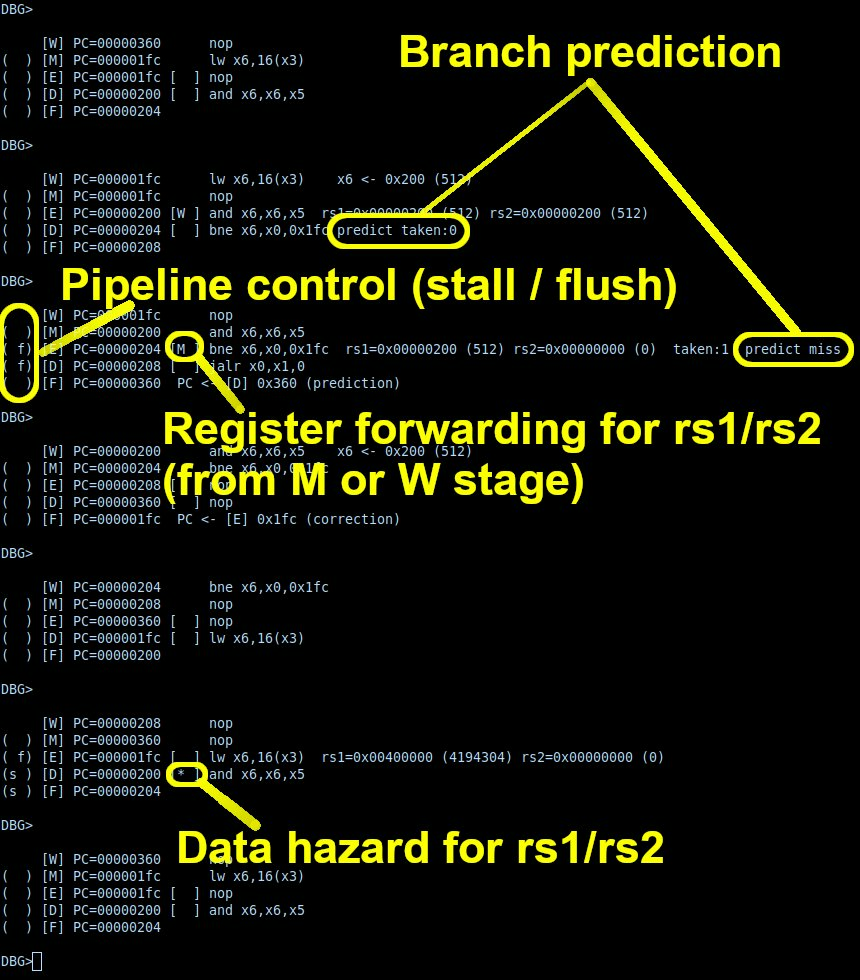

# From Blinker to RISC-V episode II - Pipelining

In the [previous episode](README.md), we learnt how to create a fully functional
RISC-V processor on a FPGA. Our processor is not the most efficient,
since it uses between 3 and 4 cycles per instruction. Modern
processors are much more efficient, and can execute several instructions
per cycle, thanks to different techniques. We will see here how to morph
our super-simple processor into a more efficient pipelined processor.

For this episode, you will need a FPGA with at least 128kB BRAM
(e.g., ULX3S). You can also run it purely in simulation. 

## Step 1: separate instruction and data memory

Our previous processor [step24.v](step24.v) has a "unified memory",
and accesses both program and
data using the same wires. For a pipelined processor, things are different
internally: it has a separate program memory and data memory. In fact, these
memories are caches, filled from a unique memory bus connected to the outside
world. For now, I don't know how a cache works (will be for next steps), so
to make things simpler, we will have a "program ROM" and a "data RAM" in the
processor (64 kB each), directly initialized from a `.hex` file (we will see
later how to create these `.hex` files from an `ELF` executable):

```verilog
   reg [31:0] PROGROM [0:16383];
   reg [31:0] DATARAM [0:16383];   
   initial begin
      $readmemh("PROGROM.hex",PROGROM);
      $readmemh("DATARAM.hex",DATARAM);      
   end
```

- `PROGROM` is where instructions are stored;
- `DATARAM` is where the variables are stored. `LOAD` and `STORE`
instructions will be able to read and write from/to this memory
(but they won't be able to access the program memory).


The previous memory busses are replaced with internal wires:

```verilog
   wire [31:0] mem_addr;
   wire [31:0] mem_rdata;
   wire [31:0] mem_wdata;
   wire [3:0]  mem_wmask;
```

As compared to before, `mem_rstrobe` and `mem_rbusy` are no longer here:
the internal memories always delivers the data at `mem_addr` at the next
cycle. 

To be able to talk to the outside world, our processor still has a 
memory bus for the mapped IO page (that we use to communicate with
the `UART` and other devices):

```verilog
module Processor (
    ...
    output [31:0] IO_mem_addr,  
    input [31:0]  IO_mem_rdata, 
    output [31:0] IO_mem_wdata, 
    output 	  IO_mem_wr     
);
```

Now we need to route everything to the internal memory busses. We keep the
same IO page as before (so that we can reuse the same code), indicared by
bit 22 of memory addresses:

```verilog
   wire isIO  = mem_addr[22];
   wire isRAM = !isIO;
```

Data ram is read and optionally written at each cycle, as follows:

```verilog
   wire [13:0] mem_word_addr = mem_addr[15:2];
   reg [31:0] dataram_rdata;
   wire [3:0] dataram_wmask = mem_wmask & {4{isRAM}};
   always @(posedge clk) begin
      dataram_rdata <= DATARAM[mem_word_addr];
      if(dataram_wmask[0]) DATARAM[mem_word_addr][ 7:0 ] <= mem_wdata[ 7:0 ];
      if(dataram_wmask[1]) DATARAM[mem_word_addr][15:8 ] <= mem_wdata[15:8 ];
      if(dataram_wmask[2]) DATARAM[mem_word_addr][23:16] <= mem_wdata[23:16];
      if(dataram_wmask[3]) DATARAM[mem_word_addr][31:24] <= mem_wdata[31:24];
   end
```

Then we can plug the external IO busses:

```verilog
   assign mem_rdata = isRAM ? dataram_rdata : IO_mem_rdata;
   assign IO_mem_addr  = mem_addr;
   assign IO_mem_wdata = mem_wdata;
   assign IO_mem_wr    = isIO & mem_wmask[0];
```

Finally, there is a couple of simple modifications to make:
- Instruction is fetched from `PROGROM` during `FETCH_INSTR` state: `instr <= PROGROM[PC[15:2]];`
- The `mem_rbusy` signal is no longer there (remember, `DATARAM` and `PROGROM` are systematically
  accessed in one cycle), so the state machine is simplified. The price to pay is that we
  will not be able to execute programs from SPI flash as before (when `PROGROM` will be replaced
  with an _instruction cache_ it will be possible again).

The updated VERILOG source is here: [pipeline1.v](pipeline1.v)

We will also need to write software for our new core. Software takes
the form of two ASCII hexadecimal files, `PROGROM.hex` and
`DATARAM.hex`, with the content of the program memory and the initial
content of the data memory respectively. First thing is to create a new
linker script, with a description of the memory map:

```
MEMORY {
   PROGROM (RX) : ORIGIN = 0x00000, LENGTH = 0x10000  /* 64kB ROM */
   DATARAM (RW) : ORIGIN = 0x10000, LENGTH = 0x10000  /* 64kB RAM */   
}
```
The ROM occupies the 64 first kilobytes, then the RAM.

Then we describe the sections, indicating that text segments should be
sent to `PROGROM`, and the rest should be sent to `DATARAM`:
```
SECTIONS {

    .text : {
        . = ALIGN(4);
	start_pipeline.o (.text)
        *(.text*)
    } > PROGROM

    .data : {
	. = ALIGN(4);
        *(.data*)          
        *(.sdata*)
        *(.rodata*) 
        *(.srodata*)
        *(.bss*)
        *(.sbss*)
	
        *(COMMON)
        *(.eh_frame)  
        *(.eh_frame_hdr)
        *(.init_array*)         
        *(.gcc_except_table*)  
    } > DATARAM
}
```

The text segment starts with the content of `start_pipeline.S`:
```asm
.equ IO_BASE, 0x400000  
.section .text
.globl start
start:
        li   gp,IO_BASE
	li   sp,0x20000
	call main
	ebreak
	
```

With this linker script, we can generate an ELF binary with all the code in the
64 first kilobytes of memory, then the data in the next 64 kilobytes. For instance, here is
how to compile Fabrice Bellard's program that computes the decimals of pi:

```
$ cd FIRMWARE
$ riscv64-unknown-elf-gcc -Os -fno-pic -march=rv32i -mabi=ilp32 -fno-stack-protector -w -Wl,--no-relax   -c pi.c
$ riscv64-unknown-elf-as -march=rv32i -mabi=ilp32   start_pipeline.S -o start_pipeline.o 
$ riscv64-unknown-elf-as -march=rv32i -mabi=ilp32   putchar.S -o putchar.o 
$ riscv64-unknown-elf-as -march=rv32i -mabi=ilp32   wait.S -o wait.o 
$ riscv64-unknown-elf-gcc -Os -fno-pic -march=rv32i -mabi=ilp32 -fno-stack-protector -w -Wl,--no-relax   -c print.c
$ riscv64-unknown-elf-gcc -Os -fno-pic -march=rv32i -mabi=ilp32 -fno-stack-protector -w -Wl,--no-relax   -c memcpy.c
$ riscv64-unknown-elf-gcc -Os -fno-pic -march=rv32i -mabi=ilp32 -fno-stack-protector -w -Wl,--no-relax   -c errno.c
$ riscv64-unknown-elf-ld -T pipeline.ld -m elf32lriscv -nostdlib -norelax pi.o putchar.o wait.o print.o memcpy.o errno.o -lm libgcc.a -o pi.pipeline.elf
```

The `Makefile` does it for you as follows:
```
$ make pi.pipeline.elf
```

You can take a look at the memory map:
```
$ readelf -a pi.pipeline.elf | more
```

then you'll see that `.text` and `.data` are where we expected them to be:
```
Section Headers:
  [Nr] Name              Type            Addr     Off    Size   ES Flg Lk Inf Al
  [ 0]                   NULL            00000000 000000 000000 00      0   0  0
  [ 1] .text             PROGBITS        00000000 000074 003fd8 00  AX  0   0  4
  [ 2] .data             PROGBITS        00010000 004050 0002c0 00  WA  0   0  8
```

To generate `PROGROM.hex` and `DATARAM.hex`, we can use the `firmware_words`
utility that has a `-from_addr` and a `-to_addr` argument to select a portion
of the memory to be written to a `.hex` file:

```
$ firmware_words pi.pipeline.elf -ram 0x20000 -max_addr 0x20000 -out pi.PROGROM.hex -from_addr 0 -to_addr 0xFFFF
$ firmware_words pi.pipeline.elf -ram 0x20000 -max_addr 0x20000 -out pi.DATARAM.hex -from_addr 0x10000 -to_addr 0x1FFFF
```

Again, the `Makefile` does it for you (and in addition copies the `.hex` files where they are needed):

```
$ make clean
$ make pi.pipeline.hex
```
_(you need to `make clean` before else it gets confused by the pre-existing `.elf` file)_

Now you can run `pi` in simulation:

```
$ cd ..
$ ./run_verilator.sh pipeline1.v
```

You can also try other programs (e.g., `tinyraytracer`):
```
$ cd FIRMWARE
$ make tinyraytracer.pipeline.hex
$ cd ..
$ ./run_verilator.sh pipeline1.v
```

If you have a ULX3S, plug it to a USB port, then:
```
$ BOARDS/run_ulx3s.sh pipeline1.v
$ ./terminal.sh
```

## Step 2: performance counters

The goal of pipelining is to gain some performance, so we need a way
of measuring performance. The RISC-V ISA has a set of special registers
(called "CSR" for Constrol and Status Registers). There are many CSRs,
used to control interrupts, protection levels, virtual memory... Here
we will only implement two (or four) of them:
- `CYCLE`: counts the clock ticks
- `INSTRET`: counts the number of retired instructions
(with them we can easily compute CPI (clock per instruction) by
dividing `CYCLE` by `INSTRET`).

`CYCLE` and `INSTRET` can be read by the following instructions:
- `RDCYCLE`
- `RDCYCLEH`
- `RDINSTRET`
- `RDINSTRETH`

There are two instructions for each counter because the counters are
64-bit wide. `RDCYCLE` reads the 32 LSBs into `rd` and `RDCYCLEH` reads
the 32 MSBs into `rd` (sae thing for `INSTRET`). 

In fact, these four instructions are pseudo-instructions, all
implemented with a single instruction (`CSRRS`), encoded as follows:


| instr[31:20] | instr[19:15] | instr[14:12] | instr[11:7] | instr[6:0] |
|--------------|--------------|--------------|-------------|------------|
|   CSR Id     |     rs1      |  funct3      |     rd      |   SYSTEM   |
|              |   5'b00000   |  3'b010      |             | 7'b1110011 |


The `CSRRS` instruction atomically reads the
current content of a CSR into `rd` and sets bits of the CSR according
to `rs1`. If `rs1` is `x0`, this just copies the CSR into `rd` (which is
the case for our four pseudo-instructions `RDXXX`).

- the 12 MSBs of the instruction word encode the id of the concerned CSR
- `rs1` will be always `x0` in our case
- `funct3` is `3'b010` for `CSRRS` (there are other instructions for
   manipulating the CSRs that we do not implement here).
- `rd` uses the same bits of the instruction words as usual.
- the opcode is `SYSTEM` (same as `EBREAK` that we use already). We will
  recognize `EBREAK` by `funct3` (that is `3'b000` for `EBREAK`).

The CSR Id is as follows for the four CSR we need to recognize:

| CSR     | Id  | Id (binary)  |
|---------|-----|--------------|
| CYCLE   | C00 | 110000000000 |
| CYCLEH  | C80 | 110010000000 |
| INSTRET | C02 | 110000000010 |
| INSTETH | C82 | 110010000010 |

In our design, we declare two new 64-bit registers. `cycle` is
incremented at each clock tick:

```verilog
   reg [63:0] cycle;   
   reg [63:0] instret;
   
   always @(posedge clk) begin
      cycle <= cycle + 1;
   end
```

and `instret` is incremented each time an instruction is fetched from
program memory:

```verilog
     ...
     WAIT_INSTR: begin
        rs1 <= RegisterBank[instr[19:15]];
        rs2 <= RegisterBank[instr[24:20]];
        state <= EXECUTE;
        instret <= instret + 1;
     end
     ...
```     

In the instruction decoder, we need to discriminate between
`EBREAK` and `CSRRS`, that both use the `SYSTEM` opcode:

```verilog
   wire isEBREAK     = isSYSTEM & (funct3 == 3'b000);
   wire isCSRRS      = isSYSTEM & (funct3 == 3'b010);
```

Then we declare the value of the read CSR as follows:

```verilog
   wire [31:0] CSR_data =
	       ( instr[27] & instr[21]) ? instret[63:32]:
	       (!instr[27] & instr[21]) ? instret[31:0] :
	             instr[27]          ? cycle[63:32]  :
 	                                  cycle[31:0]   ;
```

(we only examine the bits of `instr` that discriminate between
the four CSRs we have implemented).

Finally, we route it to `writeBackData` when the decoded instruction
is `CSRRS`:

```verilog
   assign writeBackData = (isJAL || isJALR) ? PCplus4   :
			      isLUI         ? Uimm      :
			      isAUIPC       ? PCplusImm :
			      isLoad        ? LOAD_data :
			      isCSRRS       ? CSR_data  :
			                      aluOut;
```

The resuling VERILOG design is available here: [pipeline2.v](pipeline2.v).

Now we need to create some utility functions to easily read the
counters from C programs. It is implemented in
[FIRMWARE/perf.S](FIRMWARE/perf.S). Let us take a look at `rdcycle()`:

```asm
rdcycle:
.L0:  
   rdcycleh a1
   rdcycle a0
   rdcycleh t0
   bne a1,t0,.L0
   ret
```

There are two things to know:
- the RISC-V RV32 ABI returns 64 bit values in `a1` and `a0` (with the 32
  MSBs in `a1`);
- since reading a 64-bit counter uses two instructions, the 32 LSBs
  may wraparound while you read them. To detect this, as explained in
  the RISC-V programmer's manual, one can read the MSBs twice and compare 
  them (and loop until they match).

Note that since it respects the ABI, our function can be called from C
code. We declare it in [perf.h](perf.h) as follows:

```C
#include <stdint.h>
extern uint64_t rdcycle();
```

(same thing for `rdinstret()`).

Let us now test the performance of our processor with a simple
[FIRMWARE/test_rdcycle.c](FIRMWARE/test_rdcycle.c) program:

```C
#include "perf.h"

int main() {
   for(int i=0; i<100; ++i) {
      uint64_t cycles = rdcycle();
      uint64_t instret = rdinstret();      
      printf("i=%d    cycles=%d     instret=%d\n", i, (int)cycles, (int)instret);
   }
   uint64_t cycles = rdcycle();
   uint64_t instret = rdinstret();      
   printf("cycles=%d     instret=%d    100CPI=%d\n", (int)cycles, (int)instret, (int)(100*cycles/instret));
   
}
```

Now we can compile the program, generate the ROM and initial RAM
content, and start simulation as follows:

```
$ cd FIRMWARE
$ make test_rdcycle.pipeline.hex
$ cd ..
$ ./run_verilator.sh pipeline2.v
```

_Note1:_ in case you wonder, `perf.S` is already included in the list of files to compile
and to link by the `Makefile`.

_Note2:_ our `printf()` function cannot display floating point values, so we display
`100*CPI` instead of `CPI`. 

Then we learn that for this simple loop, our (naive) CPU design runs at around `3.14` CPIs.
Let us see now what it gives with a more realistic program like
`tinyraytracer`. We add instructions to compute CPI and our
"raystones" performance measure here: [FIRMWARE/raystones.c](FIRMWARE/raystones.c).

Let's see what it gives:

```
$ cd FIRMWARE
$ make raystones.pipeline.hex
$ cd ..
$ ./run_verilator.sh pipeline2.v
```

It will compute and display a simple raytracing scene, and give the
CPI and "raystones" score of the core. 

You can also run it on device (ULX3S):
```
$ BOARDS/run_ulx3s.sh pipeline1.v
$ ./terminal.sh
```

This program is a C version
of Dmitry Sokolov's [tinyraytracer](https://github.com/ssloy/tinyraytracer).
Raytracing is interesting for benchmarking cores, because it
massively uses floating point operations, either implemented in
software or by an FPU.

Besides CPI (cycles per instruction), the program also computes the
"raystones" score of the PCU.

"raystones" (`pixels/s/MHz` or `pixels/Mticks`) is an 
interesting measure of the core's floating-point performance in
a realistic scenario (raytracing). For our core, we obtain the
following numbers:

| CPI   | RAYSTONES |
|-------|-----------|
| 3.034 | 2.614     |

Our core runs at slightly more than 3 CPIs. Most instructions
take 3 cycles, except loads that take 4 cycles. Raytracing is
quite compute intensive, for a more data intensive program,
the average CPI will be nearer to 4.

The table below gives the raystone performance of several popular
cores:

 | core                 | instr set  | raystones |
 |----------------------|------------|-----------|
 | serv                 | rv32i      |   0.111   |
 |                      |            |           |
 | picorv32-minimal     | rv32i      |   1.45    |
 | picorv32-standard    | rv32im     |   2.352   |
 |                      |            |           |
 | femtorv-quark        | rv32i      |   1.99    |
 | femtorv-electron     | rv32im     |   3.373   |
 | femtorv-gracilis     | rv32imc    |   3.516   |
 | femtorv-petitbateau  | rv32imfc   |  45.159   |
 |                      |            |           |
 | vexriscv imac        | rv32imac   |   7.987   |
 | vexriscv_smp         | rv32imafd  | 124.121   |

The present core is faster than `femtorv-quark`, because
it has a barrel shifter that shifts in 1 cycle. It is slower
than `femtorv-electron` that supports `rv32im` with multiplications
in 1 cycle and divisions in 32 cycles.

What can we expect to gain with pipelining ? Ideally, a pipelined
processor would run at 1 CPI, but this is without stalls required
to resolve certain configurations (dependencies and branches), more
on this later. 
If you compare `femtorv-gracilis` (`rv32imc`) with `vexriscv imac`
(that is pipelined), you can see that `vexriscv` is more than
twice faster.

So our goal is to turn the present processor into a pipelined version,
similar to `vexriscv` but simpler: for now, our ALU, that only supports
the `rv32i` instruction set, operates in a single cycle. Moreover, for
now, we use a separate program memory and data memory, all in BRAM, that
read/writes to memory in 1 cycle. We will see later how to implement
caches.

_Note on RAYSTONEs_: All RAYSTONES statistics should be obtained with
the line `#define NO_GRAPHIC` uncommented
in [FIRMWARE/raystones.c](FIRMWARE/raystones.c). This is because
the `putchar()` function in [FIRMWARE/putchar.S](FIRMWARE/putchar.S)
sends the character then waits for the UART to be not busy. The number
of iterations of the waiting loop can vary *A LOT* depending of the ratio
between CPU frequency and UART baud rate.

## Step 3: a sequential 5-stages pipeline

A pipelined processor is like a multi-cycle processor that uses a state machine,
but each state has its own circuitry, and runs concurrently with the other states,
and passes its outputs to the next state (one talks about stages rather than states).
Since there are several tricky situations to handle, and since I don't know for now
exactly how to do that, my idea is to go step by step, and first write a core that
has all the stages, but drive it with a state machine that executes one stage at a time
instead of running them concurrently. Then we will see what needs to be modified when
all the stages run concurrently.

Following all good books in processor design (Patterson & Hennessy, Harris & Harris) we will start
with a super classical design with 5 stages:

| acronym | long name            | description                           |
|---------|----------------------|---------------------------------------|
| I**F**  | Instruction fetch    | reads instruction from program memory |
| I**D**  | Instruction decode   | decodes instruction and immediates    |
| **E**X  | Execute              | computes ALU, tests and addresses     |
| **M**EM | read or write memory | load and store                        |
| **W**B  | Write back           | writes result to register file        |

_(I am using single-letter stage names (F,D,E,M,W) in what follows instead
of the more classical (IF,ID,EX,MEM,WB) names. This is because later,
we will name pipeline registers, with names that are prefixed by the letter
of the state that writes them and the letter of the state that reads them)_

Each stage will read its input from a set of registers and write its outputs
to a set of registers. These registers, called "pipeline registers" are
different from the standard RISC-V ISA registers (called "architectural
registers"), they are there for internal bookkeeping.

In particular, each stage will have its own copy of the
program counter, the current instruction, and some other fields derived from
them (well, in fact we will be able to drop the program counter and the
instruction word in the last stages, but for now we suppose we keep everyting).

In short, to be more precise, each stage needs to have its own copy of everything it needs to
operate properly. Why is this so ?

- Remember that even if for now we launch them sequentially, all stages are supposed to run
  concurrently (it will be so in our next step). In particular, it means that each stage
  will process a *different* instruction (and a *different* associated PC);
- besides the advantage of increasing throughput, there is another reason: by separating
  execution into multiple register-to-register stages, pipelining often results in a
  shorter critical path (hence supports a higher frequency).

OK, so for this first step, we are going to create a multi-cycle CPU, and each state
will correspond to the table above. So there will be a state machine that goes through
all the states systematically, as follows:

```verilog
   localparam F_bit = 0; localparam F_state = 1 << F_bit;
   localparam D_bit = 1; localparam D_state = 1 << D_bit;
   localparam E_bit = 2; localparam E_state = 1 << E_bit;
   localparam M_bit = 3; localparam M_state = 1 << M_bit;
   localparam W_bit = 4; localparam W_state = 1 << W_bit;
   reg [4:0] 	  state;
   wire           halt;
   always @(posedge clk) begin
      if(!resetn) begin
	 state  <= F_state;
      end else if(!halt) begin
	 state <= {state[3:0],state[4]};
      end
   end
```

We will remove this state machine in the next step, but for now it is better to run the stages
sequentially, so that we do not have to worry about some nasty things. We will have no choice
later, but it is easer, at least for me, to introduce one difficulty at a time, and test at
each step that the CPU still works, by running the `RAYSTONES` benchmark.

We can now review **the rules of the game** that we are going to play:
- Consider stage names `A`,`B`,`C`,`D`,`E` (easier to remember than
  `F`,`D`,`E`,`M`,`W` even if we will soon use these names instead).
   Each stage reads its input from a set of registers and writes its output to a
  set of registers. The output of a stage (for instance `B`) corresponds to the input of the
  next stage (for instance `C`). To make things easier, the names of these registers
  (that are both the output of `B` and the input of `C`) are prefixed by `BC_`. Still
  considering `B`, it reads its input from registers prefixed by `AB_` and writes its
  output to registers prefixed by `BC_`. Then, `C` reads its input from registers
  prefixed by `BC_` and writes its output to registers prefixed by `CD_`, and so on
  and so forth... Hence, the Verilog code for the `B` stage looks like:

```verilog
   always @(posedge clk) begin
     if(state[B_bit]) begin
         BC_xxx <= AB_aaa;
	 BC_yyy <= AB_bbb;
	 ...
     end
   end
```

- But that's not all, each stage can have some combinatorial logic. For instance, in the `E` stage,
the ALU reads its input from two registers `DE_rs1` and `DE_rs2` and outputs its result in `EM_Eresult`.
This combinatorial function can be written with intermediary signals, that are always wires, and that
are prefixed by the name of the state. In stage `B`, these signals take as input either registers
prefixed by `AB_` or other signals prefixed by `B_`.

- And some states will read and/or write memories (the program ROM, the data RAM and the register file).
In stage `B`, for writing to a memory, the address and the data to be written can be either an `AB_`-prefixed
register or a `B_` prefixed wire. For reading from a memory, the output should always be a `BC_`-prefixed
register and nothing else than reading the data should be done _(this is because each memory already has
a registered reading port, and complying to this rule lets the synthesizer map the `BC_` target to this
registered reading port)_.

Let us summarize the rules:

- **Rule 1** State `B` takes its inputs from `AB_`-prefixed registers and writes its output to `BC_`-prefixed
   registers;

- **Rule 2** State `B` can have intermediary wires. Their names are prefixed by `B_`. Their inputs are either
  `AB_`-prefixed registers or `B_`-prefixed wires;

- **Rule 3** If state `B` reads a memory, the result is always stored into a `BC_`-prefixed register and nothing
   else is done to the result;

Or put differently: in state `B`, on the left of `<=` there can be only a `BC_`-prefixed
register. On the right of `<=` or `=` there can be only a `AB_`-prefixed register, a `B_`-prefixed
wire or some combinations of these...

However, there are two **exceptions to the rules** (else it would be too simple !):

- When there is a jump or a taken branch, the program counter, managed by the `F`etch state, needs to be
  modified. So there is a 32-bits signal `jumpOrBranchAddress` and a 1-bit signal `jumpOrBranch` that is
  asserted whenever the program counter needs to be updated to `jumpOrBranchAddress`;

- most instructions write back their result to the register file. Hence there is a 32-bits signal `wbData`
  with the value to be written, a 5-bits signal `wbRdId` that indicates in which register the value should
  be written, and a 1-bit signal `wbEnable` that is asserted each time `wbData` should be written to
  register `wbRdId`.

If you imagine that an instruction travels from the left to the right through all the states
(`F`etch, `D`ecode, `E`xecute, `M`emory, `W`riteback), you can see that these two sets of signals
travel from the right to the left (so in a certain sense, they go "back in time").
This is what causes all the difficulties we will have in the next step
(but we do not have any difficulty for now since we activate one stage at a time, sequentially).

One more thing: I'm pretty sure that I'm not going to get this right directly, so debugging is
important. For that, I've written in VERILOG a simple [RISC-V disassembler](riscv_disassembly.v).
It can be used in simulation to display the instructions in all the stages of the pipeline, it
is super-useful to track bugs.

OK, so to make things simple, and to be able to use the disassembler, we will store the PC and
the current instruction in all stage (and of course, it will be a different instruction in all
stage).

Before we take a look at the Fetch state, I *highly* recommend to be super strict with the
names of the registers and the signals: with a pipeline architectures, many things have the
same name, and if they are not properly named, there is a high risk of confusing everything !

### Fetch

Let us see what the `F`etch stage looks like:

```verilog
   reg  [31:0] F_PC;
   reg  [31:0] PROGROM[0:16383]; 

   initial begin
      $readmemh("PROGROM.hex",PROGROM);
   end

   always @(posedge clk) begin
      if(!resetn) begin
	 F_PC    <= 0;
      end else if(state[F_bit]) begin
	 FD_instr <= PROGROM[F_PC[15:2]];
	 FD_PC    <= F_PC;
	 F_PC     <= F_PC+4;
      end else if(jumpOrBranch) begin
	 F_PC  <= jumpOrBranchAddress;	 
      end      
   end
   
/******************************************************************************/
   reg [31:0] FD_PC;   
   reg [31:0] FD_instr;
/******************************************************************************/

```

The `F` stage is a bit particular, in the sense that it is the first stage. It
does not have any input, but it has the program counter `F_PC` and the instruction
ROM. It outputs the PC and the loaded instruction to the `D`ecode stage. Note that
it handles the "exceptions to the rule" signals (`jumpOrBranch` and `jumpOrBranchAddress`)
that come from later stages.

### Decode

The `D`ecode stage is responsible for recognizing the opcodes, 
extracting the immediates from the instruction, and fetching the operands
from the register file. To make things as simple as possible, for now, we
are going to decode the instruction each time we need it instead of
doing that in the decode stage. It sounds a bit crazy, but for now the goal
is to understand how a pipelined design works. Then we will see later how
to optimize the design. Another reason is that we want to be able to
display the instructions in each stage with our disassembler, hence it
requires each stage to have the instruction and PC, and I'd rather keep
the information in a single form in the system (else it is a potential
source of bugs). Hence our Decode stage is implemented as follows:

```verilog
   reg [31:0] RegisterBank [0:31];
   
   always @(posedge clk) begin
      if(state[D_bit]) begin
	 DE_PC    <= FD_PC;
	 DE_instr <= FD_instr;
	 DE_rs1 <= RegisterBank[rs1Id(FD_instr)];
	 DE_rs2 <= RegisterBank[rs2Id(FD_instr)];
      end
   end

   always @(posedge clk) begin
      if(wbEnable) begin
	 RegisterBank[wbRdId] <= wbData;
      end
   end
   
/******************************************************************************/
   reg [31:0] DE_PC;
   reg [31:0] DE_instr;
   reg [31:0] DE_rs1;
   reg [31:0] DE_rs2;
/******************************************************************************/
```

It passes the PC and the instruction to the next stage (Execute) through `DE_PC`
and `DE_instr`, and it fetches the two operands from the register file into
`DE_rs1` and `DE_rs2`. To make the source more readable, there are some helper
functions to extract the different fields and immediates from an instruction:

```verilog
   function isALUreg; input [31:0] I; isALUreg=(I[6:0]==7'b0110011); endfunction
   function isALUimm; input [31:0] I; isALUimm=(I[6:0]==7'b0010011); endfunction
   function isBranch; input [31:0] I; isBranch=(I[6:0]==7'b1100011); endfunction
   ...
   function [4:0] rs1Id; input [31:0] I; rs1Id = I[19:15];      endfunction
   function [4:0] rs2Id; input [31:0] I; rs2Id = I[24:20];      endfunction
   function [4:0] rdId;  input [31:0] I; rdId  = I[11:7];       endfunction
   ...
   function [2:0] funct3; input [31:0] I; funct3 = I[14:12]; endfunction
   function [6:0] funct7; input [31:0] I; funct7 = I[31:25]; endfunction
   ...
   function [31:0] Uimm; input [31:0] I; Uimm={I[31:12],{12{1'b0}}}; endfunction
   ...
```

(they are also used in the subsequent stages). _Note that doing so is stupid, because
it creates multiple "instruction decoders", but we will see later how to optimize it,
we keep it like that for now because it is simpler and because it lets us display
the instructions in all the stages using the disassembler_.

Note also the "exception to the rule" signals `wbEnable`, `wbRdId` and `wbData` and
the way they are used to write back into the register file.

### Execute

The `E`xecute stage works exactly like in Episode I, it has a big combinatorial
function `E_aluOut` (with the 32-bits result of the current operation)
and `E_takeBranch` (the 1-bit result of the tests for branches), not reproduced
here. Then one can derive the following signals:

```verilog
   wire E_JumpOrBranch = (
         isJAL(DE_instr)  || 
         isJALR(DE_instr) || 
         (isBranch(DE_instr) && E_takeBranch)
   );

   wire [31:0] E_JumpOrBranchAddr =
	isBranch(DE_instr) ? DE_PC + Bimm(DE_instr) :
	isJAL(DE_instr)    ? DE_PC + Jimm(DE_instr) :
	/* JALR */           {E_aluPlus[31:1],1'b0} ;

   wire [31:0] E_result = 
	(isJAL(DE_instr) | isJALR(DE_instr)) ? DE_PC+4                :
	isLUI(DE_instr)                      ? Uimm(DE_instr)         :
	isAUIPC(DE_instr)                    ? DE_PC + Uimm(DE_instr) : 
        E_aluOut                                                      ;
```

Finally, the Execute stage computes both the result of the operation
(`Eresult`), the address for Load and Store instructions (`addr`) and
passes them to the next stage (as well as the PC, instruction and value
of the second source register):

```verilog
   always @(posedge clk) begin
      if(state[E_bit]) begin
	 EM_PC      <= DE_PC;
	 EM_instr   <= DE_instr;
	 EM_rs2     <= DE_rs2;
	 EM_Eresult <= E_result;
	 EM_addr    <= isStore(DE_instr) ? DE_rs1 + Simm(DE_instr) : 
                                           DE_rs1 + Iimm(DE_instr) ;
      end
   end
   
/******************************************************************************/
   reg [31:0] EM_PC;
   reg [31:0] EM_instr;
   reg [31:0] EM_rs2;
   reg [31:0] EM_Eresult;
   reg [31:0] EM_addr;
/******************************************************************************/
```

Then the two "exception to the rule" signals of the Fetch stage are connected
as follows:

```verilog
   assign jumpOrBranchAddress = E_JumpOrBranchAddr;
   assign jumpOrBranch        = E_JumpOrBranch & state[M_bit];
```

### Memory

The memory stage works nearly as in Episode I, with all this (a bit) complicated
stuff to align the operands and to do sign extension for loads. There is a little
subtelty though: remember that whenever something is read from a memory in a state
(here `M`), we cannot do anything else than writing the content of that memory
to a result register (here prefixed by `MW`), hence we cannot do alignment and sign
extension in the `M` state. For this reason we pass the content of the memory word
`MW_Mdata` to the next stage (WriteBack), that does the alignment and sign extension
(but alignment for Store instructions are still done in the `M` stage since there
is no restriction for the *input* of a memory operation).

### WriteBack

Besides alignment and sign extension mentioned in the previous paragraph, the
`W`riteback stage has a couple of multiplexers that generate the remaining
"exception to the rules" signals that write back register data to the Decode
stage:

```verilog
   assign wbData = 
	       isLoad(MW_instr)  ? (W_isIO ? MW_IOresult : W_Mresult) :
	       isCSRRS(MW_instr) ? MW_CSRresult :
	       MW_Eresult;

   assign wbEnable =
        !isBranch(MW_instr) && !isStore(MW_instr) && (rdId(MW_instr) != 0);

   assign wbRdId = rdId(MW_instr);
```

And that's mostly it ! The result is implemented in [pipeline3.v](pipeline3.v).
If you run RAYSTONES on it:

```
$ cd FIRMWARE
$ make raystones.pipeline.hex
$ cd ..
$ ./run_verilator.sh pipeline3.v
```

then it gives the following result (result for `pipeline2.v` reported for reference):


| Version    | Description           | CPI   | RAYSTONES |
|------------|-----------------------|-------|-----------|
|pipeline2.v | 3-4 states multicycle | 3.034 | 2.614     |
|pipeline3.v | "sequential pipeline" | 5     | 1.589     | 

Oooh that's great, we worked like crazy to have a **less performant** core ?
Wait wait wait, this one is not pipelined yet, we are going to start "shifting gears"
in the next step, but in fact, we have gained something. If you try to synthesize
the cores:

```
   BOARDS/run_ulx3s.sh pipeline2.v
   BOARDS/run_ulx3s.sh pipeline3.v   
```
then you can take a look at fmax (reported max frequency for the clock), it says:

| Version    | fmax   |
|------------|--------|
|pipeline2.v | 50 MHz |
|pipeline3.v | 80 MHz |

Why is it so ? In fact, we have decomposed what the processor has to do into
5 simple stages, and each stage is implemented according to the rules (except...
the exceptional wires for *jumps and branches* and for *register write back*.
The rules make sure that each stage is independent on the other
(except the exceptional wires) and that it does simple things. As a consequence, the
critical path is shorter than in our previous version that executes instructions
in 3 or 4 cycles (even with the exceptional wires).

**Summary** We have taken our core from Episode I with its 3 or 4 states architecture.
We have redesigned it according to the following ideas:
- 5 states: Fetch, Decode, Execut, Memory, Writeback
- each state is systematically executed
- each state only depends on the previous state and writes its result to the next state
- for now, each state has its own copy of the program counter and the instruction
- there are two exceptions: jumps/branches and register write back

There is nothing complicated in what we have done in this step.

Let us see now how to get nearer to 1 CPI by running all stages in parallel. We just
need to change a couple of things (but these things are a bit more subtle).

## Step 4: pipeline

OK, so we start from the core of the previous step, and apply a bit of "surgery" to it:
- first thing is removing the state machine
- then we remove all the statements like `if(state[F_bit)`, `if(state[D_bit])`, `if(state[E_bit)` ...
- we also remove the references to `state[M_bit]` in `IO_mem_wr` and `M_wmask`
- and now we start to think about what could go wrong / what we have broken ...

### control hazards

We got two different problems to solve. The first one is related to jumps and branches. 
Let us examine a simple program:

```
$ cd FIRMWARE
$ make helloC.pipeline.hex
```
This also generates `helloC.pipeline.elf.list` with the generated assembly code.
It starts like that:

```asm
00000000 <start>:
   0:	004001b7          	lui	x3,0x400
   4:	00020137          	lui	x2,0x20
   8:	008000ef          	jal	x1,10 <main>
   c:	00100073          	ebreak

00000010 <main>:
  10:	ff010113          	addi	x2,x2,-16 # 1fff0 <val.1514+0xffb8>
  14:	00112623          	sw	x1,12(x2)
  18:	004007b7          	lui	x15,0x400
  1c:	0ff00713          	li	x14,255
  20:	00010537          	lui	x10,0x10
  ...
```

Now let us take a look at what our pipeline would do: 

| clk  | F              | D            | E            | M            | W            |
|------|----------------|--------------|--------------|--------------|--------------|
|  1   | lui x3,0x400   | nop          | nop          | nop          | nop          |
|  2   | lui x2,0x20    | lui x3,0x400 | nop          | nop          | nop          |
|  3   | jal x1,0x10    | lui x2,0x20  | lui x3,0x400 | nop          | nop          | 
|  4   | ebreak         | jal x1,0x10  | lui x2,0x20  | lui x3,0x400 | nop          |
|  5   | addi x2,x2,-16 | ebreak       | jal x1,0x10  | lui x2,0x20  | lui x3,0x400 |

- At clock 3, the `jal` instruction enters the pipeline in the `F` stage.
- At clock 4, it enters the decode stage
- At clock 5, it enters the execute stage, which means that we would like to jump to
  the target (`0x10`) at clock 6. But two instructions have already entered the
  pipeline. If `PC` denotes the address of our `jal` instructions, then we have the
  instructions at `PC+4` in the `D` stage, and the one at `PC+8` in the `F` stage,
  but they should not be there (even if `addi x2,x2,-16` corresponds to the instruction
  at the branch target `0x10`, but here it is a special case, would be different if
  `<main>` was further away...). So at clock 5, `jal x1,0x10` is executed, and sends
  `0x10` to the `F` stage through `jumpOrBranch` and `jumpOrBranchAddress`. So if we do
  nothing special, we will obtain the following configuration:
  
| clk  | F              | D              | E            | M            | W            |
|------|----------------|----------------|--------------|--------------|--------------|
|  6   | addi x2,x2,-16 | addi x2,x2,-16 | ebreak       | jal x1,0x10  | lui x2,0x20  | 

- The instruction `ebreak` in `E` should not be there _(because it was at PC+4 and we jumped)_
- The instruction `addi x2,x2,-16` in `D` shoud not be there _(because it was at PC+8 and we jumped)_
- The (second) instruction `addi x2,x2,-16` in `F` is correct _(because it is the instruction at the jump target)_

Such a configuration caused by the fact that the next PC value is known two cycles too late
is called a *control hazard*.

So the idea is simple: we are going to replace the instructions that should not be there with NOPs
(or `add x0, x0, x0`), like that:

| clk  | F              | D              | E            | M            | W            |
|------|----------------|----------------|--------------|--------------|--------------|
|  6   | addi x2,x2,-16 | nop            | nop          | jal x1,0x10  | lui x2,0x20  | 

It is said that `D` and `E` are "flushed".

And that's all ! How can we implement that ?
We declare two wires, `D_flush` and `E_flush`, that are asserted each time the instruction
in `D` (resp. `E`) should be replaced with `nop` in the next cycle
(that is, when the instruction in `E` is a jump or a taken branch).
The code for the Fetch and Decode stages is updated as follows:

```verilog
   localparam NOP = 32'b0000000_00000_00000_000_00000_0110011;
   wire D_flush;
   wire E_flush;

   ...
   /* F */
   always @(posedge clk) begin
      FD_instr <= PROGROM[F_PC[15:2]]; 
      FD_PC <= F_PC;
      F_PC <= F_PC+4;

      if(jumpOrBranch) begin
	 F_PC     <= jumpOrBranchAddress;
      end

      if(D_flush | !resetn) begin
         FD_instr <= NOP;
      end
      
      if(!resetn) begin
	 F_PC <= 0;
      end
   end
   ...
   /* D */
   always @(posedge clk) begin
      DE_PC    <= FD_PC;
      DE_instr <= E_flush ? NOP : FD_instr;
      DE_rs1 <= RegisterBank[rs1Id(FD_instr)];
      DE_rs2 <= RegisterBank[rs2Id(FD_instr)];
      if(wbEnable) begin
	 RegisterBank[wbRdId] <= wbData;
      end
   end
```

And the signals `D_flush` and `E_flush` are wired to `E_JumpOrBranch`:

```verilog
   assign D_flush = E_JumpOrBranch;
   assign E_flush = E_JumpOrBranch;
```

... but the VERILOG code above has a problem, can you spot it ?

Remember the rules: whenever a memory is accessed, we should only write
its value to a register, and do nothing else (and here we are replacing the
register's value with `NOP` under certain conditions). In simulation, it has
no consequence, but if you try to synthesize the design, then it is catastrophic !
It will try to replace the 64 kB PROGROM with *combinatorial* memory, that is,
a set of flipflops with a *gigantic* address decoder (that could fit on an ULX3S,
but the routing does not converge, even when letting it run overnight, I tryed...).

So what we do instead, we add a register `FD_nop` that is set to one whenever the
instruction in `D` should be cleared:

```verilog
   /* F */
   always @(posedge clk) begin
      FD_instr <= PROGROM[F_PC[15:2]]; 
      FD_PC    <= F_PC;
      F_PC     <= F_PC+4;
      if(jumpOrBranch) begin
	 F_PC     <= jumpOrBranchAddress;
      end

      FD_nop <= D_flush | !resetn;
      
      if(!resetn) begin
	 F_PC <= 0;
      end
   end
   ...
   reg FD_nop;
```

And the Decode stage is updated as follows:
```verilog
   /* D */
   always @(posedge clk) begin
      ...
      DE_instr <= (E_flush | FD_nop) ? NOP : FD_instr;
      ...
   end
```

(and keep in mind to test `FD_nop` each time `FD_instr` is concerned).

OK, so we are done with jump and branches. Since jump and taken branches
insert two NOPs in the pipeline, they take 3 cycles (1 cycle for the
jump or branch instruction, plus 2 cycles for the NOPs).

Well, we are not completely done. By executing all stages in parallel, we
can encounter another type of problem, can you find it ?

Rember what we have said, the problems come from the exceptions to the rules.
The first type of problem is related to the `jumpOrBranch` and `jumpOrBranchAddress`
wires, that go from the `E` to the `F` stage.

We also got `wbEnable`,`wbData` and `wbRdId` that go from the `W` stage to the register
file in the `D` stage.  These wires are going to create another type of problem.

### data hazards

Let us continue to examine the same program:
```asm
00000000 <start>:
   0:	004001b7          	lui	x3,0x400
   4:	00020137          	lui	x2,0x20
   8:	008000ef          	jal	x1,10 <main>
   c:	00100073          	ebreak

00000010 <main>:
  10:	ff010113          	addi	x2,x2,-16 # 1fff0 <val.1514+0xffb8>
  14:	00112623          	sw	x1,12(x2)
  18:	004007b7          	lui	x15,0x400
  1c:	0ff00713          	li	x14,255
  20:	00010537          	lui	x10,0x10
  ...
```
Now it runs like that:

| clk  | F              | D              | E              | M              | W              |
|------|----------------|----------------|----------------|----------------|----------------|
|  1   | lui x3,0x400   | nop            | nop            | nop            | nop            |
|  2   | lui x2,0x20    | lui x3,0x400   | nop            | nop            | nop            |
|  3   | jal x1,0x10    | lui x2,0x20    | lui x3,0x400   | nop            | nop            | 
|  4   | ebreak         | jal x1,0x10    | lui x2,0x20    | lui x3,0x400   | nop            |
|  5   | addi x2,x2,-16 | ebreak         | jal x1,0x10    | lui x2,0x20    | lui x3,0x400   |
|  6   | addi x2,x2,-16 | nop            | nop            | jal x1,0x10    | lui x2,0x20    |  
|  7   | sw   x1,12(x2) | addi x2,x2,-16 | nop            | nop            | jal x1,0x10    |
|  8   | lui  x15,0x400 | sw   x1,12(x2) | addi x2,x2,-16 | nop            | nop            |
|  9   | li   x14,255   | lui  x15,0x400 | sw   x1,12(x2) | addi x2,x2,-16 | nop            |
|  10  | lui  x10,0x10  | li   x14,255   | lui  x15,0x400 | sw   x1,12(x2) | addi x2,x2,-16 | 


Do you see the problem ? The instruction `sw x1,12(x2)` decoded at clock 8 uses register `x2`, that is
set by the instruction right before (`addi x2,x2,-16`), but `x2` will be updated not before
the end of clock 10, when it leaves the `W` stage, hence `sw x1,12(x2)` gets a wrong value
of `x2` at clock 8, when it is in the `D` stage. It is called a *data hazard*.

How can we solve the problem ? The idea is simple: we make `sw x1,12(x2)` remain in `D` until
`addi x2,x2,-16` writes its result to `x2` (that is, when it leaves `W`), and we insert NOPs
in `E`, like that:

| clk  | F              | D              | E              | M              | W              |
|------|----------------|----------------|----------------|----------------|----------------|
|  8   | lui  x15,0x400 | sw   x1,12(x2) | addi x2,x2,-16 | nop            | nop            |
|  9   | lui  x15,0x400 | sw   x1,12(x2) | nop            | addi x2,x2,-16 | nop            |
|  10  | lui  x15,0x400 | sw   x1,12(x2) | nop            | nop            | addi x2,x2,-16 | 
|  11  | lui  x15,0x400 | sw   x1,12(x2) | nop            | nop            | nop            |
|  12  | li   x14,255   | lui  x15,0x400 | sw   x1,12(x2) | nop            | nop            | 
|  13  | lui  x10,0x10  | li   x14,255   | lui  x15,0x400 | sw   x1,12(x2) | nop            | 

It means that whenever an instruction in `D` uses a register written by an instruction in
`E`, `M` or `W`, we need to:
- keep that instruction in `D` (it is said that the `D` stage is "stalled")
- clearly, `F` should be also stalled (like a mini traffic jam)
- and `E` is flushed

Or put differently, whenever a stage is stalled, all the previous stages should be stalled as
well, and the next stage should be flushed. Here `D` is stalled, so the previous stages
(only `F`) are stalled as well, and the next stage (`E`) is flushed.

How can we do that ?

We simply declare two new wires, `F_stall` and `D_stall`, and take them into account in
`F` and `D` as follows:

```verilog

   ...
   /* F */
   always @(posedge clk) begin
      if(!F_stall) begin
	 FD_instr <= PROGROM[F_PC[15:2]]; 
	 FD_PC    <= F_PC;
	 F_PC     <= F_PC+4;
      end

      if(jumpOrBranch) begin
	 F_PC     <= jumpOrBranchAddress;
      end

      FD_nop <= D_flush | !resetn;
      
      if(!resetn) begin
	 F_PC <= 0;
      end
   end
   ...
   /* D */
   always @(posedge clk) begin
      if(!D_stall) begin
	 DE_PC    <= FD_PC;
	 DE_instr <= (E_flush | FD_nop) ? NOP : FD_instr;
      end
      
      if(E_flush) begin
	 DE_instr <= NOP;
      end
      
      DE_rs1 <= RegisterBank[rs1Id(FD_instr)];
      DE_rs2 <= RegisterBank[rs2Id(FD_instr)];
      
      if(wbEnable) begin
	 RegisterBank[wbRdId] <= wbData;
      end
   end
```

In other words, if a state is stalled, it does not update its output,
unless it is flushed (flush has a higher priority than stall).

The flush and stall signals are generated as follows:

```verilog
   wire rs1Hazard = !FD_nop && readsRs1(FD_instr) && rs1Id(FD_instr) != 0 && (
               (writesRd(DE_instr) && rs1Id(FD_instr) == rdId(DE_instr)) ||
               (writesRd(EM_instr) && rs1Id(FD_instr) == rdId(EM_instr)) ||
	       (writesRd(MW_instr) && rs1Id(FD_instr) == rdId(MW_instr)) ) ;

   wire rs2Hazard = !FD_nop && readsRs2(FD_instr) && rs2Id(FD_instr) != 0 && (
               (writesRd(DE_instr) && rs2Id(FD_instr) == rdId(DE_instr)) ||
               (writesRd(EM_instr) && rs2Id(FD_instr) == rdId(EM_instr)) ||
	       (writesRd(MW_instr) && rs2Id(FD_instr) == rdId(MW_instr)) ) ;
   
   wire dataHazard = rs1Hazard || rs2Hazard;
   
   assign F_stall = dataHazard;
   assign D_stall = dataHazard;
   
   assign D_flush = E_JumpOrBranch;
   assign E_flush = E_JumpOrBranch | dataHazard;
```
(remember that `FD_nop` needs to be tested. `FD_nop` is there because we
cannot write a `NOP` into `FD_instr` when `F` is flushed, because `FD_instr`
is the output register of a memory).

The `rs1Hazard` and `rs2Hazard` signals use
new functions `writesRd()`, `readsRs1()`, `readsRs2()` defined as
follows:

```verilog
   function writesRd;
      input [31:0] I;
      writesRd = !isStore(I) && !isBranch(I);
   endfunction

   function readsRs1;
      input [31:0] I;
      readsRs1 = !(isJAL(I) || isAUIPC(I) || isLUI(I));
   endfunction

   function readsRs2;
      input [31:0] I;
      readsRs2 = isALUreg(I) || isBranch(I) || isStore(I);
   endfunction
```

Looking at the following array, you see that all instructions
except `Store` and `Branch` write `rd`, all instructions except
`JAL`, `AUIPC` and `LUI` read `rs1`, and only `ALUreg`,
`Branch` and `Store` read `rs2`:

| instruction | what it does                   |
|-------------|--------------------------------|
| ALUreg      | `rd <- rs1 OP rs2`             |
| ALUimm      | `rd <- rs1 OP Iimm`            |
| Branch      | `if(rs1 OP rs2) PC<-PC+Bimm`   |
| JALR        | `rd <- PC+4; PC<-rs1+Iimm`     |
| JAL         | `rd <- PC+4; PC<-PC+Jimm`      |
| AUIPC       | `rd <- PC + Uimm`              | 
| LUI         | `rd <- Uimm`                   |
| Load        | `rd <- mem[rs1+Iimm]`          |
| Store       | `mem[rs1+Simm] <- rs2`         |
| SYSTEM      | special                        |

Now that we have a mechanism to stall the pipeline, we can also
use it to halt execution, for instance when `EBREAK` is executed,
as follows:

```verilog
   wire halt = resetn & isEBREAK(DE_instr);

   assign F_stall = dataHazard | halt;
   assign D_stall = dataHazard | halt;
```

**Summary** So we have fixed the two types of problems, control hazards, caused
by (`JumpOrBranch`,`JumpOrBranchAddress`) coming too late to the
program counter in `F`, and data hazards, caused by (`wbEnable`, `wbData` and `wbRdId`)
coming too late to the register file in `D`. The resulting processor is implemented
in [pipeline4.v](pipeline4.v). If you look at the modifications we have
done as compared to the "sequential pipeline" in the previous step
[pipeline3.v](pipeline3.v) they are rather small:
- removed the state machine
- added the "pipeline control" signals `F_stall`, `D_stall`, `D_flush`, `E_flush`
- added the small combinatorics circuitry to generate the pipeline control signals:
   - whenever there is a control hazard, flush `F` and `D`
   - whenever there is a data hazard, stall `F` and `D`, and flush `E`

Try this:
uncomment the line with `//define VERBOSE` in [pipeline4.v](pipeline4.v), then:
```
   $ cd FIRMWARE
   $ make helloC.pipeline.hex
   $ cd ..
   $ ./run_verilator.sh pipeline4.v 
```
and examine `log.txt`.
- it gives for each stage the program counter and the instruction;
- `F` also indicates whenever `jumpOrBranch` is active and when `PC`
  received a new value from `jumpOrBranchAddress`;
- `D` indicates in `[  ]` whenever there is a data hazard in `rs1` and
  `rs2`;
- `E` indicates the value of `rs1` and `rs2`
- `W` indicates the value written back to the register file

This tool helped me *a lot* to debug (I did not get all this right the first time !!!).

Now it is time to test our new processor with RAYSTONES.

```
$ cd FIRMWARE
$ make raystones.pipeline.hex
$ cd ..
$ ./run_verilator.sh pipeline4.v &> log.txt
```

Where do we stand ?

| Version    | Description           | CPI   | RAYSTONES |
|------------|-----------------------|-------|-----------|
|pipeline2.v | 3-4 states multicycle | 3.034 | 2.614     |
|pipeline3.v | "sequential pipeline" | 5     | 1.589     | 
|pipeline4.v | stall/flush           | 2.193 | 3.734     |

Much better ! We are more than twice as fast as compared to the previous step, and we are slightly
faster than our initial 3-4 states core. But we generate many NOPs (also called "bubbles") in the
pipeline. Can we blow less bubbles in there ?

## Step 5: reading and writing the register file in the same cycle

If you read the good books on processor design (Patterson and Hennessy, Harris and Harris), they say that
the data written to the register file by `W` can be read by `D` *in the same cycle*, so why
do we stall until the instruction leaves `W` ?

In fact, our design supposes that the register file is accessed with a latency of 1 cycle, which
is the case if the register file is mapped to BRAM. This implies that the data written in the
register file by `W` is available 1 cycle later, so we need to test the instruction in `W` for
data hazard.

The register file can also be implemented as an array of flipflops that does not have this
1-cycle latency (it is said it has a *combinatorial* access). We'll see how to do that later, for
now, we keep our 1-cycle latency register file and see how to add wires to it:

```verilog
/* D */
always @(posedge clk) begin
  ...
  if(wbEnable && rdId(MW_instr) == rs1Id(FD_instr)) begin
      DE_rs1 <= wbData;
  end else begin
      DE_rs1 <= RegisterBank[rs1Id(FD_instr)];
  end

  if(wbEnable && rdId(MW_instr) == rs2Id(FD_instr)) begin
      DE_rs2 <= wbData;
  end else begin
      DE_rs2 <= RegisterBank[rs2Id(FD_instr)];
  end
  ...
end  
```

The idea is simple, if the register written by `W` is the one accessed by `D`, send it to `D`
directly without accessing the register file (it is said to be "forwarded" to `D`). The additional
wire is also called a "bypass".

Now we can update the rules for the data hazards and remove from them the test for the instruction in `W`:
```
   wire rs1Hazard = !FD_nop && readsRs1(FD_instr) && rs1Id(FD_instr) != 0 && (
               (writesRd(DE_instr) && rs1Id(FD_instr) == rdId(DE_instr)) ||
	       (writesRd(EM_instr) && rs1Id(FD_instr) == rdId(EM_instr)) );
   

   wire rs2Hazard = !FD_nop && readsRs2(FD_instr) && rs2Id(FD_instr) != 0 && (
               (writesRd(DE_instr) && rs2Id(FD_instr) == rdId(DE_instr)) ||
	       (writesRd(EM_instr) && rs2Id(FD_instr) == rdId(EM_instr)) );
```

The source is in [pipeline5.v](pipeline5.v).

Let us see now how to "do it right", with a combinatorial access in the register file,
so that we really can write the register file and read it in the same cycle, as described
in the good books (Patterson & Hennessy, Harris & Harris):

```verilog
   reg [31:0] RegisterBank [0:31];
   always @(posedge clk) begin
      if(!D_stall) begin
	 DE_PC    <= FD_PC;
	 DE_instr <= (E_flush | FD_nop) ? NOP : FD_instr;
      end
      
      if(E_flush) begin
	 DE_instr <= NOP;
      end

      if(wbEnable) begin
	 RegisterBank[wbRdId] <= wbData;
      end
   end
   
/******************************************************************************/
   reg [31:0] DE_PC;
   reg [31:0] DE_instr;
   wire [31:0] DE_rs1 = RegisterBank[rs1Id(DE_instr)];
   wire [31:0] DE_rs2 = RegisterBank[rs2Id(DE_instr)];
/******************************************************************************/
```

As can be seen, `DE_rs1` and `DE_rs2` are now wires, directly connected to the register file
(and of course, we have removed the instruction to read them, as well as the bypasses).
The complete source is in [pipeline5_bis.v](pipeline5_bis.v).

Where do we stand ?

| Version    | Description           | CPI   | RAYSTONES |
|------------|-----------------------|-------|-----------|
|pipeline2.v | 3-4 states multicycle | 3.034 | 2.614     |
|pipeline3.v | "sequential pipeline" | 5     | 1.589     | 
|pipeline4.v | stall/flush           | 2.193 | 3.734     |
|pipeline5.v | stall/flush comb. RF  | 1.889 | 4.330     |

Not super spectacular, but you see we are (slowly) getting nearer to 1 CPI. 

## Step 6: register forwarding

In the previous step, we "emulated" the combinatorial access in the
register file to write to it and read it in the same cycle, so that
the instruction in `D` "sees" the value written back by the instruction
in `W`. We also saw that it is not the best way, because an easier way
of doing that exists, using a register file with combinatorial access.
However, by desiging our "emulated" combinatorial access, we have
learnt something: if the data that we need is available somewhere else
in the pipeline, instead of waiting for it to be written to the register
file (by stalling and blowing bubbles), it is better to directly send it
where it is needed (and then we do not need to wait for it !).

The data to be forwarded to `E` can be in two different places:
- in `M`, that is, in `EM_Eresult`
- in `W`, that is, in `wbData`

so we can add bypasses that will "forward" the
result to `rs1` and `rs2` at the beginning of the `E` stage, as follows:

```verilog
   wire E_M_fwd_rs1 = rdId(EM_instr) != 0 && writesRd(EM_instr) && 
	              (rdId(EM_instr) == rs1Id(DE_instr));
   
   wire E_W_fwd_rs1 = rdId(MW_instr) != 0 && writesRd(MW_instr) && 
	              (rdId(MW_instr) == rs1Id(DE_instr));

   wire E_M_fwd_rs2 = rdId(EM_instr) != 0 && writesRd(EM_instr) && 
	              (rdId(EM_instr) == rs2Id(DE_instr));
   
   wire E_W_fwd_rs2 = rdId(MW_instr) != 0 && writesRd(MW_instr) && 
	              (rdId(MW_instr) == rs2Id(DE_instr));
   
   wire [31:0] E_rs1 = E_M_fwd_rs1 ? EM_Eresult :
	               E_W_fwd_rs1 ? wbData     :
	               DE_rs1;
	       
   wire [31:0] E_rs2 = E_M_fwd_rs2 ? EM_Eresult :
	               E_W_fwd_rs2 ? wbData     :
	               DE_rs2;
```

and then replace `EM_rs1` (resp `EM_rs2`) everywhere else in `E` with
`E_rs1` (resp `E_rs2`). Do not forget any of them, else it will
break everything ! (there is three instances of each).

Now the only data hazard condition that we have is when a load
is immediately followed by an instruction that uses its result
(if a load instruction is used two instructions after, then its
result is correctly forwarded from `W`).

The pipeline control logic becomes simpler:
```verilog
   wire rs1Hazard = readsRs1(FD_instr) && (rs1Id(FD_instr) == rdId(DE_instr)) ;
   wire rs2Hazard = readsRs2(FD_instr) && (rs2Id(FD_instr) == rdId(DE_instr)) ;
   wire dataHazard = !FD_nop && (isLoad(DE_instr)||isCSRRS(DE_instr)) && (rs1Hazard || rs2Hazard);
   
   assign F_stall = dataHazard | halt;
   assign D_stall = dataHazard | halt;
   assign D_flush = E_JumpOrBranch;
   assign E_flush = E_JumpOrBranch | dataHazard;
```
(the definitions of `F_stall`, `D_stall`, `D_flush` and `E_flush` have not changed).

Notes:
- Normally we should test in `datahazard` that `rdId(DE_instr)` is not zero, but
  in general, loads and read CRS are not directed to zero ! And if one really
  loads to zero, it will just generate a bubble that could have been avoided;
- One could also systematically create a bubble when there is a Load, as follows:
   `wire dataHazard = !FD_nop && (isLoad(DE_instr)||isCSRRS(DE_instr))`. It is
   also correct, but it generates more bubbles. It may be interesting though, because
   it makes the pipeline control logic simpler, and may allow to increase fmax. Other
   strategies are possible, such as comparing only a subset of the bits in the register
   ids if the critical path is there. Asserting `dataHazard` more often than necessary
   is not incorrect (but it increases CPI).

New version is in [pipeline6.v](pipeline6.v). Time for benchmark !

| Version    | Description            | CPI   | RAYSTONES |
|------------|------------------------|-------|-----------|
|pipeline2.v | 3-4 states multicycle  | 3.034 | 2.614     |
|pipeline3.v | "sequential pipeline"  | 5     | 1.589     | 
|pipeline4.v | stall/flush            | 2.193 | 3.734     |
|pipeline5.v | stall/flush comb. RF   | 1.889 | 4.330     |
|pipeline6.v | stall/flush+reg fwding | 1.426 | 5.714     |

Good, our new pipelined CPU is more than twice faster than the initial
3-4 states multicycle CPU !

## Step 7: A flavor of branch prediction 

We always introduce two bubbles for jumps and branches. Let us examine
the case of `JAL`: introducing two bubbles for `JAL` is a bit stupid,
because we know that the next `PC` is supposed to be `PC+Jimm`. So we
can compute `PC+Jimm` in the `D` stage and pass it directy to the
`F` stage. Then the `F` stage looks like:

```verilog
   reg  [31:0] PC;
   wire [31:0] F_PC = D_JumpOrBranchNow ? D_JumpOrBranchAddr : PC;
   
   always @(posedge clk) begin
      
      if(!F_stall) begin
	 FD_instr <= PROGROM[F_PC[15:2]]; 
	 FD_PC    <= F_PC;
	 PC       <= F_PC+4;
      end
      
      if(E_JumpOrBranch) begin 
	 PC     <= E_JumpOrBranchAddr;
      end

      FD_nop <= D_flush | !resetn;
      
      if(!resetn) begin
	 PC <= 0;
      end
   end
```

So the `F` stage can get the current PC from `D_JumpOrBranchAddress` and
the next PC from `E_JumpOrBranchAddress`. Now that we have introduced this
mechanism for `JAL`, we can do a little bit more: branches are more often taken
when they are backward (with a target smaller than `PC`) and are less often
taken when they are forward (with a target larget than `PC`). We just need to
test the sign bit of `Jimm` to see whether a branch is forward or backward.
Then we can decide that `D` always sends the branch target for a backward
branch ("predict branch taken") and never sends it for a forward branch
("predict branch not taken"), as follows:

```verilog

   wire D_predictBranch = FD_instr[31];

   wire D_JumpOrBranchNow = !FD_nop && (
           isJAL(FD_instr) || 
           (isBranch(FD_instr) && D_predictBranch))
        );
   
   wire [31:0] D_JumpOrBranchAddr =  
               FD_PC + (isJAL(FD_instr) ? Jimm(FD_instr) : Bimm(FD_instr)); 
```

This branch prediction strategy is referred to as "static" (because it keeps no state),
and is called BTFNT (Backwards taken forwards not taken). We will see more elaborate
branch prediction strategies later.

We pass the prediction to `E` through a new `DE_predictBranch` reg:
```verilog
/* D */
   always @(posedge clk) begin
      ...
      if(!D_stall) begin
         ...
	 DE_predictBranch <= D_predictBranch;
	 ...
      end
      ...
   end      
```

Then `E` needs to send the "correction" if the branch was not taken, or if
the instruction was `JALR`:

```verilog
   wire E_JumpOrBranch = (
         isJALR(DE_instr) || 
         (isBranch(DE_instr) && (E_takeBranch^DE_predictBranch))
   );

   wire [31:0] E_JumpOrBranchAddr =
	isBranch(DE_instr) ? 
                     (DE_PC + (DE_predictBranch ? 4 : Bimm(DE_instr))) :
	/* JALR */   {E_aluPlus[31:1],1'b0} ;
```

We need to correct if the prediction and the actual decision differ
(`E_takeBranch^DE_predictBranch`). If the branch was predicted but is
supposed to be not taken, we send `PC+4`, and if the branch was not predicted but
supposed to be taken, we send `PC+Bimm`.

Once a "correction" is sent (through `E_JumpOrBranchAddr`
and by asserting `E_JumpOrBranch`), pipeline controls
generates two bubbles. The pipeline control do not need to be
changed and are still as below:

```verilog
   assign F_stall = dataHazard | halt;
   assign D_stall = dataHazard | halt;
   
   assign D_flush = E_JumpOrBranch;
   assign E_flush = E_JumpOrBranch | dataHazard;
```

- note1 `D_flush` and `E_flush` are still connected
  to the (non-registerd) `E_JumpOrBranch` signal: the decision
  to flush `E` needs to be taken at the same cycle;
- note2 `E_JumpOrBranch` is much less often asserted than before:
  `JAL` now works in one cycle, and one branch out of two works in
  one cycle (when prediction works).
- note3 we still generate two bubbles for `JALR`: this is because JALR
  depends on `rs1`, that is only available at the beginning of `E` (and
  potentially through register forwarding).
- note4 our design has a very long critical path: the mux before
  `PC` is driven by `E_JumpOrBranch`, that comes from the ALU, and
  the two inputs of the ALU are connected to the register-forwarding
  logic. What we can do is storing `E_JumpOrBranch` and
  `E_JumpOrBranchAddress` in `EM` pipeline registers:

```verilog
   /* E */
   always @(posedge clk) begin
      ...
      EM_JumpOrBranchNow  <= E_JumpOrBranch;
      EM_JumpOrBranchAddr <= E_JumpOrBranchAddr;
   end		  
```

Then they will be available one cycle later, but it is not a problem
if we mux them into `F_PC` instead of `PC`, as follows:

```verilog

   /* F */
   
   wire [31:0] F_PC = 
	       D_JumpOrBranchNow  ? D_JumpOrBranchAddr  :
	       EM_JumpOrBranchNow ? EM_JumpOrBranchAddr :
	                            PC;
   
   always @(posedge clk) begin
      if(!F_stall) begin
	 FD_instr <= PROGROM[F_PC[15:2]]; 
	 FD_PC    <= F_PC;
	 PC       <= F_PC+4;
      end
      
      FD_nop <= D_flush | !resetn;
      
      if(!resetn) begin
	 PC <= 0;
      end
   end
```

The new version is in [pipeline7.v](pipeline7.v). What does it give ?

| Version    | Description             | CPI   | RAYSTONES |
|------------|-------------------------|-------|-----------|
|pipeline2.v | 3-4 states multicycle   | 3.034 | 2.614     |
|pipeline3.v | "sequential pipeline"   | 5     | 1.589     | 
|pipeline4.v | stall/flush             | 2.193 | 3.734     |
|pipeline5.v | stall/flush comb. RF    | 1.889 | 4.330     |
|pipeline6.v | stall/flush+reg fwding  | 1.426 | 5.714     |
|pipeline7.v | basic branch prediction | 1.226 | 6.077     |

Interestingly, our core is much faster than femtorv-electron
(3.373 raystones) that implements RV32IM ! 

## Step 8: dynamic branch prediction

Let us see now how to further improve it using dynamic branch prediction
(thank you Bruce Hoult for the suggestion of using gshare, more on this below).

In fact, we can now take a more general point of view of what we have done:
- During the `D` stage, we make a prediction of whether a branch will be taken
  or not, and based on this prediction, the `D` stage gives the address of the
  predicted next instruction to the `F` stage;
- The `D` stage also passes the prediction to the `E` stage. Then the `E` stage
  compares this prediction with the actual branch. If they mismatch, it sends
  the corrected address to the `F` stage and flushes two instructions in the
  pipeline.

This mechanism is completely generic, and parameterized by the `D_predictBranch`
signal (that is for now wired to the sign bit of `BImm`, that is, `instr[31]`).
It solely uses the current instruction word to make a decision. We could do
something smarter: why not having a mechanism that "learns" from the preceding
decisions ? It means we are going to have a state, that will be updated
dynamically (hence "dynamic" branch prediction).

For an introduction on dynamic branch prediction, I recommend the following links:
- [link1](https://danluu.com/branch-prediction/)
- [link2](https://people.engr.ncsu.edu/efg/521/f02/common/lectures/notes/lec16.pdf)
- [Onur Mutlu's ETH Zurich lectures](https://www.youtube.com/watch?v=hl4eiN8ZMJg) (thank you Luke Wren).
- [ALF](https://team.inria.fr/alf/members/andre-seznec/branch-prediction-research/)

Let us see what it means in practice for our core. The idea is to store the latest outcome
of each branch (that is, taken or not taken). Clearly it is not possible to do that for all
addresses, but one can hash them, using the low bits of the PC. We declare a
`BHT` (for Branch History Table). In our case it will have 4096 entries:

```verilog
   localparam BP_ADDR_BITS=12;
   localparam BHT_SIZE=1<<BHT_INDEX_BITS;
   reg BHT[BHT_SIZE-1:0];
```

It is also convenient to declare a function to address the `BHT` from the PC (of
course, we ignore the two LSBs because they are always `00` since instructions are
aligned on 32-bit boundaries).

```verilog
   function [BP_ADDR_BITS-1:0] BHT_index;
      input [31:0] PC;
      BHT_index = PC[BP_ADDR_BITS+1:2];
   endfunction
```

And now we can define the `D_predictBranch` signal. It will be also passed to
`E` through a pipeline register, as follows:

```verilog
   /* D */
   wire D_predictBranch = BHT[BHT_index(FD_PC)][1];
   ...
   always @(posedge clk) begin
      ...
      if(!D_stall) begin
         ...
	 DE_predictBranch <= D_predictBranch;
	 DE_BHTindex <= BHT_index(FD_PC);
      end
      ...
   end
```

Then the `E` state has two things to do:
- send the correction and two bubbles if the prediction and the
 decision do not match
- update the Branch History Table with the decision

```verilog
  /* E */
  wire E_JumpOrBranch = (
         isJALR(DE_instr) || 
         (isBranch(DE_instr) && (E_takeBranch^DE_predictBranch))
  );
  ...  
  always @(posedge clk) begin
     ...
     if(isBranch(DE_instr)) begin
	BHT[DE_BHTindex] <= E_takeBranch;
     end
     ...
  end     
```

I also added some VERILOG instructions to measure the hit rate for
the prediction, so that we can track our progress. Clearly, it can be
*very* different depending on the program that you run. So
we do that for our RAYSTONES test, and also for the more popular DHRYSTONES
one (`make dhrystone.pipeline.hex` in `FIRMWARE`):

|  prediction strategy     | raystones | dhrystones |
|--------------------------|-----------|------------|
| predict taken (always)   | 68.6%     | 89.2%      |
| bkwd taken fwd not taken | 63%       | 93.4%      |
| 1 bit BHT                | 74%       | 92.7%      |

It's interesting: smarter strategies do not systematically gain something !
The "BTFNT" strategy gains something in DHRYSTONE, but is worse than the
super trivial "predict taken" strategy in RAYSTONE. For our 1-bit branch
history table, the situation is inversed.

If you read the references above, you have seen they say that it is
better to store a 2-bits status (using saturating counter). Then the
`D_predictBranch` signal is the most significant bit:

```verilog
   reg [1:0] BHT[BHT_SIZE-1:0];
   ...
   wire D_predictBranch = BHT[BHT_index(FD_PC)][1]; 
```

Then the `E` stage updates the `BHT` as follows, using a function
to increment or decrement a 2-bits saturated counter:

```verilog

   /* E */
   function [1:0] incdec_sat;
      input [1:0] prev;
      input dir;
      incdec_sat = 
 	   {dir, prev} == 3'b000 ? 2'b00 :
           {dir, prev} == 3'b001 ? 2'b00 :
	   {dir, prev} == 3'b010 ? 2'b01 :
	   {dir, prev} == 3'b011 ? 2'b10 :		
	   {dir, prev} == 3'b100 ? 2'b01 :
	   {dir, prev} == 3'b101 ? 2'b10 :
	   {dir, prev} == 3'b110 ? 2'b11 :
	                           2'b11 ;
   endfunction;

   ...
   always @(posedge clk) begin
      if(isBranch(DE_instr)) begin
	 BHT[DE_BHTindex] <= incdec_sat(BHT[DE_BHTindex], E_takeBranch);
      end
   end   
```

Where do we stand ? Not bad ! It increases the prediction rate for
both test programs:

|  prediction strategy     | raystones | dhrystones |
|--------------------------|-----------|------------|
| predict taken (always)   | 68.6%     | 89.2%      |
| bkwd taken fwd not taken | 63%       | 93.4%      |
| 1 bit BHT                | 74%       | 92.7%      |
| 2 bits BHT               | 76.8%     | 95.97%     |


It is possible to improve the prediction rate by injecting more
information about the history of branches. One can create a
FIFO that memorizes the latest results for a small number of
branches (here 9):

```verilog
   localparam BP_HISTO_BITS=9;
   reg [BP_HISTO_BITS-1:0] branch_history;

   /* E */
   always @(posedge clk) begin
      ...
      if(isBranch(DE_instr)) begin
	 branch_history <= {E_takeBranch,branch_history[BP_HISTO_BITS-1:1]};
	 BHT[DE_BHTindex] <= incdec_sat(BHT[DE_BHTindex], E_takeBranch);
      end
   end
```

Then this history is XORed with the lower bits of PC to index the BHT:

```verilog
   function [BHT_INDEX_BITS-1:0] BHT_index;
      input [31:0] PC;
   /* verilator lint_off WIDTH */
      BHT_index = PC[BP_ADDR_BITS+1:2] ^ 
                  (branch_history << (BP_ADDR_BITS - BP_HISTO_BITS));
   /* verilator lint_on WIDTH */      
   endfunction
```

The new version is in [pipeline8.v](pipeline8.v)

This strategy, known as "gshare", costs almost nothing and can significantly
improve the accuracy of branch prediction, as can be seen in the table below:

|  prediction strategy     | raystones | dhrystones |
|--------------------------|-----------|------------|
| predict taken (always)   | 68.6%     | 89.2%      |
| bkwd taken fwd not taken | 63%       | 93.4%      |
| 1 bit BHT                | 74%       | 92.7%      |
| 2 bits BHT               | 76.8%     | 95.97%     |
| gshare                   | 82%       | 96.3%      |

It is more significant for RAYSTONES
than for DHRYSTONES, maybe because DHRYSTONES has long loops with repetitive
patterns for which the two-bits counters in the BHT do the job in most cases,
whereas RAYSTONES does floating point computations (in software in the present case),
with much more irregular branching patterns that are captured by the global
history.

## Step 9: return address stack

There is a reasonably easy way of gaining more performance by optimizing the `JALR`
instruction, used to implement function calls. The idea is to have in the
processor a small stack (the Return Address Stack, or RAS for short), typically
of depth 4. Each time a function call is detected, the address of the function is pushed to the top
of the stack. When the function returns (using `JALR`), the address is ready
on the top of the stack (and is popped). The RAS is simply declared as 4 32-bit
registers, as follows:

```verilog
/* D */
   reg [31:0] RAS_0;
   reg [31:0] RAS_1;
   reg [31:0] RAS_2;
   reg [31:0] RAS_3;
```

The two signals `D_JumpOrBranchNow` and `D_JumpOrBranchAddress`
are renamed as `D_predictPC` and `D_PCprediction` (clearer
I think). 

```verilog
/* D */

   wire D_predictPC = !FD_nop && (
      D_isJAL || D_isJALR || (D_isBranch && D_predictBranch) 
   );
   wire [31:0] D_PCprediction = 
                D_isJALR ? RAS_0 : 
	        (FD_PC + (D_isJAL ? D_Jimm : D_Bimm));
```

The predicted return address is passed to `E`, so that
`E` will be able to compare it with the actual return address:

```verilog
/* D */
always @(posedge clk) begin
   ...
   DE_predictRA <= RAS_0;
end
```

Now, in execute, we need to do two different things. First, determine
whether PC prediction was correct, and if not assert `E_correctPC`
and send `E_PCcorrection` to `F` (they were called before
`E_jumpOrBranch` and `E_jumpOrBranchAddress`): 

```verilog
/* E */
  wire [31:0] E_JALRaddr = {E_aluPlus[31:1],1'b0};
  wire E_correctPC = (
     (DE_isJALR    && (DE_predictRA != E_JALRaddr)   ) || 
     (DE_isBranch  && (E_takeBranch^DE_predictBranch))
  );
  wire [31:0] E_PCcorrection = DE_isBranch ? DE_PCplus4orBimm : E_JALRaddr;
```

We need also to update the RAS, as follows:

```verilog
/* E */
 always @(posedge clk) begin
    ...
    if(!FD_nop && !D_flush) begin
       if(D_isJAL && (D_rdId==1 || D_rdId==5)) begin
          RAS_3 <= RAS_2;
          RAS_2 <= RAS_1;
          RAS_1 <= RAS_0;
          RAS_0 <= FD_PC + 4;
        end 
        if(D_isJALR && D_rdId==0 && (D_rs1Id == 1 || D_rs1Id==5)) begin
           RAS_0 <= RAS_1;
           RAS_1 <= RAS_2;
           RAS_2 <= RAS_3;
        end
    end
    ...
  end    
```

We suppose that `JAL x1,addr` or `JAL x5,addr`
implements a function call and `JALR x0,x1,imm` or `JALR x0,x5,imm`
returns from a function. Why `x5` ? In fact, both `x1` and `x5` can
be used as link registers, it is explained in table 2.1, P. 17 or the
RISCV specification (thank you Bruce Hoult).

The new version is implemented in [pipeline9.v](pipeline9.v). This new
version can be configured to enable / disable different features:

| flag                | description                                          |
|---------------------|------------------------------------------------------|
| `CONFIG_PC_PREDICT` | enables the `D` -> `F` path                          |
| `CONFIG_RAS`        | return address stack (needs `CONFIG_PC_PREDICT`)     |
| `CONFIG_GSHARE`     | gshare branch prediction (needs `CONFIG_PC_PREDICT`) |
| `CONFIG_INITIALIZE` | if set, registers are initialized to 0               |
|                     | (it is required by some synthesis tools)             |

Now we can test the impact of our return address stack:

|  prediction strategy     | raystones| CPI   | dhrystones(DMIPS/MHz) |  CPI  |
|--------------------------|----------|-------|-----------------------|-------|
| gshare                   |  7.185   | 1.121 | 1.562                 | 1.116 |
| gshare+RAS               |  7.374   | 1.092 | 1.606                 | 1.086 |


## A debugger written in VERILOG



In addition, this version has a built-in "debugger" written in VERILOG,
that works with Verilator (only).
It can be enabled by setting `CONFIG_DEBUG`. It lets you run the core clock by
clock and inspect the different stages. It also displays register forwarding and
pipeline control signals.

The debugger has only two commands:
- press `<return>` to advance to the next clock
- `g` advances to the next breakpoint

Breakpoints can be declared in the VERILOG source, by asserting the `breakpoint` signal,
see line 840 in [pipeline9.v](pipeline9.v).

For instance, one can break whenever
an instruction at a given address is executed:

```verilog
  wire breakpoint = (DE_PC   == 32'h000000); // break on address reached
```

or when data at a given address is read or written:

```verilog
   wire breakpoint = (EM_addr == 32'h......);
```

Break on LEDs output:
```verilog
   wire breakpoint = (EM_addr == 32'h400004);
```

Break on character output:
```verilog
   wire breakpoint = (EM_addr == 32'h400008);
```

In the next step, we will implement RV32M, with a multi-cycle ALU
that needs (slightly) more complicated pipeline control, so it will
be good to have that ! 

## Step 10: RV32M

We attained 7.374 raystones using pipelining, register fowarding, branch
prediction and return address stack. Let us see now if we can make our processor
faster by supporting more instructions, that is, integer multiplication, division
and remainder. These instructions are part of the `RV32M` extension. Once our core
will support them, we will just have to recompile our code targeting this architecture,
then the compiler will generate a `MUL` instruction instead of calling `__mulsi3` from
gcc library. So we have 8 new instructions to support:

| instruction       | description        | comment                  | funct3 |
|-------------------|--------------------|--------------------------|--------|
| MUL rd,rs1,rs2    | rd <- rs1 * rs2    | signed, 32 lsbs          | 000    |
| MULH rd,rs1,rs2   | rd <- rs1 * rs2    | signed, 32 msbs          | 001    |
| MULHSU rd,rs1,rs2 | rd <- rs1 * rs2    | signed*unsigned, 32 msbs | 010    |
| MULHU rd,rs1,rs2  | rd <- rs1 * rs2    | unsigned, 32 msbs        | 011    |
| DIV rd,rs1,rs2    | rd <- rs1 / rs2    | signed version           | 100    |
| DIVU rd,rs1,rs2   | rd <- rs1 / rs2    | unsigned                 | 101    |
| REM rd,rs1,rs2    | rd <- rs1 % rs2    | signed                   | 110    |
| REMU rd,rs1,rs2   | rd <- rs1 % rs2    | unsigned                 | 111    |

There is multiplication, division and remainder. They exist in signed and unsigned versions.
For multiplication, 32 bits times 32 bits gives 64 bits, so there are two instructions
(`MUL` to get the lsbs and `MULH` to get the msbs). There are three variants of `MULH`,
signed x signed, signed x unsigned and unsigned x unsigned.

First thing we need to do is decoding these new instructions. They are all encoded
with `opcode` = `7'b0110011`, that is `ALUreg`. The difference is `funct7` that
is `0000001` for all RV32M instructions. Then the instruction is encoded by `funct3`,
as expected (we have 8 new instructions and 8 possible values of `funct3`, good !).
Note that `funct3[2]` says whether it is a multiplication or a division/remainder.

Now that we know how to decode the RV32M instructions, we need to create circuitry
to compute multiplications, divisions and remainder.

For multiplication, most FPGAs have builtin blocs (called DSPs for "Digital Signal Processing" because that's what they are good at)
that can compute them in 1 cycle, just using `A <= B * C;` in VERILOG (provided you passed the right flags to yosys), and it is good,
because without them we would need to compute the product bit-by-bit, this would cost us 32 cycles per multiplication, and we would not
gain much as compared to software multiplication (`__mulsi`) with good branch prediction. So we will compute a 33 bits times 33 bits
product. Why 33 bits ? Matthias Koch had the idea of adding a sign bit, depending on the operation and the sign of the operands:

```verilog
   /* E */
   wire E_isMULH   = DE_funct3_is[1];
   wire E_isMULHSU = DE_funct3_is[2];
   
   wire E_mul_sign1 = E_rs1[31] &  E_isMULH;
   wire E_mul_sign2 = E_rs2[31] & (E_isMULH | E_isMULHSU);

   wire signed [32:0] E_mul_signed1 = {E_mul_sign1, E_rs1};
   wire signed [32:0] E_mul_signed2 = {E_mul_sign2, E_rs2};
   wire signed [63:0] E_multiply = E_mul_signed1 * E_mul_signed2;
```

For division and remainder, we have no choice, we need to create multi-cycle circuitry for them. We are using the classical algorithm,
that takes 33 cycles for a division. Our implementation is highly inspired by Claire Wolf's picorv and includes some ideas by Matthias
Koch:

```verilog

   /* E */
   reg [31:0] EE_dividend;
   reg [62:0] EE_divisor;
   reg [31:0] EE_quotient;
   reg [31:0] EE_quotient_msk;

   reg  EE_div_sign;
   reg 	EE_divBusy     = 1'b0;
   reg 	EE_divFinished = 1'b0;

   wire E_divstep_do = (EE_divisor <= {31'b0, EE_dividend});
   
   always @(posedge clk) begin
      if (!EE_divBusy) begin
	 if(DE_isDIV & !dataHazard & !EE_divFinished) begin
	    EE_quotient_msk <= 1 << 31;
	    EE_divBusy     <= 1'b1;	    
	 end
	 EE_dividend <=   ~DE_funct3[0] & E_rs1[31] ? -E_rs1 : E_rs1;
	 EE_divisor  <= {(~DE_funct3[0] & E_rs2[31] ? -E_rs2 : E_rs2), 31'b0};
	 EE_quotient <= 0;
	 EE_div_sign <= ~DE_funct3[0] & (DE_funct3[1] ? E_rs1[31] : 
                         (E_rs1[31] != E_rs2[31]) & |E_rs2)       ;
      end else begin
	 EE_dividend <= E_divstep_do ? EE_dividend-EE_divisor[31:0]:EE_dividend;
	 EE_divisor  <= EE_divisor >> 1;
	 EE_quotient <= E_divstep_do ? EE_quotient|EE_quotient_msk :EE_quotient;
	 EE_quotient_msk <= EE_quotient_msk >> 1;
	 EE_divBusy <= EE_divBusy & !EE_quotient_msk[0];
      end 
      EE_divFinished <= EE_quotient_msk[0];
   end 
```

Note that for division, the execute stage stores some state in registers. To make
the difference with wires, this registers are prefixed with `EE`.

The different instructions are multiplexed as follows to form the output of the ALU.
In addition, the `aluBusy` signal indicates whether a division is currently running.

```verilator
   wire [2:0] E_divsel = {DE_isDIV,DE_funct3[1],EE_div_sign};
   
   wire [31:0] E_aluOut_muldiv =
     (  DE_funct3_is[0]    ? E_multiply[31: 0] : 32'b0) | // 0:MUL
     ( |DE_funct3_is[3:1]  ? E_multiply[63:32] : 32'b0) | // 1:MH, 2:MHSU, 3:MHU
     (  E_divsel == 3'b100 ?  EE_quotient      : 32'b0) | // DIV
     (  E_divsel == 3'b101 ? -EE_quotient      : 32'b0) | // DIV (negative)
     (  E_divsel == 3'b110 ?  EE_dividend      : 32'b0) | // REM
     (  E_divsel == 3'b111 ? -EE_dividend      : 32'b0) ; // REM (negative)
   
   wire [31:0] E_aluOut = DE_isRV32M ? E_aluOut_muldiv : E_aluOut_base;

   wire aluBusy = EE_divBusy | (DE_isDIV & !EE_divFinished);
```

Whenever a division is running, the instruction needs to remain in `E`
(`E` is stalled). It means `F` and `D` need to be also stalled, and `M` needs
to be flushed. We create the new pipeline control signals (`E_stall` and `M_flush`),
and connect all the pipeline control signals as follows:

```verilator
   assign F_stall = aluBusy | dataHazard | halt;
   assign D_stall = aluBusy | dataHazard | halt;
   assign E_stall = aluBusy;
   
   assign D_flush = E_correctPC;
   assign E_flush = E_correctPC | dataHazard;
   assign M_flush = aluBusy;
```

The new version is in [pipeline10.v](pipeline10.v). You will first need
to reconfigure the system to target RV32IM (instead of RV32I):

```
  $ cd learn-fpga/FemtoRV
  $ make ICEBREAKER.firmware_config
  $ cd TUTORIALS/FROM_BLINKER_TO_RISCV/FIRMWARE
  $ make clean raystones.pipeline.hex
```

Then run it:
```
  $ cd ..
  $ ./run_verilator.sh pipeline10.v
```

The new core has a score of 18.215 RAYSTONES. Even if a FPU would be better
for raytracing, hardware integer multiplication in 1 cycle significantly
improves it.

To see the processor in action, uncomment the line with `CONFIG_DEBUG`
and run it with verilator. Press `g` to reach the next breakpoint (set
to `DIV` instructions), then press `<return>` to run cycle by cycle.
The displayed division mask shows progress. 


## Step 10: optimizing for fmax

So we have seen that we have gained something regarding CPI, but were do
we stand for fmax (and also LUTs and FFs) ? Here are the values for
the ULX3S:

| Version        | Description            | Fmax   | LUTs  | FFs  |
|----------------|------------------------|--------|-------|------|
|pipeline2.v     | 3-4 states multicycle  | 50 MHz | 2100  | 532  |
|pipeline3.v     | "sequential pipeline"  | 80 MHz | 1877  | 1092 |
|pipeline4.v     | stall/flush            | 50 MHz | 2262  | 1148 |
|pipeline5.v     | stall/flush RF bypas   | 55 MHz | 2115  | 1040 | 
|pipeline5_bis.v | stall/flush comb. RF   | 55 MHz | 1903  | 1040 | 
|pipeline6.v     | stall/flush+reg fwding | 40 MHz | 2478  | 1040 |

- the "sequential pipeline" validates at 80 MHz. Then we see the
  benefit of having simple stages
- Fmax quickly drops when pipeline control logic is added (pipeline4)
- ... but it gets higher with pipeline5 and pipeline5_bis that use
  a combinatorial register file (emulated or real) where a written
  value can be read in the same cycle (hence pipeline control logic
  is simpler)
- ... and finally it drops again when we add register forwarding logic.

But we made no effort optimizing Fmax, our goal up to now was mainly to
reduce CPI. Let us see what we can do now.

There are several things that we can do:

### Read `DATARAM` in `E` stage, sign-extend and align in `M`

Splitting memory operations over multiple stages reduces the critical path.

### `wbEn` register pipeline

Seeing the drop in fmax in the last row, we can guess that register forwarding
is also a limiting factor. Let us take a closer look at what we have done for
register forwaring:

```verilog
   wire E_M_fwd_rs1 = rdId(EM_instr) != 0 && writesRd(EM_instr) && 
	              (rdId(EM_instr) == rs1Id(DE_instr));
   
   wire E_W_fwd_rs1 = rdId(MW_instr) != 0 && writesRd(MW_instr) && 
	              (rdId(MW_instr) == rs1Id(DE_instr));

   wire E_M_fwd_rs2 = rdId(EM_instr) != 0 && writesRd(EM_instr) && 
	              (rdId(EM_instr) == rs2Id(DE_instr));
   
   wire E_W_fwd_rs2 = rdId(MW_instr) != 0 && writesRd(MW_instr) && 
	              (rdId(MW_instr) == rs2Id(DE_instr));
   
   wire [31:0] E_rs1 = E_M_fwd_rs1 ? EM_Eresult :
	               E_W_fwd_rs1 ? wbData     :
	               DE_rs1;
	       
   wire [31:0] E_rs2 = E_M_fwd_rs2 ? EM_Eresult :
	               E_W_fwd_rs2 ? wbData     :
	               DE_rs2;
```

and `writesRd(I)` is defined as `!isStore(I) & !isBranch(I)`, where
`isStore()` and `isBranch()` test 7 bits each. Since they also test
5 bits (`rdId`), the four expressions that control the two muxes `E_rs1` and `E_rs2`
are quite wide. How can we reduce them ?

The idea is to create in each stage a `wbEnable` pipeline register, that indicates
whether the instruction writes back to the register file. The decode stage will
do the `!isStore(I) & !isBranch(I)` test, then the execute test will test that
`rdId` is not 0.

### `D` decodes, and remove `instr` and `PC` from subsequent stages

We propagate `instr` from stage to stage, and decode it each time we
need. It is suboptimal, it is better to recognize the different
instructions in `D`, and propagate `is_xxxx` flags that recognize
each instruction.

### Careful optimizations in `D`

The choice for the bit pattern encoding of the 10 main instruction classes
is not arbitrary, it was designed with efficiency in mind. The most obvious
thing is the last two bits, that are always `00`, that one does not need
to test, but there is also some more subtle structure:

For instance,
`JAL` is the only instruction that has its bit 3 set, so `D` does not need
to test the other bits. It is interesting, because it simplifies the PC
prediction logic. 

### Pipelined register Id comparator for register forwarding

The two three-way-muxes at the beginning of `E` are driven by comparisons between
the source regster ids (`rs1Id` and `rs2Id`) and the destination register
Id `rdId`) in (`DE`,`EM`) and (`DE`,`MW`). The result of these two tests can be
computed one cycle in advance in `D` and stored in 4 flipflops
`DE_rs1Id_eq_EM_rdId`, `DE_rs1Id_eq_MW_rdId`, `DE_rs2Id_eq_EM_rdId` and
`DE_rs2Id_eq_MW_rdId`.

The "final product", called `TordBoyau`,
is available in [this project](https://github.com/BrunoLevy/TordBoyau). On an ARTY
using Vivado, it validates at 100-125 MHz (and can be successfully overclocked up
to 140 MHz).
- With the RV32I configuration, the raytracing test achieves 7.375 raystones
  (and 1.092 CPI, gshare + RAS works very well !).
- With the RV32IM configuration, it reaches 18.215 raystones. 

## Epilogue

Hope you enjoyed this series. There are many other topics to study, and I will prepare
(one day) tutorials on the following topics (as soon as I understand them !)

- **optimizations**: there are several things we can do to make our processor even faster.
  First thing is `STORE`->`LOAD` register forwarding, to make `memcpy()` run at 1 cycle
  per word. Second thing is with the `RV32IM` version of `TordBoyau` that validates around
  80 MHz (whereas it can be safely overclocked up to 140 MHz), so there are probably some
  false paths that need to be elimitated.

- **cache**: for now, our pipelined processor has a `PROGROM` and a `DATARAM`. We should plug
 on them a cache interface, connected to an SDRam controller, that fetched and stores data
 to the SDRAM as need be. I plan to develop that in the LiteX system, that has super complete
 functionalities (SDRam controller, frame buffer etc...). Then we will be able to run DOOM
 on our pipelined processor (DOOM already runs with the core that we built in Episode I because
 LiteX folks already interfaced it to their cache controller).

- **interrupts**: the RISC-V ISA has several chapters. There is a "priviledged ISA", with
 special registers and instructions to control interrupts and traps. However, the official
 documentation of the ISA is very difficult to read (I think), because it lists every
 possibility. I project to write a small description of the bare minimum needed to run
 for instance Linux-noMMU.

- **MMU**: talking about MMU, it is already an interesting topic. @ultraembedded told me it
 is super simple to add.

- **Out-of-order**: at the end of this episode, thanks to the combined effect of
  gshare branch prediction and the return address stack, we achieved 1.092 CPIs,
  which is very near the "speed of light" (1 CPI). In fact, it is possible to design
  "faster than light" processor, with several execution units, that pick instructions
  and execute them out of order (OoO), executing **several instructions per cycle**.
  There are several cores that do that, such as NaxRiscV by @dolu1990 and
  BiRiscV by @ultraembedded. The micro-architecture is completely different, still
  a set of pipelines, but organized as a tree, with a "central authority" that
  routes instructions (Tomasulo algorithm). Would be great to have a generic
  design, where one could create his own tree of pipelines, and have code to
  automatically generate the "central authority". A framework like LiteX could
  be used for that.

## References

- [Intel, AMD and VIA microarchitecture](https://www.agner.org/optimize/microarchitecture.pdf)
- [course at upenn](https://acg.cis.upenn.edu/milom/cse372-Spring06/labs/lab4.html)
- [slides](https://acg.cis.upenn.edu/milom/cis501-Fall05/lectures/06_pipeline.pdf)

## References on Out-of-Order (recommended by Charles Papon)
- [Henry thesis](https://www.stuffedcow.net/files/henry-thesis-phd.pdf)
- [Boom](https://docs.boom-core.org/en/latest/index.html)
- [Mashimo](https://www.rsg.ci.i.u-tokyo.ac.jp/members/shioya/pdfs/Mashimo-FPT'19.pdf)
