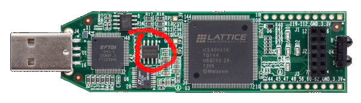

# From Blinker to RISC-V

This tutorial is a progressive journey from a simple blinky design to a RISC-V core.

It works with the following boards:
- IceStick
- IceBreaker
- ULX3S
- _to be added_ ARTY

If you do not have a board, you can run everything in simulation (but
it is not as fun).

## Introduction and references on processor design

To understand processor design, the first thing that I have read was
[this answer](https://stackoverflow.com/questions/51592244/implementation-of-simple-microprocessor-using-verilog/51621153#51621153)
on Stackoverflow, that I found inspiring. There is also [this article](http://www.fpgacpu.org/papers/xsoc-series-drafts.pdf) suggested by @mithro.
For a complete course, I highly recommend [this one from the MIT](http://web.mit.edu/6.111/www/f2016/), it also
gives the principles for going much further than what I've done here (pipelines etc...).

For Verilog basics and syntax, I read _Verilog by example by Blaine C. Readler_, it is also short and to the point. 

There are two nice things with the Stackoverflow answer:
- it goes to the essential, and keeps nothing else than what's essential
- the taken example is a RISC processor, that shares several similarities with RISC-V
  (except that it has status flags, that RISC-V does not have).

What we learn there is that there will be a _register file_, that stores
the so-called _general-purpose_ registers. By general-purpose, we mean 
that each time an instruction reads a register, it can be any of them, 
and each time an instruction writes a register, it can be any of them, 
unlike the x86 (CISC) that has _specialized_ registers. To implement the
most general instruction (`register <- register OP register`), the 
register file will read two registers at each cycle, and optionally 
write-back one.

There will be an _ALU_, that will compute an operation on two values.

There will be also a _decoder_, that will generate all required internal signals
from the bit pattern of the current instruction. 

If you want to design a RISC-V processor on your own, I recommend you take a deep look at 
[the Stackoverflow answer](https://stackoverflow.com/questions/51592244/implementation-of-simple-microprocessor-using-verilog/51621153#51621153), 
and do some schematics on your own to have all the general ideas in mind
before going further... or you can choose to directly jump into this tutorial, one step at a time. It will
gently take you from the most trivial Blinky design to a fully functional RISC-V core. 

## Prerequisites:

First step is cloning the learn-fpga repository:
```
$ git clone https://github.com/BrunoLevy/learn-fpga.git
```

Before starting, you will need to install the following softwares:
- iverilog/icarus (simulation)
```
  $ sudo apt-get install iverilog
```
- yosys/nextpnr, the toolchain for your board. See [this link](../toolchain.md).

Note that iverilog/icarus is sufficient to run and play with all the
steps of the tutorial, but the experience is not the same. I highly
recommend to run each step on a real device.  The feeling and
excitation of your own processor running some code for the first time
is not of the same magnitude when you are doing simulation !!!

## Step 1: your first blinky

Let us start and create our first blinky ! Our blinky is implemented as a VERILOG module,
connected to inputs and outputs, as follows ([step1.v](step1.v)):
```verilog
   module SOC (
       input  CLK,        
       input  RESET,      
       output [4:0] LEDS, 
       input  RXD,        
       output TXD         
   );

   reg [4:0] count = 0;
   always @(posedge CLK) begin
      count <= count + 1;
   end
   assign LEDS = count;
   assign TXD  = 1'b0; // not used for now

   endmodule
```
We call it SOC (System On Chip), which is a big name for a blinky, but
that's what our blinky will be morphed into after all the steps of
this tutorial. Our SOC is connected to the following signals:

- `CLK` (input) is the system clock.
- `LEDS` (output) is connected to the 5 LEDs of the board.
- `RESET` (input) is a reset button. You'll say that the IceStick
   has no button, but in fact ... (we'll talk about that
   later)
- `RXD` and `TXD` (input,output) connected to the FTDI chip that emulates 
   a serial port through USB. We'll also talk about that
   later.

You can synthesize and send the bitstream to the device as follows:
```
$ BOARDS/run_xxx.sh step1.v
```
where `xxx` corresponds to your board.

The five leds will light on... but they are not blinking. Why is this so ?
In fact they are blinking, but it is too fast for you to distinguish anything.

To see something, it is possible to use simulation. To use simulation, we write
a new VERILOG file [bench_iverilog.v](bench_iverilog.v),
with a module `bench` that encapsulates our `SOC`:
```verilog
module bench();
   reg CLK;
   wire RESET = 0; 
   wire [4:0] LEDS;
   reg  RXD = 1'b0;
   wire TXD;

   SOC uut(
     .CLK(CLK),
     .RESET(RESET),
     .LEDS(LEDS),
     .RXD(RXD),
     .TXD(TXD)
   );

   reg[4:0] prev_LEDS = 0;
   initial begin
      CLK = 0;
      forever begin
	 #1 CLK = ~CLK;
	 if(LEDS != prev_LEDS) begin
	    $display("LEDS = %b",LEDS);
	 end
	 prev_LEDS <= LEDS;
      end
   end
endmodule   
```
The module `bench` drives all the signals of our `SOC` (called
`uut` here for "unit under test"). The `forever` loop wiggles
the `CLK` signal and displays the status of the LEDs whenever
it changes.

Now we can start the simulation:
```
  $ iverilog -DBENCH -DBOARD_FREQ=10 bench_iverilog.v step1.v
  $ vvp a.out
```
... but that's a lot to remember, so I created a script for that,
you'll prefer to do:
```
  $ ./run.sh step1.v
```

You will see the LEDs counting. Simulation is precious, it lets
you insert "print" statements (`$display`) in your VERILOG code,
which is not directly possible when you run on the device !

To exit the simulation:
```
  <ctrl><c>
  finish
```
_Note: I developped the first version of femtorv completely on device,
 using only the LEDs to debug because I did not know how to
 use simulation, don't do that, it's stupid !_
 
**Try this** How would you modify `step1.v` to slow it down
sufficiently for one to see the LEDs blinking ?

**Try this** Can you implement a "Knight driver"-like blinking
pattern instead of counting ?

## Step 2: slower blinky

You probably got it right: the blinky can be slowed-down either
by counting on a larger number of bits (and wiring the most
significant bits to the leds), or inserting a "clock divider"
(also called a "gearbox") that counts on a large number
of bits (and driving the counter
with its most significant bit). The second solution is interesting,
because you do not need to modify your design, you just insert
the clock divider between the `CLK` signal of the board and your
design. Then, even on the device you can distinguish what happens
with the LEDs.

To do that, I created a `Clockworks` module in [clockworks.v](clockworks.v),
that contains the gearbox and a mechanism related with the `RESET` signal (that
I'll talk about later). `Clockworks` is implemented as follows:
```verilog
module Clockworks 
(
   input  CLK,   // clock pin of the board
   input  RESET, // reset pin of the board
   output clk,   // (optionally divided) clock for the design.
   output resetn // (optionally timed) negative reset for the design (more on this later)
);
   parameter SLOW;
...
   reg [SLOW:0] slow_CLK = 0;
   always @(posedge CLK) begin
      slow_CLK <= slow_CLK + 1;
   end
   assign clk = slow_CLK[SLOW];
...
endmodule
```
This divides clock frequency by `2^SLOW`.

The `Clockworks` module is then inserted
between the `CLK` signal of the board
and the design, using an internal `clk`
signal, as follows, in [step2.v](step2.v):

```verilog
`include "clockworks.v"

module SOC (
    input  CLK,        // system clock 
    input  RESET,      // reset button
    output [4:0] LEDS, // system LEDs
    input  RXD,        // UART receive
    output TXD         // UART transmit
);

   wire clk;    // internal clock
   wire resetn; // internal reset signal, goes low on reset
   
   // A blinker that counts on 5 bits, wired to the 5 LEDs
   reg [4:0] count = 0;
   always @(posedge clk) begin
      count <= !resetn ? 0 : count + 1;
   end

   // Clock gearbox (to let you see what happens)
   // and reset circuitry (to workaround an
   // initialization problem with Ice40)
   Clockworks #(
     .SLOW(21) // Divide clock frequency by 2^21
   )CW(
     .CLK(CLK),
     .RESET(RESET),
     .clk(clk),
     .resetn(resetn)
   );
   
   assign LEDS = count;
   assign TXD  = 1'b0; // not used for now   
endmodule
```
It also handles the `RESET` signal. 

Now you can try it on simulation:
```
  $ ./run.sh step2.v
```

As you can see, the counter is now much slower. Try it also on device:
```
  $ BOARDS/run_xxx.sh step2.v
```
Yes, now we can see clearly what happens ! And what about the `RESET`
button ? The IceStick has no button. In fact it has one ! 


Press a finger on the circled region of the image (around pin 47).

**Try this** Knight-driver mode, and `RESET` toggles direction.

If you take a look at [clockworks.v](clockworks.v), you will see it can
also create a `PLL`, it is a component that can be used to generate
*faster* clocks. For instance, the IceStick has a 12 MHz system clock,
but the core that we will generate will run at 45 MHz. We will see that
later.

## Step 3: a blinker that loads LEDs patterns from ROM

Now we got all the tools that we need, so let's see how to
transform this blinker into a fully-functional RISC-V
processor. This goal seems to be far far away, but the
processor we will have created at step 16 is not longer
than 200 lines of VERILOG ! I was amazed to discover
that it is that simple to create a processor. OK, let us
go there one step at a time.

We know already that a processor has a memory, and fetches
instructions from there, in a sequential manner most of
the time (except when there are jumps and branches). Let us
start with something similar, but much simpler: a pre-programmed
christmas tinsel, that loads the LEDs pattern from a memory (see
[step3.v](step3.v)). Our tinsel has a memory with the patterns:
```verilog
   reg [4:0] MEM [0:20];
   initial begin
       MEM[0]  = 5'b00000;
       MEM[1]  = 5'b00001;
       MEM[2]  = 5'b00010;
       MEM[3]  = 5'b00100;
       ...
       MEM[19] = 5'b10000;
       MEM[20] = 5'b00000;       
   end
```
_Note that what's in the initial block does not generate any circuitry
when synthesized, it is directly translated into the initialization
data for the BRAMs of the FPGA._

We will also have a "program counter" `PC` incremented at each clock, and
a mechanism to fetch `MEM` contents indexed by `PC`:

```verilog
   reg [4:0] PC = 0;
   reg [4:0] leds = 0;

   always @(posedge clk) begin
      leds <= MEM[PC];
      PC <= (!resetn || PC==20) ? 0 : (PC+1);
   end
```
_Note the test `PC==20` to make it cycle._

Now try it with simulation and on device.

**Try this** create several blinking modes, and switch between
  modes using `RESET`.

## The RISC-V instruction set architecture

An important source of information is of course the 
[RISC-V reference manual](https://github.com/riscv/riscv-isa-manual/releases/download/Ratified-IMAFDQC/riscv-spec-20191213.pdf).
There you learn that there are several flavors of the RISC-V standard.
Let us start from the simplest one (RV32I, that is, 32 bits base integer 
instruction set). Then we will see how to add things, one thing at a
time. This is a very nice feature of RISC-V, since the instruction set 
is _modular_, you can start with a very small self-contained kernel, and
this kernel will be compliant with the norm. This means standard tools
(compiler, assembler, linker) will be able to generate code for this
kernel. Then I started reading Chapter 2 (page 13 to page 30). Seeing
also the table page 130, there are in fact only 11 different
instrutions ! (I say for instance that an AND, an OR, an ADD ... are
the same instruction, the operation is just an additional parameter).
Now we just try to have an idea of the overall picture,
no need to dive into the details for now. Let's take a global look at these
11 instructions:

| instruction | description                          | algo                                 |
|-------------|--------------------------------------|--------------------------------------|
| branch      | conditional jump, 6 variants         | `if(reg OP reg) PC<-PC+imm`          |
| ALU reg     | Three-registers ALU ops, 10 variants | `reg <- reg OP reg`                  |
| ALU imm     | Two-registers ALU ops, 9 variants    | `reg <- reg OP imm`                  |
| load        | Memory-to-register, 5 variants       | `reg <- mem[reg + imm]`              |
| store       | Register-to-memory, 3 variants       | `mem[reg+imm] <- reg`                |
| `LUI`       | load upper immediate                 | `reg <- (im << 12)`                  |
| `AUIPC`     | add upper immediate to PC            | `reg <- PC+(im << 12)`               |
| `JAL`       | jump and link                        | `reg <- PC+4 ; PC <- PC+imm`         |
| `JALR`      | jump and link register               | `reg <- PC+4 ; PC <- reg+imm`        |
| `FENCE`     | memory-ordering for multicores       | (not detailed here, skipped for now) |
| `SYSTEM`    | system calls, breakpoints            | (not detailed here, skipped for now) |

- The 6 branch variants are conditional jumps, that depend on a test
on two registers. 

- ALU operations can be of the form `register <- register OP register`
or `register <- register OP immediate`

- Then we have load and store, that can operate
on bytes, on 16 bit values (called half-words) or 32 bit values
(called words). In addition byte and half-word loads can do sign
expansion. The source/target address is obtained by adding an 
immediate offset to the content of a register.

- The remaining instructions are more special (one
may skip their description in a first read, you just need to know
that they are used to implement unconditional jumps, function calls,
memory ordering for multicores, system calls and breaks):

    - `LUI` (load upper immediate) is used to load the upper 20 bits of a constant. The lower
bits can then be set using `ADDI` or `ORI`. At first sight it may
seem weird that we need two instructions to load a 32 bit constant
in a register, but in fact it is a smart choice, because all
instructions are 32-bit long. 

    - `AUIPC` (add upper immediate to PC) adds a constant to the current program counter and places the 
result in a register. It is meant to be used in combination with 
`JALR` to reach a 32-bit PC-relative address.

    - `JAL` (jump and link) adds an offset to the PC and stores the address
of the instruction following the jump in a register. It can be used to
implement function calls. `JALR` does the same thing, but adds the
offset to a register. 

    - `FENCE` and `SYSTEMS` are used to implement memory ordering in
multicore systems, and system calls/breaks respectively.

To summarize, we got branches (conditional jumps), ALU operations,
load and store, and a couple of special instructions used to implement
unconditional jumps and function calls. There are also two functions
for memory ordering and system calls (but we will ignore these two
ones for now). OK, in fact only 9 instructions then, it seems doable...
At this point, I had not understood everything, so I'll start from what
I think to be the simplest parts (intruction decoder, register file and ALU), then we will
see how things are interconnected, how to implement jumps, branches, and all the instructions.

## Step 4: the instruction decoder

Now the idea is to have a memory with RISC-V instructions in it, load all instructions
sequentially (like in our christmas tinsel), in an `instr` register, and see how to recognize
among the 11 instructions (and light a different LED in function of the recognized instruction). Each
instruction is encoded in a 32-bits word, and we need to decode the different bits of this word to
recognize the instruction and its parameters.

The [RISC-V reference manual](https://github.com/riscv/riscv-isa-manual/releases/download/Ratified-IMAFDQC/riscv-spec-20191213.pdf)
has all the information that we need summarized in two tables in page 130 (RV32/64G Instruction Set Listings). 

Let us take a look at the big table, first thing to notice is that the 7 LSBs tells you which instruction it is
(there are 10 possibilities, we do not count `FENCE` for now).

```verilog
   reg [31:0] instr;
   ...
   wire isALUreg  =  (instr[6:0] == 7'b0110011); // rd <- rs1 OP rs2   
   wire isALUimm  =  (instr[6:0] == 7'b0010011); // rd <- rs1 OP Iimm
   wire isBranch  =  (instr[6:0] == 7'b1100011); // if(rs1 OP rs2) PC<-PC+Bimm
   wire isJALR    =  (instr[6:0] == 7'b1100111); // rd <- PC+4; PC<-rs1+Iimm
   wire isJAL     =  (instr[6:0] == 7'b1101111); // rd <- PC+4; PC<-PC+Jimm
   wire isAUIPC   =  (instr[6:0] == 7'b0010111); // rd <- PC + Uimm
   wire isLUI     =  (instr[6:0] == 7'b0110111); // rd <- Uimm   
   wire isLoad    =  (instr[6:0] == 7'b0000011); // rd <- mem[rs1+Iimm]
   wire isStore   =  (instr[6:0] == 7'b0100011); // mem[rs1+Simm] <- rs2
   wire isSYSTEM  =  (instr[6:0] == 7'b1110011); // special
```

Besides the instruction type, we need also to decode the arguments of the instruction.
The table on the top distinguishes 6 types of instructions
(`R-type`,`I-type`,`S-type`,`B-type`,`U-type`,`J-type`), depending on the arguments
of the instruction and how they are encoded within the 32 bits of the instruction word.

`R-type` instructions take two source registers `rs1` and `rs2`,
 apply an operation on them and stores the result in a
 third destination register `rd` (`ADD`, `SUB`, `SLL`, `SLT`, `SLTU`, `XOR`,
 `SRL`, `SRA`, `OR`, `AND`).

 Since RISC-V has 32 registers,
 each of `rs1`,`rs2` and `rd` use 5 bits of the instruction
 word. Interestingly, these are the same bits for all
 instruction formats. Hence, "decoding" `rs1`,`rs2`
 and `rd` is just a matter of drawing some wires
 from the instruction word:
```verilog
   wire [4:0] rs1Id = instr[19:15];
   wire [4:0] rs2Id = instr[24:20];
   wire [4:0] rdId  = instr[11:7];
```

 Then, one needs to recognize among the 10 R-type instructions.
 It is done mostly with the `funct3` field, a 3-bits code. With
 a 3-bits code, one can only encode 8 different instructions, hence
 there is also a `funct7` field (7 MSBs of instruction word). Bit
 30 of the instruction word encodes `ADD`/`SUB` and `SRA`/`SRL`
 (arithmetic right shift with sign expansion/logical right shift).
 The instruction decoder has wires for `funct3` and `funct7`:
```verilog
   wire [2:0] funct3 = instr[14:12];
   wire [6:0] funct7 = instr[31:25];
```

`I-type` instructions take one register `rs1`, an immediate value
`Iimm`, applies an operation on them and stores the result in the
destination register `rd` (`ADDI`, `SLTI`, `SLTIU`, `XORI`, `ORI`,
`ANDI`, `SLLI`, `SRLI`, `SRAI`).

_Wait a minute:_ there are 10 R-Type instructions but only 9 I-Type
instructions, why is this so ? If you look carefully, you will see
that there is no `SUBI`, but one can instead use `ADDI` with a
negative immediate value. This is a general rule in RISC-V, if an
existing functionality can be used, do not create a new functionality.

As for R-type instructions, the instruction can be distinguished using
`funct3` and `funct7` (and in `funct7`, only the bit 30 of the instruction
word is used, to distinguish `SRAI`/`SRLI` arithmetic and logical right shifts).

The immediate value is encoded in the 12 MSBs of the instruction word,
hence we will draw additional wires to get it:
```verilog
   wire [31:0] Iimm={{21{instr[31]}}, instr[30:20]};
```

As can be seen, bit 31 of the instruction word is repeated 21 times,
this is "sign expansion" (converts a 12-bits signed quantity into
a 32-bits one).

There are four other instruction formats `S-type` (for Store),
`B-type` (for Branch), `U-type` (for Upper immediates that
are left-shifted by 12), and `J-type` (for Jumps). Each
instruction format has a different way of encoding an immediate
value in the instruction word.

To understand what it means, let's get back to Chapter 2, page 16.
The different instruction types correspond to the way _immediate values_ are encoded in them.

| Instr. type | Description                                    | Immediate value encoding                             |
|-------------|------------------------------------------------|------------------------------------------------------|
| `R-type`    | register-register ALU ops. [more on this here](https://www.youtube.com/watch?v=pVWtI0426mU) | None    |
| `I-type`    | register-immediate integer ALU ops and `JALR`. | 12 bits, sign expansion                              |
| `S-type`    | store                                          | 12 bits, sign expansion                              |
| `B-type`    | branch                                         | 12 bits, sign expansion, upper `[31:1]` (bit 0 is 0) |
| `U-type`    | `LUI`,`AUIPC`                                  | 20 bits, upper `31:12` (bits `[11:0]` are 0)         |
| `J-type`    | `JAL`                                          | 12 bits, sign expansion, upper `[31:1]` (bit 0 is 0) |

Note that `I-type` and `S-type` encode the same type of values (but they are taken from different parts of `instr`).
Same thing for `B-type` and `J-type`.

One can decode the different types of immediates as follows:
```verilog
   wire [31:0] Uimm={    instr[31],   instr[30:12], {12{1'b0}}};
   wire [31:0] Iimm={{21{instr[31]}}, instr[30:20]};
   wire [31:0] Simm={{21{instr[31]}}, instr[30:25],instr[11:7]};
   wire [31:0] Bimm={{20{instr[31]}}, instr[7],instr[30:25],instr[11:8],1'b0};
   wire [31:0] Jimm={{12{instr[31]}}, instr[19:12],instr[20],instr[30:21],1'b0};
```
Note that `Iimm`, `Simm`, `Bimm` and `Jimm` do sign expansion (by copying
bit 31 the required number of times to fill the MSBs).

And that's all for our instruction decoder ! To summarize, the instruction
decoder gets the following information from the instruction word:
- signals isXXX that recognizes among the 11 possible RISC-V instructions
- source and destination registers `rs1`,`rs2` and `rd`
- function codes `funct3` and `funct7`
- the five formats for immediate values (with sign expansion for `Iimm`, `Simm`, `Bimm` and `Jimm`).

Let us now initialize the memory with a few RISC-V instruction and see whether we can recognize them
by lighting a different LED depending on the instruction ([step4.v](step4.v)). To do that, we use
the big table in page 130 of the
[RISC-V reference manual](https://github.com/riscv/riscv-isa-manual/releases/download/Ratified-IMAFDQC/riscv-spec-20191213.pdf).
It is a bit painful (we will see easier ways later !). Using the `_` character to separate fields of a binary constant is
especially interesting under this circumstance.

```verilog
   initial begin
      // add x1, x0, x0
      //                    rs2   rs1  add  rd  ALUREG
      MEM[0] = 32'b0000000_00000_00000_000_00001_0110011;
      // addi x1, x1, 1
      //             imm         rs1  add  rd   ALUIMM
      MEM[1] = 32'b000000000001_00001_000_00001_0010011;
      ...
      // lw x2,0(x1)
      //             imm         rs1   w   rd   LOAD
      MEM[5] = 32'b000000000000_00001_010_00010_0000011;
      // sw x2,0(x1)
      //             imm   rs2   rs1   w   imm  STORE
      MEM[6] = 32'b000000_00001_00010_010_00000_0100011;
      // ebreak
      //                                        SYSTEM
      MEM[7] = 32'b000000000001_00000_000_00000_1110011;
   end	   
```

Then we can fetch and recognize the instructions as follows:
```verilog
   always @(posedge clk) begin
      if(!resetn) begin
	 PC <= 0;
      end else if(!isSYSTEM) begin
	 instr <= MEM[PC];
	 PC <= PC+1;
      end
   end
   assign LEDS = isSYSTEM ? 31 : {PC[0],isALUreg,isALUimm,isStore,isLoad};
```
(first led is wired to `PC[0]` so that we will see it blinking even if
 there is the same instruction several times).

As you can see, the program counter is only incremented if instruction
is not `SYSTEM`. For now, the only `SYSTEM` instruction that we support
is `EBREAK`, that halts execution. 

In simulation mode, we can in addition display the name of the recognized instruction
and the fields:
```verilog
`ifdef BENCH   
   always @(posedge clk) begin
      $display("PC=%0d",PC);
      case (1'b1)
	isALUreg: $display("ALUreg rd=%d rs1=%d rs2=%d funct3=%b",rdId, rs1Id, rs2Id, funct3);
	isALUimm: $display("ALUimm rd=%d rs1=%d imm=%0d funct3=%b",rdId, rs1Id, Iimm, funct3);
	isBranch: $display("BRANCH");
	isJAL:    $display("JAL");
	isJALR:   $display("JALR");
	isAUIPC:  $display("AUIPC");
	isLUI:    $display("LUI");	
	isLoad:   $display("LOAD");
	isStore:  $display("STORE");
	isSYSTEM: $display("SYSTEM");
      endcase 
   end
`endif
```

**Try this** run `step4.v` in simulation and on the device. Try initializing the memory with
different RISC-V instruction and test whether the decoder recognizes them.

## Sidebar: the elegance of RISC-V

This paragraph may be skipped.
it just contains my own impressions and reflexions on the RISC-V instruction set, inspired by the comments and Q&A in italics in the
[RISC-V reference manual](https://github.com/riscv/riscv-isa-manual/releases/download/Ratified-IMAFDQC/riscv-spec-20191213.pdf).

At this point, I realized what an _instruction set architecture_ means: it is for sure a specification of _what bit pattern does what_
(Instruction Set) and it is also at the same time driven by how this will be translated into wires (Architecture). An ISA is not
_abstract_, it is _independent_ on an implementation, but it is strongly designed with implementation in mind ! While the 
pipeline, branch prediction unit, multiple execution units, caches may differ in different implementations, the instruction decoder
is probably very similar in all implementations.

There were things that seemed really weird to me
in the first place: all these immediate format variants, the fact that immediate values are scrambled in different bits of `instr`,
the `zero` register, and the weird instructions `LUI`,`AUIPC`,`JAL`,`JALR`. When writing the instruction decoder, you better understand the reasons. The
ISA is really smart, and is the result of a long evolution (there were RISC-I, RISC-II, ... before). It seems to me the result of a 
_distillation_. Now, in 2020, many things were tested in terms of ISA, and this one seems to have benefited from all the previous
attempts, taking the good choices and avoiding the suboptimal ones. 

What is really nice in the ISA is:
- instruction size is fixed. Makes things really easier. _(there are extension with varying instrution length, but at least the core
  instruction set is simple)_;
- `rs1`,`rs2`,`rd` are always encoded by the same bits of `instr`;
- the immediate formats that need to do sign expansion do it from the same bit (`instr[31]`);
- the weird instructions `LUI`,`AUIPC`,`JAL`,`JALR` can be combined to implement higher-level tasks
   (load 32-bit constant in register, jump to arbitrary address, function calls). Their existence is
   justified by the fact it makes the design easier. Then assembly programmer's life is made easier by
   _pseudo-instructions_ `CALL`, `RET`, ... See [risc-v assembly manual](https://github.com/riscv/riscv-asm-manual/blob/master/riscv-asm.md), the
   two tables at the end of the page. Same thing for tests/branch instructions obtained by swapping parameters (e.g. `a < b <=> b > a`
   etc...), there are pseudo-instructions that do the job for you.

Put differently, to appreciate the elegance of the RISC-V ISA, imagine
that your mission is to _invent it_. That is, invent both the set of
instructions and the way they are encoded as bit patterns. The constraints are:
- fixed instruction length (32 bits)
- as simple as possible: the ultimate sophistication is simplicity [Leonardo da Vinci] !!
- source and destination registers always encoded at the same position
- whenever there is sign-extension, it should be done from the same bit
- it should be simple to load an arbitrary 32-bits immediate value in a register (but may take several instructions)
- it should be simple to jump to arbitrary memory locations (but may take several instructions)
- it should be simple to implement function calls (but may take several instructions)

Then you understand why there are many different immediate
formats. For instance, consider `JAL`, that does not have a source
register, as compared to `JALR` that has one. Both take an immediate
value, but `JAL` has 5 more bits available to store it, since it does
not need to encode the source register. The slightest available bit is
used to extend the dynamic range of the immediates. This explains both
the multiple immediate formats and the fact that they are assembled
from multiple pieces of `instr`, slaloming between the three fixed
5-bits register encodings, that are there or not depending on the
cases.

Now the rationale behind the weird instructions `LUI`,`AUIPC`,`JAL`
and `JALR` is to give a set of functions that can be combined to load
arbitrary 32-bit values in register, or to jump to arbitrary locations
in memory, or to implement the function call protocol as simply as
possible. Considering the constraints, the taken choices (that seemed
weird to me in the first place) perfectly make sense. In addition,
with the taken choices, the instruction decoder is pretty simple and
has a low logical depth. Besides the 7-bits instruction decoder, it
mostly consists of a set of wires drawn from the bits of `instr`, and
duplication of the sign-extended bit 31 to form the immediate values.

Before moving forward, I'd like to say a word about the `zero` register.
I think it is really a smart move. With it, you do not need a `MOV rd rs` 
instruction (just `ADD rd rs zero`), you do not need a `NOP` 
instruction (`ADD zero zero zero`), and all the branch variants can
compare with `zero` ! I think that `zero` is a great invention, not as great
as `0`, but really makes the instruction set more compact.

## Step 5: The register bank and the state machine

The register bank is implemented as follows:
```verilog
   reg [31:0] RegisterBank [0:31];
```

Let us take a closer look at what we need to to to execute an instruction.
Condider for instance a stream of R-type instructions. For each instruction,
we need to do the following four things:

- fetch the instruction: `instr <= MEM[PC]`
- fetch the values of `rs1` and `rs2`: `rs1 <= RegisterBank[rs1Id]; rs2 <= RegisterBank[rs2Id]`
   where `rs1` and `rs2` are two registers. We need to do that because `RegisterBank` will be
   synthesized as a block of BRAM, and one needs one cycle to access the content of BRAM.
- compute `rs1` `OP` `rs2` (where `OP` depends on `funct3` and `funct7`)
- store the result in `rd`: `RegisterBank[rdId] <= writeBackData`. This can be done during
  the same cycle as the previous step if `OP` is computed by a combinatorial circuit.

The first three operations are implemented by a state machine,
as follows (see [step5.v](step5.v)):
```verilog
   localparam FETCH_INSTR = 0;
   localparam FETCH_REGS  = 1;
   localparam EXECUTE     = 2;
   reg [1:0] state = FETCH_INSTR;
   always @(posedge clk) begin
	 case(state)
	   FETCH_INSTR: begin
	      instr <= MEM[PC];
	      state <= FETCH_REGS;
	   end
	   FETCH_REGS: begin
	      rs1 <= RegisterBank[rs1Id];
	      rs2 <= RegisterBank[rs2Id];
	      state <= EXECUTE;
	   end
	   EXECUTE: begin
	      PC <= PC + 1;
	      state <= FETCH_INSTR;	      
	   end
	 endcase
      end 
   end 
```

The fourth one (register write-back) is implemented in this block:
```verilog
   wire [31:0] writeBackData = ... ;
   wire writeBackEn = ...;
   always @posedge(clk) begin	
      if(writeBackEn && rdId != 0) begin
          RegisterBank[rdId] <= writeBackData;
      end
   end
```
Remember that writing to register 0 has no effect (hence the test `rdId != 0`).
The signal `writeBackEn` is asserted whenever `writeBackData` should be written
to register `rdId`.
The data to be written back (`writeBackData`) will be obtained from the ALU,
as explained in the next episode. 

**Try this**: run [step5.v](step5.v) in simulation and on the device. You will
see your wannabe CPU's state machine dancing waltz on the LEDs (that display
the current state).

## Step 6: the ALU

Now we can fetch instructions from memory, decode them and read register
values, but our (wannabe) CPU is still unable to do anything. Let us see
how to do actual computations on register's values.

_So, are you going to create an `ALU` module ? And by the way, why did not
 you create a `Decoder` module, and a `RegisterBank` module ?_

My very first design used multiple modules and multiple files, for
a total of 1000 lines of code or so, then Matthias Koch wrote a monolithic
version, that fits in 200 lines of code. Not only it is more compact, but
also it is much easier to understand when you got everything in one place.
**Rule of thumb:** if you have more boxes and wires between the boxes than
circuitry in the boxes, then you have too many boxes !

_But wait a minute, modular design is good, no ?_

Modular design is neither good nor bad, it is useful whenever it makes things
simpler. It is not the case in the present situation. There is no absolute
answer though, it is a matter of taste and style ! In this tutorial, we use
a (mostly) monolithic design.

Now we want to implement two types of instructions:
- Rtype: `rd` <- `rs1` `OP` `rs2`  (recognized by `isALUreg`)
- Itype: `rd` <- `rs1` `OP` `Iimm` (recognized by `isALUimm`)

The ALU takes two inputs `aluIn1` and `aluIn2`, computes
`aluIn1` `OP` `aluIn2` and stores it in `aluOut`:
```verilog
   wire [31:0] aluIn1 = rs1;
   wire [31:0] aluIn2 = isALUreg ? rs2 : Iimm;
   reg [31:0] aluOut;
```
Depending on the instruction type, `aluIn2` is either the value
in the second source register `rs2`, or an immediate in the `Itype`
format (`Immm`). The operation `OP` depends mostly on `funct3`
(and also on `funct7`). Keep a copy of the [RISC-V reference manual](https://github.com/riscv/riscv-isa-manual/releases/download/Ratified-IMAFDQC/riscv-spec-20191213.pdf) open page 130 on your knees or in another window:

| funct3 | operation                                     |
|--------|-----------------------------------------------|
| 3'b000 | `ADD` or `SUB`                                |
| 3'b001 | left shift                                    |
| 3'b010 | signed comparison (<)                         |
| 3'b011 | unsigned comparison (<)                       |
| 3'b100 | `XOR`                                         |
| 3'b101 | logical right shift or arithmetic right shift |
| 3'b110 | `OR`                                          |
| 3'b111 | `AND`                                         |

- for `ADD`/`SUB`, if its an `ALUreg` operation (Rtype), then one makes the
difference between `ADD` and `SUB` by testing bit 5 of `funct7` (1 for `SUB`).
If it is an `ALUimm` operation (Itype), then it can be only `ADD`. In this
context, one just needs to test bit 5 of `instr` to distinguish between
`ALUreg` (if it is 1) and `ALUimm` (if it is 0).
- for logical or arithmetic right shift, one makes the difference also by testing
bit 5 of `funct7`, 1 for arithmetic shift (with sign expansion) and 0 for
logical shift.
- the shift amount is either the content of `rs2` for `ALUreg` instructions or
  `instr[24:20]` (the same bits as `rs2Id`) for `ALUimm` instructions.

Putting everything together, one gets the following VERILOG code for the ALU:
```verilog
   reg [31:0] aluOut;
   wire [4:0] shamt = isALUreg ? rs2[4:0] : instr[24:20]; // shift amount
   always @(*) begin
      case(funct3)
	3'b000: aluOut = (funct7[5] & instr[5]) ? (aluIn1-aluIn2) : (aluIn1+aluIn2);
	3'b001: aluOut = aluIn1 << shamt;
	3'b010: aluOut = ($signed(aluIn1) < $signed(aluIn2));
	3'b011: aluOut = (aluIn1 < aluIn2);
	3'b100: aluOut = (aluIn1 ^ aluIn2);
	3'b101: aluOut = funct7[5]? ($signed(aluIn1) >>> shamt) : (aluIn1 >> shamt); 
	3'b110: aluOut = (aluIn1 | aluIn2);
	3'b111: aluOut = (aluIn1 & aluIn2);	
      endcase
   end
```
_Note:_ although it is declared as a `reg`, `aluOut` will be a combinatorial function
(no flipflop generated), because its value is determined in a combinatorial block
(`always @(*)`), and all the configurations are enumerated in the `case` statement.

Register write-back is configured as follows:
```verilog
   assign writeBackData = aluOut; 
   assign writeBackEn = (state == EXECUTE && (isALUreg || isALUimm));   
```

**Try this** run [step6.v](step6.v) in simulation and on the device. In simulation
it will display the written value and the written register for all register
write-back operation. On the device it will show the 5 LSBs of `x1` on the LEDs.
Then you can try changing the program, and observe the effect on register values.

**You are here !** This is the list of instructions you have to implement,
your wannabe RISC-V core currently supports 20 of them. Next steps: jumps,
then branches, then... the rest. Before then, as you probably have noticed,
translating RISC-V programs into binary (that is, assembling manually) is
extremely painful. Next section gives a much easier solution.

| ALUreg | ALUimm | Jump  | Branch | LUI | AUIPC | Load  | Store | SYSTEM |
|--------|--------|-------|--------|-----|-------|-------|-------|--------|
| [*] 10 | [*] 9  | [ ] 2 | [ ] 6  | [ ] | [ ]   | [ ] 5 | [ ] 3 | [*] 1  |

## Step 7: using the VERILOG assembler

To avoid having to manually translate RISC-V assembly into binary, one can
use the GNU assembler, generate a binary file, translate it into hexadecimal
and use the VERILOG function `readmemh()` to initialize memory with the
content of that file. We will see later how to do that.

But in our case, it would be very convenient to be able to write small
assembly programs directly in the same VERILOG file as our design. In fact,
it is possible to do so, by implementing a RISC-V assembler directly in
VERILOG (using tasks and functions), as done in [riscv_assembly.v](riscv_assembly.v).

In [step7.v](step7.v), memory is initialized with
the same assembly program as in [step6.v](step6.v). 
It looks like that now, Much easier to read, no ?
```verilog
   `include "riscv_assembly.v"
   initial begin
      ADD(x0,x0,x0);
      ADD(x1,x0,x0);
      ADDI(x1,x1,1);
      ADDI(x1,x1,1);
      ADDI(x1,x1,1);
      ADDI(x1,x1,1);
      ADD(x2,x1,x0);
      ADD(x3,x1,x2);
      SRLI(x3,x3,3);
      SLLI(x3,x3,31);
      SRAI(x3,x3,5);
      SRLI(x1,x3,26);
      EBREAK();
   end
```
_Note:_ `riscv_assembly.v` needs to be included from inside the module that
uses assembly.

In this step, we make another modification: in the previous steps, `PC` was
the index of the current instruction. For what follows, we want it to be
the _address_ of the current instruction. Since each instruction is 32-bits
long, it means that:
- to increment `PC`, we do `PC <= PC + 4` (instead of `PC <= PC + 1` as before)
- to fetch the current instruction, we do `instr <= MEM[PC[31:2]];` (we ignore
  the two LSBs of `PC`).

## Step 8: jumps

There are two jump instructions, `JAL` (jump and link), and `JALR` (jump and
link register). By "and link", one means that the current PC can be written
to a register. Hence `JAL` and `JALR` can be used to implement not only
jumps, but also function calls. Here is what the two instructions are
supposed to do:

| instruction     | effect                  |
|-----------------|-------------------------|
| JAL rd,imm      | rd<-PC+4; PC<-PC+Jimm   |
| JALR rd,rs1,imm | rd<-PC+4; PC<-rs1+Iimm  |

To implement these two instructions, we need to make
the following changes to our core. First thing is
register write-back: now value can be `PC+4` instead
of `aluOut` for jump instructions:
```verilog
   assign writeBackData = (isJAL || isJALR) ? (PC + 4) : aluOut;
   assign writeBackEn = (state == EXECUTE && 
			 (isALUreg || 
			  isALUimm || 
			  isJAL    || 
			  isJALR)
			 );
```

We also need to declare a `nextPC` value, that implements the
three possibilities:
```verilog
   wire [31:0] nextPC = isJAL  ? PC+Jimm :
	                isJALR ? rs1+Iimm :
	                PC+4;
```

Then, in the state machine, the line `PC <= PC + 4;` is replaced
with `PC <= nextPC;` and that's all !

We can now implement a simple (infinite) loop to test our new
jump instruction:
```verilog
`include "riscv_assembly.v"
      integer L0_=4;
      initial begin
	 ADD(x1,x0,x0);
      Label(L0_);
	 ADDI(x1,x1,1);
	 JAL(x0,LabelRef(L0_));
	 EBREAK();
	 endASM();
      end
```

The integer `L0_` is a label. Unlike with a real assembler, we
need to specify the value of `L0_` by hand. Here it is easy,
`L0_` is right after the first instruction, hence it corresponds
to the beginning of the RAM (0) plus one 32-bits words, that is, 4.
For longer programs with many labels, you can let the labels uninitialized
(`integer L0_;`) then the first time you run the program, it will compute and display the
values to be used for the labels. It is not super-convenient, but still
much better than assembling by hand / determining the labels by hand.

The `LabelRef()` function computes the label's offset relative to the current program
counter. In addition, in simulation mode, it displays the current address (to be used
to initialize the label), and if the label was already initialized (like here with `L0_=4`)
it checks that the label corresponds to the current address generated by the assembler. If
it is not the case, the `endASM()` statement displays an error message and exits.

_Note 1_: I systematically insert an `EBREAK()` instruction at the end of the program,
here it would not be necessary (we have an infinite loop), but if I change my mind
and exit the loop, then `EBREAK()` is already there.

_Note 2_: the `endASM();` statement checks the validity of all the labels and exits
simulation whenever an invalid label is detected. If you use the RISC-V VERILOG
assembler, systematically run your design in simulation before synthesizing (because
this verification cannot be done at synthesis time).

**Try this** Run the design [step8.v](step8.v) in simulation and on the device.
Yes, after 8 steps, what we have is just another stupid blinky ! But this time,
this blinky is executing a real RISC-V program ! It is not a complete RISC-V core
yet, but it starts to have a strong RISC-V flavor. Be patient, our core will be
soon able to run RISC-V programs that are more interesting than a blinky.

**You are here !**
Still some work to do, but we are making progress.
| ALUreg | ALUimm | Jump  | Branch | LUI | AUIPC | Load  | Store | SYSTEM |
|--------|--------|-------|--------|-----|-------|-------|-------|--------|
| [*] 10 | [*] 9  | [*] 2 | [ ] 6  | [ ] | [ ]   | [ ] 5 | [ ] 3 | [*] 1  |

**Try this** add a couple of instructions before the loop, run in simulation,
fix the label as indicated by the simulator, re-run in simulation, run on device.

## Step 9: Branches

Branches are like jumps, except that they compare two register, and update
`PC` based on the result of the comparison. Another difference is that they
are more limited in the address range they can reach from `PC` (12-bits offset). 
There are 6 different branch instructions:

| instruction      | effect                                             |
|------------------|----------------------------------------------------|
| BEQ rs1,rs2,imm  | if(rs1 == rs2) PC <- PC+Bimm                       |
| BNE rs1,rs2,imm  | if(rs1 != rs2) PC <- PC+Bimm                       |
| BLT rs1,rs2,imm  | if(rs1 <  rs2) PC <- PC+Bimm (signed comparison)   |
| BGE rs1,rs2,imm  | if(rs1 >= rs2) PC <- PC+Bimm (signed comparison)   |
| BLTU rs1,rs2,imm | if(rs1 <  rs2) PC <- PC+Bimm (unsigned comparison) |
| BGEU rs1,rs2,imm | if(rs1 >= rs2) PC <- PC+Bimm (unsigned comparison) |

_Wait a minute:_ there is `BLT`, but where is `BGT` ? Always the same
principle in a RISC-V processor: if something can be done with a functionality
that is already there, do not add a new functionality ! In this case,
`BGT rs1,rs2,imm` is equivalent to `BLT rs2,rs1,imm` (just swap the first
two operands). If you use `BGT` in a RISC-V assembly program, it will work
(and the assembler replaces it with `BLT` with swapped operands). `BGT`
is called a "pseudo-instruction". There are many pseudo-instructions to make
RISC-V assembly programmer's life easier (more on this later).

Back to our branch instructions, we will need to add in the ALU some wires
to compute the result of the test, as follows:
```verilog
   reg takeBranch;
   always @(*) begin
      case(funct3)
	3'b000: takeBranch = (rs1 == rs2);
	3'b001: takeBranch = (rs1 != rs2);
	3'b100: takeBranch = ($signed(rs1) < $signed(rs2));
	3'b101: takeBranch = ($signed(rs1) >= $signed(rs2));
	3'b110: takeBranch = (rs1 < rs2);
	3'b111: takeBranch = (rs1 >= rs2);
	default: takeBranch = 1'b0;
      endcase
```
_Note 1_ it is possible to create a much more compact ALU, that uses a much smaller number
of LUTs when synthesized, we sill see that later (for now, our goal is to have a RISC-V
processor that works, we will optimize it later).

_Note 2_ Among the 8 possibilites given by `funct3`, only 6 of them are used by the branch
instructions. It is necessary to have a `default:` statement in the `case`, else the
synthesizer would not be able to keep `takeBranch` as purely combinatorial (and would generate
a latch, which we do not want).

Now the only thing that remains to do for implementing branches is to add a case for
`nextPC`, as follows:
```verilog
   wire [31:0] nextPC = (isBranch && takeBranch) ? PC+Bimm :	       
   	                isJAL                    ? PC+Jimm :
	                isJALR                   ? rs1+Iimm :
	                PC+4;
```

We are now ready to test a simple loop, that counts from 0 to 31,
displays each iteration on the LEDs (remember, they are wired
to `x1`) and stops:

```c++
`include "riscv_assembly.v"
      integer L0_ = 8;
   
      initial begin
         ADD(x1,x0,x0);
         ADDI(x2,x0,32);
      Label(L0_); 
	 ADDI(x1,x1,1); 
         BNE(x1, x2, LabelRef(L0_));
         EBREAK();

	 endASM();
      end
```

**Try this** run [test9.v](test9.v) in simulation and on device. Try modifying the program,
create a "knight driver" blinky with an outer loop and two inner loops (one left to right and
one right to left). 

**You are here !**
Wow, we have implemented 28 instructions out of 38 ! Let us continue...

| ALUreg | ALUimm | Jump  | Branch | LUI | AUIPC | Load  | Store | SYSTEM |
|--------|--------|-------|--------|-----|-------|-------|-------|--------|
| [*] 10 | [*] 9  | [*] 2 | [ *] 6 | [ ] | [ ]   | [ ] 5 | [ ] 3 | [*] 1  |

## Step 10: LUI and AUIPC

We still have these two weird instructions to implement. What do they do ?
It is rather simple:

| instruction   | effect          |
|---------------|-----------------|
| LUI rd, imm   | rd <= Uimm      |
| AUIPC rd, imm | rd <= PC + Uimm |

And if you look at the `Uimm` format, it reads its MSBs (`imm[31:12]`) from
the immediate encoded in the instructions. The 12 LSBs are set to zero.
These two instructions are super useful: the immediate formats supported by all the
other instructions can only modify the LSBs. Combined with these two
functions, one can load an arbitrary value in a register (but this can
require up to two instructions).

Implementing these two instructions just requires to change `writeBackEn` and
`writeBackData` as follows:
```verilog
   assign writeBackData = (isJAL || isJALR) ? (PC + 4) :
			  (isLUI) ? Uimm :
			  (isAUIPC) ? (PC + Uimm) : 
			  aluOut;
   
   assign writeBackEn = (state == EXECUTE && 
			 (isALUreg || 
			  isALUimm || 
			  isJAL    || 
			  isJALR   ||
			  isLUI    ||
			  isAUIPC)
			 );
```

**You are here !**
Seems that we are nearly there ! 8 instructions to go...

| ALUreg | ALUimm | Jump  | Branch | LUI | AUIPC | Load  | Store | SYSTEM |
|--------|--------|-------|--------|-----|-------|-------|-------|--------|
| [*] 10 | [*] 9  | [*] 2 | [ *] 6 | [*] | [*]   | [ ] 5 | [ ] 3 | [*] 1  |


**Try this** run [step10.v](step10.v) in simulation and on the device.

_Argh !!_ On my icestick, it does not fit (requires 1283 LUTs and the
IceStick only has 1280). What can we do ? Remember, we absolutely took
no care about resource consumption, just trying to write a design that
works. In fact, there is _a lot_ of room for improvement in our design,
we will see that later, but before then, let's organize our SOC a
bit better (then we will shrink the processor).

## Step 11: Memory in a separate module

In our previous designs, we got everything in our `SOC` module (memory and
processor). In this step, we will see how to separate them.

First, the `Memory` module:

```verilog
module Memory (
   input             clk,
   input      [31:0] mem_addr,  // address to be read
   output reg [31:0] mem_rdata, // data read from memory
   input   	     mem_rstrb  // goes high when processor wants to read
);
   reg [31:0] MEM [0:255]; 

`include "riscv_assembly.v"
   integer L0_=8;
   initial begin
                  ADD(x1,x0,x0);      
                  ADDI(x2,x0,31);
      Label(L0_); ADDI(x1,x1,1); 
                  BNE(x1, x2, LabelRef(L0_));
                  EBREAK();
      endASM();
   end

   always @(posedge clk) begin
      if(mem_rstrb) begin
         mem_rdata <= MEM[mem_addr[31:2]];
      end
   end
endmodule
```

In its interface, there is a `clk` signal connected to the clock.
Whenever the processor wants to read in memory, it positions the
address to be read on `mem_addr`, and sets `mem_rstrb` to 1. Then
the `Memory` module returns the data to be read on `mem_rdata`.

Symetrically, the `Processor` module has a `mem_addr` signal (as
`output` this time), a `mem_rdata` signal (as input) and a
`mem_rstrb` signal (as output):

```verilog
module Processor (
    input 	      clk,
    input 	      resetn,
    output     [31:0] mem_addr, 
    input      [31:0] mem_rdata, 
    output 	      mem_rstrb,
    output reg [31:0] x1		  
);
...
endmodule
```
(in addition, we have a `x1` signal that contains the contents
of register `x1`, that can be used for visual debugging. We will
plug it to the LEDs).

The state machine has one additional state:
```verilog
   localparam FETCH_INSTR = 0;
   localparam WAIT_INSTR  = 1;
   localparam FETCH_REGS  = 2;
   localparam EXECUTE     = 3;

   case(state)
     FETCH_INSTR: begin
       state <= WAIT_INSTR;
     end
     WAIT_INSTR: begin
       instr <= mem_rdata;
       state <= FETCH_REGS;
     end
     FETCH_REGS: begin
       rs1 <= RegisterBank[rs1Id];
       rs2 <= RegisterBank[rs2Id];
       state <= EXECUTE;
     end
     EXECUTE: begin
        if(!isSYSTEM) begin
  	   PC <= nextPC;
	end
	state <= FETCH_INSTR;
      end
   endcase 
```
_Note_ we will see later how to simplify it and get back to three states.

Now, `mem_addr` and `mem_rstrb` can be wired as follows:
```verilog
   assign mem_addr = PC;
   assign mem_rstrb = (state == FETCH_INSTR);
```

And finally, everything is installed and connected in the `SOC`
```verilog
module SOC (
    input  CLK,        // system clock 
    input  RESET,      // reset button
    output [4:0] LEDS, // system LEDs
    input  RXD,        // UART receive
    output TXD         // UART transmit
);
   wire    clk;
   wire    resetn;
   Memory RAM(
      .clk(clk),
      .mem_addr(mem_addr),
      .mem_rdata(mem_rdata),
      .mem_rstrb(mem_rstrb)
   );

   wire [31:0] mem_addr;
   wire [31:0] mem_rdata;
   wire mem_rstrb;
   wire [31:0] x1;
   Processor CPU(
      .clk(clk),
      .resetn(resetn),		 
      .mem_addr(mem_addr),
      .mem_rdata(mem_rdata),
      .mem_rstrb(mem_rstrb),
      .x1(x1)		 
   );
   assign LEDS = x1[4:0];

   // Gearbox and reset circuitry.
   Clockworks #(
     .SLOW(19) // Divide clock frequency by 2^19
   ) CW (
     .CLK(CLK),
     .RESET(RESET),
     .clk(clk),
     .resetn(resetn)
   );
   
   assign TXD  = 1'b0; // not used for now   
endmodule
```

Now you can run [step11.v](step11.v) in the simulator. As expected,
it does the same thing as in the previous step (counts on the LEDs
from 0 to 31 and stops). What about running it on the device ?
Wow, even worse, 1341 LUTs (and we only got 1280 of them on the IceStick).
So let us shrink our code to make it fit !

## Step 12: Size optimization: the Incredible Shrinking Core.

_Tribute to "the Incredible Shrinking Man" classic movie_

There are many things we can do for shrinking this core. Let us
first take a look at the ALU. It can compute addition, subtraction,
and comparisons. Can't we reuse the result of subtraction for comparisons ?
Sure we can, but to do that we need to compute a 33 bits subtraction, and
test the sign bit. Matthias Koch (@Mecrisp) explained me this trick, that
is also used in swapforth/J1 (another small RISC core that works on
the IceStick).  The 33 bits subtract is written as follows:
```verilog
   wire [32:0] aluMinus = {1'b0,aluIn1} - {1'b0,aluIn2};
```
if you want to know what `A-B` does in Verilog, it corresponds
to `A+~B+1` (negate all the bits of B before adding, and add 1), it
is how two's complement subtraction works. For instance, take
`4'b0000 - 4`b0001`, the result is `-1`, encoded as `4`b1111`. It is
computed as follows by the formula: `4'b0000 + ~4'b0001 + 1` = `4'b0000 + 4`b1110 + 1`
= `4'b1111`. So we will keep the following expression (we could have kept the
simpler form above, but it is interesting to be aware of what happens under the
scene):
```verilog
   wire [32:0] aluMinus = {1'b1, ~aluIn2} + {1'b0,aluIn1} + 33'b1;
```
Then we can create the wires for the three tests (this saves three 32-bit
adders):
```
   wire        EQ  = (aluMinus[31:0] == 0);
   wire        LTU = aluMinus[32];
   wire        LT  = (aluIn1[31] ^ aluIn2[31]) ? aluIn1[31] : aluMinus[32];
```

- The first one, `EQ`, goes high when `aluIn1` and `aluIn2` have the same value, or
`aluMinus == 0` (no need to test the 33-rd bit)
- the second one, `LTU`, corresponds to unsigned comparison. It is given by the sign bit of
our 33-bits subtraction.
- for the third one, there are two cases: if the signs differ, then `LT` goes high if
  `aluIn1` is negative, else it is given by the sign bit of our 33-bits subtraction.

Of course, we still need one adder for addition:
```verilog
   wire [31:0] aluPlus = aluIn1 + aluIn2;
```

Then, `aluOut` is computed as follows:
```verilog
   reg [31:0]  aluOut;
   always @(*) begin
      case(funct3)
	3'b000: aluOut = (funct7[5] & instr[5]) ? aluMinus[31:0] : aluPlus;
	3'b001: aluOut = aluIn1 << shamt;;
	3'b010: aluOut = {31'b0, LT};
	3'b011: aluOut = {31'b0, LTU};
	3'b100: aluOut = (aluIn1 ^ aluIn2);
	3'b101: aluOut = funct7[5]? ($signed(aluIn1) >>> shamt) : 
			 ($signed(aluIn1) >> shamt); 
	3'b110: aluOut = (aluIn1 | aluIn2);
	3'b111: aluOut = (aluIn1 & aluIn2);	
      endcase
   end
```

Let us try on the IceStick. Yes ! 1167 LUTs, it fits ! But it is not a
good reason to stop there, there are still several opportunities to
shrink space. Let us take a look at `takeBranch`, can't we reuse the
`EQ`,`LT`,`LTU` signals we just created ? Sure we can:

```verilog
   reg takeBranch;
   always @(*) begin
      case(funct3)
	3'b000: takeBranch = EQ;
	3'b001: takeBranch = !EQ;
	3'b100: takeBranch = LT;
	3'b101: takeBranch = !LT;
	3'b110: takeBranch = LTU;
	3'b111: takeBranch = !LTU;
	default: takeBranch = 1'b0;
      endcase
   end
```

For this to work, we also need to make sure that `rs2` is routed to the
second ALU input also for branches:

```verilog
   wire [31:0] aluIn2 = isALUreg | isBranch ? rs2 : Iimm;
```

What does it give on the device ? 1094 LUTs, not that bad, but let us continue...
The jump target for `JALR` is `rs1+Iimm`, and we created an adder especially for
that, it is stupid because the ALU already computes that. OK let us reuse it:

```verilog
   wire [31:0] nextPC = ((isBranch && takeBranch) || isJAL) ? PCplusImm  :	       
	                isJALR                              ? {aluPlus[31:1],1'b0}:
	                PCplus4;
```

How do we stand now ? 1030 LUTs. And it is not finished: what eats-up the largest
number of LUTs is the shifter, and we have three of them in the ALU (one for left
shifts, one for logical right shifts and one for arithmetic right shifts).
By another sorcerer's trick indicated by by Matthias Koch (@mecrisp), it is
possible to merge the two right shifts, by creating a 33 bits shifter with the
additional bit set to 0 or 1 depending on input's bit31 and on whether it is a
logical shift or an arithmetic shift.
```verilog
   wire [31:0] shifter = 
               $signed({instr[30] & aluIn1[31], shifter_in}) >>> aluIn2[4:0];
```

Even better, Matthias told me it is possible to use in fact a single shifter, by flipping the
input and flipping the output if it is a left shift:
```verilog
   wire [31:0] shifter_in = (funct3 == 3'b001) ? flip32(aluIn1) : aluIn1;
   wire [31:0] leftshift = flip32(shifter);
```

The ALU then looks like that:
```verilog
   reg [31:0]  aluOut;
   always @(*) begin
      case(funct3)
	3'b000: aluOut = (funct7[5] & instr[5]) ? aluMinus[31:0] : aluPlus;
	3'b001: aluOut = leftshift;
	3'b010: aluOut = {31'b0, LT};
	3'b011: aluOut = {31'b0, LTU};
	3'b100: aluOut = (aluIn1 ^ aluIn2);
	3'b101: aluOut = shifter;
	3'b110: aluOut = (aluIn1 | aluIn2);
	3'b111: aluOut = (aluIn1 & aluIn2);	
      endcase
   end
```

Where do we stand now ? 887 LUTs my friend ! 

_Note 1_ well, in fact one can gain even more space with the shifter, by shifting 1 single bit
at each clock. The ALU then becomes a little bit more complicated (multi-cycle), but much
much smaller (Femtorv32-quark uses this trick). We will see that later.

_Note 2_ with a multi-cycle ALU, we could also have a single 33-bits adder, and compute subtractions
in three cycles, by separating the computation of `~aluIn2`, `aluIn1+(~aluIn2)` and `aluIn1+(~aluIn2)+1`.

Before then, another easy win is factoring the adder used for address computation, as follows:
```verilog
   wire [31:0] PCplusImm = PC + ( instr[3] ? Jimm[31:0] :
				  instr[4] ? Uimm[31:0] :
				             Bimm[31:0] );
   wire [31:0] PCplus4 = PC+4;
```   

Then these two adders can be used by both `nextPC` and `writeBackData`:
```verilog

   assign writeBackData = (isJAL || isJALR) ? (PCplus4) :
			  (isLUI) ? Uimm :
			  (isAUIPC) ? PCplusImm : 
			  aluOut;

   assign writeBackEn = (state == EXECUTE && !isBranch);

   wire [31:0] nextPC = (isBranch && takeBranch || isJAL) ? PC+Imm  :	       
	                isJALR                   ? {aluPlus[31:1],1'b0} :
	                PCplus;
```

The verdict ? 839 LUTs (we have gained another 50 LUTs or so...). There is still room for
gaining more LUTs (by using a multi-cycle ALU for shifts, and by using a smaller number of
bits for address computation), but we'll keep that for later, since we have now enough room
on the device for the next steps. 

## Step 13: subroutines (version 1, using plain RISC-V instructions)

OK, so now we have an (uncomplete) RISC-V processor, a SOC, both fit
on the device. Remember, we are approaching the end, only
8 instructions to go (5 Load variants, 3 Store variants).

| ALUreg | ALUimm | Jump  | Branch | LUI | AUIPC | Load  | Store | SYSTEM |
|--------|--------|-------|--------|-----|-------|-------|-------|--------|
| [*] 10 | [*] 9  | [*] 2 | [ *] 6 | [*] | [*]   | [ ] 5 | [ ] 3 | [*] 1  |

Before attacking them, let us learn a bit more on RISC-V assembly, and
function calls. Up to now, we have used a gearbox to slow down the CPU in
such a way we can observe it executing our programs. Could'nt we implement
a `wait` function instead and call it ? Let us see how to do that.

First thing to do is to remove the `#(.SLOW(nnn))` parameter in the `Clockworks`
instanciation:
```verilog
   Clockworks CW(
     .CLK(CLK),
     .RESET(RESET),
     .clk(clk),
     .resetn(resetn)
   );
```
this no longer generates a gearbox and directly wires the `CLK` signal of the board
to the internal `clk` signal used by our design.

OK, so now we need to see two different things:
- how to write a function that waits for some time
- how to call it

_Wait a minute_ you are talking about function calls, but we do not have
`Load` / `Store` instructions. We won't be able to push the return address
on the stack (because we cannot read/write memory, and the stack is in memory !),
so how is it possible ?

There would many possible ways of using RISC-V instructions to implement function
calls. To make sure everybody uses the same convention, there is an
**application binary interface** that defines how to call functions, how to
pass parameters, and which register does what. See
[this document](https://github.com/riscv-non-isa/riscv-asm-manual/blob/master/riscv-asm.md) for more details.

**Calling a function** In this document, we learn that for calling a function, the return address will
be stored in `x1`. Hence one can call a function using `JAL(x1,offset)` where
`offset` is the (signed) difference between the program counter and the address
of the function to be called. This works provided the offset fits in 20 bits
(Jimm format).
_Note_: for function that are further away, one can use a combination of `AUIPC` and
`JALR` to reach an arbitrary offset.

**Returning from a function** is done by jumping to the address stored in `x1`, which can
be done by `JALR(x0,x1,0)`.

**Function arguments and return value**: The first 6 function arguments
are passed through `x10`..`x16`, and the return value is passed through `x10`
(it overwrites the first function argument).

That's interesting, even though we do not have `Load`/`Store`, we can write programs
with functions, but we cannot write functions that call other functions, because this
requires saving `x1` to the stack (well in fact nothing forbids us from doing that by
saving `x1` in another register but then it would quickly become a mess, so we won't
do that). 

One little thing: we have just learnt that in the ABI, `x1` is used to store the
return address of functions. Up to know we have wired it to the LEDs. Since we
are going now to comply with the ABI, we need to chose another register instead.
From now, `x10` will be wired to the LEDs.

OK, so now we have everything we need to write yet another version of the blinky !
Let us chose a `slow_bit` constant, wire a `wait` function that counts to
`2^slow_bit`, and call it to slow-down our blinky:

```verilog
`ifdef BENCH
   localparam slow_bit=15;
`else
   localparam slow_bit=19;
`endif

   
`include "riscv_assembly.v"
   integer L0_   = 4;
   integer wait_ = 20;
   integer L1_   = 28;
   
   initial begin
      ADD(x10,x0,x0);
   Label(L0_); 
      ADDI(x10,x10,1);
      JAL(x1,LabelRef(wait_)); // call(wait_)
      JAL(zero,LabelRef(L0_)); // jump(l0_)
      
      EBREAK(); // I keep it systematically
                // here in case I change the program.

   Label(wait_);
      ADDI(x11,x0,1);
      SLLI(x11,x11,slow_bit);
   Label(L1_);
      ADDI(x11,x11,-1);
      BNE(x11,x0,LabelRef(L1_));
      JALR(x0,x1,0);	  
	  
      endASM();
   end

   always @(posedge clk) begin
      if(mem_rstrb) begin
         mem_rdata <= MEM[mem_addr[31:2]];
      end
   end
endmodule
```


Try [step13.v](step13.v) in simulation and on the device.

**Try this** Knight-driver blinky, with one routine for going from left to right,
  another routine for going from right to left, and the wait routine. _Hint_ you
  will need to save `x1` to another register. 

## Step 14: subroutines (version 2, using RISC-V ABI and pseudo-instructions)

With the ABI, we have a standard way of writing programs, but there are many
things to remember:
- all RISC-V registers are the same, but with the ABI, we need to use certain
  registers for certain tasks (`x1` for return address, `x10`..`x16` for
  function parameters, etc...);
- calling a function is implemented using `JAL` or `AUIPC` and `JALR`,
  and returning from a function is implemented using `JALR`.

On a CISC processor, there are often special functions for calling
functions (`CALL`) and for returning from a function (`RET`), and registers
are often specialized (function return address, stack pointer, function
parameters). This makes programmer's life easier because there i s less
to remember. There is no reason not doing the same for a RISC processor !
Let us pretend that the register are different and give them different names
(or aliases). These names are listed
[here](https://github.com/riscv-non-isa/riscv-asm-manual/blob/master/riscv-asm.md#general-registers).

| ABI name          | name | usage                                       |
|-------------------|------|---------------------------------------------|
| `zero`            | `x0` | read:0  write:ignored                       |
| `ra`              | `x1` | return address                              |
| `t0`...`t6`       | ...  | temporary registers                         |
| `fp`,`s0`...`s11` | ...  | saved registers, `fp`=`so`: frame pointer   |
| `a0`...`a7`       | ...  | function parameters and return value (`a0`) |
| `sp`              | `x2` | stack pointer                               |
| `gp`              | `x3` | global pointer                              |

Saved registers (`s0`, ... `s11`) are supposed to be left untouched or
saved/restored by functions. You can put your local variables there.
If you write a function, you are supposed to push the ones you use
on the stack and pop them before returning.

For all the other registers, you cannot expect them to be preserved through
function calls.

The gloval pointer `gp` can be used as a "shortcut" to reach memory areas that are
far away in 1 instruction. We will see that later (once we have `Load` and `Store`).

In our VERILOG assembler [riscv_assembly.v](riscv_assembly.v), we just need to declare
these aliases for register names:
```verilog
   localparam zero = x0;
   localparam ra   = x1;
   localparam sp   = x2;
   localparam gp   = x3;
   ...
   localparam t4   = x29;
   localparam t5   = x30;      
   localparam t6   = x31;   
```

Besides these names, there are also _pseudo-instructions_ for common tasks, such as:
 | pseudo-instruction    | action                               |
 |-----------------------|--------------------------------------|
 | `LI(rd,imm)`          | loads a 32-bits number in a register |
 | `CALL(offset)`        | calls a function                     |
 | `RET()`               | return from a function               |
 | `MV(rd,rs)`           | equivalent to `ADD(rd,rs,zero)`      | 
 | `NOP()`               | equivalent to `ADD(zero,zero,zero)`  |
 | `J(offset)`           | equivalent to `JAL(zero,offset)`     |
 | `BEQZ(rd1,offset)`    | equivalent to `BEQ(rd1,x0,offset)`   |
 | `BNEZ(rd1,offset)`    | equivalent to `BNE(rd1,x0,offset)`   |
 | `BGT(rd1,rd2,offset)` | equivalent to `BLT(rd2,rd1,offset)`  | 

If the constant in in the [-2048,2047] range, `LI` is implemented using `ADDI(rd,x0,imm)`, else
it uses a combination of `LUI` and `ADDI` (if you want to know how it works, see this [stackoverflow answer](https://stackoverflow.com/questions/50742420/risc-v-build-32-bit-constants-with-lui-and-addi), there are tricky details about sign expansion).

Using ABI register names and pseudo-instructions, our program becomes as follows:

```verilog
   integer L0_   = 4;
   integer wait_ = 24;
   integer L1_   = 32;
   
   initial begin
      LI(a0,0);
   Label(L0_); 
      ADDI(a0,a0,1);
      CALL(LabelRef(wait_)); 
      J(LabelRef(L0_)); 
      
      EBREAK();

   Label(wait_);
      LI(a1,1);
      SLLI(a1,a1,slow_bit);
   Label(L1_);
      ADDI(a1,a1,-1);
      BNEZ(a1,LabelRef(L1_));
      RET();
	  
      endASM();
   end
```
It does not make a huge difference, but in longer programs, it improves legibility by showing
the intent of the programmer (this one is a function, that one is a jump to a label etc...).
Without it, since everything looks like the same, reading a program is more difficult. 

It is quite funny: the RISC-V standard has a super-simple instruction set, but programming with
it is not that easy, so the ABI pretends that the instruction set is more complicated, like a
CISC processor, and this makes programmer's life easier. It also ensures that a function written
by a programmer can be called from a function written by another programmer, possibly in a different
language. We will see later how to use GNU assembler and C compiler to compile programs for our CPU.
But before playing with software and toolchains, remember, we still have 8 instructions to implement
in hardware (5 `Load` variants and 3 `Store` variants).

**Try this** invent (or copy it from [somewhere else](https://github.com/riscv-collab/riscv-gcc/blob/5964b5cd72721186ea2195a7be8d40cfe6554023/libgcc/config/riscv/muldi3.S)) a routine to multiply two numbers, test it on various inputs in simulation, and on the device.

## Step 15: Load

Let us see now how to implement load instructions. There are 5 different instructions:

 | Instruction     | Effect                                                       |
 |-----------------|--------------------------------------------------------------|
 | LW(rd,rs1,imm)  | Load word at address (rs1+imm) into rd                       |
 | LBU(rd,rs1,imm) | Load byte at address (rs1+imm) into rd                       |
 | LHU(rd,rs1,imm) | Load half-word at address (rs1+imm) into rd                  |
 | LB(rd,rs1,imm)  | Load byte at address (rs1+imm) into rd then sign extend      |
 | LH(rd,rs1,imm)  | Load half-word at address (rs1+imm) into rd then sign extend |

_Note_ addresses are aligned on word boundaries for `LW` (multiple of 4 bytes) and
halfword boundaries for `LH`,`LHU` (multiple of 2 bytes). It is a good thing, it
makes things much easier for us...

But we still have some work to do ! First, some circuitry that determines the
loaded value (that we will call `LOAD_data`).

As you can see, we got instructions for loading words, half-words and bytes, and
instructions that load half-words and bytes exist in two versions:
- `LBU`,`LHU` that load a byte,halfword in the LSBs of `rd`
- `LB`,`LH` that load a byte,halfword in the LSBs of `rd` then do sign extensin:

For instance, imagine a sign byte with the value `-1`, that is `8'b11111111`,
loading it in a 32-bit register with `LBU` will result in `32b0000000000000000000000011111111`,
whereas loading it with `LB` will result in `32b11111111111111111111111111111111`, that is,
the 32-bits version of `-1`. 

So we got a "two-dimensional" array of cases (whether we load a byte, halfword, word, and
whether we do sign extension or not). Well, in fact it is even more complicated. Remember,
our memory is structured into words, so when we load a byte, we need to know which one it
is (among 4), and when we load a halfword, we need to know which one it is (among 2). This
can be done by examining the 2 LSBs of the address of the data to be loaded (`rs1 + Iimm`):

```verilog
   wire [31:0] loadstore_addr = rs1 + Iimm;
   wire [15:0] LOAD_halfword =
	       loadstore_addr[1] ? mem_rdata[31:16] : mem_rdata[15:0];

   wire  [7:0] LOAD_byte =
	       loadstore_addr[0] ? LOAD_halfword[15:8] : LOAD_halfword[7:0];
```

OK, so now we need to select among `mem_rdata` (`LW`), `LOAD_halfword` (`LH`,`LHU`)
and `LOAD_byte` (`LB`,`LBU`). Examining the table in the
[RISC-V reference manual](https://github.com/riscv/riscv-isa-manual/releases/download/Ratified-IMAFDQC/riscv-spec-20191213.pdf)
page 130, this is determined by the two LSBs of `funct3`:

```verilog
   wire mem_byteAccess     = funct3[1:0] == 2'b00;
   wire mem_halfwordAccess = funct3[1:0] == 2'b01;

   wire [31:0] LOAD_data =
         mem_byteAccess ? LOAD_byte     :
     mem_halfwordAccess ? LOAD_halfword :
                          mem_rdata     ;
```

Now we need to insert sign expansion into this expression. The value to be
written in the MSBs of `rd`, `LOAD_sign`, depends on both whether the
instruction does sign expansion (`LB`,`LH`), characterized by `funct3[2]=0`,
and the MSB of the loaded value:

```verilog
   wire LOAD_sign =
	!funct3[2] & (mem_byteAccess ? LOAD_byte[7] : LOAD_halfword[15]);

   wire [31:0] LOAD_data =
         mem_byteAccess ? {{24{LOAD_sign}},     LOAD_byte} :
     mem_halfwordAccess ? {{16{LOAD_sign}}, LOAD_halfword} :
                          mem_rdata ;
```

Pfiuuuu, it was a bit painful, but in the end it is not too complicated.
My initial design was much more complicated, but Matthias Koch (@mecrisp) simplified
it a lot, resulting in the (reasonably easy to understand) design above.

We are not completely done though, now we need to modify the state machine. It will have
two additional states, `LOAD` and `WAIT_DATA`:

```verilog
   localparam FETCH_INSTR = 0;
   localparam WAIT_INSTR  = 1;
   localparam FETCH_REGS  = 2;
   localparam EXECUTE     = 3;
   localparam LOAD        = 4;
   localparam WAIT_DATA   = 5;
   reg [2:0] state = FETCH_INSTR;
```

_Note 1_ we could do with a smaller number of states, but for now our goal is to have
something that works and that is as easy to understand as possible. We will see later
how to simplify the state machine.
_Note 2_ do not forget to check that `state` has the required number of bits !
(`reg [2:0] state` instead of `reg [1:0] state` as before !!). Then the new
states are plugged in as follows:

```verilog
     ...
	   EXECUTE: begin
	      if(!isSYSTEM) begin
		 PC <= nextPC;
	      end
	      state <= isLoad ? LOAD : FETCH_INSTR;
	   end
	   LOAD: begin
	      state <= WAIT_DATA;
	   end
	   WAIT_DATA: begin
	      state <= FETCH_INSTR;
	   end

     ...
```

And finally, the signals `mem_addr` (with the address to be read)
and `mem_rstrb` (that goes high whenever the processor wants to read data) are
driven as follows:

```verilog
   assign mem_addr = (state == WAIT_INSTR || state == FETCH_INSTR) ?
		     PC : loadstore_addr ;
   assign mem_rstrb = (state == FETCH_INSTR || state == LOAD);
```

Let us test now our new instructions with the following program:
```verilog
   integer L0_   = 8;
   integer wait_ = 32;
   integer L1_   = 40;
   
   initial begin
      LI(s0,0);   
      LI(s1,16);
   Label(L0_); 
      LB(a0,s0,400); // LEDs are plugged on a0 (=x10)
      CALL(LabelRef(wait_));
      ADDI(s0,s0,1); 
      BNE(s0,s1, LabelRef(L0_));
      EBREAK();
      
   Label(wait_);
      LI(t0,1);
      SLLI(t0,t0,slow_bit);
   Label(L1_);
      ADDI(t0,t0,-1);
      BNEZ(t0,LabelRef(L1_));
      RET();

      endASM();

      // Note: index 100 (word address)
      //     corresponds to 
      // address 400 (byte address)
      MEM[100] = {8'h4, 8'h3, 8'h2, 8'h1};
      MEM[101] = {8'h8, 8'h7, 8'h6, 8'h5};
      MEM[102] = {8'hc, 8'hb, 8'ha, 8'h9};
      MEM[103] = {8'hff, 8'hf, 8'he, 8'hd};            
   end
```
This program initializes some values in four words
at address 400, and loads them in `a10` in a loop.
There is also a delay loop (`wait` function) to let
you see something, just as before.

**Try this** Run the program in simulation and on the device.
Test the other instructions. Do a programmable tinsel as in step 3.

**You are here !** Just three instructions to go and we will be done !

| ALUreg | ALUimm | Jump  | Branch | LUI | AUIPC | Load  | Store | SYSTEM |
|--------|--------|-------|--------|-----|-------|-------|-------|--------|
| [*] 10 | [*] 9  | [*] 2 | [*] 6  | [*] | [*]   | [*] 5 | [ ] 3 | [*] 1  |

## Step 16: Store

We are approaching the end, but still some work to do, to implement
the following three instructions:

 | Instruction     | Effect                                  |
 |-----------------|-----------------------------------------|
 | SW(rs2,rs1,imm) | store rs2 at address rs1+imm            |
 | SB(rs2,rs1,imm) | store 8 LSBs of rs2 at address rs1+imm  |
 | SH(rs2,rs1,imm) | store 16 LSBs of rs2 at address rs1+imm |

To do so, we will need to do three different things:
- modify the interface between the processor and the memory in
  such a way that the processor can write to the memory
- the memory is addressed by words. Each write operation will
  modify a word. But `SB` and `SH` need to be able to
  write individual bytes. Besides the word to be written,
  we need to compute which byte of this word should be
  effectively modified in memory (a 4-bits mask)
- the state machine needs to be modified.


The `Memory` module is modified as follows:

``` verilog
module Memory (
   input             clk,
   input      [31:0] mem_addr,  
   output reg [31:0] mem_rdata, 
   input   	     mem_rstrb, 
   input      [31:0] mem_wdata, 
   input      [3:0]  mem_wmask	
);

   reg [31:0] MEM [0:255]; 

   initial begin
      ...
   end

   wire [29:0] word_addr = mem_addr[31:2];
   always @(posedge clk) begin
      if(mem_rstrb) begin
         mem_rdata <= MEM[word_addr];
      end
      if(mem_wmask[0]) MEM[word_addr][ 7:0 ] <= mem_wdata[ 7:0 ];
      if(mem_wmask[1]) MEM[word_addr][15:8 ] <= mem_wdata[15:8 ];
      if(mem_wmask[2]) MEM[word_addr][23:16] <= mem_wdata[23:16];
      if(mem_wmask[3]) MEM[word_addr][31:24] <= mem_wdata[31:24];	 
   end
```


We have two new input signals: `mem_wdata`, a 32-bits signal
with the value to be written, and `mem_wmask` a 4-bits signal
that indicates which byte should be written.

_Note_ you may wonder how it is implemented in practice, in particular
how the masked write to memory is synthesized on the device. BRAMs on
most FPGAs directly support masked writes, through vendor's special
primitives. Yosys has a (super smart) special step called "technology mapping" that
detects some patterns in the source VERILOG file, and instances
the vendor's primitive best adapted to the usage. In fact technology mapping
was used before in our tutorial, to represent the registers bank: at each
cycle we read two registers, `rs1` and `rs2`. In the IceStick, BRAMs can
read a single value at each clock, so to make it possible, yosys automatically
duplicates the register bank. Whenever a value is written to `rd`, it is written to
the two register banks: `bank1[rdId] <- writeBackValue; bank2[rdId] <- writeBackValue;`,
and two different registers can be read at the same cycle, each one in its own
register bank `rs1 <- bank1[rs1Id]; rs2 <- bank2[rs2Id;`. With the magic of Yosys,
you do not have to take care of this, it will automatically select the best
mapping for you (duplicated register bank, single register bank with two read
ports if target supports it, or even array of flipflops with address decoder
for larger FPGAs with many LUTs). In our case, the IceStick has an Ice40HX1K,
that has 8 kB of BRAM, organized in 8 blocks of 1 kB each. Two of them are
used for the (duplicated) register bank, leaving 6 kB of BRAM that we use
to synthesize system RAM. 

The `Processor` module is updated accordingly:
```verilog
module Processor (
    input 	      clk,
    input 	      resetn,
    output [31:0]     mem_addr, 
    input [31:0]      mem_rdata, 
    output 	      mem_rstrb,
    output [31:0]     mem_wdata,
    output [3:0]      mem_wmask,
    output reg [31:0] x10 = 0		  
);
```

(and everything is connected in the `SOC`).

Let us see now how to compute the word to be written and the mask. The
address where the value should be written is still `rs1 + imm`, but
the format of the immediate value is different between `Load` (`Iimm`)
and `Store` (`Simm`):
```
   wire [31:0] loadstore_addr = rs1 + (isStore ? Simm : Iimm);
```

Now the data to be written depends on whether we write a byte, a halfword
or a word, and for bytes and halfwords, also depends on the 2 LSBs of
the address. Interestingly, we do not need to test whether we write a
byte, a halfword or a word, because the write mask (see lated) will
ignore MSBs for byte and halfword write:
```
   assign mem_wdata[ 7: 0] = rs2[7:0];
   assign mem_wdata[15: 8] = loadstore_addr[0] ? rs2[7:0]  : rs2[15: 8];
   assign mem_wdata[23:16] = loadstore_addr[1] ? rs2[7:0]  : rs2[23:16];
   assign mem_wdata[31:24] = loadstore_addr[0] ? rs2[7:0]  :
			     loadstore_addr[1] ? rs2[15:8] : rs2[31:24];
```

And finally, the 4-bits write mask, that indicate which byte of `mem_wdata`
should be effectively written to memory. It is determined as follows:

| write mask                                   | Instruction
|----------------------------------------------|------------------------------------------|  
| `4'b1111`                                    | `SW`                                     |
| `4'b0011` or `4'b1100`                       | `SH`, depending on `loadstore_addr[1]`   |
| `4'b0001`, `4'b0010`, `4'b0100` or `4'b1000` | `SB`, depending on `loadstore_addr[1:0]` |

Deriving the expression is a bit painful. With Matthias Koch we ended up with this one:

```verilog
   wire [3:0] STORE_wmask =
	      mem_byteAccess      ?
	            (loadstore_addr[1] ?
		          (loadstore_addr[0] ? 4'b1000 : 4'b0100) :
		          (loadstore_addr[0] ? 4'b0010 : 4'b0001)
                    ) :
	      mem_halfwordAccess ?
	            (loadstore_addr[1] ? 4'b1100 : 4'b0011) :
              4'b1111;
```

Let us now create additional states in the state machine:
```verilog
   localparam FETCH_INSTR = 0;
   localparam WAIT_INSTR  = 1;
   localparam FETCH_REGS  = 2;
   localparam EXECUTE     = 3;
   localparam LOAD        = 4;
   localparam WAIT_DATA   = 5;
   localparam STORE       = 6;

   ...

   always @(posedge clk) begin
   ...
       case(state)
           ...
	   EXECUTE: begin
	      if(!isSYSTEM) begin
		 PC <= nextPC;
	      end
	      state <= isLoad  ? LOAD  : 
		       isStore ? STORE : 
		       FETCH_INSTR;
	   LOAD: begin
	      state <= WAIT_DATA;
	   end
	   WAIT_DATA: begin
	      state <= FETCH_INSTR;
	   end
	   STORE: begin
	      state <= FETCH_INSTR;
	   end
	 endcase 
      end
   end
```

The signals interfaced with the memory as driven as follows:
```verilog
   assign mem_addr = (state == WAIT_INSTR || state == FETCH_INSTR) ?
		     PC : loadstore_addr ;
   assign mem_rstrb = (state == FETCH_INSTR || state == LOAD);
   assign mem_wmask = {4{(state == STORE)}} & STORE_wmask;
```

And, at last, a little thing: do not write back to register bank if instruction
is a `Store` !
```verilog
   assign writeBackEn = (state==EXECUTE && !isBranch && !isStore && !isLoad) ||
			(state==WAIT_DATA) ;
```
_Note_ The `!isLoad` term that prevents writing `rd` during `EXECUTE` can be removed from the condition,
since `rd` will be overwritten right after during the `WAIT_DATA`. It is there to have something easier
to understand with simulations.

**try this** Run [step16.v](step16.v) in simulation and on the device. It copies 16 bytes from address 400
to address 800, then displays the values of the copied bytes.

**You are here !** Congratulations ! You have finished implementing your first RV32I RISC-V core !

| ALUreg | ALUimm | Jump  | Branch | LUI | AUIPC | Load  | Store | SYSTEM |
|--------|--------|-------|--------|-----|-------|-------|-------|--------|
| [*] 10 | [*] 9  | [*] 2 | [*] 6  | [*] | [*]   | [*] 5 | [*] 3 | [*] 1  |

_But wait a minute_ for sure we have worked a lot to implement a RISC-V core, but all what I can see know
is just something that looks like the stupid blinky at step 1 ! I want to see more !

To do so, we need to let our device communicate with the outside word with more than 5 LEDs.

## Step 17: Memory-mapped device - let's do (much) more than a blinky !

Now the idea is to add devices to our SOC. We already have LEDs, that are plugged to
register `a0` (`x10`). Plugging devices on a register like that is not super elegant, it would
be better to have a special address in memory that is not really actual RAM but that has
a register plugged to the LEDs. With this idea, one can add as many devices as he likes, by
assigning a virtual address to each device. Then the SOC will have address decoding hardware
that routes the data to the right device. As you will see, besides removing from the processor
the wires drawn from `x10` to the LEDS, this only requires some small modifications in the SOC.

Before starting to modify the SOC, the first thing to do is to decide
about the "memory map", that is, which address space portion
corresponds to what. In our system, we have 6 kB of RAM, so in
practice we could say that addresses between 0 and 2^13-1 (8 kB, let
us keep a power of two) correspond to RAM. I decided to use a larger
portion of address space for RAM (because we also have FPGAs that have
ampler quantities of BRAM), then the address space dedicated to RAM
will be between 0 and 2^22-1 (that is, 4 MB of RAM).

Then, I decided to say that if bit 22 is set in an address, then this address
corresponds to a device. Now we need to specify how to select among multiple
devices. A natural idea is to use bits 0 to 21 as a "device index", but doing
so is going to require multiple 22-bits wide comparators, and on our IceStick,
it will eat-up a significant portion of the removing LUTs. A better idea,
suggested (once again) by Matthias Koch (@mecrisp), is to use 1-hot encoding,
that is, data is routed to device number `n` if bit `n` is set in the address.
We will only consider "word addresses" (that is, ignore the two LSBs).
Doing that, we can only plug 20 different devices to our SOC, but it is still
much more than what we need. The advantage is that it dramatically simplifies
address decoding, in such a way that everything still fits in the IceStick.

To determine whether a memory request should be routed to the RAM or to the
devices, we insert the following circuitry into the SOC:
```verilog
   wire [31:0] RAM_rdata;
   wire [29:0] mem_wordaddr = mem_addr[31:2];
   wire isIO  = mem_addr[22];
   wire isRAM = !isIO;
   wire mem_wstrb = |mem_wmask;
```

The RAM is wired as follows:
```verilog
   Memory RAM(
      .clk(clk),
      .mem_addr(mem_addr),
      .mem_rdata(RAM_rdata),
      .mem_rstrb(isRAM & mem_rstrb),
      .mem_wdata(mem_wdata),
      .mem_wmask({4{isRAM}}&mem_wmask)
   );
```
(note the `isRAM` signal ANDed with the write mask)

Now we can add the logic to wire our LEDs. They are
declared as a `reg` in the SOC module interface:
```verilog
module SOC (
    input 	     CLK, 
    input 	     RESET,
    output reg [4:0] LEDS, 
    input 	     RXD, 
    output 	     TXD  
);
```

driven by a simple block:
```verilog
   localparam IO_LEDS_bit = 0;  

   always @(posedge clk) begin
      if(isIO & mem_wstrb & mem_wordaddr[IO_LEDS_bit]) begin
	 LEDS <= mem_wdata;
      end
   end
```

Now we can write (yet another version of) our old good blinky:
```verilog
      LI(gp,32'h400000); 
      LI(a0,0);
   Label(L1_);
      SW(a0,gp,4);
      CALL(LabelRef(wait_));
      ADDI(a0,a0,1);
      J(LabelRef(L1_));
```

First we load the base address of the IO page in `gp` (that is, `2^22`). To write
LEDs value, we store `a0` to word address 1 (that is address 4) in the IO page.
To make things easier when we'll have several devices (right after), let us write
some helper functions:

```verilog
   // Memory-mapped IO in IO page, 1-hot addressing in word address.   
   localparam IO_LEDS_bit      = 0;  // W five leds

   // Converts an IO_xxx_bit constant into an offset in IO page.
   function [31:0] IO_BIT_TO_OFFSET;
      input [31:0] bit;
      begin
	 IO_BIT_TO_OFFSET = 1 << (bit + 2);
      end
   endfunction
```

Then we can write to the LEDs as follows:

```verilog
   SW(a0,gp,IO_BIT_TO_OFFSET(IO_LEDS_bit));
```

_OK, is it all what you have, still your stupid blinky after 17 (!) tutorial steps ?_

Sure, you are right man. Let us add an UART to allow our core to display stuff to a
virtual terminal. The IceStick (and many other FPGA boards) has a special chip
(FTDI2232H if you want to know), that
translates between the plain old RS232 serial protocol and USB. It is good news for
us, because RS232 is a simple protocol, much easier to implement than USB. In fact,
our core will communicate with the outside word through two pins (one for sending
data, called `TXD` and one for receiving data, called `RXD`), and the FTDI chip
converts to the USB protocol for you. Moreover, it is a good idea not reinventing
the wheel, and there are many existing implementation of UART
(Universal Asynchronous Receiver Transmitter, that implement the RS232 protocol)
in VERILOG. For our
purpose, for now we will only implement half of it (that is, the part that lets
our processor send data over it to display text in a terminal emulator).

Olof Kindren has written a [Tweet-size UART](https://twitter.com/OlofKindgren/status/1409634477135982598),
more legible version [here](https://gist.github.com/olofk/e91fba2572396f55525f8814f05fb33d).

Let us insert it into our SOC and connect it:

```verilog
   // Memory-mapped IO in IO page, 1-hot addressing in word address.   
   localparam IO_LEDS_bit      = 0;  // W five leds
   localparam IO_UART_DAT_bit  = 1;  // W data to send (8 bits) 
   localparam IO_UART_CNTL_bit = 2;  // R status. bit 9: busy sending
   ...

   wire uart_valid = isIO & mem_wstrb & mem_wordaddr[IO_UART_DAT_bit];
   wire uart_ready;
   
   corescore_emitter_uart #(
      .clk_freq_hz(`BOARD_FREQ*1000000),
      .baud_rate(115200)			    
   ) UART(
      .i_clk(clk),
      .i_rst(!resetn),
      .i_data(mem_wdata[7:0]),
      .i_valid(uart_valid),
      .o_ready(uart_ready),
      .o_uart_tx(TXD)      			       
   );

   wire [31:0] IO_rdata = 
	       mem_wordaddr[IO_UART_CNTL_bit] ? { 22'b0, !uart_ready, 9'b0}
	                                      : 32'b0;

   assign mem_rdata = isRAM ? RAM_rdata :
	                      IO_rdata ;
   
```

The UART is projected onto two different addresses in memory space. The first
one, that can be only written to, sends one character. The second one, that can
be only read from, indicates whether the UART is ready (bit 9 = 0) or busy
sending a character (bit 9 = 1). 


Now our processor has more possibilities to communicate with the outside world
than the poor five LEDs we had before ! Let us implement a function to send
a character:

```verilog
   Label(putc_);
      // Send character to UART
      SW(a0,gp,IO_BIT_TO_OFFSET(IO_UART_DAT_bit));
      // Read UART status, and loop until bit 9 (busy sending)
      // is zero.
      LI(t0,1<<9);
   Label(putc_L0_);
      LW(t1,gp,IO_BIT_TO_OFFSET(IO_UART_CNTL_bit));     
      AND(t1,t1,t0);
      BNEZ(t1,LabelRef(putc_L0_));
      RET();
```

It writes the character to the UART address projected in IO space, then loops while
the UART status indicates that it is busy sending a character.

**Try this** run [step17.v](step17.v) in simulation.

_Wait a minute_ in simulation, how does it know how to display something ?

It's because I cheated a bit, I added the following block of code to the SOC:
```verilog
`ifdef BENCH
   always @(posedge clk) begin
      if(uart_valid) begin
	 $write("%c", mem_wdata[7:0] );
	 $fflush(32'h8000_0001);
      end
   end
`endif   
```
(the magic constant argument to`$fflush()` corresponds to `stdout`, you need to
do that else you do not see anything on the terminal until the output buffer
of `stdout` is full). Doing so we do not test the UART in simulation (it is completely bypassed).
I trust Olof that it works fine, but to do things properly, it would be better to plug something
on the simulated `TXD` signal, decode the RS232 protocol and display the characters (we'll see
examples of this type of simulation later on).

**Try this** run [step17.v](step17.v) on device.

To display what's sent to the UART, use:
```
  $ ./terminal.sh
```
_Note_ edit `terminal.sh` and chose your favourite terminal emulator in there. You may also
need to change `DEVICE=/dev/ttyUSB1` according to your local configuration.

## Step 18: Computing the Mandelbrot set 

Now that we have a functional RISC-V processor and a SOC with an UART that can send characters
to a virtual terminal, let us rest a little bit with a purely software step. In this step, we
are going to write a program in RISC-V assembly that computes a crude, ASCII-art version of
the Mandelbrot set.

Our "image" will be made of 80x80 characters. So let us start by writing a program that fills
the image with "*" characters. To do that, we will use two nested loops. The Y coordinate
will be stored in `s0` and the X coordinate in `s1`. The upper bound (80) will be stored
in `s11`. The program looks like that:

```verilog
      LI(gp,32'h400000); // IO page
      LI(s1,0);
      LI(s11,80);
      
   Label(loop_y_);
      LI(s0,0);

   Label(loop_x_);
      LI(a0,"*");
      CALL(LabelRef(putc_));

      ADDI(s0,s0,1);
      BNE(s0,s11,LabelRef(loop_x_));

      LI(a0,13);
      CALL(LabelRef(putc_));
      LI(a0,10);
      CALL(LabelRef(putc_));      

      ADDI(s1,s1,1);
      BNE(s1,s11,LabelRef(loop_y_));

      EBREAK();
```
(and we copy the `putc` function from the previous example).

**Fixed point** So now we want to compute the Mandelbrot set. To do that, we need to manipulate real numbers.
Unfortunately, our super simplistic RISC-V core is not able to directly manipulate floating point
numbers. The C compiler's support library `libgcc` has some functions to support them, but we will
see later how to use them. For now, the idea is to compute the Mandelbrot set using fixed-point
numbers, that is, in an integer number, we will use some bits to represent the fractional part
(10 bits in our case), and some bits to represent the integer parts (22 bits in our case). In other
words, it means that if we want to represent a real number `x`, we will store (the integer part of)
`x*2^10` in a register. It is similar to floating point numbers, except that the exponent in our
case is always 10. We will use the following constants in our program:

```verilog
   `define mandel_shift 10
   `define mandel_mul (1 << `mandel_shift)
```

Now, to compute the sum or the difference of two numbers, it does not change anything, because
the `2^10` factor is the same for both numbers to be added (or subtracted). For a product it
is a different story, because when you compute `x*y`, the actual computation that you do is
`x*2^10*y*2^10`, so what you get is `(x*y)*2^20`, and you wanted `(x*y)*2^10`, so you need to
divide by `2^10` (right shift by `10`). OK, that's good, but how do we compute the product
of two integer numbers stored in two registers ? Our processor has no `MUL` instruction ? In fact
it is possible to add a `MUL` instruction (it is part of the RV32M instruction set), we will see
that later, but it will not fit within our tiny IceStick ! So what can we do ? We can implement
a function that takes two numbers in `a0` and `a1`, computes their products and returns it in `a0`.
The C compiler support library `libgcc` has one (it is what is used when compiling C for small
RV32I RISC-V processors that do not have the `MUL` instruction, like ours). The source-code of
this function is [here](https://github.com/riscv-collab/riscv-gcc/blob/5964b5cd72721186ea2195a7be8d40cfe6554023/libgcc/config/riscv/muldi3.S).
Let us port it to our VERILOG RISC-V assembler (that has a slightly different syntax unfortunately,
we will see later how to directly use gcc and gas):

```verilog
      // Mutiplication routine,
      // Input in a0 and a1
      // Result in a0
   Label(mulsi3_);
      MV(a2,a0);
      LI(a0,0);
   Label(mulsi3_L0_); 
      ANDI(a3,a1,1);
      BEQZ(a3,LabelRef(mulsi3_L1_)); 
      ADD(a0,a0,a2);
   Label(mulsi3_L1_);
      SRLI(a1,a1,1);
      SLLI(a2,a2,1);
      BNEZ(a1,LabelRef(mulsi3_L0_));
      RET();
```
(do not forget to declare the new labels before the `initial` block).

So now, before displaying the Mandelbrot set, to test our fixed-point
computation idea, let us display a simpler shape, that is, we consider
we are visualizing the `[-2.0,2.0]x[-2.0,2.0]` square (mapped to our
30x30 characters display), and we want to display a disk of radius `2`
centered on `(0,0)`. To do that, we need first to compute the (fixed point)
coordinates `x,y`. They will be stored in `s2` and `s3`. Then we need to
compute `x^2+y^2`. We can do that by invoking the `mulsi3` routine twice
(do not forget to rightshift the result by 10). Finally, we compare
the result with `4 << 10` (4 because it is the _squared_ radius, and shifted
to the left by 10 because of our fixed-point representation), to decide
whether the point was inside or outside the disk, and use a different character
to display it. The corresponding program looks like that:

```verilog
   `define mandel_shift 10
   `define mandel_mul (1 << `mandel_shift)
   `define xmin (-2*`mandel_mul)
   `define xmax ( 2*`mandel_mul)
   `define ymin (-2*`mandel_mul)
   `define ymax ( 2*`mandel_mul)	
   `define dx ((`xmax-`xmin)/30)
   `define dy ((`ymax-`ymin)/30)
   `define norm_max (4 << `mandel_shift)
   
   integer    loop_y_      = 28;
   integer    loop_x_      = 36;
   integer    in_disk_     = 92;

   initial begin
      LI(gp,32'h400000); // IO page

      LI(s1,0);
      LI(s3,`xmin);
      LI(s11,30);
      LI(s10,`norm_max);
      
   Label(loop_y_);
      LI(s0,0);
      LI(s2,`ymin);

   Label(loop_x_);

      MV(a0,s2);
      MV(a1,s2);
      CALL(LabelRef(mulsi3_));
      SRLI(s4,a0,`mandel_shift); // s4 = x*x
      MV(a0,s3);
      MV(a1,s3);
      CALL(LabelRef(mulsi3_));
      SRLI(s5,a0,`mandel_shift); // s5 = y*y
      ADD(s6,s4,s5);             // s6 = x*x+y*y
      LI(a0,"*");
      BLT(s6,s10,LabelRef(in_disk_)); // if x*x+y*y < 4
      LI(a0," ");
  Label(in_disk_);
      CALL(LabelRef(putc_)); 

      ADDI(s0,s0,1);
      ADDI(s2,s2,`dx);
      BNE(s0,s11,LabelRef(loop_x_));

      LI(a0,13);
      CALL(LabelRef(putc_));
      LI(a0,10);
      CALL(LabelRef(putc_));      

      ADDI(s1,s1,1);
      ADDI(s3,s3,`dy);
      BNE(s1,s11,LabelRef(loop_y_));

      EBREAK(); 
```

and the output looks like that:
```
          ***********         
        ***************       
       ******************     
     *********************    
    ***********************   
    ************************  
   *************************  
  *************************** 
  *************************** 
 *****************************
 *****************************
 *****************************
 *****************************
 *****************************
 *****************************
 *****************************
 *****************************
 *****************************
 *****************************
 *****************************
  *************************** 
  *************************** 
   *************************  
   *************************  
    ***********************   
     *********************    
      *******************     
        ***************       
          ***********         
```

Now to compute the Mandelbrot set, we need to iterate the following operation:
```
   Z <- 0; iter <- 0
   do
      Z <- Z^2 + C
      iter <- iter + 1
   while |Z| < 2
```
where `Z` and `C` are complex numbers. `C = x + iy` corresponds to the current pixel.
Remember the rule for complex number multiplication (`i*i = -1`), we can compute
`Z^2 = (Zr + i*Zi)^2 = Zr^2-Zi^2 + 2*i*Zr*Zi`. The loop that computes these iterates
writes:
```verilog
   Label(loop_Z_);
      MV(a0,s4); // Zrr  <- (Zr*Zr) >> mandel_shift
      MV(a1,s4);
      CALL(LabelRef(mulsi3_));
      SRLI(s6,a0,`mandel_shift);
      MV(a0,s4); // Zri <- (Zr*Zi) >> (mandel_shift-1)
      MV(a1,s5);
      CALL(LabelRef(mulsi3_));
      SRAI(s7,a0,`mandel_shift-1);
      MV(a0,s5); // Zii <- (Zi*Zi) >> (mandel_shift)
      MV(a1,s5);
      CALL(LabelRef(mulsi3_));
      SRLI(s8,a0,`mandel_shift);
      SUB(s4,s6,s8); // Zr <- Zrr - Zii + Cr  
      ADD(s4,s4,s2);
      ADD(s5,s7,s3); // Zi <- 2Zri + Cr

      ADD(s6,s6,s8); // if norm > norm max, exit loop
      LI(s7,`norm_max);
      BGT(s6,s7,LabelRef(exit_Z_));
      
      ADDI(s10,s10,-1);  // iter--, loop if non-zero
      BNEZ(s10,LabelRef(loop_Z_));
      
   Label(exit_Z_);
```

in the end, we display different characters depending on the value
of `iter` (`s10`) when the loop is exited:
```
   Label(exit_Z_);
      LI(a0,colormap_);
      ADD(a0,a0,s10);
      LBU(a0,a0,0);
      CALL(LabelRef(putc_));
```
where the "colormap" is an array of characters that mimic
different "intensities", from the darkest to the brightest:
```
   Label(colormap_);
      DATAB(" ",".",",",":");
      DATAB(";","o","x","%");
      DATAB("#","@", 0 , 0 );            
```


**Try that** run [step18.v](step18.v) in simulation and on the device. Modify it to draw your own graphics (for instance,
try drawing "concentric circles" using the "colormap").

## Step 19: Faster simulation with Verilator

As you have seen in Step 18, simulation is much much slower than running the design on the device. However, there is
another tool, called `verilator`, that lets you convert a VERILOG design into C++. Then you compile the C++, and you
have a simulation that is much much faster than icarus/iverilog. Let us first install verilator:
```
  $ apt-get install verilator
```

Before transforming our design into C++, we will have to create a "bench", that is, some C++ code that will generate the
signals for our design, and that will declare the C++ `main()` function. The main role of the main function is to declare
an object of class `VSOC` (generated from our `SOC` module), and wiggle its `CLK` signal. Each time the `CLK` signal is
changed, you need to call the `eval()` function to take the change into account. The `sim_main.cpp` file is as follows:

```c++
#include "VSOC.h"
#include "verilated.h"
#include <iostream>

int main(int argc, char** argv, char** env) {
   VSOC top;
   top.CLK = 0;
   while(!Verilated::gotFinish()) {
      top.CLK = !top.CLK;
      top.eval();
   }
   return 0;
}
```

In addition, in [sim_main.cpp](sim_main.cpp), there is some code to decode whenever the LEDs change, and display their
status. 

To convert a design to C++, use the following command:
```
  $ verilator -DBENCH -DBOARD_FREQ=12 -Wno-fatal --top-module SOC -cc -exe sim_main.cpp step18.v
```

Then to compile the C++ and run the generated program:
```
  $ cd obj_dir
  $ make -f VSOC.mk
  $ ./VSOC
```

As you can see, it is much much faster than icarus/iverilog ! For a small design, it does not make a huge difference, but believe me, when you
are developping an RV32IMFC core, with a FPU, it is good to have efficient simulation !

To make things easier, there is a `run_verilator.sh` script, that you can invoke as follows:
```
  $ run_verilator.sh step18.v
```

## Step 20: Using the GNU toolchain to compile programs - assembly

At this step, you may have the feeling that our RISC-V design
is just a toy, for educational purpose, far away from "the real thing".
In fact, at this step, you will start feeling that what you have done
is as real as any other RISC-V processor ! What makes a processor interesting
is the software you can run on it, hence if our thingy can run any software
written for a (RV32I) RISC-V processor, then it is a RV32I RISC-V processor.

_Wait a minute_ but what we have used up to now to write the software is
the VERILOG assembler, it is just a toy, different from the real thing no ?

In fact, the VERILOG assembler generates exactly the same machine code as
any other RISC-V assembler. We coud use instead any other RISC-V assembler,
load the generated machine code into our design and run it !

To do so, VERILOG has a `$readmemh()` command, that loads the data to
initialize a memory from an external file. It is used as follows in
[step20.v](step20.v):

```verilog
   initial begin
       $readmemh("firmware.hex",MEM);
   end
```

where `firmware.hex` is an ASCII file with the initial content of `MEM` in hexadecimal.

So if we want to use an external assembler, all we have to do is figure out the following
things:
- how to compile RISC-V assembly code using GNU tools
- how to tell GNU tools about the device we have created (RAM start address, RAM amount)
- how to convert the output of GNU tools into a file that `$readmemh()` can understand

OK, let us start with a simple blinker, in [blinker.S](FIRMWARE/blinker.S):

```
# Simple blinker

.equ IO_BASE, 0x400000  
.equ IO_LEDS, 4

.section .text

.globl start

start:
        li   gp,IO_BASE
	li   sp,0x1800
.L0:
	li   t0, 5
	sw   t0, IO_LEDS(gp)
	call wait
	li   t0, 10
	sw   t0, IO_LEDS(gp)
	call wait
	j .L0

wait:
        li t0,1
	slli t0, t0, 17
.L1:       
        addi t0,t0,-1
	bnez t0, .L1
	ret
```

As you can see, it is very similar to the code we wrote up to now in the
VERILOG assembler. In this program, we have three different things:
- **main program**
- **utilities**, here the `wait` function
- **setup**, that is, initializing `gp` and `sp`

So we will split the file into three parts:
- [FIRMWARE/blinker.S](FIRMWARE/blinker.S) with the `main` function
- [FIRMWARE/wait.S](FIRMWARE/wait.S) with the `wait` function
- [FIRMWARE/start.S](FIRMWARE/start.S) with the setup code, that calls `main` in the end.

To compile it, you will need to install the RISC-V toolchain (compiler,
assembler, linker) on your machine. Our makefile can do that for you:

```
  $ cd learn-fpga/FemtoRV
  $ make ICESTICK.firmware_config
```
_Note:_ always use `ICESTICK.firmware_config`, even if you have a larger board,
it will configure the makefiles for `RV32I` build (and that's what our processor
supports).

This will download some files and unpack them in `learn-fpga/FemtoRV/FIRMWARE/TOOLCHAIN`.
Add the `riscv64-unknown-elf-gcc..../bin/` directory to your path.

Now to compile our program:
```
  $ cd learn-fpga/FemtoRV/TUTORIALS/FROM_BLINKER_TO_RISCV/FIRMWARE
  $ riscv64-unknown-elf-as -march=rv32i -mabi=ilp32 -mno-relax start.S -o start.o  
  $ riscv64-unknown-elf-as -march=rv32i -mabi=ilp32 -mno-relax blinker.S -o blinker.o
  $ riscv64-unknown-elf-as -march=rv32i -mabi=ilp32 -mno-relax wait.S -o wait.o  
```
We specify the architecture (`rv32i`) that corresponds to the instructions
supported by our processor and the ABI (`ilp32`) that corresponds to the way functions
are called. THe `no-relax` option concerns the `gp` register that we use for
accessing the IO page (so we do not let the assembler use it for anything else).

This generates object files (`.o`). We now need to generate an executable from them,
by invoking the linker. The linker will determine where our code and data should
be implanted in memory. For that, we need to specify how the memory in our
device is organized, in a linker script ([FIRMWARE/bram.ld](FIRMWARE/bram.ld)):

```
MEMORY
{
   BRAM (RWX) : ORIGIN = 0x0000, LENGTH = 0x1800  /* 6kB RAM */
}
SECTIONS
{
    everything :
    {
	. = ALIGN(4);
	start.o (.text)
        *(.*)
    } >BRAM
}
```

A linker script contains a description of `MEMORY`. In our case, there is a single
segment of 6 kB of memory, that we call `BRAM`. It starts from address `0x0000`.
Then we have `SECTIONS`, that indicates what goes where (or which segment goes
to which memory). In our case, it is super simple: everything goes to BRAM.
We also indicate that the content of `start.o` should be installed first in memory.
The linker is invoked as follows:

```
  $ riscv64-unknown-elf-ld blinker.o wait.o -o blinker.bram.elf -T bram.ld -m elf32lriscv -nostdlib -norelax
```

It generates an "elf" executable ("elf" stands for Executable and Linkable Format). It is the
same format as the binaries in a Linux system. The option
`-T bram.ld` tells it to use our linker script. The option `-m elf32lriscv` indicates that
we are generating a 32-bits executable. We are not using the C stdlib for now (`-nostdlib`) and
we keep `gp` for ourselves (`-norelax`). We do not need to have `start.o` on the command line
in the list of objects to link, because it is already included in the linker script `bram.ld`.

We are not completely done, now we need to extract the relevant information from the elf executable,
and generate a file with all the machine code in hexadecimal, so that VERILOG's `$readmemh()` function
can understand it. For that, I wrote a `firmware_words` utility, that understands the elf file formats,
extracts the parts that are interesting for us and writes them in ASCII hexadecimal:

```
  $ make blinker.bram.hex
```

_Note_ you can invoke `make xxxx.bram.hex` directly, it will invoke the assembler, linker and
elf conversion utility for you automatically.

Now you can run the example in simulation and on the device:
```
  $ cd ..
  $ ./run_verilator.sh step20.v
  $ BOARDS/run_xxx.sh step20.v
```

Now that things are easier, we can write more complicated programs. Let us see how
to write the famous "hello world" program. What we need is a `putstring` routine to display
a string on the tty. It takes as input the address of the first character of the string
to display in `a0`.  We just need to loop on all characters of the string, and
exit the loop as soon as we find a null character, and call `putchar` for each character:
```
# Warning, buggy code ahead !
putstring:
	mv t2,a0	
.L2:    lbu a0,0(t2)
	beqz a0,.L3
	call putchar
	addi t2,t2,1	
	j .L2
.L3:    ret
```
Have you seen the comment ? It means the code above has an error, can you spot it ?

A hint, `putstring` is a function that calls a function. Don't we need to do special
in this case ? 

Do you remember what `call` and `ret` do ? Yes, `call` stores `PC+4` in `ra` then
jumps to the function, and `ret` jumps to the address in `ra`. Now suppose that
somebody called our `putstring` function. When we enter the function, `ra` contains
the address we are supposed to jump to when reaching the `ret` statement in `putstring`.
But inside `putstring`, we call `putchar`, and it overwrites `ra` with the address right
after the call, so that `putchar` will be able to jump there when it will return, but
`putstring` will jump there as well, which is not what we want. To avoid that, we need
to save `ra` at the beginning of `putstring`, and restore it at the end. To do that,
we use the stack as follows:

```
putstring:
	addi sp,sp,-4 # save ra on the stack
	sw ra,0(sp)   # (need to do that for functions that call functions)
	mv t2,a0	
.L2:    lbu a0,0(t2)
	beqz a0,.L3
	call putchar
	addi t2,t2,1	
	j .L2
.L3:    lw ra,0(sp)  # restore ra
	addi sp,sp,4 # resptore sp
	ret
```

The function can be used as follows:
```
   la   a0, hello
   call putstring
   
   ...

hello:
	.asciz "Hello, world !\n"
```

The `la` (load address) pseudo-instruction loads the address of the string
in `a0`. The string is declared with a standard label, and the `.asciz`
directive that generates a zero-terminated string.

**Try this** Compile `hello.S` (`cd FIRMWARE; make hello.bram.hex`) and test it in simulation and on device.
Try also `mandelbrot.S`. As you can see, [FIRMWARE/mandelbrot.S](FIRMWARE/mandelbrot.S) does not have
the `__mulsi` function. If you take a look at [FIRMWARE/Makefile](FIRMWARE/Makefile), the executable is
linked with the right version of `libgcc.a` (for RV32I), that has it.

Now you can start having a feeling that your processor is a real thing: when you run the Mandelbrot example,
it executes code on *your* processor that was written by *somebody else*. Can we go further and run code
generated by standard tools ? 

## Step 21: Using the GNU toolchain to compile programs - C

Let us see now how we can write code in C for our processor. At this point, we are able to
generate object files (`.o`) and produce an elf executable from them using the linker. Our
linker script ensures that everything goes at the right place in memory, then our processor
can execute the code, first the content of `start.S`, implanted at address 0, that calls in
turn the `main` function. Up to now our programs were completely written in assembly. The
nice thing with the ABI (Application Binary Interface), that we have seen at steps 13 and 14,
is that it makes it possible to combine object files (`.o`) produced by different tools, as
soon as they respect the ABI, which is the case (of course) of the C compiler.

The example [FIRMWARE/sieve.c](FIRMWARE/sieve.c), taken from the examples in picorv is a good
candidate. It is interesting, it does multiplications, divisions and modulos using integer
numbers. These operations are not implemented by our RV32I core, but they are supported
by the compiler using functions in `libgcc.a`, and since we link with `libgcc.a`, this will
work. However, the program also uses `printf()` to display the result, and this function
is declared in `libc.a`. In principle, it would be possible to use it, but `printf()`
supports so many formats that its code is too large and will not fit in our 6 kB or RAM.
For this reason, we include a much smaller / much simpler version in
[FIRMWARE/print.c](FIRMWARE/print.c) (also taken from picorv), and included in the objects
to be linked with executables.


There are two other examples, a C version of the Mandelbrot program:
[FIRMWARE/mandel_C.c](FIRMWARE/mandel_C.c). It uses
[ANSI colors](https://stackoverflow.com/questions/4842424/list-of-ansi-color-escape-sequences) to display
low-resolution "graphics" in the terminal. There is also [FIRMWARE/riscv_logo.c](FIRMWARE/riscv_logo.c)
that displays a spinning Risc-V logo (in a 90-ish demoscene style !).

**Try this** Compile `sieve.c` (`cd FIRMWARE; make sieve.bram.hex`) and test it in simulation (`./run_verilator.sh step20.v`)
and on device (`BOARDS/run_xxx.sh step20.v; ./terminal.sh`).
Try the other programs. Write your own programs (if you do not have an idea, try for instance cellular automata, Life ...).
Note: the Verilator framework can directly load ELF executables in simulation (no need to regenerate `firmware.hex`). You can generate all
demo programs: `cd FIRMWARE; make hello.bram.elf mandelbrot.bram.elf mandel_C.bram.elf riscv_logo.bram.elf;cd ..`, then run the one that you want
using `./run_verilator.sh step20.v FIRMWARE/mandel_C.bram.elf` or `./obj_dir/FIRMWARE/mandel_C.bram.elf`.

Now you can see that your processor is not just a toy, it is a real
RISC-V processor on which you can run programs produced by standard
tools !

## Step 22: Storing data: can I have more than 6 kB of memory ?

_and some optimizations in the processor_



On the IceStick, there are only 8 blocks of 1 kB of BRAM, and since we
need to use two of them for the registers, this leaves only 6 kB of
RAM for our programs. It is sufficient for small programs like
Mandelbrot or little graphic demos, but you will very soon reach the
limit. The IceStick has a little chip (see figure) with 4 MBs of FLASH
memory (other boards have a similar chip). When you synthesize a
design, it is stored in this FLASH memory. On startup, the FPGA loads
its configuration from this chip. The nice thing is that the FPGA
configuration takes no more than a few kilobytes, this leaves us a lot
of space to store our own data. But we will need to create some
additional hardware to communicate with this chip.

As you can see on the figure, this chip only has 8 legs, how can we
address 4 MBs of data using 8 pins only ?  In fact, this chip uses a
_serial protocol_ (SPI). To access data, one sends the address to be
read on a pin, one bit at a time, then the chip sends the data back on
another pin, one bit at a time. If you want to learn more about it,
my notes about SPI flash are
[here](https://github.com/BrunoLevy/learn-fpga/blob/master/FemtoRV/TUTORIALS/spi_flash.md)
and the VERILOG implementation is in [spi_flash.v](spi_flash.v).
It supports different protocols, depending on the used number of pins and whether pins are bidirectional.

The `MappedSPIFlash` module has the following interface:
```verilog
module MappedSPIFlash( 
    input wire 	       clk,          
    input wire 	       rstrb,        
    input wire [19:0]  word_address, 

    output wire [31:0] rdata,        
    output wire        rbusy,        

    output wire        CLK,  
    output reg         CS_N, 
    inout  wire [1:0]  IO 
);
```

| signal       | description                                                    |
|--------------|----------------------------------------------------------------|
| clk          | system clock                                                   |
| rstrb        | read strobe, goes high whenever processor wants to read a word |
| word_address | address of the word to be read                                 |
| rdata        | data read from memory                                          |
| rbusy        | asserted if busy receiving data                                |
| CLK          | clock pin of the SPI flash chip                                |
| CS_N         | chip select pin of the SPI flash chip, active low              |
| IO           | two bidirectional pins for sending and receiving data          |

Now the idea is to modify our SOC in such a way that some addresses correspond to the SPI flash.
First we need to decide how it will be projected into the memory space of our processor. The
idea is to use bit 23 of memory addresses to select the SPI Flash. 
Then we have the different
signals to discriminate the different zones of our memory:
```verilog
   wire isSPIFlash  = mem_addr[23];      
   wire isIO        = mem_addr[23:22] == 2'b01;
   wire isRAM       = mem_addr[23:22] == 2'b00;
```

The `MappedSPIFlash` module is wired as follows:
```verilog
   wire SPIFlash_rdata;
   wire SPIFlash_rbusy;
   MappedSPIFlash SPIFlash(
      .clk(clk),
      .word_address(mem_wordaddr),
      .rdata(SPIFlash_rdata),
      .rstrb(isSPIFlash & mem_rstrb),
      .rbusy(SPIFlash_rbusy),
      .CLK(SPIFLASH_CLK),
      .CS_N(SPIFLASH_CS_N),
      .IO(SPIFLASH_IO)
   );
```
(the pins `SPIFLASH_CLK`, `SPIFLASH_CS_N`, `SPIFLASH_IO[0]` and `SPIFLASH_IO[1]` are declared
in the constraint file, in the `BOARDS` subdirectory).

The data sent to the processor has a three-ways mux:
```verilog
   assign mem_rdata = isRAM      ? RAM_rdata :
                      isSPIFlash ? SPIFlash_rdata : 
	                           IO_rdata ;
```

OK, now our processor can automatically trigger a SPI flash read by accessing memory with bit 23 set in the
address, but how does it know that data is ready ? (remember, data arrives one bit at a time). There is
this `SPIFlash_rbusy` that goes high whenever `MappedSPIFlash` is busy receiving some data, we need to take it
into account in our processor's state machine. We add a new input signal `mem_rbusy` to our processor,
and modify the state machine as follows:
```verilog
   ...
   WAIT_DATA: begin
      if(!mem_rbusy) begin
	 state <= FETCH_INSTR;
      end
   end
   ...
```

Then, in the SOC, this signal is wired to `SPIFlash_rbusy`:
```verilog
   wire mem_rbusy;
   ...
   Processor CPU(
     ...
     .mem_rbusy(mem_rbusy),
     ...
   );
   ...
   assign mem_rbusy = SPIFlash_rbusy;
```

By the way, since we are revisiting the state machine, there is something
we can do. Remember this portion of the state machine, don't you think
we could go faster ?
```verilog
   WAIT_INSTR: begin
      instr <= mem_rdata;
      state <= FETCH_REGS;
   end
   FETCH_REGS: begin
      rs1 <= RegisterBank[rs1Id];
      rs2 <= RegisterBank[rs2Id];
      state <= EXECUTE;
   end
```

Yes, `rs1Id` and `rs2Id` are simply 5 wires (each) drawn from `instr`, so we can
get them from `mem_rdata` directly, and fetch the registers in the `WAIT_INSTR` state,
as follows:
```verilog
   WAIT_INSTR: begin
      instr <= mem_rdata;
      rs1 <= RegisterBank[mem_rdata[19:15]];
      rs2 <= RegisterBank[mem_rdata[24:20]];
      state <= FETCH_REGS;
   end
```
Doing so we gain one cycle per instruction, and it is an easy win !

Oh, and one more thing, why do we need a `LOAD` and a `STORE` state, could'nt we
initiate memory transfers in the `EXECUTE` state ? Yes we can, so we need to change the write mask and
read strobes accordingly, like that:
```verilog
   assign mem_rstrb = (state == FETCH_INSTR || (state == EXECUTE & isLoad));
   assign mem_wmask = {4{(state == EXECUTE) & isStore}} & STORE_wmask;
```

Then the state machine has 4 states only !
```verilog
   localparam FETCH_INSTR = 0;
   localparam WAIT_INSTR  = 1;
   localparam EXECUTE     = 2;
   localparam WAIT_DATA   = 3;
   reg [1:0] state = FETCH_INSTR;
   always @(posedge clk) begin
      if(!resetn) begin
	 PC    <= 0;
	 state <= FETCH_INSTR;
      end else begin
	 if(writeBackEn && rdId != 0) begin
	    RegisterBank[rdId] <= writeBackData;
	 end
	 case(state)
	   FETCH_INSTR: begin
	      state <= WAIT_INSTR;
	   end
	   WAIT_INSTR: begin
	      instr <= mem_rdata;
	      rs1 <= RegisterBank[mem_rdata[19:15]];
	      rs2 <= RegisterBank[mem_rdata[24:20]];
	      state <= EXECUTE;
	   end
	   EXECUTE: begin
	      if(!isSYSTEM) begin
		 PC <= nextPC;
	      end
	      state <= isLoad  ? WAIT_DATA : FETCH_INSTR;
	   end
	   WAIT_DATA: begin
	      if(!mem_rbusy) begin
		 state <= FETCH_INSTR;
	      end
	   end
	 endcase 
      end
   end
```

There are several other things that we can optimize. First thing, you may have noticed that
the two LSBs of the instructions are always `2'b11` in RV32I, so we do not need to load them:
```verilog
   reg [31:2] instr;  
   ...
   instr <= mem_rdata[31:2];
   ...
   wire isALUreg  =  (instr[6:2] == 5'b01100); 
   ...
```

Something else: we are doing all address computations with 32 bits, whereas our address space
has 24 bits only, we can save significant resources there:
```verilog
   localparam ADDR_WIDTH=24;
   wire [ADDR_WIDTH-1:0] PCplusImm = PC + ( instr[3] ? Jimm[31:0] :
				  instr[4] ? Uimm[31:0] :
				             Bimm[31:0] );
   wire [ADDR_WIDTH-1:0] PCplus4 = PC+4;

   wire [ADDR_WIDTH-1:0] nextPC = ((isBranch && takeBranch) || isJAL) ? PCplusImm   :
	                                  isJALR   ? {aluPlus[31:1],1'b0} :
	                                             PCplus4;

   wire [ADDR_WIDTH-1:0] loadstore_addr = rs1 + (isStore ? Simm : Iimm);
```


OK, so now we are ready to test the new storage that we have. Up to date
verilog file is avalaible in [step22.v](step22.v). What we will do is displaying
an animation on the terminal. The animation is a demo from the 90's, that streams
polygon data to a software polygon renderer. Polygon data is a 640 kB binary file,
available from `learn_fpga/FemtoRV/FIRMWARE/EXAMPLES/DATA/scene1.dat` (see other
files in the same directory for more information about the file format). First
thing to do is writing the file to the SPI flash, from a 1MBytes offset. For
ICE40-based boards (IceStick, IceBreaker), use:

```
 $ iceprog -o 1M learn_fpga/FemtoRV/FIRMWARE/EXAMPLES/DATA/scene1.dat
```

For ECP5 boards (ULX3S), use:
```
 $ cp learn_fpga/FemtoRV/FIRMWARE/EXAMPLES/DATA/scene1.dat scene1.img
 $ ujprog -j flash -f 1048576 scene1.img
```
(using latest version of `ujprog` compiled from [https://github.com/kost/fujprog](https://github.com/kost/fujprog)).

Now you can compile the program:
```
 $ cd FIRMWARE
 $ make ST_NICCC.bram.hex
 $ cd ..
```
and send the design and the program to the device:
```
 $ BOARDS/run_xxx.sh step22.v
 $ ./terminal.sh
```
**Try this** Store an image in SPI Flash (in a format that is easy to read), and write a program to display it.
You can use `printf("\033[48;2;%d;%d;%dm ",R,G,B);` to send a pixel (where `R`,`G`,`B` are numbers between 0 and 255),
and `printf("\033[48;2;0;0;0m\n");` after each scanline.

## Step 23: running programs from SPI Flash

With what we have done in the previous step, we are now able to load data from the SPI flash, and we
have ample space for all our data, but we still have only 6 kB that is shared between our code and
variables, it is not much ! It would be great to be able to use the SPI flash to store our code,
and execute it directly from there. We were able to write nice demos that fit in 6 kB, imagine what
you could do with 2 MB for code, and the entire 6 kB available for your variables !

To be able to load code from the SPI flash, the only thing we need to
change is staying in the `WAIT_INSTR` state until `mem_rbusy` is zero, hence we
just need to test `mem_rbusy` before changing `state` to `EXECUTE`:

```verilog
   WAIT_INSTR: begin
      instr <= mem_rdata[31:2];
      rs1 <= RegisterBank[mem_rdata[19:15]];
      rs2 <= RegisterBank[mem_rdata[24:20]];
      if(!mem_rbusy) begin
	 state <= EXECUTE;
      end
   end
```

and we initialize the BRAM with the following program, that jumps to address `0x00820000`:

```verilog
   initial begin
      LI(a0,32'h00820000);
      JR(a0);
   end
```

This address corresponds to the address where the SPI flash is projected into the address space of our
CPU (`0x00800000` = 1 << 23) plus an offset of 128kB (`0x20000`). This offset of 128 kB is
necessary because remember, we share the SPI Flash with the FPGA that stores its configuration
in it ! 

OK, that's mostly it for the hardware part. Let us see now if we can execute code from there.
To do that, we will need a new linker script ([FIRMWARE/spiflash0.ld](FIRMWARE/spiflash0.ld)):

```
MEMORY {
   FLASH (RX)  : ORIGIN = 0x00820000, LENGTH = 0x100000 /* 4 MB in flash */
}
SECTIONS {
    everything : {
	. = ALIGN(4);
	start.o (.text)
        *(.*)
    } >FLASH
}
```

It is the same thing as before, but we tell the linker to put everything in flash memory (for now,
we will see later how it works for global variables). Let us test it with a program that does not
write to global variables, for instance [FIRMWARE/hello.S](FIRMWARE/hello.S). To link it using our
new linker script, we do:
```
  $ riscv64-unknown-elf-ld -T spiflash0.ld -m elf32lriscv -nostdlib -norelax hello.o putchar.o -o hello.spiflash0.elf
```

But since it is tedious to type, it is automated by the Makefile:
```
  $ make hello.spiflash0.elf
```

Now you need to convert the ELF executable into a flat binary:
```
  $ riscv64-unknown-elf-objcopy hello.spiflash0.elf hello.spiflash0.bin -O binary
```

or with our Makefile:
```
  $ make hello.spiflash0.bin
```

and send it to the SPI flash at offset 128k:
```
  $ iceprog -o 128k hello.spiflash0.bin
```

or with our Makefile:
```
  $ make hello.spiflash0.prog
```

and then:
```
  $ ./terminal.sh
```

## Step 24: running programs from SPI Flash, linker script

Before starting, let us make a little change in our core: when pushing the reset
button, it jumps at address 0, which is initialized as a jump to flash memory, but
after executing our program, it is possible (and highly probable) that the RAM will
have been used for something else, and no longer has the jump-to-flash instruction.
To fix this, one can make the CPU jump to flash memory each time reset goes low:

```verilog
   if(!resetn) begin
     PC    <= 32'h00820000; 
     state <= WAIT_DATA;    
   end
```

Note that state is set to WAIT_DATA, so that it waits for `mem_rbusy` to go low before
doing anything else.

OK, so now we have a large quantity of flash memory in which we can install the code
and run it from there. We can also install readonly variables in there, like the
string `.asciz "Hello, world !\n"` in the previous example. And what about local
variables ? They are allocated on the stack, that resides in the 6 kB of RAM that
we have, so it will work. How does it know where the stack is ? Remember, we
have written [FIRMWARE/start.S](FIRMWARE/start.S), that initializes `sp` at the
end of the RAM (`0x1800`) and it suffices.

But how does it work for a program like that ?
```C
  int x = 3;
  void main() {
     x = x + 1;
     printf("%d\n",x);
  }
```

The global variable `x` has an initial value that needs to be stored somewhere,
so we need to put it in flash memory, but we are modifying it after,
so we need to put it in RAM, how is it possible ?
In fact, what we need is a mechanism for storing all the initial values of the
(initialized) global variables in flash memory and copy them to RAM on startup.
To do that, we will need a new linker script (that indicates where to put the variables and
where to put their initial values) and a new `start.S` (that copies the initial
values to the variables). Let us see how to do that.


## Files for all the steps

- [step 1](step1.v): Blinker, too fast, can't see anything
- [step 2](step2.v): Blinker with clockworks
- [step 3](step3.v): Blinker that loads pattern from ROM
- [step 4](step4.v): The instruction decoder
- [step 5](step5.v): The register bank and the state machine
- [step 6](step6.v): The ALU
- [step 7](step7.v): Using the VERILOG assembler
- [step 8](step8.v): Jumps
- [step 9](step9.v): Branches
- [step 10](step10.v): LUI and AUIPC
- [step 11](step11.v): Memory in separate module
- [step 12](step12.v): Size optimization: the Incredible Shrinking Core !
- [step 13](step13.v): Subroutines 1 (standard Risc-V instruction set)
- [step 14](step14.v): Subroutines 2 (using Risc-V pseudo-instructions)
- [step 15](step15.v): Load
- [step 16](step16.v): Store
- [step 17](step17.v): Memory-mapped devices 
- [step 18](step18.v): Mandelbrot set
- step 19: Faster simulation with Verilator
- [step 20](step20.v): Using the GNU toolchain to compile assembly programs
- step 21: Using the GNU toolchain to compile C programs
- [step 22](step22.v): More memory ! Using the SPI Flash
- [step 23](step23.v): Running programs from the SPI Flash

_WIP_

- step 24: More devices (LED matrix, OLED screen...)
- step 25: Raytracing with the IceStick
