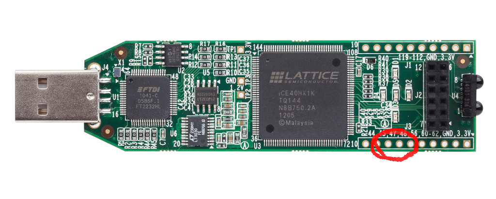

# From Blinker to RISC-V

This tutorial is a progressive journey from a simple blinky design to a RISC-V core.

## Introduction

To understand processor design, the first thing that I have read was
[this answer](https://stackoverflow.com/questions/51592244/implementation-of-simple-microprocessor-using-verilog/51621153#51621153)
on Stackoverflow, that I found inspiring. There is also [this article](http://www.fpgacpu.org/papers/xsoc-series-drafts.pdf) suggested by @mithro.
For a complete course, I highly recommend [this one from the MIT](http://web.mit.edu/6.111/www/f2016/), it also
gives the principles for going much further than what I've done here (pipelines etc...).

For Verilog basics and syntax, I read _Verilog by example by Blaine C. Readler_, it is also short and to the point. 

There are two nice things with the Stackoverflow answer:
- it goes to the essential, and keeps nothing else than what's essential
- the taken example is a RISC processor, that shares several similarities with RISC-V
  (except that it has status flags, that RISC-V does not have).

What we learn there is that there will be a _register file_, that stores
the so-called _general-purpose_ registers. By general-purpose, we mean 
that each time an instruction reads a register, it can be any of them, 
and each time an instruction writes a register, it can be any of them, 
unlike the x86 (CISC) that has _specialized_ registers. To implement the
most general instruction (`register <- register OP register`), the 
register file will read two registers at each cycle, and optionally 
write-back one.

There will be an _ALU_, that will compute an operation on two values.

There will be also a _decoder_, that will generate all required internal signals
from the bit pattern of the current instruction. 

If you want to design a RISC-V processor on your own, I recommend you take a deep look at 
[the Stackoverflow answer](https://stackoverflow.com/questions/51592244/implementation-of-simple-microprocessor-using-verilog/51621153#51621153), 
and do some schematics on your own to have all the general ideas in mind
before going further. 


## Prerequisites:

Before starting, you will need to install the following softwares:
- iverilog/icarus (simulation)
```
  sudo apt-get install iverilog
```
- yosys/nextpnr, the toolchain for your board. See [this link](../toolchain.md).

## Step 1: your first blinky

Let us start and create our first blinky ! Our blinky is implemented as VERILOG module,
connected to inputs and outputs, as follows ([step1.v](step1.v)):
```verilog
   module SOC (
       input  CLK,        
       input  RESET,      
       output [4:0] LEDS, 
       input  RXD,        
       output TXD         
   );

   reg [4:0] count = 0;
   always @(posedge CLK) begin
      count <= count + 1;
   end
   assign LEDS = count;
   assign TXD  = 1'b0; // not used for now

   endmodule
```
We call it SOC (System On Chip), which is a big name for a blinky, but
that's what our blinky will be morphed into after all the steps of
this tutorial. Our SOC is connected to the following signals:

- `CLK` (input) is the system clock.
- `LEDS` (output) is connected to the 5 LEDs of the board.
- `RESET` (input) is a reset button. You'll say that the IceStick
   has no button, but in fact ... (we'll talk about that
   later)
- `RXD` and `TXD` (input,output) connected to the FTDI chip that emulates 
   a serial port through USB. We'll also talk about that
   later.

You can synthesize and send the bitstream to the device as follows:
```
$ BOARDS/run_xxx.sh step1.v
```
where `xxx` corresponds to your board.

The five leds will light on... but they are not blinking. Why is this so ?
In fact they are blinking, but it is too fast for you to distinguish anything.

To see something, it is possible to use simulation. To use simulation, we write
a new VERILOG file [bench_iverilog.v](bench_iverilog.v),
with a module `bench` that encapsulates our `SOC`:
```verilog
module bench();
   reg CLK;
   wire RESET = 0; 
   wire [4:0] LEDS;
   reg  RXD = 1'b0;
   wire TXD;

   SOC uut(
     .CLK(CLK),
     .RESET(RESET),
     .LEDS(LEDS),
     .RXD(RXD),
     .TXD(TXD)
   );

   reg[4:0] prev_LEDS = 0;
   initial begin
      CLK = 0;
      forever begin
	 #1 CLK = ~CLK;
	 if(LEDS != prev_LEDS) begin
	    $display("LEDS = %b",LEDS);
	 end
	 prev_LEDS <= LEDS;
      end
   end
endmodule   
```
The module `bench` drives all the signals of our `SOC` (called
`uut` here for "unit under test"). The `forever` loop wiggles
the `CLK` signal and displays the status of the LEDs whenever
it changes.

Now we can start the simulation:
```
  $ iverilog -DBENCH -DBOARD_FREQ=10 bench_iverilog.v step1.v
  $ vvp a.out
```
... but that's a lot to remember, so I created a script for that,
you'll prefer to do:
```
  $ ./run.sh step1.v
```

You will see the LEDs counting. Simulation is precious, it lets
you insert "print" statements (`$display`) in your VERILOG code,
which is not directly possible when you run on the device !

To exit the simulation:
```
  <ctrl><c>
  finish
```
_Note: I developped the first version of femtorv completely on device,
 using only the LEDs to debug because I did not know how to
 use simulation, don't do that, it's stupid !_
 
**Try this** How would you modify `step1.v` to slow it down
sufficiently for one to see the LEDs blinking ?

**Try this** Can you implement a "Knight driver"-like blinking
pattern instead of counting ?

## Step 2: slower blinky

You probably got it right: the blinky can be slowed-down either
by counting on a larger number of bits (and wiring the most
significant bits to the leds), or inserting a "clock divider"
(also called a "gearbox") that counts on a large number
of bits (and driving the counter
with its most significant bit). The second solution is interesting,
because you do not need to modify your design, you just insert
the clock divider between the `CLK` signal of the board and your
design. Then, even on the device you can distinguish what happens
with the LEDs.

To do that, I created a `Clockworks` module in (clockworks.v)[clockworks.v],
that contains the gearbox and a mechanism related with the `RESET` signal (that
I'll talk about later). `Clockworks` is implemented as follows:
```verilog
module Clockworks 
(
   input  CLK,   // clock pin of the board
   input  RESET, // reset pin of the board
   output clk,   // (optionally divided) clock for the design.
   output resetn // (optionally timed) negative reset for the design (more on this later)
);
   parameter SLOW;
...
   reg [SLOW:0] slow_CLK = 0;
   always @(posedge CLK) begin
      slow_CLK <= slow_CLK + 1;
   end
   assign clk = slow_CLK[SLOW];
...
endmodule
```
This divides clock frequency by `2^SLOW`.

The `Clockworks` module is then inserted
between the `CLK` signal of the board
and the design, using an internal `clk`
signal, as follows, in [step2.v](step2.v):

```verilog
`include "clockworks.v"

module SOC (
    input  CLK,        // system clock 
    input  RESET,      // reset button
    output [4:0] LEDS, // system LEDs
    input  RXD,        // UART receive
    output TXD         // UART transmit
);

   wire clk;    // internal clock
   wire resetn; // internal reset signal, goes low on reset
   
   // A blinker that counts on 5 bits, wired to the 5 LEDs
   reg [4:0] count = 0;
   always @(posedge clk) begin
      count <= !resetn ? 0 : count + 1;
   end

   // Clock gearbox (to let you see what happens)
   // and reset circuitry (to workaround an
   // initialization problem with Ice40)
   Clockworks #(
     .SLOW(21) // Divide clock frequency by 2^21
   )CW(
     .CLK(CLK),
     .RESET(RESET),
     .clk(clk),
     .resetn(resetn)
   );
   
   assign LEDS = count;
   assign TXD  = 1'b0; // not used for now   
endmodule
```
It also handles the `RESET` signal. 

Now you can try it on simulation:
```
  $ ./run.sh step2.v
```

As you can see, the counter is now much slower. Try it also on device:
```
  $ BOARDS/run_xxx.sh step2.v
```
Yes, now we can see clearly what happens ! And what about the `RESET`
button ? The IceStick has no button. In fact it has one ! 



Press a finger on the circled region of the image (around pin 47).

**Try this** Knight-driver mode, and `RESET` toggles direction.

## Step 3: a blinker that loads LEDs patterns from ROM

Now we got all the tools that we need, so let's see how to
transform this blinker into a fully-functional RISC-V
processor. This goal seems to be far far away, but the
processor we will have created at step 16 is not longer
than 200 lines of VERILOG ! I was amazed to discover
that it is that simple to create a processor. OK, let us
go there one step at a time.

We know already that a processor has a memory, and fetches
instructions from there, in a sequential manner most of
the time (except when there are jumps and branches). Let us
start with something similar, but much simpler: a pre-programmed
christmas tinsel, that loads the LEDs pattern from a memory (see
[step3.v](step3.v)). Our tinsel has a memory with the patterns:
```verilog
   reg [4:0] MEM [0:20];
   initial begin
       MEM[0]  = 5'b00000;
       MEM[1]  = 5'b00001;
       MEM[2]  = 5'b00010;
       MEM[3]  = 5'b00100;
       ...
       MEM[19] = 5'b10000;
       MEM[20] = 5'b00000;       
   end
```
_Note that what's in the initial block does not generate any circuitry
when synthesized, it is directly translated into the initialization
data for the BRAMs of the FPGA._

We will also have a "program counter" `PC` incremented at each clock, and
a mechanism to fetch `MEM` contents indexed by `PC`:

```verilog
   reg [4:0] PC = 0;
   reg [4:0] leds = 0;

   always @(posedge clk) begin
      leds <= MEM[PC];
      PC <= (!resetn || PC==20) ? 0 : (PC+1);
   end
```
_Note the test `PC==20` to make it cycle._

Now try it with simulation and on device.

**Try this** create several blinking modes, and switch between
  modes using `RESET`.

## The RISC-V instruction set architecture

An important source of information is of course the 
[RISC-V reference manual](https://github.com/riscv/riscv-isa-manual/releases/download/Ratified-IMAFDQC/riscv-spec-20191213.pdf).
There you learn that there are several flavors of the RISC-V standard.
Let us start from the simplest one (RV32I, that is, 32 bits base integer 
instruction set). Then we will see how to add things, one thing at a
time. This is a very nice feature of RISC-V, since the instruction set 
is _modular_, you can start with a very small self-contained kernel, and
this kernel will be compliant with the norm. This means standard tools
(compiler, assembler, linker) will be able to generate code for this
kernel. Then I started reading Chapter 2 (page 13 to page 30). Seeing
also the table page 130, there are in fact only 11 different
instrutions ! (I say for instance that an AND, an OR, an ADD ... are
the same instruction, the operation is just an additional parameter).
Now we just try to have an idea of the overall picture,
no need to dive into the details for now. Let's take a global look at these
11 instructions:

| instruction | description                          | algo                                 |
|-------------|--------------------------------------|--------------------------------------|
| branch      | conditional jump, 6 variants         | `if(reg OP reg) PC<-PC+imm`          |
| ALU reg     | Three-registers ALU ops, 10 variants | `reg <- reg OP reg`                  |
| ALU imm     | Two-registers ALU ops, 9 variants    | `reg <- reg OP imm`                  |
| load        | Memory-to-register, 5 variants       | `reg <- mem[reg + imm]`              |
| store       | Register-to-memory, 3 variants       | `mem[reg+imm] <- reg`                |
| `LUI`       | load upper immediate                 | `reg <- (im << 12)`                  |
| `AUIPC`     | add upper immediate to PC            | `reg <- PC+(im << 12)`               |
| `JAL`       | jump and link                        | `reg <- PC+4 ; PC <- PC+imm`         |
| `JALR`      | jump and link register               | `reg <- PC+4 ; PC <- reg+imm`        |
| `FENCE`     | memory-ordering for multicores       | (not detailed here, skipped for now) |
| `SYSTEM`    | system calls, breakpoints            | (not detailed here, skipped for now) |

- The 6 branch variants are conditional jumps, that depend on a test
on two registers. 

- ALU operations can be of the form `register <- register OP register`
or `register <- register OP immediate`

- Then we have load and store, that can operate
on bytes, on 16 bit values (called half-words) or 32 bit values
(called words). In addition byte and half-word loads can do sign
expansion. The source/target address is obtained by adding an 
immediate offset to the content of a register.

- The remaining instructions are more special (one
may skip their description in a first read, you just need to know
that they are used to implement unconditional jumps, function calls,
memory ordering for multicores, system calls and breaks):

    - `LUI` (load upper immediate) is used to load the upper 20 bits of a constant. The lower
bits can then be set using `ADDI` or `ORI`. At first sight it may
seem weird that we need two instructions to load a 32 bit constant
in a register, but in fact it is a smart choice, because all
instructions are 32-bit long. 

    - `AUIPC` (add upper immediate to PC) adds a constant to the current program counter and places the 
result in a register. It is meant to be used in combination with 
`JALR` to reach a 32-bit PC-relative address.

    - `JAL` (jump and link) adds an offset to the PC and stores the address
of the instruction following the jump in a register. It can be used to
implement function calls. `JALR` does the same thing, but adds the
offset to a register. 

    - `FENCE` and `SYSTEMS` are used to implement memory ordering in
multicore systems, and system calls/breaks respectively.

To summarize, we got branches (conditional jumps), ALU operations,
load and store, and a couple of special instructions used to implement
unconditional jumps and function calls. There are also two functions
for memory ordering and system calls (but we will ignore these two
ones for now). OK, in fact only 9 instructions then, it seems doable...
At this point, I had not understood everything, so I'll start from what
I think to be the simplest parts (register file and ALU), then we will
see the instruction decoder and how things are interconnected.

## Step 4: the instruction decoder

Now the idea is to have a memory with RISC-V instructions in it, load all instructions
sequentially (like in our christmas tinsel), in an `instr` register, and see how to recognize
among the 11 instructions (and light a different LED in function of the recognized instruction). Each
instruction is encoded in a 32-bits word, and we need to decode the different bits of this word to
recognize the instruction and its parameters.

The [RISC-V reference manual](https://github.com/riscv/riscv-isa-manual/releases/download/Ratified-IMAFDQC/riscv-spec-20191213.pdf)
has all the information that we need summarized in two tables in page 130 (RV32/64G Instruction Set Listings). 

Let us take a look at the big table, first thing to notice is that the 7 LSBs tells you which instruction it is
(there are 10 possibilities, we do not count `FENCE` for now).

```verilog
   reg [31:0] instr;
   ...
   wire isALUreg  =  (instr[6:0] == 7'b0110011); // rd <- rs1 OP rs2   
   wire isALUimm  =  (instr[6:0] == 7'b0010011); // rd <- rs1 OP Iimm
   wire isBranch  =  (instr[6:0] == 7'b1100011); // if(rs1 OP rs2) PC<-PC+Bimm
   wire isJALR    =  (instr[6:0] == 7'b1100111); // rd <- PC+4; PC<-rs1+Iimm
   wire isJAL     =  (instr[6:0] == 7'b1101111); // rd <- PC+4; PC<-PC+Jimm
   wire isAUIPC   =  (instr[6:0] == 7'b0010111); // rd <- PC + Uimm
   wire isLUI     =  (instr[6:0] == 7'b0110111); // rd <- Uimm   
   wire isLoad    =  (instr[6:0] == 7'b0000011); // rd <- mem[rs1+Iimm]
   wire isStore   =  (instr[6:0] == 7'b0100011); // mem[rs1+Simm] <- rs2
   wire isSYSTEM  =  (instr[6:0] == 7'b1110011); // special
```

Besides the instruction type, we need also to decode the arguments of the instruction.
The table on the top distinguishes 6 types of instructions
(`R-type`,`I-type`,`S-type`,`B-type`,`U-type`,`J-type`), depending on the arguments
of the instruction and how they are encoded within the 32 bits of the instruction word.

`R-type` instructions take two source registers `rs1` and `rs2`,
 apply an operation on them and stores the result in a
 third destination register `rd` (`ADD`, `SUB`, `SLL`, `SLT`, `SLTU`, `XOR`,
 `SRL`, `SRA`, `OR`, `AND`).

 Since RISC-V has 32 registers,
 each of `rs1`,`rs2` and `rd` use 5 bits of the instruction
 word. Interestingly, these are the same bits for all
 instruction formats. Hence, "decoding" `rs1`,`rs2`
 and `rd` is just a matter of drawing some wires
 from the instruction word:
```verilog
   wire [4:0] rs1Id = instr[19:15];
   wire [4:0] rs2Id = instr[24:20];
   wire [4:0] rdId  = instr[11:7];
```

 Then, one needs to recognize among the 10 R-type instructions.
 It is done mostly with the `funct3` field, a 3-bits code. With
 a 3-bits code, one can only encode 8 different instructions, hence
 there is also a `funct7` field (7 MSBs of instruction word). Bit
 30 of the instruction word encodes `ADD`/`SUB` and `SRA`/`SRL`
 (arithmetic right shift with sign expansion/logical right shift).
 The instruction decoder has wires for `funct3` and `funct7`:
```verilog
   wire [2:0] funct3 = instr[14:12];
   wire [6:0] funct7 = instr[31:25];
```

`I-type` instructions take one register `rs1`, an immediate value
`Iimm`, applies an operation on them and stores the result in the
destination register `rd` (`ADDI`, `SLTI`, `SLTIU`, `XORI`, `ORI`,
`ANDI`, `SLLI`, `SRLI`, `SRAI`).

_Wait a minute:_ there are 10 R-Type instructions but only 9 I-Type
instructions, why is this so ? If you look carefully, you will see
that there is no `SUBI`, but one can instead use `ADDI` with a
negative immediate value. This is a general rule in RISC-V, if an
existing functionality can be used, do not create a new functionality.

As for R-type instructions, the instruction can be distinguished using
`funct3` and `funct7` (and in `funct7`, only the bit 30 of the instruction
word is used, to distinguish `SRAI`/`SRLI` arithmetic and logical right shifts).

The immediate value is encoded in the 12 MSBs of the instruction word,
hence we will draw additional wires to get it:
```verilog
   wire [31:0] Iimm={{21{instr[31]}}, instr[30:20]};
```

As can be seen, bit 31 of the instruction word is repeated 21 times,
this is "sign expansion" (converts a 12-bits signed quantity into
a 32-bits one).

There are four other instruction formats `S-type` (for Store),
`B-type` (for Branch), `U-type` (for Upper immediates that
are left-shifted by 12), and `J-type` (for Jumps). Each
instruction format has a different way of encoding an immediate
value in the instruction word.

To understand what it means, let's get back to Chapter 2, page 16.
The different instruction types correspond to the way _immediate values_ are encoded in them.

| Instr. type | Description                                    | Immediate value encoding                             |
|-------------|------------------------------------------------|------------------------------------------------------|
| `R-type`    | register-register ALU ops. [more on this here](https://www.youtube.com/watch?v=pVWtI0426mU) | None    |
| `I-type`    | register-immediate integer ALU ops and `JALR`. | 12 bits, sign expansion                              |
| `S-type`    | store                                          | 12 bits, sign expansion                              |
| `B-type`    | branch                                         | 12 bits, sign expansion, upper `[31:1]` (bit 0 is 0) |
| `U-type`    | `LUI`,`AUIPC`                                  | 20 bits, upper `31:12` (bits `[11:0]` are 0)         |
| `J-type`    | `JAL`                                          | 12 bits, sign expansion, upper `[31:1]` (bit 0 is 0) |

Note that `I-type` and `S-type` encode the same type of values (but they are taken from different parts of `instr`).
Same thing for `B-type` and `J-type`.

One can decode the different types of immediates as follows:
```verilog
   wire [31:0] Uimm={    instr[31],   instr[30:12], {12{1'b0}}};
   wire [31:0] Iimm={{21{instr[31]}}, instr[30:20]};
   wire [31:0] Simm={{21{instr[31]}}, instr[30:25],instr[11:7]};
   wire [31:0] Bimm={{20{instr[31]}}, instr[7],instr[30:25],instr[11:8],1'b0};
   wire [31:0] Jimm={{12{instr[31]}}, instr[19:12],instr[20],instr[30:21],1'b0};
```
Note that `Iimm`, `Simm`, `Bimm` and `Jimm` do sign expansion (by copying
bit 31 the required number of times to fill the MSBs).

And that's all for our instruction decoder ! To summarize, the instruction
decoder gets the following information from the instruction word:
- signals isXXX that recognizes among the 11 possible RISC-V instructions
- source and destination registers `rs1`,`rs2` and `rd`
- function codes `funct3` and `funct7`
- the five formats for immediate values (with sign expansion for `Iimm`, `Simm`, `Bimm` and `Jimm`).

Let us now initialize the memory with a few RISC-V instruction and see whether we can recognize them
by lighting a different LED depending on the instruction ([step4.v](step4.v)). To do that, we use
the big table in page 130 of the
[RISC-V reference manual](https://github.com/riscv/riscv-isa-manual/releases/download/Ratified-IMAFDQC/riscv-spec-20191213.pdf).
It is a bit painful (we will see easier ways later !). Using the `_` character to separate fields of a binary constant is
especially interesting under this circumstance.

```verilog
   initial begin
      // add x1, x0, x0
      //                    rs2   rs1  add  rd  ALUREG
      MEM[0] = 32'b0000000_00000_00000_000_00001_0110011;
      // addi x1, x1, 1
      //             imm         rs1  add  rd   ALUIMM
      MEM[1] = 32'b000000000001_00001_000_00001_0010011;
      ...
      // lw x2,0(x1)
      //             imm         rs1   w   rd   LOAD
      MEM[5] = 32'b000000000000_00001_010_00010_0000011;
      // sw x2,0(x1)
      //             imm   rs2   rs1   w   imm  STORE
      MEM[6] = 32'b000000_00001_00010_010_00000_0100011;
      // ebreak
      //                                        SYSTEM
      MEM[7] = 32'b000000000001_00000_000_00000_1110011;
   end	   
```

Then we can fetch and recognize the instructions as follows:
```verilog
   always @(posedge clk) begin
      if(!resetn) begin
	 PC <= 0;
      end else if(!isSYSTEM) begin
	 instr <= MEM[PC];
	 PC <= PC+1;
      end
   end
   assign LEDS = isSYSTEM ? 31 : {PC[0],isALUreg,isALUimm,isStore,isLoad};
```
(first led is wired to `PC[0]` so that we will see it blinking even if
 there is the same instruction several times).

As you can see, the program counter is only incremented if instruction
is not `SYSTEM`. For now, the only `SYSTEM` instruction that we support
is `EBREAK`, that halts execution. 

In simulation mode, we can in addition display the name of the recognized instruction
and the fields:
```verilog
`ifdef BENCH   
   always @(posedge clk) begin
      $display("PC=%0d",PC);
      case (1'b1)
	isALUreg: $display("ALUreg rd=%d rs1=%d rs2=%d funct3=%b",rdId, rs1Id, rs2Id, funct3);
	isALUimm: $display("ALUimm rd=%d rs1=%d imm=%0d funct3=%b",rdId, rs1Id, Iimm, funct3);
	isBranch: $display("BRANCH");
	isJAL:    $display("JAL");
	isJALR:   $display("JALR");
	isAUIPC:  $display("AUIPC");
	isLUI:    $display("LUI");	
	isLoad:   $display("LOAD");
	isStore:  $display("STORE");
	isSYSTEM: $display("SYSTEM");
      endcase 
   end
`endif
```

**Try this** run `step4.v` in simulation and on the device. Try initializing the memory with
different RISC-V instruction and test whether the decoder recognizes them.

## Sidebar: the elegance of RISC-V

This paragraph may be skipped.
it just contains my own impressions and reflexions on the RISC-V instruction set, inspired by the comments and Q&A in italics in the
[RISC-V reference manual](https://github.com/riscv/riscv-isa-manual/releases/download/Ratified-IMAFDQC/riscv-spec-20191213.pdf).

At this point, I realized what an _instruction set architecture_ means: it is for sure a specification of _what bit pattern does what_
(Instruction Set) and it is also at the same time driven by how this will be translated into wires (Architecture). An ISA is not
_abstract_, it is _independent_ on an implementation, but it is strongly designed with implementation in mind ! While the 
pipeline, branch prediction unit, multiple execution units, caches may differ in different implementations, the instruction decoder
is probably very similar in all implementations.

There were things that seemed really weird to me
in the first place: all these immediate format variants, the fact that immediate values are scrambled in different bits of `instr`,
the `zero` register, and the weird instructions `LUI`,`AUIPC`,`JAL`,`JALR`. When writing the instruction decoder, you better understand the reasons. The
ISA is really smart, and is the result of a long evolution (there were RISC-I, RISC-II, ... before). It seems to me the result of a 
_distillation_. Now, in 2020, many things were tested in terms of ISA, and this one seems to have benefited from all the previous
attempts, taking the good choices and avoiding the suboptimal ones. 

What is really nice in the ISA is:
- instruction size is fixed. Makes things really easier. _(there are extension with varying instrution length, but at least the core
  instruction set is simple)_;
- `rs1`,`rs2`,`rd` are always encoded by the same bits of `instr`;
- the immediate formats that need to do sign expansion do it from the same bit (`instr[31]`);
- the weird instructions `LUI`,`AUIPC`,`JAL`,`JALR` can be combined to implement higher-level tasks
   (load 32-bit constant in register, jump to arbitrary address, function calls). Their existence is
   justified by the fact it makes the design easier. Then assembly programmer's life is made easier by
   _pseudo-instructions_ `CALL`, `RET`, ... See [risc-v assembly manual](https://github.com/riscv/riscv-asm-manual/blob/master/riscv-asm.md), the
   two tables at the end of the page. Same thing for tests/branch instructions obtained by swapping parameters (e.g. `a < b <=> b > a`
   etc...), there are pseudo-instructions that do the job for you.

Put differently, to appreciate the elegance of the RISC-V ISA, imagine
that your mission is to _invent it_. That is, invent both the set of
instructions and the way they are encoded as bit patterns. The constraints are:
- fixed instruction length (32 bits)
- as simple as possible: the ultimate sophistication is simplicity [Leonardo da Vinci] !!
- source and destination registers always encoded at the same position
- whenever there is sign-extension, it should be done from the same bit
- it should be simple to load an arbitrary 32-bits immediate value in a register (but may take several instructions)
- it should be simple to jump to arbitrary memory locations (but may take several instructions)
- it should be simple to implement function calls (but may take several instructions)

Then you understand why there are many different immediate
formats. For instance, consider `JAL`, that does not have a source
register, as compared to `JALR` that has one. Both take an immediate
value, but `JAL` has 5 more bits available to store it, since it does
not need to encode the source register. The slightest available bit is
used to extend the dynamic range of the immediates. This explains both
the multiple immediate formats and the fact that they are assembled
from multiple pieces of `instr`, slaloming between the three fixed
5-bits register encodings, that are there or not depending on the
cases.

Now the rationale behind the weird instructions `LUI`,`AUIPC`,`JAL`
and `JALR` is to give a set of functions that can be combined to load
arbitrary 32-bit values in register, or to jump to arbitrary locations
in memory, or to implement the function call protocol as simply as
possible. Considering the constraints, the taken choices (that seemed
weird to me in the first place) perfectly make sense. In addition,
with the taken choices, the instruction decoder is pretty simple and
has a low logical depth. Besides the 7-bits instruction decoder, it
mostly consists of a set of wires drawn from the bits of `instr`, and
duplication of the sign-extended bit 31 to form the immediate values.

Before moving forward, I'd like to say a word about the `zero` register.
I think it is really a smart move. With it, you do not need a `MOV rd rs` 
instruction (just `ADD rd rs zero`), you do not need a `NOP` 
instruction (`ADD zero zero zero`), and all the branch variants can
compare with `zero` ! I think that `zero` is a great invention, not as great
as `0`, but really makes the instruction set more compact.

## Step 5: The register bank and the state machine

The register bank is implemented as follows:
```verilog
   reg [31:0] RegisterBank [0:31];
```

Let us take a closer look at what we need to to to execute an instruction.
Condider for instance a stream of R-type instructions. For each instruction,
we need to do the following four things:

- fetch the instruction: `instr <= MEM[PC]`
- fetch the values of `rs1` and `rs2`: `rs1 <= RegisterBank[rs1Id]; rs2 <= RegisterBank[rs2Id]`
   where `rs1` and `rs2` are two registers. We need to do that because `RegisterBank` will be
   synthesized as a block of BRAM, and one needs one cycle to access the content of BRAM.
- compute `rs1` `OP` `rs2` (where `OP` depends on `funct3` and `funct7`)
- store the result in `rd`: `RegisterBank[rdId] <= writeBackData`. This can be done during
  the same cycle as the previous step if `OP` is computed by a combinatorial circuit.

The first three operations are implemented by a state machine,
as follows (see [step5.v](step5.v)):
```verilog
   localparam FETCH_INSTR = 0;
   localparam FETCH_REGS  = 1;
   localparam EXECUTE     = 2;
   reg [1:0] state = FETCH_INSTR;
   always @(posedge clk) begin
	 case(state)
	   FETCH_INSTR: begin
	      instr <= MEM[PC];
	      state <= FETCH_REGS;
	   end
	   FETCH_REGS: begin
	      rs1 <= RegisterBank[rs1Id];
	      rs2 <= RegisterBank[rs2Id];
	      state <= EXECUTE;
	   end
	   EXECUTE: begin
	      PC <= PC + 1;
	      state <= FETCH_INSTR;	      
	   end
	 endcase
      end 
   end 
```

The fourth one (register write-back) is implemented in this block:
```verilog
   wire [31:0] writeBackData = ... ;
   wire writeBackEn = ...;
   always @posedge(clk) begin	
      if(writeBackEn && rdId != 0) begin
          RegisterBank[rdId] <= writeBackData;
      end
   end
```
Remember that writing to register 0 has no effect (hence the test `rdId != 0`).
The signal `writeBackEn` is asserted whenever `writeBackData` should be written
to register `rdId`.
The data to be written back (`writeBackData`) will be obtained from the ALU,
as explained in the next episode. 

**Try this**: run [step5.v](step5.v) in simulation and on the device. You will
see your wannabe CPU's state machine dancing waltz on the LEDs (that display
the current state).

## Step 6: the ALU

Now we can fetch instructions from memory, decode them and read register
values, but our (wannabe) CPU is still unable to do anything. Let us see
how to do actual computations on register's values.

_So, are you going to create an `ALU` module ? And by the way, why did not
 you create a `Decoder` module, and a `RegisterBank` module ?_

My very first design used multiple modules and multiple register files, for
a total of 1000 lines of code or so, then Matthias Koch wrote a monolithic
version, that fits in 200 lines of code. Not only it is more compact, but
also it is much easier to understand when you got everything in one place.
**Rule of thumb:** if you have more boxes and wires between the boxes than
circuitry in the boxes, then you have too many boxes !

_But wait a minute, modular design is good, no ?_

Modular design is neither good nor bad, it is useful whenever it makes things
simpler. It is not the case in the present situation. There is no absolute
answer though, it is a matter of taste and style ! In this tutorial, we use
a (mostly) monolithic design.

Now we want to implement two types of instructions:
- Rtype: `rd` <- `rs1` `OP` `rs2`  (recognized by `isALUreg`)
- Itype: `rd` <- `rs1` `OP` `Iimm` (recognized by `isALUimm`)

The ALU takes two inputs `aluIn1` and `aluIn2`, computes
`aluIn1` `OP` `aluIn2` and stores it in `aluOut`:
```verilog
   wire [31:0] aluIn1 = rs1;
   wire [31:0] aluIn2 = isALUreg ? rs2 : Iimm;
   reg [31:0] aluOut;
```
Depending on the instruction type, `aluIn2` is either the value
in the second source register `rs2`, or an immediate in the `Itype`
format (`Immm`). The operation `OP` depends mostly on `funct3`
(and also on `funct7`). Keep a copy of the [RISC-V reference manual](https://github.com/riscv/riscv-isa-manual/releases/download/Ratified-IMAFDQC/riscv-spec-20191213.pdf) open page 130 on your knees or in another window:

| funct3 | operation                                     |
|--------|-----------------------------------------------|
| 3'b000 | `ADD` or `SUB`                                |
| 3'b001 | left shift                                    |
| 3'b010 | signed comparison (<)                         |
| 3'b011 | unsigned comparison (<)                       |
| 3'b100 | `XOR`                                         |
| 3'b101 | logical right shift or arithmetic right shift |
| 3'b110 | `OR`                                          |
| 3'b111 | `AND`                                         |

- for `ADD`/`SUB`, if its an `ALUreg` operation (Rtype), then one makes the
difference between `ADD` and `SUB` by testing bit 5 of `funct7` (1 for `SUB`).
If it is an `ALUimm` operation (Itype), then it can be only `ADD`. In this
context, one just needs to test bit 5 of `instr` to distinguish between
`ALUreg` (if it is 1) and `ALUimm` (if it is 0).
- for logical or arithmetic right shift, one makes the difference also by testing
bit 5 of `funct7`, 1 for arithmetic shift (with sign expansion) and 0 for
logical shift.
- the shift amount is either the content of `rs2` for `ALUreg` instructions or
  `instr[24:20]` (the same bits as `rs2Id`) for `ALUimm` instructions.

Putting everything together, one gets the following VERILOG code for the ALU:
```verilog
   reg [31:0] aluOut;
   wire [4:0] shamt = isALUreg ? rs2[4:0] : instr[24:20]; // shift amount
   always @(*) begin
      case(funct3)
	3'b000: aluOut = (funct7[5] & instr[5]) ? (aluIn1-aluIn2) : (aluIn1+aluIn2);
	3'b001: aluOut = aluIn1 << shamt;
	3'b010: aluOut = ($signed(aluIn1) < $signed(aluIn2));
	3'b011: aluOut = (aluIn1 < aluIn2);
	3'b100: aluOut = (aluIn1 ^ aluIn2);
	3'b101: aluOut = funct7[5]? ($signed(aluIn1) >>> shamt) : (aluIn1 >> shamt); 
	3'b110: aluOut = (aluIn1 | aluIn2);
	3'b111: aluOut = (aluIn1 & aluIn2);	
      endcase
   end
```
_Note:_ although it is declared as a `reg`, `aluOut` will be a combinatorial function
(no flipflop generated), because its value is determined in a combinatorial block
(`always @(*)`), and all the configurations are enumerated in the `case` statement.

Register write-back is configured as follows:
```verilog
   assign writeBackData = aluOut; 
   assign writeBackEn = (state == EXECUTE && (isALUreg || isALUimm));   
```

**Try this** run [step6.v](step6.v) in simulation and on the device. In simulation
it will display the written value and the written register for all register
write-back operation. On the device it will show the 5 LSBs of `x1` on the LEDs.
Then you can try changing the program, and observe the effect on register values.

**You are here !** This is the list of instructions you have to implement,
your wannabe RISC-V core currently supports 20 of them. Next steps: jumps,
then branches, then... the rest. Before then, as you probably have noticed,
translating RISC-V programs into binary (that is, assembling manually) is
extremely painful. Next section gives a much easier solution.

| ALUreg | ALUimm | Jump  | Branch | LUI | AUIPC | Load  | Store | SYSTEM |
|--------|--------|-------|--------|-----|-------|-------|-------|--------|
| [*] 10 | [*] 9  | [ ] 2 | [ ] 6  | [ ] | [ ]   | [ ] 5 | [ ] 3 | [*] 1  |

## Using the VERILOG assembler

## Files for all the steps

- [step 1](step1.v): Blinker, too fast, can't see anything
- [step 2](step2.v): Blinker with clockworks
- [step 3](step3.v): Blinker that loads pattern from ROM
- [step 4](step4.v): The instruction decoder
- [step 5](step5.v): The register bank and the state machine
- [step 6](step6.v): The ALU
- [step 7](step7.v): Using the VERILOG assembler
- [step 8](step8.v): Jumps
- [step 9](step9.v): Branches
- [step 10](step10.v): LUI and AUIPC
- [step 11](step11.v): Memory in separate module
- [step 12](step12.v): Subroutines 1 (standard Risc-V instruction set)
- [step 13](step13.v): Size optimization
- [step 14](step14.v): Subroutines 2 (using Risc-V pseudo-instructions)
- [step 15](step15.v): Load
- [step 16](step16.v): Store
- [step 17](step17.v): Memory-mapped devices 
- [step 18](step18.v): Mandelbrot set

_WIP_

- step 19: Faster simulation with Verilator
- step 20: Using the GNU toolchain to compile programs
- step 21: More devices (LED matrix, OLED screen...)
- step 22: Running programs from the SPI Flash
- step 23: Raytracing with the IceStick
