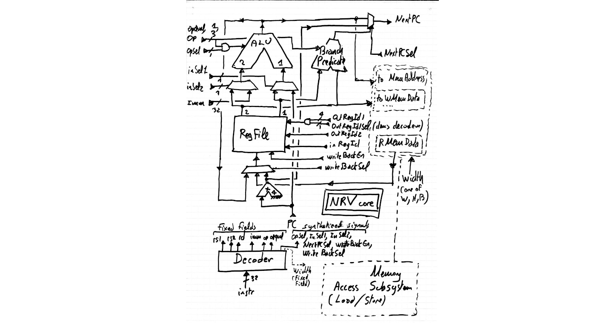
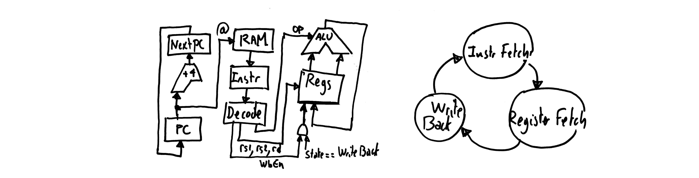
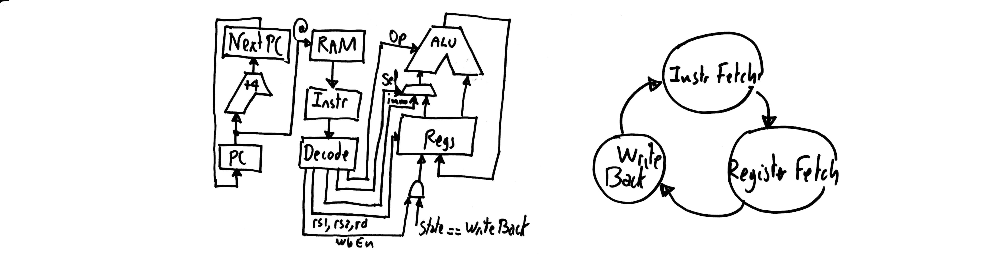

FemtoRV32 Design: from zero to I,II,III,IV ... RISC-V
=====================================================



_During the first confinement in March 2020, I grabbed an IceStick
just before getting stuck at home, with the idea in mind to learn
verilog and processor design. I came out with FemtoRV32, a super-simple design.
It is too basic (no pipeline), but it may be useful to somebody who
wants to quickly understand the general principles. This document
is written from my curated notes, keeping the order in which I
understood different things and how they mesh together._


Step I: general understanding on processor design
-------------------------------------------------

To understand processor design, the first thing that I have read was
[this answer](https://stackoverflow.com/questions/51592244/implementation-of-simple-microprocessor-using-verilog/51621153#51621153)
on Stackoverflow, that I found inspiring.
For a complete course, I highly recommend [this one from the MIT](http://web.mit.edu/6.111/www/f2016/), it also
gives the principles for going much further than what I've done here (pipelines etc...). For
Verilog basics and syntax, I read _Verilog by example by Blaine C. Readler_, it is also short and to the point. 

There are two nice things with the Stackoverflow answer:
- it goes to the essential, and keeps nothing else than what's essential
- the taken example is a RISC processor, that shares several similarities with RISC-V

What we learn there is that there will be a _register file_, that stores
the so-called _general-purpose_ registers. By general-purpose, we mean 
that each time an instruction reads a register, it can be any of them, 
and each time an instruction writes a register, it can be any of them, 
unlike the x86 (CISC) that has _specialized_ registers. To implement the
most general instruction (`register <- register OP register`), the 
register file will read two registers at each cycle, and optionally 
write-back one.

There will be an _ALU_, that will compute an operation on two values.

There will be also a _decoder_, that will generate all required internal signals
from the bit pattern of the current instruction. 

If you want to design a RISC-V processor on your own, I recommend you take a deep look at 
[the Stackoverflow answer](https://stackoverflow.com/questions/51592244/implementation-of-simple-microprocessor-using-verilog/51621153#51621153), 
and do some schematics on your own to have all the general ideas in mind
before going further. 

OK let's see how this
can be translated into something that understands RISC-V instructions.

Step II: the RV32I instruction set
----------------------------------

Another important source of information is of course the 
[RISC-V reference manual](https://github.com/riscv/riscv-isa-manual/releases/download/Ratified-IMAFDQC/riscv-spec-20191213.pdf).
There you learn that there are several flavors of the RISC-V standard.
Let us start from the simplest one (RV32I, that is, 32 bits base integer 
instruction set). Then we will see how to add things, one thing at a
time. This is a very nice feature of RISC-V, since the instruction set 
is _modular_, you can start with a very small self-contained kernel, and
this kernel will be compliant with the norm. This means standard tools
(compiler, assembler, linker) will be able to generate code for this
kernel. Then I started reading Chapter 2 (page 13 to page 30). Seeing
also the table page 130, there are in fact only 11 different
instrutions ! (I say for instance that an AND, an OR, an ADD ... are
the same instruction, the operation is just an additional parameter).
Now we just try to have an idea of the overall picture,
no need to dive into the details for now. Let's take a global look at these
11 instructions:

| instruction | description                          | algo                                 |
|-------------|--------------------------------------|--------------------------------------|
| branch      | conditional jump, 6 variants         | `if(reg OP reg) PC<-PC+imm`          |
| ALU reg     | Three-registers ALU ops, 10 variants | `reg <- reg OP reg`                  |
| ALU imm     | Two-registers ALU ops, 9 variants    | `reg <- reg OP imm`                  |
| load        | Memory-to-register, 5 variants       | `reg <- mem[reg + imm]`              |
| store       | Register-to-memory, 3 variants       | `mem[reg+imm] <- reg`                |
| `LUI`       | load upper immediate                 | `reg <- (im << 12)`                  |
| `AUIPC`     | add upper immediate to PC            | `reg <- PC+(im << 12)`               |
| `JAL`       | jump and link                        | `reg <- PC+4 ; PC <- PC+imm`         |
| `JALR`      | jump and link register               | `reg <- PC+4 ; PC <- reg+imm`        |
| `FENCE`     | memory-ordering for multicores       | (not detailed here, skipped for now) |
| `SYSTEM`    | system calls, breakpoints            | (not detailed here, skipped for now) |

- The 6 branch variants are conditional jumps, that depend on a test
on two registers. 

- ALU operations can be of the form `register <- register OP register`
or `register <- register OP immediate`

- Then we have load and store, that can operate
on bytes, on 16 bit values (called half-words) or 32 bit values
(called words). In addition byte and half-word loads can do sign
expansion. The source/target address is obtained by adding an 
immediate offset to the content of a register.

- The remaining instructions are more special (one
may skip their description in a first read, you just need to know
that they are used to implement unconditional jumps, function calls,
memory ordering for multicores, system calls and breaks):

    - `LUI` (load upper immediate) is used to load the upper 20 bits of a constant. The lower
bits can then be set using `ADDI` or `ORI`. At first sight it may
seem weird that we need two instructions to load a 32 bit constant
in a register, but in fact it is a smart choice, because all
instructions are 32-bit long. 

    - `AUIPC` (add upper immediate to PC) adds a constant to the current program counter and places the 
result in a register. It is meant to be used in combination with 
`JALR` to reach a 32-bit PC-relative address.

    - `JAL` (jump and link) adds an offset to the PC and stores the address
of the instruction following the jump in a register. It can be used to
implement function calls. `JALR` does the same thing, but adds the
offset to a register. 

    - `FENCE` and `SYSTEMS` are used to implement memory ordering in
multicore systems, and system calls/breaks respectively.

To summarize, we got branches (conditional jumps), ALU operations,
load and store, and a couple of special instructions used to implement
unconditional jumps and function calls. There are also two functions
for memory ordering and system calls (but we will ignore these two
ones for now). OK, in fact only 9 instructions then, it seems doable...
At this point, I had not understood everything, so I'll start from what
I think to be the simplest parts (register file and ALU), then we will
see the instruction decoder and how things are interconnected.

Step III: the register file
---------------------------

Following the [stackoverflow answer](https://stackoverflow.com/questions/51592244/implementation-of-simple-microprocessor-using-verilog/51621153#51621153),
at each clock tick, our register file will read two register values
and optionally write one. In addition, we learn from the RISC-V
specification that there is a special register `zero`, that returns always 0 when read, and 
that ignores what is written to it. Here is a _simplified_ version of the register file:

```
module NrvRegisterFile(
  input 	    clk, 
  input [31:0] 	    in,        // Data for write back register
  input [4:0] 	    inRegId,   // Register to write back to
  input 	    inEn,      // Enable register write back
  input [4:0] 	    outRegId1, // Register number for out1
  input [4:0] 	    outRegId2, // Register number for out2
  output reg [31:0] out1,      // Data out 1, available one clock after outRegId1 is set
  output reg [31:0] out2       // Data out 2, available one clock after outRegId2 is set
);
   reg [31:0]  bank1 [31:0];
   reg [31:0]  bank2 [31:0];
   always @(posedge clk) begin
      if (inEn) begin
	 if(inRegId != 0) begin 
	    bank1[inRegId] <= in;
	    bank2[inRegId] <= in;
	 end	  
      end 
      out1 <= bank1[outRegId1];
      out2 <= bank2[outRegId2];
   end 
endmodule
```

We need to read two registers (for instance, the two
operands of an ALU operation). Normally we would need two cycles, but if
we _duplicate_ the entire register file, we can do that in a single
cycle (this is why there is `bank1` and `bank2`).

_In fact if you take a look at `femtorv32.v`, it is slightly different:
there is a smarter way of treating register `zero`, taken from
Claire Wolf's [PicoRV32 sources](https://github.com/cliffordwolf/picorv32), by
negating the register index._ 

Step IV: the ALU and the predicates
-----------------------------------

The ALU is another simple element of the design. In the table Page 130 of
the [RISC-V reference manual](https://github.com/riscv/riscv-isa-manual/releases/download/Ratified-IMAFDQC/riscv-spec-20191213.pdf),
we
learn that there are 8 possible operations (some of them with two variants, ADD/SUB
and SRL/SRA).
Let us now take a look at the table in page 130 of the
[RISC-V reference manual](https://github.com/riscv/riscv-isa-manual/releases/download/Ratified-IMAFDQC/riscv-spec-20191213.pdf).
This table is very useful: it indicates how the 32 bits of an instruction are used to encode the parameters of the instruction.
The 7 least significant bits `[6:0]` are used to encode the instruction. Later we will need a component (_instruction decoder_)
with a `switch` statement based on these bits. Now you also see why I'm saying that in fact there are only 11 different
instructions, because there are only 11 different opcodes.
In the table, we see also where the source and destination register indices (`rs1,rd1,rd`) are encoded, as well as
the immediate values (`imm`). We will talk about that later. For now, let us focus on what varies in the register-immediate
ALU instructions (code `0010011`) and the register-register ALU instructions (code `0110011`). Seeing the table,
it will be possible to get the 3-bits `op` from the bits `[14:12]` of the instruction. The 1-bit `opqual` that discriminates
`ADD/SUB` and `SRLI/SRAI` (shift _logical_ immediate / shift _arithmetic_ immediate) correspond to the bit `30` of the
instruction. So we can write the ALU as a combinatorial function. Here is a _simplified_ version of the ALU:

```
module NrvSmallALU (
  input [31:0] 	    in1,
  input [31:0] 	    in2,
  input [2:0] 	    op,     // Operation
  input 	    opqual, // Operation qualification (+/-, Logical/Arithmetic)
  output reg [31:0] out     // ALU result. 
);
   always @(*) begin
      case(op)
        3'b000: out = opqual ? in1 - in2 : in1 + in2;                       // ADD/SUB
        3'b010: out = ($signed(in1) < $signed(in2)) ? 32'b1 : 32'b0 ;       // SLT
        3'b011: out = (in1 < in2) ? 32'b1 : 32'b0;                          // SLTU
	3'b100: out = in1 ^ in2;                                            // XOR
	3'b110: out = in1 | in2;                                            // OR
	3'b111: out = in1 & in2;                                            // AND
        3'b001: out = in1 << in2[4:0];                                      // SLL
        3'b101: out = $signed({opqual ? in1[31] : 1'b0, in1}) >>> in2[4:0]; // SRL/SRA
      endcase 
   end
endmodule
```

The ALU takes as input two 32-bit values `in1` and `in2`, the operation `op`,`opqual` and returns
the result.

_Well, doing so is not very good, because the _barrel shifter_ generated for SLL and SRL/SRA eats up many LUTs,
so it is possible to have an internal register in the ALU, that will shift one position at each clock tick, and
a `busy` signal asserted when the ALU is computed. There is also in FemtoRV32 a trick (suggested by @mecrisp) to
factor the addition/subtraction/comparison in a single adder. But for now, let us just imagine that the ALU is
as above._

Let us get back to the table Page 130 of
the [RISC-V reference manual](https://github.com/riscv/riscv-isa-manual/releases/download/Ratified-IMAFDQC/riscv-spec-20191213.pdf).
There are also 6 branch instructions (code `1100011`) with a varying part in bits `[14:12]` that indicates the test. To implement
these tests, we need another component, that resembles an ALU, but that just compares two values:

```
module NrvPredicate(
   input [31:0] in1,
   input [31:0] in2,
   input [2:0]  op, 
   output reg   out
);
   always @(*) begin
      case(op)
        3'b000: out = (in1 == in2);                   // BEQ
        3'b001: out = (in1 != in2);                   // BNE
        3'b100: out = ($signed(in1) < $signed(in2));  // BLT
        3'b101: out = ($signed(in1) >= $signed(in2)); // BGE
        3'b110: out = (in1 < in2);                    // BLTU
        3'b111: out = (in1 >= in2);                   // BGEU
	default: out = 1'bx; // don't care...
      endcase
   end 
endmodule
```

It takes as input two 32-bit values `in1` and `in2`, the test `op` and outputs a single bit, indicating the
result of the test.

_Same thing here, the comparison can be factored in a single adder as suggested by @mecrisp (see FemtoRV32 source),
but we will ignore that for now._

Step V: the instruction decoder
-------------------------------

At this point, we got a register file, that can store and retreive values, we got an ALU that can apply operations
to values, and we got predicates that can test values. The instruction of the processor will be fetched from memory,
let's say the current instruction is stored in a 32-bits register called `instr`.
Each instruction is a 32-bits word. We need now to define the hardware component that will decide what to do with the
registers and with the ALU, based on the instruction. The main reference is again the table in page 130 of the
[RISC-V reference manual](https://github.com/riscv/riscv-isa-manual/releases/download/Ratified-IMAFDQC/riscv-spec-20191213.pdf).
We know already that there will be a switch statement based on the opcode (bits `[6:0]`):
```
   wire[6:0] opcode = instr[6:0];
```

We also know already that we will need to extract the ALU operation/branch test (bits `[14:12]`):
```
   wire [2:0] op = instr[14:12];
```

There are operations that manipulate registers. They take one (`rs1`) or two (`rs1`,`rs2`) source registers and store the
result in the destination register (`rd`). Still in the same table, we can see that always the same bits of `instr` are
used to encore `rs1` (`[19:15]`), `rs2` (`[24:20]`) and `rd` (`[11:7]`), so we can write some verilog for that:
```
   wire [4:0] rd  = instr[11:7];
   wire [4:0] rs1 = instr[19:15];
   wire [4:0] rs2 = instr[24:20];
```

Another important thing is the little table on the top of page 130.
We learn there that there are several types of instructions. To understand what it means, let's get back to Chapter 2, page 16.
The different instruction types correspond to the way _immediate values_ are encoded in them.

| Instr. type | Description                                    | Immediate value encoding                             |
|-------------|------------------------------------------------|------------------------------------------------------|
| `R-type`    | register-register ALU ops. [more on this here](https://www.youtube.com/watch?v=pVWtI0426mU) | None    |
| `I-type`    | register-immediate integer ALU ops and `JALR`. | 12 bits, sign expansion                              |
| `S-type`    | store                                          | 12 bits, sign expansion                              |
| `B-type`    | branch                                         | 12 bits, sign expansion, upper `[31:1]` (bit 0 is 0) |
| `U-type`    | `LUI`,`AUIPC`                                  | 20 bits, upper `31:12` (bits `[11:0]` are 0)         |
| `J-type`    | `JAL`                                          | 12 bits, sign expansion, upper `[31:1]` (bit 0 is 0) |

Note that `I-type` and `S-type` encode the same type of values (but they are taken from different parts of `instr`).
Same thing for `B-type` and `J-type`.

We will need to reconstruct the immediate values from their bits in the instruction word. To do that, the table in Fig. 2.4,
Page 17 of [RISC-V reference manual](https://github.com/riscv/riscv-isa-manual/releases/download/Ratified-IMAFDQC/riscv-spec-20191213.pdf)
helps a lot (gives for each immediate format where each bit comes from). It can be directly translated in Verilog as follows:
```
   wire [31:0] Iimm = {{21{instr[31]}}, instr[30:20]};
   wire [31:0] Simm = {{21{instr[31]}}, instr[30:25], instr[11:7]};
   wire [31:0] Bimm = {{20{instr[31]}}, instr[7], instr[30:25], instr[11:8], 1'b0};
   wire [31:0] Jimm = {{12{instr[31]}}, instr[19:12], instr[20], instr[30:21], 1'b0};   
   wire [31:0] Uimm = {instr[31], instr[30:12], {12{1'b0}}};
```

Sidebar: the elegance of RISC-V
-------------------------------

This paragraph may be skipped, it just contains my own impressions and reflexions on the RISC-V instruction set, inspired by the
comments and Q&A in italics in the
[RISC-V reference manual](https://github.com/riscv/riscv-isa-manual/releases/download/Ratified-IMAFDQC/riscv-spec-20191213.pdf).

At this point, I realized what an _instruction set architecture_ means: it is for sure a specification of _what bit pattern does what_
(Instruction Set) and it is also at the same time driven by how this will be translated into wires (Architecture). An ISA is not
_abstract_, it is _independent_ on an implementation, but it is strongly designed with implementation in mind ! While the 
pipeline, branch prediction unit, multiple execution units, caches may differ in different implementations, the instruction decoder
is probably very similar in all implementations.

There were things that seemed really weird to me
in the first place: all these immediate format variants, the fact that immediate values are scrambled in different bits of `instr`,
and the weird instructions `LUI`,`AUIPC`,`JAL`,`JALR`. When writing the instruction decoder, you better understand the reasons. The
ISA is really smart, and is the result of a long evolution (there were RISC-I, RISC-II, ... before). It seems to me the result of a 
_distillation_. Now, in 2020, many things were tested in terms of ISA, and this one seems to have benefited from all the previous
attempts, taking the good choices and avoiding the suboptimal ones. 

What is really nice in the ISA is:
- instruction size is fixed. Makes things really easier. _(there are extension with varying instrution length, but at least the core
  instruction set is simple)_;
- `rs1`,`rs2`,`rd` are always encoded by the same bits of `instr`;
- the immediate formats that need to do sign expansion do it from the same bit (`instr[31]`);
- the weird instructions `LUI`,`AUIPC`,`JAL`,`JALR` can be combined to implement higher-level tasks
   (load 32-bit constant in register, jump to arbitrary address, function calls). Their existence is
   justified by the fact it makes the design easier. Then assembly programmer's life is made easier by
   _pseudo-instructions_ `CALL`, `RET`, ... See [risc-v assembly manual](https://github.com/riscv/riscv-asm-manual/blob/master/riscv-asm.md), the
   two tables at the end of the page.

Put differently, to appreciate the elegance of the RISC-V ISA, imagine that your mission is to _invent it_. The constraints are:
- fixed instruction length (32 bits)
- source and destination registers always encoded at the same position
- whenever there is sign-extension, it should be done from the same bit
- it should be simple to load an arbitrary 32-bits immediate value in a register (but may take several instructions)
- it should be simple to jump to arbitrary memory locations (but may take several instructions)
- it should be simple to implement function calls (but may take several instructions)

Then you understand why there are many different immediate
formats. For instance, consider `JAL`, that does not have a source
register, as compared to `JALR` that has one. Both take an immediate
value, but `JAL` has 5 more bits available to store it, since it does
not need to encode the source register. The slightest available bit is
used to extend the dynamic range of the immediates. This explains both
the multiple immediate formats and the fact that they are assembled
from multiple pieces of `instr`, slaloming between the three fixed
5-bits register encodings, that are there or not depending on the
cases.

Now the rationale behind the weird instructions `LUI`,`AUIPC`,`JAL`
and `JALR` is to give a set of functions that can be combined to load
arbitrary 32-bit values in register, or to jump to arbitrary locations
in memory, or to implement the function call protocol as simply as
possible. Considering the constraints, the taken choices (that seemed
weird to me in the first place) perfectly make sense. In addition,
with the taken choices, the instruction decoder is pretty simple and
has a low logical depth. Besides the 7-bits instruction decoder, it
mostly consists of a set of wires drawn from the bits of `instr`, and
duplication of the sign-extended bit 31 to form the immediate values.

OK, now that we see more or less the overall picture, we can now
create the hardware for interpreting the 9 different instructions
(register-register ALU, register-immediate ALU, branch, the 4 weird
instructions, load and store). We will start from a very simple
design, that only supports a linear execution flow, then enrich it
step by step.

Step VI: Linear execution flow, `reg <- reg OP reg` ALU instructions
--------------------------------------------------------------------


Let us start with a very simple processor, that can only execute a
linear stream of `reg <- reg OP reg` instructions stored in an RAM. On
the left part of the design, the `NextPC` is always obtained by adding
4 to the `PC`. In the middle part, the instruction is fetched from the
RAM and stored in `Instr`. The two sources and the destination
register are extracted by the decoder, and sent to the register
file. The two values read from the register file are fed to the ALU,
that computes the operation also extracted by the decoder. Finally
this value is written back to the register file.

The finite state machine that controls it is very simple, with three
states. At the beginning of `Instr Fetch`, the program counter `PC`
contains a valid address. The instruction is ready in `Instr` at the
beginning of the next state, `Register Fetch`. The two source and
destination registers are also ready, since they are just 5-bits words
extracted from `Instr` at fixed position. At the beginning of `Write
Back`, the two source registers and the computed value are ready
(because we have a purely combinatorial ALU, with a more complicated
one we would need to wait for it to be ready). Then the result is
written to the register file, and `PC` is replaced with `NextPC`.

(TODO: add testbench and example designs)

Step VII: Linear execution flow, adding `reg <- reg OP imm` ALU instructions
----------------------------------------------------------------------------


Let us now introduce the ALU operations that take immediate values. To
do that, as shown in the schematic, we insert a mux before the
second ALU input. This mux selects either the second output register
from the register file or the decoded immediate value. It is driven by
an additional signal generated by the instruction decoder. 

We have implemented 2 out of 7 instructions, let us continue...

Step VIII: Adding the branch instructions
-----------------------------------------


Now, to make things more interesting, we add branch instructions. With
branch instructions, we will have enough to create a blinky (yeha !!).
Let us see how to do that. It will require more drastic changes in the
design, as can be seen from the schematic. 

First, on the left part, the value of `NextPC` is now selected from a
mux, that uses either `PC+4` or the output of the ALU. This mux is
driven by both the result of the predicate (right part of the
schematic) and a new signal from the instruction decoder. Now on the
right part of the schematic, the predicate is wired to the two outputs
of the register file. Now when the branch is taken, `PC` should be set
to `PC + imm`. To do that, we reuse the adder of the ALU. The two muxes
select `imm` on the left, and `PC` on the right. In addition, `op` is
forced to zero (which means `ADD`) by an additional signal (not shown
here) from the decoder. 

At this point, we have implemented 3 instructions (out of 9), but we
can do interesting things with this processor. Since for now it cannot
store values to the memory, it cannot output anything, but it is
possible to wire signals from one of the registers, and connect these
signals to the LEDs. Then you can program two nested loops (the inner
one is a delay) to implement a blinky. To generate the initial content
of the RAM, you can use the gnu risc-v assembly, then the `objcopy`
command to convert an object file into raw hexadecimal that can be
understood by the `readmemh` command of verilog. Believe me or not,
when your own processor starts executing risc-v code compiled by the 
gnu assembly, even if it is only blinking a couple of LEDs, it is a
fantastic experience !

TODO: restore the designs, assembly programs, test bench.

Now we are 6 instructions away from a complete RV32I processor (minus
`FENCE` and `SYSTEM`, but we can leave without them). We need to
implement the four weird instructions (as I like to call them). They
are not that weird, and easy to implement. Then we will need to
implement the different variants of `load` and `store` (more
difficult).

Step IX: Adding the weird instructions `LUI`, `AUIPC`, `JAL`, `JALR`
--------------------------------------------------------------------

Step X: Adding load and store instructions
------------------------------------------

