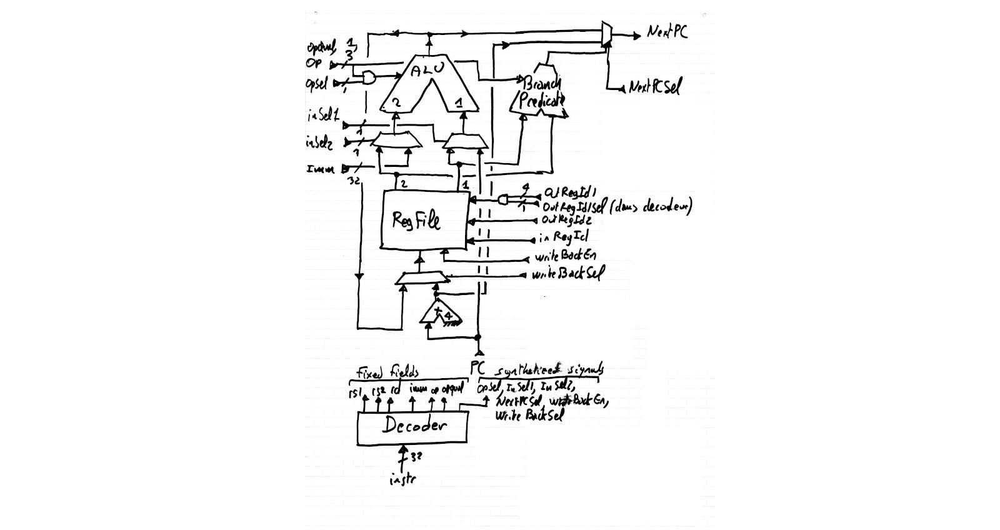

Episode IX: Adding the weird instructions `LUI`, `AUIPC`, `JAL`, `JALR`
--------------------------------------------------------------------



In fact, these instructions are not that complicated. Let us see again what they are supposed
to do:

| instruction | description                          | algo                                 |
|-------------|--------------------------------------|--------------------------------------|
| `LUI`       | load upper immediate                 | `reg <- (im << 12)`                  |
| `AUIPC`     | add upper immediate to PC            | `reg <- PC+(im << 12)`               |
| `JAL`       | jump and link                        | `reg <- PC+4 ; PC <- PC+imm`         |
| `JALR`      | jump and link register               | `reg <- PC+4 ; PC <- reg+imm`        |

Consider first the right-hand side of the affectations. We need to compute additions between the
`PC` and immediates. To do that, we already have the two muxes for the input of the ALU, so we
are done. In fact, `LUI` requires a special treatment, since it directly copies the immediate
value to a register. It can be easily done by and-gating the selection of the second register
(`sel2`) with an additional `regId1Sel` signal from the decoder. If this signal is 0, then this
register is replaced by `zero`, and we add 0 to the imm. It is a bit convoluted, but makes minimal
changes / adds minimal complexity to the previous design. Now consider `JAL` and `JALR`, they need
to write back `PC+4` to the register file. For that, we add a mux to the write back input of the
register file, that selects between the output of the ALU and `PC+4`. These two modifications
are depicted on the schematic above.

It is time to take a look at the (almost complete) instruction decoder. It looks
complicated, but it is nothing more than a big combinatorial function, written as
a big `switch` statement that generates all the signals for the 7 different instructions
(`load` and `store` are not there yet, will see them in the next
section). Before seeing the VERILOG source for the instruction decoder, 
let us take a look at a die shot of a 6502 (a very common 8-bit processor in the 80's):

[](https://fr.wikipedia.org/wiki/MOS_Technology_6502#/media/Fichier:BreakNES_MOS_6502.jpg)

The instruction decoder is the grid-like structure on the top of the
image. Horizontally, you have the 8 bits and negated 8 bits of the currently decoded
instruction, and vertically, all the `ANDs` computed between these bits 
(each 'dot' on the grid corresponds to an `AND`), then these vertical lines are 
combined with `ORs` to form the internal signals of the processor.

Note that the
signals that select among more than two sources use one wire per source (for instance,
selecting among 4 sources is 0001, 0010, 0100, 1000). This so-called _one hot encoding_
may sound stupid since we could use instead (00, 01, 10, 11), but in fact doing so
reduces logical depth (clearly), and more surprisingly _saves LUTs_ in the end, so only gains. 

```
module NrvDecoder(
    input wire [31:0] instr,
    output wire [4:0] writeBackRegId,
    output reg 	      writeBackEn,
    output reg [3:0]  writeBackSel, // 0001: ALU  0010: PC+4  (and also, later, 0100:RAM 1000:counters)
    output wire [4:0] inRegId1,
    output wire [4:0] inRegId2,
    output reg 	      aluSel, // 0: force aluOp,aluQual to zero (ADD)  1: use aluOp,aluQual from instr field
    output reg 	      aluInSel1, // 0: reg  1: pc
    output reg 	      aluInSel2, // 0: reg  1: imm
    output [2:0]      aluOp,
    output reg 	      aluQual,
    output reg [2:0]  nextPCSel, // 001: PC+4  010: ALU  100: (predicate ? ALU : PC+4)
    output reg [31:0] imm,
    output reg 	      error
);

   reg inRegId1Sel; // 0: force inRegId1 to zero 1: use inRegId1 instr field

   // The control signals directly deduced from (fixed pos) fields
   assign writeBackRegId = instr[11:7];
   assign inRegId1       = instr[19:15] & {5{inRegId1Sel}}; // Internal sig InRegId1Sel used to force zero in reg1
   assign inRegId2       = instr[24:20];             
   assign aluOp          = instr[14:12];  

   // The five immediate formats, see the RiscV reference, Fig. 2.4 p. 12
   wire [31:0] Iimm = {{21{instr[31]}}, instr[30:20]};
   wire [31:0] Simm = {{21{instr[31]}}, instr[30:25], instr[11:7]};
   wire [31:0] Bimm = {{20{instr[31]}}, instr[7], instr[30:25], instr[11:8], 1'b0};
   wire [31:0] Jimm = {{12{instr[31]}}, instr[19:12], instr[20], instr[30:21], 1'b0};   
   wire [31:0] Uimm = {instr[31], instr[30:12], {12{1'b0}}};

   // The rest of instruction decoding, for the following signals:
   // writeBackEn
   // writeBackSel   0001: ALU  0010: PC+4 (two additional bits for RAM and COUNTERS)
   // inRegId1Sel    0: zero   1: regId
   // aluInSel1      0: reg    1: PC 
   // aluInSel2      0: reg    1: imm
   // aluQual        +/- SRLI/SRAI
   // aluSel         0: force aluOp,aluQual=00  1: use aluOp/aluQual
   // nextPCSel      001: PC+4  010: ALU   100: (pred ? ALU : PC+4)
   // imm (select one of Iimm,Simm,Bimm,Jimm,Uimm)

   // We need to distingish shifts, because
   //   for ALU ops with immediates, aluQual is 0, except
   //   for shifts (then it is instr[30]). Had a hard time
   //   debugging / understanding that.
   wire aluOpIsShift = (aluOp == 3'b001) || (aluOp == 3'b101);
   
   always @(*) begin

       error = 1'b0;
       nextPCSel = 3'b001;  // default: PC <- PC+4
       inRegId1Sel = 1'b1; // reg 1 Id from instr
       aluQual = 1'b0;
      
       (* parallel_case, full_case *)
       case(instr[6:0])
	   7'b0110111: begin // LUI
	      writeBackEn  = 1'b1;    // enable write back
	      writeBackSel = 4'b0001; // write back source = ALU
	      inRegId1Sel = 1'b0;     // reg 1 Id = 0
	      aluInSel1 = 1'b0;       // ALU source 1 = reg	      
	      aluInSel2 = 1'b1;       // ALU source 2 = imm
	      aluSel = 1'b0;          // ALU op = ADD
	      imm = Uimm;             // imm format = U
	   end
	 
	   7'b0010111: begin // AUIPC
	      writeBackEn  = 1'b1;    // enable write back
	      writeBackSel = 4'b0001; // write back source = ALU
	      inRegId1Sel = 1'bx;     // reg 1 Id : don't care (we use PC)	      
	      aluInSel1 = 1'b1;       // ALU source 1 = PC	      
	      aluInSel2 = 1'b1;       // ALU source 2 = imm
	      aluSel = 1'b0;          // ALU op = ADD
	      imm = Uimm;             // imm format = U
	   end
	 
	   7'b1101111: begin // JAL
	      writeBackEn  = 1'b1;    // enable write back
	      writeBackSel = 4'b0010; // write back source = PC+4
	      inRegId1Sel = 1'bx;     // reg 1 Id : don't care (we use PC)	      	      
	      aluInSel1 = 1'b1;       // ALU source 1 = PC	      
	      aluInSel2 = 1'b1;       // ALU source 2 = imm
	      aluSel = 1'b0;          // ALU op = ADD
	      nextPCSel = 3'b010;     // PC <- ALU	      
	      imm = Jimm;             // imm format = J
	   end
	 
	   7'b1100111: begin // JALR
	      writeBackEn  = 1'b1;    // enable write back
	      writeBackSel = 4'b0010; // write back source = PC+4
	      aluInSel1 = 1'b0;       // ALU source 1 = reg	      
	      aluInSel2 = 1'b1;       // ALU source 2 = imm
	      aluSel = 1'b0;          // ALU op = ADD
	      nextPCSel = 3'b010;     // PC <- ALU	      
	      imm = Iimm;             // imm format = I
	   end
	 
	   7'b1100011: begin // Branch
	      writeBackEn = 1'b0;     // disable write back
	      writeBackSel = 4'bxxxx; // write back source = don't care
	      aluInSel1 = 1'b1;       // ALU source 1 : PC
	      aluInSel2 = 1'b1;       // ALU source 2 : imm
	      aluSel = 1'b0;          // ALU op = ADD
	      nextPCSel = 3'b100;     // PC <- pred ? ALU : PC+4	       
	      imm = Bimm;             // imm format = B
	   end
	   
	   7'b0010011: begin // ALU operation: Register,Immediate
	      writeBackEn = 1'b1;     // enable write back
	      writeBackSel = 4'b0001; // write back source = ALU
	      aluInSel1 = 1'b0;       // ALU source 1 : reg
	      aluInSel2 = 1'b1;       // ALU source 2 : imm
	                              // Qualifier for ALU op: SRLI/SRAI
	      aluQual = aluOpIsShift ? instr[30] : 1'b0;
	      aluSel = 1'b1;         // ALU op : from instr
	      imm = Iimm;            // imm format = I
	   end
	   
	   7'b0110011: begin // ALU operation: Register,Register
	      writeBackEn = 1'b1;     // enable write back
	      writeBackSel = 4'b0001; // write back source = ALU
	      aluInSel1 = 1'b0;       // ALU source 1 : reg
	      aluInSel2 = 1'b0;       // ALU source 2 : reg
	      aluQual = instr[30];    // Qualifier for ALU op: +/- SRL/SRA
	      aluSel = 1'b1;          // ALU op : from instr
	      error = instr[25];
	      imm = 32'bxxxxxxxxxxxxxxxxxxxxxxxxxxxxxxxx; // don't care
	   end
	   
           default: begin
	      writeBackEn = 1'b0;
	      error = 1'b1;
	      writeBackSel = 4'bxxxx;   
	      inRegId1Sel = 1'bx; 
	      aluInSel1 = 1'bx;      
	      aluInSel2 = 1'bx;      
	      aluSel = 1'bx;      
	      nextPCSel = 3'bxxx;  
	      imm = 32'bxxxxxxxxxxxxxxxxxxxxxxxxxxxxxxxx;
	   end
       endcase
   end

endmodule
```

[Next](FemtoRV32_X.md)