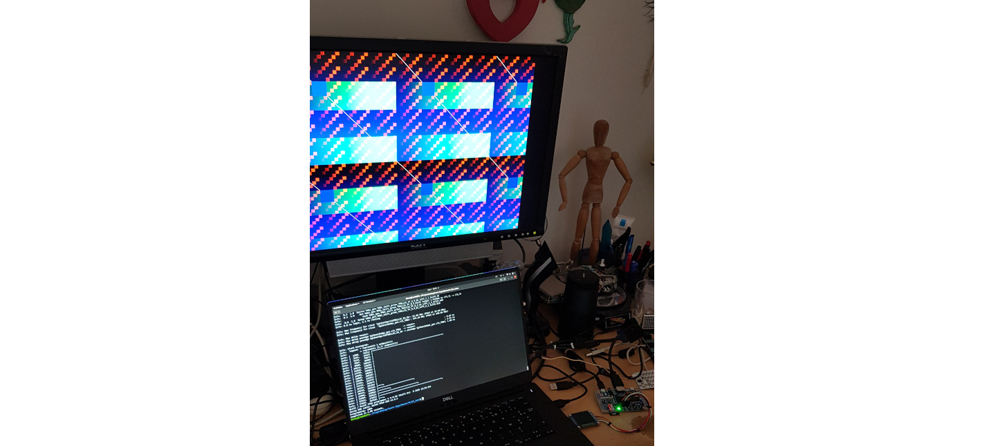

HDMI
====

_TL;DR_ self-contained easy example for the ULX3S is 
[here](https://github.com/BrunoLevy/learn-fpga/tree/master/Basic/ULX3S_hdmi)

Let us try to add a framebuffer device that sends a portion of the RAM
to the HDMI. I know nothing about HDMI, it is very difficult to find a
simple and self-contained design that works well with the ULX3S. There
are several reasons, one of them is that we need to use some specialized
blocks, that may differ from one FPGA to another. 

First thing I found is the [fpga4fun](https://www.fpga4fun.com/HDMI.html)
website. It has a nice explanation and example program (that will need
to be adapted though). We learn there that the HDMI connector has 19
pins, but that we need to generate signals on 8 of them, forming 4
so-called `TMDS differential pairs`. As far as I understand, a
differential pair is a way of sending a digital signal through a wire
at a high frequency. There will be one for red, for green, for blue and
for the clock. 

Then we learn that there will be an off-screen area, just like VGA. In
other words, as far as I understand, HDMI (or DVI) is just working like VGA, with
the difference that all the signals are digital (and serialized) instead
of analog. Then we see the timings for 640x480 RGB 24bpp 60Hz. We see
that we will need a pixel clock at 25MHz. The ULX3S has a clock at
25MHz, we can use it directly, cool ! Then with the offscreen area, the 
total area will be 800x525. We will also generate a hSync and vSync
signal, just like VGA.

Now we need to serialize the red, green and blue signals, but there are
some complications: we learn that the bits need to be scrambled in
some way, and that there will be 2 additional bits per signal
(if you want to know, this is for minimizing the transitions between
0 and 1, and for balancing the number of 0 and 1). For that,
there is a `TMDS_encoder` module. It takes as input the pixel clock,
the 8-bits channel data, two bits of control, and a VDE (Video Display
Enable) signal (that goes zero when we are offscreen). The two bits of
control are set fo 00 for the red and green signals, and to vSync,hSync
for the blue signal. Each `TMDS_encoder` outputs 10 bits of data.

Now we need to serialize the 10-bits wide red,green and blue TMDS
signals. For this we will need a clock that runs at 10*25MHz = 250MHz.
There is a special block to do that.
We also need three 10-bits shift registers, and a signal that goes high
every 10 ticks of the 250MHz clock to copy the 10-bits TMDS signals into
the shift register. _It seems we cannot simply use the initial 25MHz signal
to do that, probably the way it is generated would make it not well
synchronized or something_.

Finally, we need to send the generated red,green,blue serial signals and
the pixel clock _not the signal that goes high every 10 ticks of the
250 MHz clock ??_ through special blocks that correspond to TMDS pairs.

OK, so it is rather clear, to summarize we have:
 1) something like a VGA signal generator, written in portable verilog 
     [here](https://github.com/BrunoLevy/learn-fpga/blob/master/Basic/ULX3S_hdmi/HDMI_test.v)
     (using FPGA4fun's one)
 2) TMDS encoder, also written in portable verilog, that take the red, green and blue signals, and encodes them in 10 bits
     [here](https://github.com/BrunoLevy/learn-fpga/blob/master/Basic/ULX3S_hdmi/TMDS_encoder.v)
     (using FPGA4fun's one)
 3) a 250 MHz clock, using special primitives
     [here](https://github.com/BrunoLevy/learn-fpga/blob/master/Basic/ULX3S_hdmi/HDMI_clock.v)
     (ECP5-specific, using Lawrie's one)
 4) shift-registers, written in portable verilog
     [here](https://github.com/BrunoLevy/learn-fpga/blob/master/Basic/ULX3S_hdmi/HDMI_test.v)
     (using FPGA4fun's one)      
 5) finally, specialized blocs to generate the TMDS pairs from the
    serialized red,green,blue signals and from the pixel clock. It is
    also ECP5-specific. I'm using the `LVCMOS33D` mode for the HDMI
    pins, specified in the `.lpf` file
    [here](https://github.com/BrunoLevy/learn-fpga/blob/master/Basic/ULX3S_hdmi/ulx3s.lpf).
    It does exactly what I need:
    generate the negative pins from the positive ones. When it is
    active, negative pins should not be driven !
  
Note: for higher resolution, it is possible to use a specialized ECP5
primitive (`ODDRX1F`) that can shift two bits per clock (then using a
125MHz clock instead of 250MHz), see Lawrie's code
[here](https://github.com/lawrie/ulx3s_examples/blob/master/hdmi/fake_differential.v).
For now I'm not doing that, because it seems that the simpler code
suffices.

[Complete sources for ULX3S](https://github.com/BrunoLevy/learn-fpga/tree/master/Basic/ULX3S_hdmi)

References
----------
- [fpga4fun](https://www.fpga4fun.com/HDMI.html)
- [Lawrie's HDMI for ULX3S](https://github.com/lawrie/ulx3s_examples/blob/master/hdmi/)
- [UltraEmbedded's core dvi FB](https://github.com/ultraembedded/core_dvi_framebuffer/blob/master/src_v/dvi.v)
- [Silice HDMI walkthrough](https://github.com/sylefeb/Silice/tree/master/projects/hdmi_test)
- [HDMI with audio](https://github.com/hdl-util/hdmi/)
- [HDMI tutorial](https://purisa.me/blog/hdmi-on-fpga/)
