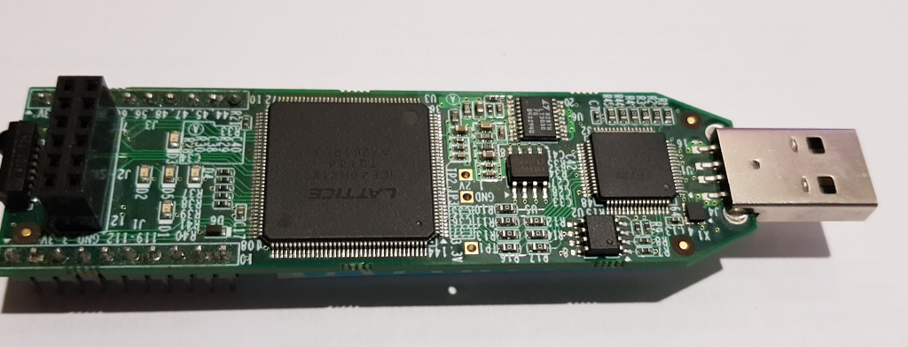
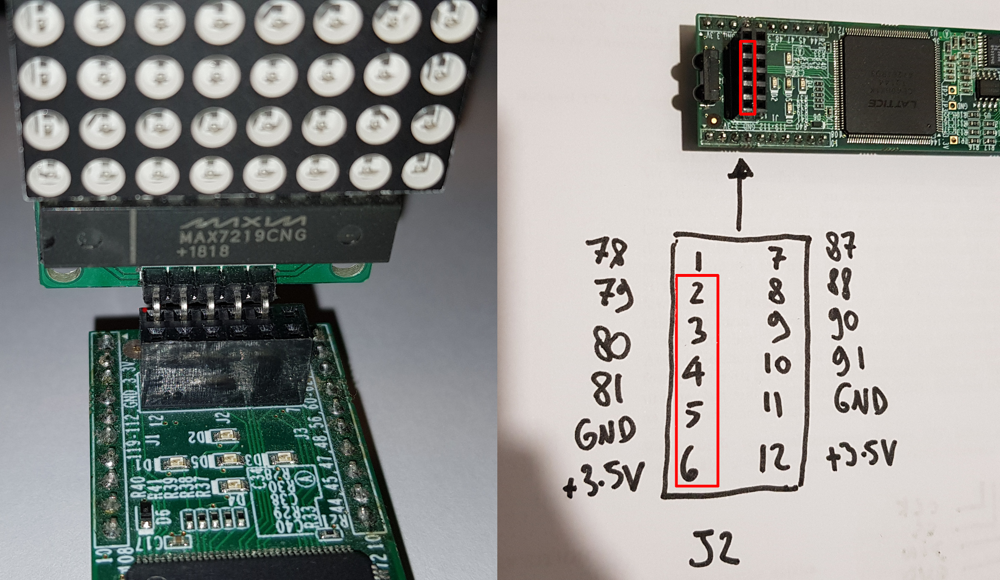
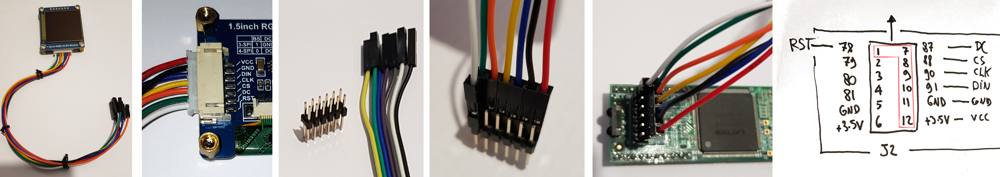

IceStick Tutorial
=================



This tutorial will show you how to install FPGA development tools,
synthesize a RISC-V core, compile and install programs and run them
on a IceStick. This lets you experience FPGA design and RISC-V using 
one of the cheapest FPGA devices (around $40).

_Note: the following instructions are for Linux (I'm using Ubuntu). It 
is probably possible to make everything work under Windows, but this 
will require porting the Makefiles. If somebody volunteers, it would 
be cool, please send a pull request !_

Before starting, you will need to install the OpenSource FPGA
development tools, Yosys (Verilog synthesis), IceStorm (tools for
Lattice Ice40 FPGA), NextPNR (Place and Route). Although there 
exists some precompiled packages, I highly recommend to get fresh
source versions from the repository, because the tools quickly 
evolve.

Step 0: install FemtoRV
=======================
```
$ git clone https://github.com/BrunoLevy/learn-fpga.git
```

Step 1: install FPGA development tools
======================================

Yosys
-----

Follow setup instructions from [yosys website](https://github.com/YosysHQ/yosys)

*TL;DR*

Install prerequisites:
```
$ sudo apt-get install build-essential clang bison flex \
  libreadline-dev gawk tcl-dev libffi-dev git \
  graphviz xdot pkg-config python3 libboost-system-dev \
  libboost-python-dev libboost-filesystem-dev zlib1g-dev
```
Get the sources:
```
$ git clone https://github.com/YosysHQ/yosys.git
```
Compile and install it:
```
$ cd yosys
$ make
$ sudo make install
```

IceStorm
--------

Follow setup instructions from [icestorm website](https://github.com/YosysHQ/icestorm)

*TL;DR*

Install prerequisites:
```
$ sudo apt-get install build-essential clang bison flex libreadline-dev \
  gawk tcl-dev libffi-dev git mercurial graphviz   \
  xdot pkg-config python python3 libftdi-dev \
  qt5-default python3-dev libboost-all-dev cmake libeigen3-dev
```
Get the sources:
```
$ git clone https://github.com/YosysHQ/icestorm.git
```
Compile and install it:
```
$ cd icestorm
$ make -j 4
$ sudo make install
```

NextPNR
-------

Follow setup instructions from [nextpnr website](https://github.com/YosysHQ/nextpnr)

*TL;DR*


Get the sources:
```
$ git clone https://github.com/YosysHQ/nextpnr.git
```
Compile and install it:
```
$ cd nextpnr
$ cmake -DARCH=ice40 -DCMAKE_INSTALL_PREFIX=/usr/local .
$ make -j 4
$ sudo make install
```

Step 2: Configure USB rules
===========================
We need to let normal users program the IceStick through USB. This
can be done by creating in `/etc/udev/rules.d` a file `53-lattive-ftdi.rules` 
with the following content:
```
ATTRS{idVendor}=="0403", ATTRS{idProduct}=="6010", MODE="0660", GROUP="plugdev", TAG+="uaccess"
```

Step 3: Configure femtosoc and femtorv32
========================================
Time to edit `learn-fpga/FemtoRV/femtosoc.v`. This file lets you define what type
of RISC-V processor you will create, and which device drivers in the
associated system-on-chip. For now we activate the LEDs (for visual
debugging) and the UART (to talk with the system through a
terminal-over-USB connection). We use 6144 bytes of RAM. It is not 
very much, but we cannot do more on the IceStick. You will see that
with 6k of RAM, you can still program nice and interesting RISC-V
demos. The file contains some `CONFIGWORD` commands that need to
be kept: the firmware generation tool uses them to store the hardware
configuration in some predefined memory areas. 


We configure `FemtoRV/femtosoc.v` as follows (we keep unused options as commented-out lines):
```
/*
 * Optional mapped IO devices
 */
`define NRV_IO_LEDS         // CONFIGWORD 0x0024[0]  // Mapped IO, LEDs D1,D2,D3,D4 (D5 is used to display errors)
`define NRV_IO_UART         // CONFIGWORD 0x0024[1]  // Mapped IO, virtual UART (USB)
//`define NRV_IO_SSD1351      // CONFIGWORD 0x0024[2]  // Mapped IO, 128x128x64K OLed screen
//`define NRV_IO_MAX2719      // CONFIGWORD 0x0024[3]  // Mapped IO, 8x8 led matrix
//`define NRV_IO_SPI_FLASH    // CONFIGWORD 0x0024[4]  // Mapped IO, SPI flash  
//`define NRV_IO_SPI_SDCARD   // CONFIGWORD 0x0024[5]  // Mapped IO, SPI SDCARD
//`define NRV_IO_BUTTONS      // CONFIGWORD 0x0024[6]  // Mapped IO, buttons

`define NRV_FREQ 80        // CONFIGWORD 0x001C // Frequency in MHz. Can push it to 80 MHz on the ICEStick.
                                                  
// Quantity of RAM in bytes. Needs to be a multiple of 4. 
// Can be decreased if running out of LUTs (address decoding consumes some LUTs).
// 6K max on the ICEstick
// Do not forget the CONFIGWORD 0x0020 comment (FIRMWARE_WORDS depends on it)
//`define NRV_RAM 393216       // CONFIGWORD 0x0020 // bigger config for ULX3S
//`define NRV_RAM 262144       // CONFIGWORD 0x0020 // default for ULX3S
//`define NRV_RAM 131072       // CONFIGWORD 0x0020 // You need at least this to run DHRYSTONE
//`define NRV_RAM 65536        // CONFIGWORD 0x0020
`define NRV_RAM 6144         // CONFIGWORD 0x0020 // default for IceStick (maximum)
//`define NRV_RAM 4096         // CONFIGWORD 0x0020 // smaller for IceStick (to save LUTs)

//`define NRV_COUNTERS    // CONFIGWORD 0x0018[0] // Uncomment for instr and cycle counters (won't fit on the ICEStick)
//`define NRV_COUNTERS_64 // CONFIGWORD 0x0018[1] // ... and uncomment this one as well if you want 64-bit counters
//`define NRV_RV32M       // CONFIGWORD 0x0018[2] // Uncomment for hardware mul and div support (RV32M instructions)

/*
 * For the small ALU (that is, when not using RV32M),
 * comment-out if running out of LUTs (makes shifter faster, 
 * but uses 60-100 LUTs) (inspired by PICORV32). 
 */ 
`define NRV_TWOSTAGE_SHIFTER 
```

Step 4: Configure firmware
==========================
Now, edit `FemtoRV/FIRMWARE/makefile.inc`. You have two things to do,
first indicate where the firmware sources are installed in the `FIRMWARE_DIR`
variable. Second, chose the architecture, ABI and optimization flags
as follows:
```
ARCH=rv32i
ABI=ilp32
OPTIMIZE=-Os
```
Remember, on the IceStick, we do not have enough LUTs to support
hardware multiplications (M instruction set), and we only have 6k of RAM
(then we optimize for size, memory is precious !).

Step 5: Examples
================
You can now compile the firmware, synthesize the design and send it to
the device. Plug the device in a USB port, then:
```
$make ICESTICK
```
The first time you run it, it will download RISC-V development tools (takes a while).
The default firmware outputs a welcome message to the terminal-over-USB port. First,
install a terminal emulator:
```
$sudo apt-get install python3-serial
```
(or `sudo apt-get install screen`, both work).
To see the output, you need to connect to it (using the terminal emulator):
```
$make terminal
```
(if you installed `screen` instead of `python3-serial`, edit `Makefile` before accordingly).

To exit, press `<ctrl> ]` (python-3-serial/miniterm), or `<ctrl> a` then '\\' (screen).

Examples with the serial terminal (UART)
========================================
The directories `FIRMWARE/EXAMPLES` and `FIRMWARE/ASM_EXAMPLES` contain programs in C and assembly
that you can run on the device. On the IceStick, only those that use 6K or less will work (list below).

To compile a program:
```
$cd FIRMWARE
$./make_firmware.sh EXAMPLES/NNNN.c
```
or:
```
$cd FIRMWARE
$./make_firmware.sh ASM_EXAMPLES/NNNN.c
```

Then send it to the device and connect to the device using the terminal emulator:
```
$cd ..
$make ICESTICK terminal
```

There are several C and assembly programs you can play with (list below). To learn more about RISC-V assembly,
see the [RISC-V specifications](https://riscv.org/technical/specifications/), 
in particular the [instruction
set](file:///tmp/mozilla_blevy0/riscv-spec.pdf) and the [programmer's
manual](https://github.com/riscv/riscv-asm-manual/blob/master/riscv-asm.md).

ASCII-art version of the Mandelbrot set, computed by a program in
assembly (`ASM_EXAMPLES/mandelbrot_terminal.S`)


| Program                                | Description                                                    |
|----------------------------------------|----------------------------------------------------------------|
| `ASM_EXAMPLES/blinker_shift.S`         | the blinker program, using shifts                              |
| `ASM_EXAMPLES/blinker_wait.S`          | the blinker program, using a delay loop                        |
| `ASM_EXAMPLES/test_serial.S`           | reads characters from the serial over USB, and sends them back |
| `ASM_EXAMPLES/mandelbrot_terminal.S`   | computes the Mandelbrot set and displays it in ASCII art       |
| `EXAMPLES/hello.c`                     | displays a welcome message                                     |
| `EXAMPLES/sieve.c`                     | computes prime numbers                                         |


Examples with the LED matrix
============================

For more fun, you can add an 8x8 led matrix. It is cheap (less than
$1) and easy to find (just google search `max7219 8x8 led matrix`).
Make sure pin labels (CLK,CS,DIN,GND,VCC) correspond to the image, then
insert it in the J2 connector of the IceStik as shown on the image.

FemtoSOC configuration
----------------------
Now we need to activate hardware support for the led matrix (and
deactivate the UART). To do that, configure devices in `FemtoRV/femtosoc.v` as follows:
```
/*
 * Optional mapped IO devices
 */
`define NRV_IO_LEDS         // CONFIGWORD 0x0024[0]  // Mapped IO, LEDs D1,D2,D3,D4 (D5 is used to display errors)
//`define NRV_IO_UART         // CONFIGWORD 0x0024[1]  // Mapped IO, virtual UART (USB)
//`define NRV_IO_SSD1351      // CONFIGWORD 0x0024[2]  // Mapped IO, 128x128x64K OLed screen
`define NRV_IO_MAX2719      // CONFIGWORD 0x0024[3]  // Mapped IO, 8x8 led matrix
//`define NRV_IO_SPI_FLASH    // CONFIGWORD 0x0024[4]  // Mapped IO, SPI flash  
//`define NRV_IO_SPI_SDCARD   // CONFIGWORD 0x0024[5]  // Mapped IO, SPI SDCARD
//`define NRV_IO_BUTTONS      // CONFIGWORD 0x0024[6]  // Mapped IO, buttons
```
(TODO: fix typo in sources everywhere, it is MAX7219, not MAX2719)


Now you can compile the `hello world` program:
```
$cd FIRMWARE
$./make_firmware.sh EXAMPLES/hello.c
$cd ..
$make ICESTICK
```
When the led matrix is configured, `printf()` is automatically
redirected to the scroller display routine. The `sieve.c` program will
also behave like that.

There are other examples that you can play with:

| Program                                | Description                                                    |
|----------------------------------------|----------------------------------------------------------------|
| `ASM_EXAMPLES/test_led_matrix.S`       | display two images on the led matrix in ASM                    |
| `EXAMPLES/life_led_matrix.c`           | Game of life on a 8x8 toroidal world                           |

To compile one of them, it is still the same procedure, for instance:
```
$cd FIRMWARE
$./make_firmware.sh EXAMPLES/life_led_matrix.c
$cd ..
$make ICESTICK
```

If you want to write your own program: in C, you first need
to switch the display on using `MAX2719_init()`, then you can use
the function `MAX2719(col,data)` where `col` is the column index in 1..8
(and not 0..7 !!!), and data an 8-bit integer indicating which led
should be lit. Take a look at `FIRMWARE/EXAMPLES/life_led_matrix.c` 
for reference.

(TODO: fix everywhere in the sources, it should be MAX7219!!)


Examples with the OLED screen
=============================


With its 64 pixels, our led matrix is somewhat limited and lacks
colors... Let us generate more fancy graphics. For this, you will need a
_SSD1351 128x128 oled display_. It costs around $15 (there exists
cheaper screens, such as 240x240 IPS screens driven by the ST7789, but
they really do not look as good, and they are not compatible, believe me
the SSD1351 is worth the price). Make sure you get one of good quality 
(if it costs less than $5 then I'd be suspicious, some users reported 
failures with such low-cost versions). Got mine from Waveshare. Those
from Adafruit were reported to work as well.

These little screens need 7 wires. The good news is that no soldering
is needed, just get a 2x6 pins connector such as the one on the image,
connect the wires as shown to the connector, then the connector to the
IceStick. If the colors of the wires do not match, use the schematic
on the right to know wich wire goes where. 

Now you need to reconfigure `femtosoc.v` as follows:
```
/*
 * Optional mapped IO devices
 */
`define NRV_IO_LEDS         // CONFIGWORD 0x0024[0]  // Mapped IO, LEDs D1,D2,D3,D4 (D5 is used to display errors)
//`define NRV_IO_UART         // CONFIGWORD 0x0024[1]  // Mapped IO, virtual UART (USB)
`define NRV_IO_SSD1351      // CONFIGWORD 0x0024[2]  // Mapped IO, 128x128x64K OLed screen
//`define NRV_IO_MAX2719      // CONFIGWORD 0x0024[3]  // Mapped IO, 8x8 led matrix
//`define NRV_IO_SPI_FLASH    // CONFIGWORD 0x0024[4]  // Mapped IO, SPI flash  
//`define NRV_IO_SPI_SDCARD   // CONFIGWORD 0x0024[5]  // Mapped IO, SPI SDCARD
//`define NRV_IO_BUTTONS      // CONFIGWORD 0x0024[6]  // Mapped IO, buttons
```

Let us compile a test program:
```
$ cd FIRMWARE
$ ./make_firmware.sh EXAMPLES/test_OLED.c
$ cd ..
$ make ICESTICK
```
If everything goes well, you will see an animated colored pattern on
the screen. Note that the text-mode demos (`hello.c` and `sieve.c`)
still work and now display text on the screen. There are other
programs that you can play with:


_(The black diagonal stripes are due to display refresh, they are not visible normally)._

| Program                                | Description                                                    |
|----------------------------------------|----------------------------------------------------------------|
| `ASM_EXAMPLES/test_OLED.S`             | displays an animated pattern.                                  |
| `ASM_EXAMPLES/mandelbrot_OLED.S`       | displays the Mandelbrot set.                                   |
| `EXAMPLES/cube_OLED.c`                 | displays a rotating 3D cube.                                   |
| `EXAMPLES/mandelbrot_OLED.c`           | displays the Mandelbrot set (C version).                       |
| `EXAMPLES/riscv_logo_OLED.c`           | a rotozoom with the RISCV logo (back to the 90's).             |
| `EXAMPLES/spirograph_OLED.c`           | rotating squares.                                              |
| `EXAMPLES/test_OLED.c`                 | displays an animated pattern (C version).                      |
| `EXAMPLES/demo_OLED.c`                 | demo of graphics functions(old chaps, remember EGAVGA.bgi ?).  |
| `EXAMPLES/test_font_OLED.c`            | test font rendering.                                           |
| `EXAMPLES/sysconfig.c`                 | displays femtosoc and femtorv configurations.                  |

The LIBFEMTORV32 library includes some basic font rendering, 2D polygon clipping and 2D polygon filling routines. It also includes
basic font rendering. Everything fits in the available 6kbytes of memory ! 

Storing stuff on the SPI Flash
------------------------------

Is it all we can do with an IceStick ? No we can do more !
Let us see how to port a [Y2K demo called
ST-NICCC](http://www.pouet.net/prod.php?which=1251). Such 3D graphics
cannot be rendered in real time (and the 8 MHz 68000 of the Atari ST
could not either !), so it does render a precomputed stream of 2D
polygons stored in a file. The file weights 640Kb, and remember we only
have 6Kb, so what can we do ? It would be possible to wire a SDCard
adapter and store the file there, but there is much better: the
IceStick stores the configuration of the FPGA in a flash memory, and
there is plenty of unused room in it: _if it does not fit in one chip,
we can put it in another chip !_. This flash memory is a tiny 8-legged
chip, that talks to the external world using a serial protocol (SPI).
You need to activate another driver in `femtosoc.v`, as follows:

```
/*
 * Optional mapped IO devices
 */
`define NRV_IO_LEDS         // CONFIGWORD 0x0024[0]  // Mapped IO, LEDs D1,D2,D3,D4 (D5 is used to display errors)
//`define NRV_IO_UART         // CONFIGWORD 0x0024[1]  // Mapped IO, virtual UART (USB)
`define NRV_IO_SSD1351      // CONFIGWORD 0x0024[2]  // Mapped IO, 128x128x64K OLed screen
//`define NRV_IO_MAX2719      // CONFIGWORD 0x0024[3]  // Mapped IO, 8x8 led matrix
`define NRV_IO_SPI_FLASH    // CONFIGWORD 0x0024[4]  // Mapped IO, SPI flash  
//`define NRV_IO_SPI_SDCARD   // CONFIGWORD 0x0024[5]  // Mapped IO, SPI SDCARD
//`define NRV_IO_BUTTONS      // CONFIGWORD 0x0024[6]  // Mapped IO, buttons
```

Then, you need to copy the data to the SPI flash:
```
$ iceprog -o 1M FIRMWARE/EXAMPLES/DATA/scene1.bin
```
This copies the data starting from a 1Mbytes offset (the lower
addresses are used to store the configuration of the FPGA, so do not
overwrite them). The data file `scene1.bin` is the original one, taken
from the ST_NICCC demo.

Now you can compile the demo program and send it to the IceStick:
```
$ cd FIRMWARE
$ ./make_firmware.sh EXAMPLES/ST_NICCC_spi_flash.c
$ cd ..
$ make ICESTICK
```

Now if you want to go further, there may be ways of mapping the SPI
flash in the memory space of the processor and directly running code 
from there, this would considerably enhance the possibilities. This
requires more work on the memory controller in femtosoc and femtorv.
An easier way to go further is to get an ULX3S. It costs a bit more
($130) but it is worth the price (the on-board ECP5 FPGA is HUGE as
compared to the one of the IceStick).
