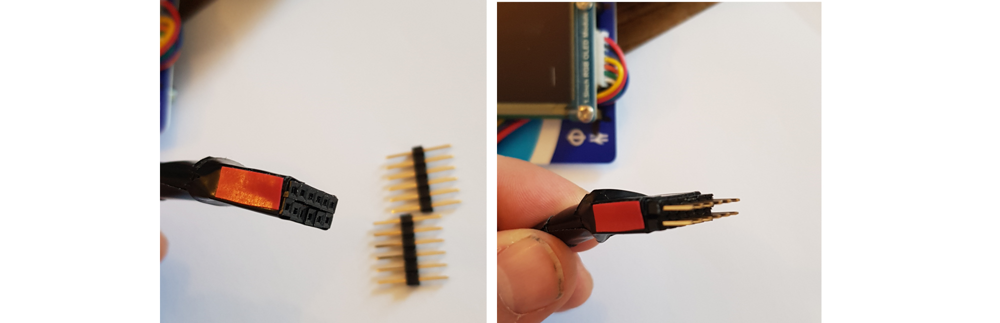

Oyster PMOD
===========

Create your own OysterPMOD, with a 8x8 led matrix, and a 128x128 OLED
display ! It can be assembled without any soldering. It is compatible 
with all femtorv processors and supported boards, and uses a single 
PMOD connector.

You will need:
- an old plastic card (Oyster card, credit card ...)
- a MAX7219 driven 8x8 led matrix (costs around $2)
- a SSD1351 128x128 oled display (costs around $10 - $15). You may find 
  cheaper clones, but they are sometimes reported not working.
- female-female dupont connecting wires for the led matrix
- connecting wires for the OLED display (most of the time they are
  shipped with it)
- small screws

Step 1
------
  - drill holes in the plastic card
  - attach the led matrix and the OLED display to the plastic card

Step 2
------

