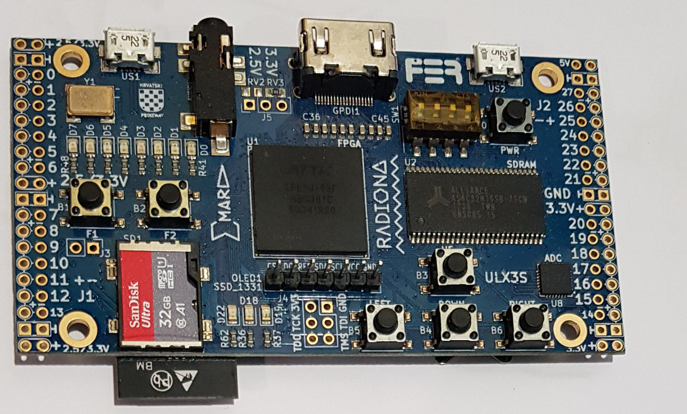
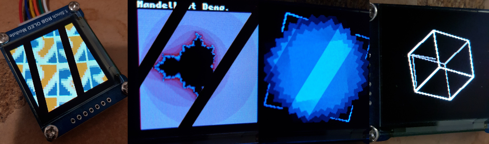
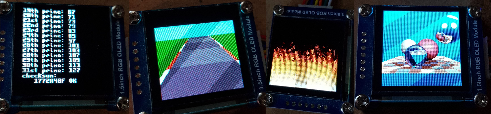

ULX3S Tutorial
==============



This tutorial will show you how to install FPGA development tools,
synthesize a RISC-V core, compile and install programs and run them
on a ULX3S.

Install open-source FPGA development toolchain
==============================================
Before starting, you will need to install the open-source FPGA
development toolchain (Yosys, NextPNR etc...), instructions to
do so are given [here](toolchain.md).

Configure femtosoc and femtorv32
================================
Time to edit `learn-fpga/FemtoRV/RTL/femtosoc_config.v`. This file lets you define what type
of RISC-V processor you will create, and which device drivers in the
associated system-on-chip. For now we activate the LEDs (for visual
debugging) and the UART (to talk with the system through a
terminal-over-USB connection). We use 256 Kbytes of RAM. It is not 
very much, but for now I'm not able to use the DRAM on the ULX3S
(but plan to integrate @sylefeb's SLICE memory controller).
You will see that
with 256kb of RAM, you can still program nice and interesting RISC-V
demos. 

We configure `FemtoRV/RTL/femtosoc_config.v` as follows (we keep unused options as commented-out lines):
```
/*
 * Optional mapped IO devices
 */
`define NRV_IO_LEDS         // Mapped IO, LEDs D1,D2,D3,D4 (D5 is used to display errors)
`define NRV_IO_UART         // Mapped IO, virtual UART (USB)
//`define NRV_IO_SSD1351      // Mapped IO, 128x128x64K OLed screen
//`define NRV_IO_MAX2719      // Mapped IO, 8x8 led matrix
//`define NRV_IO_SPI_FLASH    // Mapped IO, SPI flash  
//`define NRV_IO_SPI_SDCARD   // Mapped IO, SPI SDCARD
`define NRV_IO_BUTTONS      // Mapped IO, buttons

`define NRV_FREQ 50        // Frequency in MHz. You can try overclocking (up to 100 MHz)
                                                  
// Quantity of RAM in bytes. Needs to be a multiple of 4. 
// Can be decreased if running out of LUTs (address decoding consumes some LUTs).
// 6K max on the ICEstick
//`define NRV_RAM 393216       // bigger config for ULX3S
`define NRV_RAM 262144       // default for ULX3S
//`define NRV_RAM 6144         // default for IceStick (maximum)
//`define NRV_RAM 4096         // smaller for IceStick (to save LUTs)

`define NRV_CSR         // Uncomment if using something below (counters,...)
`define NRV_COUNTERS    // Uncomment for instr and cycle counters (won't fit on the ICEStick)
`define NRV_COUNTERS_64 // ... and uncomment this one as well if you want 64-bit counters
`define NRV_RV32M       // Uncomment for hardware mul and div support (RV32M instructions)

/*
 * For the small ALU (that is, when not using RV32M),
 * comment-out if running out of LUTs (makes shifter faster, 
 * but uses 60-100 LUTs) (inspired by PICORV32). 
 */ 
`define NRV_TWOSTAGE_SHIFTER 
```

Examples
========
You can now compile the firmware, synthesize the design and send it to
the device. Plug the device in a USB port, then:
```
$make ULX3S
```
The first time you run it, it will download RISC-V development tools (takes a while).
The default firmware outputs a welcome message to the terminal-over-USB port. First,
install a terminal emulator:
```
$sudo apt-get install python3-serial
```
(or `sudo apt-get install screen`, both work).
To see the output, you need to connect to it (using the terminal emulator):
```
$make terminal
```
(if you installed `screen` instead of `python3-serial`, edit
`Makefile` before accordingly. You may need also to change there ttyUSBnnn).

To exit, press `<ctrl> ]` (python-3-serial/miniterm), or `<ctrl> a` then '\\' (screen).

Examples with the serial terminal (UART)
========================================
The directories `FIRMWARE/EXAMPLES` and `FIRMWARE/ASM_EXAMPLES` contain programs in C and assembly
that you can run on the device. 

To compile a program:
```
$cd FIRMWARE
$./make_firmware.sh EXAMPLES/NNNN.c
```
or:
```
$cd FIRMWARE
$./make_firmware.sh ASM_EXAMPLES/NNNN.c
```

Then send it to the device and connect to the device using the terminal emulator:
```
$cd ..
$make ULX3S terminal
```

There are several C and assembly programs you can play with (list below). To learn more about RISC-V assembly,
see the [RISC-V specifications](https://riscv.org/technical/specifications/), 
in particular the [instruction
set](file:///tmp/mozilla_blevy0/riscv-spec.pdf) and the [programmer's
manual](https://github.com/riscv/riscv-asm-manual/blob/master/riscv-asm.md).

ASCII-art version of the Mandelbrot set, computed by a program in
assembly (`ASM_EXAMPLES/mandelbrot_terminal.S`)


| Program                                | Description                                                    |
|----------------------------------------|----------------------------------------------------------------|
| `ASM_EXAMPLES/blinker_shift.S`         | the blinker program, using shifts                              |
| `ASM_EXAMPLES/blinker_wait.S`          | the blinker program, using a delay loop                        |
| `ASM_EXAMPLES/test_serial.S`           | reads characters from the serial over USB, and sends them back |
| `ASM_EXAMPLES/mandelbrot_terminal.S`   | computes the Mandelbrot set and displays it in ASCII art       |
| `EXAMPLES/hello.c`                     | displays a welcome message                                     |
| `EXAMPLES/sieve.c`                     | computes prime numbers                                         |


Graphics
========

Let us do some graphics. For this, you have two options:
- the FGA (Femto Graphic Adapter) is a graphic board, that outputs
  video to the HDMI connector of the ULX3S,
- connect a small OLED display to the `OLED1` connector of the ULX3S.

These options can be selected in `RTL/CONFIGS/ulx3s_config.v`. You can
activate both if you want. If both are activated, the firmware mirrors 
what's displayed on the OLED display and sends it through HDMI. 

FGA (Femto Graphic Adapter)
---------------------------

The Femto Graphic Adapter supports the following mode:

| Mode          | Description                        |
|---------------|------------------------------------|
| 320x200x16bpp | 65536 colors, RGB                  |
| 320x200x8bpp  | 256 colors, colormapped, two pages |
| 640x400x4bpp  | 16 colors, colormapped             |


It supports hardware-accelerated `FILLRECT` operation, 
also used to clear the screen, and to draw scanlines in
polygon fill (it is 7 times faster than a software loop).

OLED screen
-----------


It is not mandatory, but it is cool to add a small OLED display. You
got two options, SSD1331 (top image row) or SSD1351 (bottom image row),
both are supported by the hardware/firmware (activate `NRV_IO_SSD1351`
or `NRV_IO_SSD1331` in'RTL/CONFIGS/ulx3s_config.v'). 

Which one should I use ? Here is a side-by-side comparizon to help you:

 |        SSD1351                |            SSD1331             |
 -----------------------------------------------------------------|
 |  +A large tiny screen !       |  -A bit too tiny               |
 |  -Needs wires on the ULX3S    |  +Fits well on a ULX3S         |
 |  -Cannot flip/rotate          |  +Flexible configuration       |
 |  -Nearly no accel. primitives |  +HW accel fillrect,scroll,copy|
 ------------------------------------------------------------------
 
- For both: luminous and crisp rendering, much better than LCD !
- For both: last but not least, supported by FemtoRV32/FemtoSOC !!

Then my recommendation is SSD1331 for ULX3S (and SSD1351 for other
boards). The main reason is that mechanically, SSD1331 fits very
well with the ULX3S. You will need to solder header pins to the ULX3S
(or ask a skilled friend, which is what I did, thank you @ssloy !!!).
On the SSD1331, you can solder a female header, as shown on the
top row images (my 14 years old son Nathan did the soldering, 
he is good !). For the SSD1351, connect the wires according to the names
on the ULX3S and the names on the display. Note that the pin names may
vary a bit, refer to this table:

| pin name on the ULX3S | pin description      | other possible names on the display |
|-----------------------|----------------------|-------------------------------------|
|  CS                   | Chip Select          |                                     |
|  DC                   | Data/Command         |                                     |
|  RES                  | Reset                | RST                                 |
|  SDA                  | Data                 | DIN                                 |
|  SCL                  | Clock                | CLK                                 |
|  VCC                  | +3.3V                |                                     |
|  GND                  | Ground               |                                     |
             

Now configure `FemtoRV/RTL/femtosoc_config.v` as follows:
```
/*
 * Optional mapped IO devices
 */
`define NRV_IO_LEDS         // Mapped IO, LEDs D1,D2,D3,D4 (D5 is used to display errors)
//`define NRV_IO_UART         // Mapped IO, virtual UART (USB)
`define NRV_IO_SSD1331      // Mapped IO, 96x64x64K OLed screen
//`define NRV_IO_SSD1351      // Mapped IO, 128x128x64K OLed screen (or this one)
//`define NRV_IO_MAX2719      // Mapped IO, 8x8 led matrix
//`define NRV_IO_SPI_FLASH    // Mapped IO, SPI flash  
//`define NRV_IO_SPI_SDCARD   // Mapped IO, SPI SDCARD
`define NRV_IO_BUTTONS      // Mapped IO, buttons
```

Let us compile a test program:
```
$ cd FIRMWARE
$ ./make_firmware.sh EXAMPLES/test_OLED.c
$ cd ..
$ make ULX3S
```
If everything goes well, you will see an animated colored pattern on
the screen. Note that the text-mode demos (`hello.c` and `sieve.c`)
still work and now display text on the screen. There are other
programs that you can play with:



_(The black diagonal stripes are due to display refresh, they are not visible normally)._

| Program                                      | Description                                                                      |
|----------------------------------------------|----------------------------------------------------------------------------------|
| `ASM_EXAMPLES/test_OLED.S`                   | displays an animated pattern.                                                    |
| `ASM_EXAMPLES/mandelbrot_OLED.S`             | displays the Mandelbrot set.                                                     |
| `EXAMPLES/cube_OLED.c`                       | displays a rotating 3D cube.                                                     |
| `EXAMPLES/mandelbrot_OLED.c`                 | displays the Mandelbrot set (C version).                                         |
| `EXAMPLES/riscv_logo_OLED.c`                 | a rotozoom with the RISCV logo (back to the 90's).                               |
| `EXAMPLES/spirograph_OLED.c`                 | rotating squares.                                                                |
| `EXAMPLES/test_OLED.c`                       | displays an animated pattern (C version).                                        |
| `EXAMPLES/demo_OLED.c`                       | demo of graphics functions(old chaps, remember EGAVGA.bgi ?).                    |
| `EXAMPLES/test_font_OLED.c`                  | test font rendering.                                                             |
| `EXAMPLES/sysconfig.c`                       | displays femtosoc and femtorv configurations.                                    |
|                                              |                                                                                  |
|_Larger ones (that would not fit on IceStick)_|                                                                                  |
| `EXAMPLES/imgui_xxxx.c`                      | some ports from [ImGui challenge](https://github.com/ocornut/imgui/issues/3606). |
| `EXAMPLES/mandelbrot_float_OLED.c`           | displays the Mandelbrot set (floating-point version, using gcc's software FP).   |
| `EXAMPLES/tinyraytracer.c`                   | a port from [TinyRaytracer](https://github.com/ssloy/tinyraytracer).             |

The LIBFEMTORV32 library includes some basic font rendering, 2D polygon clipping and 2D polygon filling routines. 
For most of the programs, everything fits in the available 6kbytes of
memory for the smallest configuration (IceStick) !
The larger programs use floating point arithmetics, implemented 
in software in gcc's libraries (there will be one day a hardware FPU
for femtorv32, maybe...). 

FemtOS
======

It is a pain to synthethize and flash each time you just want to
change the firmware. There is a command to replace the BRAM
initialization in the bitstream, but there is even better ! The ULX3S
has a SDCard reader, why not using it ? Would be great to be able to 
directly put executables on a SDCard and select programs using a
simple GUI. Let's do that ! Here is a (very crappy) OS that lets you
select and run programs from a SDCard. It is made possible by
@ultraembedded's [fat io lib](https://github.com/ultraembedded/fat_io_lib),
a wonderful piece of software that lets you read files from a
fat-formatted medium.

First, you need to activate the hardware driver for the SDCard in 
`FemtoRV/RTL/femtosoc_config.v`:
```
/*
 * Optional mapped IO devices
 */
`define NRV_IO_LEDS         // Mapped IO, LEDs D1,D2,D3,D4 (D5 is used to display errors)
//`define NRV_IO_UART         // Mapped IO, virtual UART (USB)
`define NRV_IO_SSD1351      // Mapped IO, 128x128x64K OLed screen
//`define NRV_IO_MAX2719      // Mapped IO, 8x8 led matrix
//`define NRV_IO_SPI_FLASH    // Mapped IO, SPI flash  
`define NRV_IO_SPI_SDCARD   // Mapped IO, SPI SDCARD
`define NRV_IO_BUTTONS      // Mapped IO, buttons
```

Then, compile `commander`, that is `FemtOS`'s component that can
select and launch programs from a SDCard:

```
$ cd FIRMWARE
$ ./make_firmware.sh EXAMPLES/commander.c
$ cd ..
$ make ULX3S.synth ULX3S.prog_flash
```
(we synthethize then send the generated bitstream to the ULX3S's flash
so that it will not be lost when the device is switched off)


Then you can compile a couple of programs:
```
$ cd FIRMWARE/EXAMPLES
$ make sieve.elf mandelbrot_OLED.elf 
```
(it works for all programs in `EXAMPLES`, but not in `ASM_EXAMPLES` yet).

Copy `sieve.elf` and `mandelbrot_OLED.elf` to a
FAT-formatted SDCard. Unplug the ULX3S from the USB, 
insert the SDCard into it and replug it into the USB. The up and
down buttons let you select the program, and the right button starts it.
The F2 button (near the SDCard) resets the machine (and restarts `commander`).

To compile all the examples, `make everything` in the `EXAMPLES`
directory. Note: do not copy too many programs on an SDCard,
`commander` display will not work if directory does not fit on
a single screen (to be fixed).

File access on the SDCard
=========================

Once again, @ultraembedded's [fat io lib](https://github.com/ultraembedded/fat_io_lib) 
is really an awesome piece of software. In a couple of `.c` files, it provides a
self-contained library and implementations of `fopen()`, `fread()`,
`fwrite()` and `fclose()`. Let us see how to use that to port a 
[Y2K demo called ST-NICCC](http://www.pouet.net/prod.php?which=1251).
The demo uses a precomputed stream of 2D polygons stored in a file.
To generate the demo, first copy the file `FIRMWARE/EXAMPLES/DATA/scene1.dat` 
(from the original ST-NICCC demo) to the SDCard. Then generate the
executable:
```
$ cd FIRMWARE/EXAMPLES
$ make ST_NICCC.elf
```
then copy `ST_NICCC.elf` to the SDCard, insert the SDCard in the ULX3S
and restart it, then select `ST_NICCC.elf` using the up/down buttons and
start it using the right button.

_Note: there is also a version `ST_NICCC_spi_flash.c` that reads data
from the SPI Flash (the same component that stores the FPGA
configuration in which there is sufficient room to store additional
data). It is used by the IceStick version. It works also on the ULX3S
(see instructions in the source)._

HDMI, FGA (Femto Graphics Adapter)
==================================

To enable HDMI display, edit `RTL/femtosoc_config.v` and uncomment the
line with `NRV_FGA` (femto graphics adapter), keep the OLED display
active (commander still needs it for now, I will make it display on
the HDMI later). Then synthethize and flash the ULX3S.

There are several programs that you can use, in `FIRMWARE/EXAMPLES`:

| Program                                      | Description                                                                      |
|----------------------------------------------|----------------------------------------------------------------------------------|
| `EXAMPLES/test_FGA.c`                        | Displays an animated colored pattern.                                            |
| `EXAMPLES/tinyrt_FGA.c`                      | A port from [TinyRaytracer](https://github.com/ssloy/tinyraytracer).             |

Compile them by `cd FIRMWARE/EXAMPLES` then `make xxx.elf` where `xxx` is the name of the program. Copy the generated `.elf` executable to
the SDCard. Plug the HDMI monitor to the ULX3S. Select the program using the up and down buttons, run it with the right button. The button
near the SDCard is the reset button.

If you want to write your own programs, it is very easy, just use `FGA_setpixel(X,Y,R,G,B)` where `X` and `Y` are the coordinates
(resolution is 320x200) and `R`,`G`,`B` the color components, each in 0..255.

If you want to do animations, you may need to directly write to the graphic memory.
Graphic memory starts at address `FGA_BASEMEM`. Each pixel is encoded in 16 bits.
The macro `GL_RGB` encodes a pixel from its r,g,b components (each of them between 0 and 255).
The `FGA_setpixel` function is written as follows: 
```
static inline FGA_setpixel(int x, int y, uint8_t R, uint8_t G, uint8_t B) {
  ((uint16_t*)FGA_BASEMEM)[320*y+x] = GL_RGB(R,G,B);
}
```
It tells you everyhting you need if you want to implement your own optimized graphic primitives.
The GL_RGB macro shifts and combines the components. It uses the same encoding as for the small OLED screen.

Epilogue
========

MORE TO COME / TO BE CONTINUED (with a cleaner FemtOS, priviledged instructions, system calls,
floating-point instructions, VGA output, PS/2 mouse and keyboard,
ImGui port...)