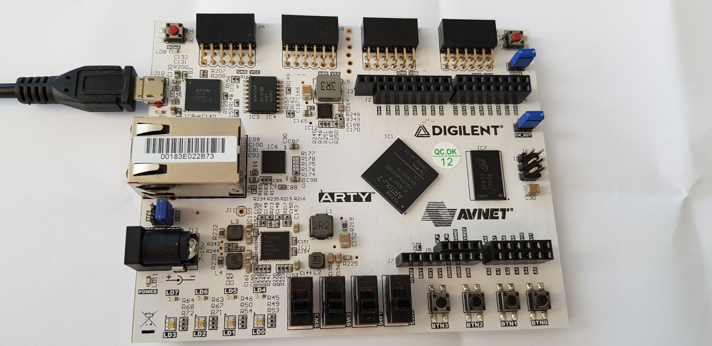

ARTY Tutorial
=================



This tutorial will show you how to install FPGA development tools,
synthesize a RISC-V core, compile and install programs and run them
on a ARTY. Note that ARTY support is work in progress: the UART does 
not work properly (displays garbage sometimes). The OLED display and
led matrix work fine. Framebuffer (FGA: Femto Graphic Adapter) and 
VGA output will be added soon.

Install open-source FPGA development toolchain
==============================================
Before starting, you will need to install the open-source FPGA
development toolchain (Yosys, NextPNR etc...), instructions to
do so are given [here](toolchain.md).


(Optional) configure femtosoc and femtorv32
============================================
Edit `learn-fpga/FemtoRV/RTL/CONFIGS/arty_config.v`

This file lets you define what type of RISC-V processor you will
create. 

The file `learn-fpga/FemtoRV/RTL/CONFIGS/arty_config.v`
also lets you select the device drivers present in the associated system-on-chip:

| Device                 | description                    | comment                           |
|------------------------|--------------------------------|-----------------------------------|
| `NRV_IO_LEDS`          | 5 leds                         | keep it                           |
| `NRV_IO_UART`          | serial connection through USB  | keep it                           |
| `NRV_IO_SSD1351`       | small OLED screen (128x128)    | comment-out if you do not have it |
| `NRV_IO_SSD1331`       | small OLED screen (96x64)      | comment-out if you do not have it |
| `NRV_IO_MAX7219`       | led matrix (10x10)             | comment-out if you do not have it |
| `NRV_MAPPED_SPI_FLASH` | flash mapped in memory space   | keep it                           |

We activate the LEDs (for visual debugging) and the UART (to talk with
the system through a terminal-over-USB connection). We use 64 Kbytes
of RAM. If you do not have an OLED screen or a led matrix screen, you
can comment out the corresponding lines in the file.

There are other options in the file. Normally you will not need to change them. If you want to know, they
are listed below:

| Option                   | Description                                                                          |
|--------------------------|--------------------------------------------------------------------------------------|
| `NRV_FREQ`               | Frequency of the processor in MHz (100 MHz on ARTY, cannot be changed)               |
| `NRV_RAM`                | Amount of RAM                                                                        |
| `NRV_RESET_ADDR`         | Address where to jump at startup and reset                                           |
| `NRV_IO_HARDWARE_CONFIG` | Hardware register that can be queried by code to see configured devices              |
| `NRV_RUN_FROM_SPI_FLASH` | Not supported for now on ARTY                                                        |

NOTE: you will need also to edit `BOARDS/arty.xdc` and comment-out all the pins that you do not use.

Compile firmware
================

```
$ cd learn-fpga/FemtoRV
$ make ARTY.firmware_config
$ cd FIRMWARE/EXAMPLES
$ make hello.hex
```
The first time you run it, it will download RISC-V development tools (takes a while).

Synthethize and program
=======================
You can now synthesize the design and send it to
the device. Plug the device in a USB port, then:
```
$make ARTY
```

If you have the OLED screen or the led matrix plugged in, you will see
the message. If you don't, it will be sent to the UART, but support is
currently broken (displays garbage). What follows is an explanation on
how to connect to the UART (but again, it will display garbage).

Now, install a terminal emulator:
```
$sudo apt-get install python3-serial
```
(or `sudo apt-get install screen`, both work).
To see the output, you need to connect to it (using the terminal emulator):
```
$make terminal
```
(if you installed `screen` instead of `python3-serial`, edit
`Makefile` before accordingly. You may need also to change there ttyUSBnnn).

If everything goes well, then your RISC-V core on the arty will
display a welcome message !

To exit, press `<ctrl> ]` (python-3-serial/miniterm), or `<ctrl> a` then '\\' (screen).

Examples with the serial terminal (UART)
========================================
The directories `FIRMWARE/EXAMPLES` and `FIRMWARE/ASM_EXAMPLES` contain programs in C and assembly
that you can run on the device. 

To compile a program:
```
$cd FIRMWARE/EXAMPLES
$make hello.prog
```

The `.prog` target generates the program and sends it to the device's SPI flash, using `iceprog`.
To see the result, use:
```
$cd ../..
$make terminal
```

There are several C and assembly programs you can play with (list below). To learn more about RISC-V assembly,
see the [RISC-V specifications](https://riscv.org/technical/specifications/), 
in particular the [instruction
set](file:///tmp/mozilla_blevy0/riscv-spec.pdf) and the [programmer's
manual](https://github.com/riscv/riscv-asm-manual/blob/master/riscv-asm.md).

ASCII-art version of the Mandelbrot set, computed by a program in
assembly (`ASM_EXAMPLES/mandelbrot_terminal.S`)


| Program                                | Description                                                    |
|----------------------------------------|----------------------------------------------------------------|
| `ASM_EXAMPLES/blinker_shift.S`         | the blinker program, using shifts                              |
| `ASM_EXAMPLES/blinker_wait.S`          | the blinker program, using a delay loop                        |
| `ASM_EXAMPLES/test_serial.S`           | reads characters from the serial over USB, and sends them back |
| `ASM_EXAMPLES/mandelbrot_terminal.S`   | computes the Mandelbrot set and displays it in ASCII art       |
| `EXAMPLES/hello.c`                     | displays a welcome message                                     |
| `EXAMPLES/sieve.c`                     | computes prime numbers                                         |


Examples with the LED matrix
============================

For more fun, you can add an 8x8 led matrix. It is cheap (less than
$1) and easy to find (just google search `max7219 8x8 led matrix`).
Make sure pin labels (CLK,CS,DIN,GND,VCC) correspond to the image, then
insert it in the J2 connector of the IceStik as shown on the image.
You can also build a [OysterPMOD](OysterPMOD.md) (with both a led
matrix and OLED screen using a single PMOD connector).

FemtoSOC configuration
----------------------
Now we need to activate hardware support for the led matrix (and
deactivate the UART). To do that, configure devices in `FemtoRV/RTL/CONFIGS/arty_config.v` as follows:
```
...
`define NRV_IO_MAX7219    // Mapped IO, 8x8 led matrix
...
```

NOTE: you will need also to edit `BOARDS/arty.xdc` and uncomment there
the pins used by the led matrix.

Then you need to re-synthethize and send the bitstream to the ARTY:
```
$make ARTY
```


Now you can compile the `hello world` program
(`FIRMWARE/EXAMPLES/hello.c`). Edit it and uncomment the following line:
```
femtosoc_tty_init();
```
This line automatically redirects `printf()` to the configured device
(here the led matrix). Now compile the program and send it to the device:
```
$cd FIRMWARE/EXAMPLES
$make hello.prog
```
When the led matrix is configured, `printf()` is automatically
redirected to the scroller display routine. The `sieve.c` program will
also behave like that.

There are other examples that you can play with:

| Program                                | Description                                                    |
|----------------------------------------|----------------------------------------------------------------|
| `ASM_EXAMPLES/test_led_matrix.S`       | display two images on the led matrix in ASM                    |
| `EXAMPLES/life_led_matrix.c`           | Game of life on a 8x8 toroidal world                           |


If you want to write your own program: in C, you first need
to switch the display on using `MAX7219_init()`, then you can use
the function `MAX7219(col,data)` where `col` is the column index in 1..8
(and not 0..7 !!!), and data an 8-bit integer indicating which led
should be lit. Take a look at `FIRMWARE/EXAMPLES/life_led_matrix.c` 
for reference.

Examples with the OLED screen
=============================


With its 64 pixels, our led matrix is somewhat limited and lacks
colors... Let us generate more fancy graphics. For this, you will need a
_SSD1351 128x128 oled display_. It costs around $15 (there exists
cheaper screens, such as 240x240 IPS screens driven by the ST7789, but
they really do not look as good, and they are not compatible, believe me
the SSD1351 is worth the price). Make sure you get one of good quality 
(if it costs less than $5 then I'd be suspicious, some users reported 
failures with such low-cost versions). Got mine from Waveshare. Those
from Adafruit were reported to work as well.

These little screens need 7 wires. The good news is that no soldering
is needed, just get a 2x6 pins connector such as the one on the image,
connect the wires as shown to the connector, then the connector to the
ARTY. If the colors of the wires do not match, use the schematic
on the right to know wich wire goes where. 

You can also build a [OysterPMOD](OysterPMOD.md) (with both a led
matrix and OLED screen using a single PMOD connector).

Now you need to reconfigure `arty_config.v` as follows:
```
...
`define NRV_IO_SSD1351    // Mapped IO, 128x128x64K OLed screen
...
```

NOTE: you will need also to edit `BOARDS/arty.xdc` and uncomment there
the pins used by the OLED screen.

Then you need to re-synthethize and send the bitstream to the ARTY:
```
$make ARTY
```


Let us compile a test program:
```
$ cd FIRMWARE/EXAMPLES
$ make gfx_test.prog
```
If everything goes well, you will see an animated colored pattern on
the screen. Note that the text-mode demos (`hello.c` and `sieve.c`)
still work and now display text on the screen. There are other
programs that you can play with:


_(The black diagonal stripes are due to display refresh, they are not visible normally)._

| Program                                | Description                                                    |
|----------------------------------------|----------------------------------------------------------------|
| `ASM_EXAMPLES/test_OLED.S`             | displays an animated pattern.                                  |
| `ASM_EXAMPLES/mandelbrot_OLED.S`       | displays the Mandelbrot set.                                   |
| `EXAMPLES/cube.c`                      | displays a rotating 3D cube.                                   |
| `EXAMPLES/mandelbrot.c`                | displays the Mandelbrot set (C version).                       |
| `EXAMPLES/riscv_logo.c`                | a rotozoom with the RISCV logo (back to the 90's).             |
| `EXAMPLES/spirograph.c`                | rotating squares.                                              |
| `EXAMPLES/gfx_test.c`                  | displays an animated pattern (C version).                      |
| `EXAMPLES/gfx_demo.c`                  | demo of graphics functions(old chaps, remember EGAVGA.bgi ?).  |
| `EXAMPLES/test_font_OLED.c`            | test font rendering.                                           |
| `EXAMPLES/sysconfig.c`                 | displays femtosoc and femtorv configurations.                  |

The LIBFEMTORV32 library includes some basic font rendering, 2D polygon clipping and 2D polygon filling routines. 
Everything fits in the available 6kbytes of memory ! 

Can we do more with this tiny system ? Yes, we can do _raytracing_ !
```
$ cd FIRMWARE/EXAMPLES
$ make tinyraytracer.hex
$ cd ../..
$ make ARTY
```

