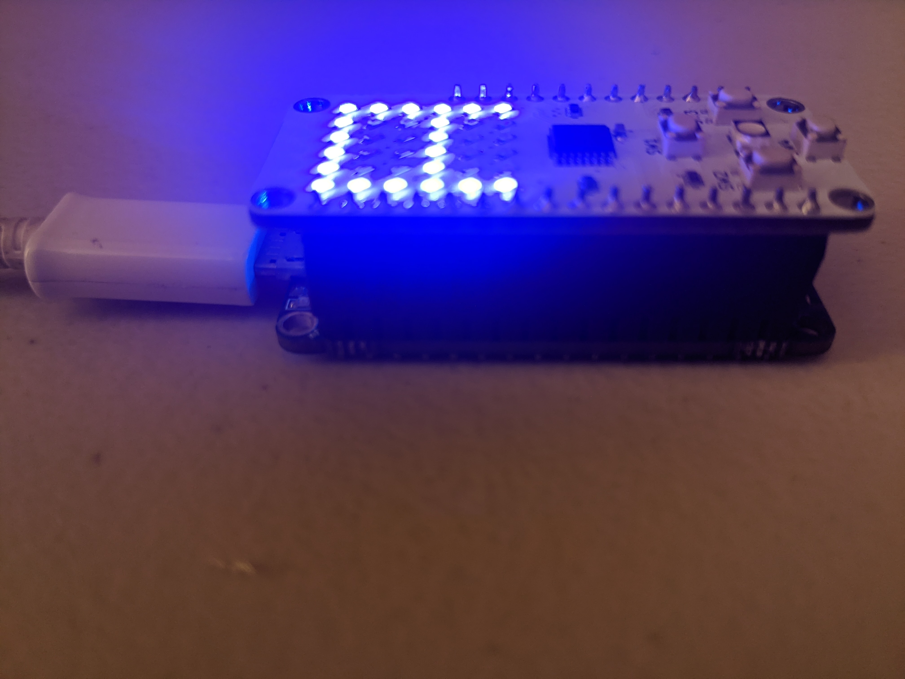
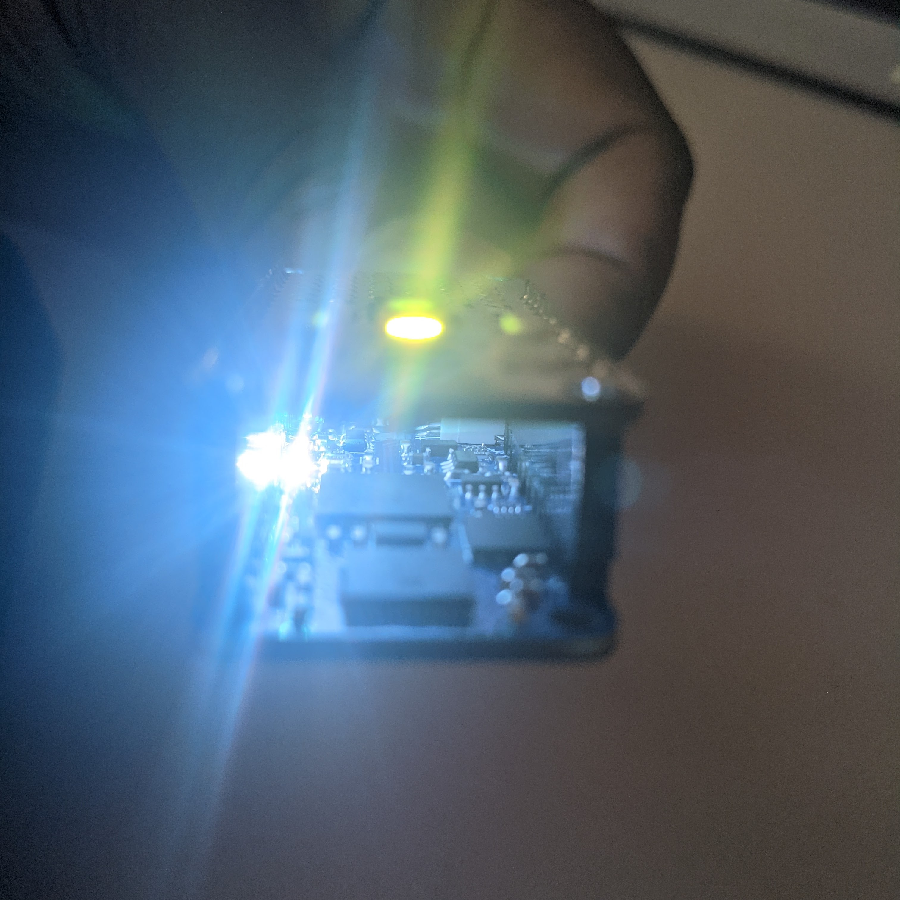

iCE40-Feather Tutorial _WIP_
======================


This tutorial is **WIP**. It will discuss how to install an FPGA toolchain on windows from pre-compiled packages at [open-tool-forge](https://github.com/open-tool-forge/fpga-toolchain/releases/tag/nightly-20201228) and source.

Most of the Ubuntu content is the same as the [IceStick Tutorial](IceStick.md) and omitted here for brevity. Focus is instead on jumping between WSL2 and Powershell to upload the firmware to the IceFeather.

In the particular caveat of compiling yosys for WSL2 from tip of the trunk, ABC value had to set to default in the configs.

Step 0: install FemtoRV
=======================
```
$ git clone https://github.com/BrunoLevy/learn-fpga.git
```

Step 1: install FPGA development tools
======================================

Refer to [IceStick Tutorial](IceStick.md), essentially clone and install [yosys website](https://github.com/YosysHQ/yosys), [icestorm](https://github.com/YosysHQ/icestorm) and [nextpnr](https://github.com/YosysHQ/nextpnr). Pre-compiled versions of these can also be obtained for windows
using [open-tool-forge](https://github.com/open-tool-forge/fpga-toolchain/releases/tag/nightly-20201228).

On windows install these under WSL2 or MSYS2 paths, somewhere make,bash and python are available to leverage the scripting this Tutorial provides.

Step 2: Configure Zadig USB Driver
==================================

On windows the stock FTDI driver does not play nice with iceprog. Select
the `libusbk` driver from [Zadig](https://zadig.akeo.ie/) to convert FTDI port 0 on the IceFeather to a programming port, leave FTDI port 1 as the
serial port to communicate with the processor once the gateware is loaded.

If using all the gateware building toolchain in WSL2, due to lack of [USB-passthrough](https://github.com/microsoft/WSL/issues/2195) the final upload stage will fail. At this point swap to
powershell / cmd and upload using the FPGA-Progtools bundle.

Step 3: Configure femtosoc and femtorv32
========================================
The pinmap and basic settings were imported following the procedure for [adding a new board](newboard.md) from original [iCE40-Feather repo](https://github.com/joshajohnson/iCE40-feather/). The D0 pin is used as RESET.

Ideal configs for the iceFeather / UP5K are still being investigated. A known issue is `SB_PLL40_CORE` needing to be replaced with `SB_PLL40_PAD` with a packagepin for CLK instead of ReferenceCLK for initial gateware building to work.

To try the pass-through clock at 12MHz instead use the following configuration block.
```
`define NRV_FREQ 12      // Frequency in MHz. Recomm: 50 MHz (FOMU: 16MHz) Overclocking: 80-100 MHz (HX1K, ECP5)
`define PASSTHROUGH_PLL
```

The ice-feather comes with an SPI Flash and a stock [led wing](https://github.com/joshajohnson/iCE40-feather/tree/master/hardware/led-wing) with a 6x6 LED Matrix , a second RGB LED and 4 buttons.

Set up the `femtosoc_config.v` to support the SPI flash by enabling / uncommenting this line.

```
//`define NRV_IO_SPI_FLASH  // Mapped IO, SPI flash 
```

Setup support for the wing based buttons by uncommenting this line

```
//`define NRV_IO_BUTTONS    // Mapped IO, buttons
```

The full config block looks like this currently, however this may change as more features and support for more peripherals is added.

```
`define NRV_IO_LEDS      // Mapped IO, LEDs D1,D2,D3,D4 (D5 is used to display errors)
`define NRV_IO_UART      // Mapped IO, virtual UART (USB)
//`define NRV_IO_SSD1351    // Mapped IO, 128x128x64K OLed screen
//`define NRV_IO_MAX7219      // Mapped IO, 8x8 led matrix
`define NRV_IO_SPI_FLASH  // Mapped IO, SPI flash  
//`define NRV_IO_SPI_SDCARD // Mapped IO, SPI SDCARD
`define NRV_IO_BUTTONS    // Mapped IO, buttons
//`define NRV_MAPPED_SPI_FLASH // SPI flash mapped in address space. Use with MINIRV32 to run code from SPI flash.
//`define NRV_FGA // Femto Graphic Adapter (ULX3S only)
```

The LED matrix shield in action and buttons are shown in the images
below.




The x2 RGB led's spread across the Base feather and the LED Wing are mapped to pins D1-D6 and when the FemtoRV Soc is loaded these light up as shown below.



Step 4: Configure a Firmware
============================

The ice40 parts have limited RAM and need firmware optimized for size. Edit `FemtoRV/FIRMWARE/makefile.inc` to use these options.

```
ARCH=rv32i
ABI=ilp32
OPTIMIZE=-Os
```

Then compile a sample firmware of your choice using `./make_firmware.sh ASM_EXAMPLES/mandelbrot_terminal.S` or similar for an
assembly or C based sample. The firmware making script compiles the firmware and places it in `firmware.hex`, this is then
packed into a bin file using `icepack` and sent to the board using `iceprog`.