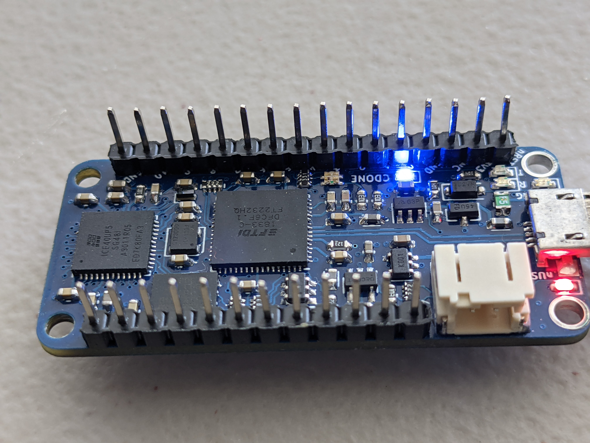

iCE40-Feather Tutorial _WIP_
======================



This tutorial is **WIP**. It will discuss how to install an FPGA toolchain on windows from pre-compiled packages at [open-tool-forge](https://github.com/open-tool-forge/fpga-toolchain/releases/tag/nightly-20201228) and source.

Most of the Ubuntu content is the same as the [IceStick Tutorial](IceStick.md) and omitted here for brevity. Focus is instead on jumping between WSL2 and Powershell to upload the firmware to the IceFeather.

In the particular caveat of compiling yosys for WSL2 from tip of the trunk, ABC value had to set to default in the configs.

Step 0: install FemtoRV
=======================
```
$ git clone https://github.com/BrunoLevy/learn-fpga.git
```

Step 1: install FPGA development tools
======================================

Refer to [IceStick Tutorial](IceStick.md), essentially clone and install [yosys website](https://github.com/YosysHQ/yosys), [icestorm](https://github.com/YosysHQ/icestorm) and [nextpnr](https://github.com/YosysHQ/nextpnr). Pre-compiled versions of these can also be obtained for windows
using [open-tool-forge](https://github.com/open-tool-forge/fpga-toolchain/releases/tag/nightly-20201228).

On windows install these under WSL2 or MSYS2 paths, somewhere make,bash and python are available to leverage the scripting this Tutorial provides.

Step 2: Configure Zadig USB Driver
==================================

On windows the stock FTDI driver does not play nice with iceprog. Select
the `libusbk` driver from [Zadig](https://zadig.akeo.ie/) to convert FTDI port 0 on the IceFeather to a programming port, leave FTDI port 1 as the
serial port to communicate with the processor once the gateware is loaded.

If using all the gateware building toolchain in WSL2, due to lack of [USB-passthrough](https://github.com/microsoft/WSL/issues/2195) the final upload stage will fail. At this point swap to
powershell / cmd and upload using the FPGA-Progtools bundle.

Step 3: Configure femtosoc and femtorv32
========================================
The pinmap and basic settings were imported following the procedure for [adding a new board](newboard.md) from original [iCE40-Feather repo](https://github.com/joshajohnson/iCE40-feather/). The D0 pin is used as RESET.

Ideal configs for the iceFeather / UP5K are still being investigated. A known issue is `SB_PLL40_CORE` needing to be replaced with `SB_PLL40_PAD` with a packagepin for CLK instead of ReferenceCLK for initial gateware building to work.