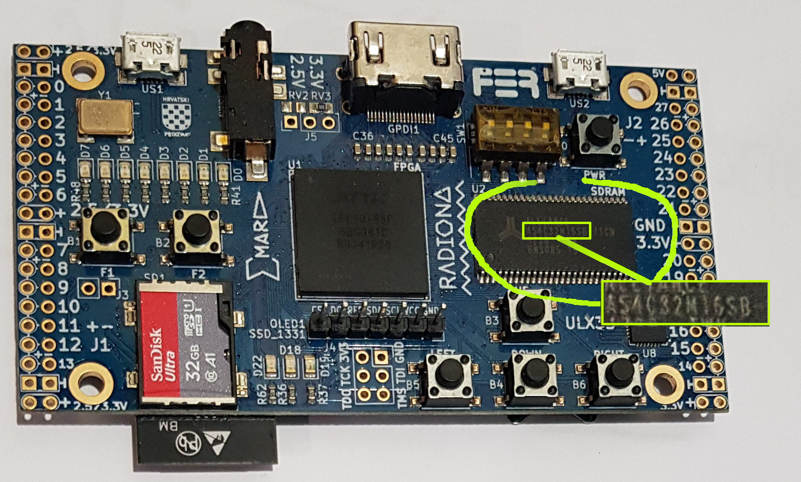

LiteX Instructions for ULX3S:
-----------------------------



The ULX3S is a nice board for starting to learn FPGA design. It has a
comfortable ECP5 FPGA (with 12K to 85K logic elements, depending on
the variant), an SDCard connector that can be used to store programs
and data, a video connector, and on-board SDRam (from 16MBytes to
32MBytes depending on the options). It also has an on-board
microcontroller (ESP32) with wifi, that can be used to remotely access
the SDCard. 

The ULX3S is directly supported by LiteX. We made a couple of small 
improvements as compared to the original LiteX design (see 
[boards/radiona_ulx3s_ex.py](boards/radiona_ulx3s_ex.py)), that is:
- circuitry to switch ESP32 on and off, and route the SDCard to the
  ESP32 or the FPGA. It makes it possible to upload files to the
  SDCard through Wifi while still using the FPGA. (NOTE: DEACTIVATED
  FOR NOW, NEEDS TO BE ADAPTED TO NEW LITEX)
- fixed a video timing problem 
- added a crude Blitter to accelerate some graphic functions (clear, fillrect, fillpoly)
- NOTE: you may need to do a [simple modification](https://github.com/enjoy-digital/litex/issues/1712) in
  one of LiteX's files to be able to access the SDCard.

To generate the bitstream for the ULX3S, you will first need to:

- determine FPGA variant: one of LFE5U-12F, LFE5U-25F, LFE5U-45F or LFE5U-85F
- determine SDRAM chip (see image): one of MT48LC16M16, AS4C32M16 or AS4C16M16

_Note 1: there exists variants of the ULX3S equipped with a IS42S16160G
SDRAM chip. For this one, use `--sdram-module MT48LC16M16` 
(thank you @darkstar007)._

_Note 2: if you use the framebuffer with the AS4C32M16 (64MB), SDRAM refresh
timings will not be met. Pretend it is an AS4C32M16 instead (32MB)._

Now you can:

- plug the board
- synthesize and load design (in the following command, replace FPGA variant and SDRAM chip with your own):
```
$ cd learn-fpga/LiteX
$ python3 -m boards.radiona_ulx3s_ex --device LFE5U-85F --sdram-module AS4C16M16 --cpu-type femtorv --cpu-variant petitbateau --build --load --ecppack-compress
```

- if you have installed the optional small OLED screen, add `--with-oled` flag to the command line.


This will download the dependencies (including the latest version of
FemtoRV directly from its github repository, great !). It will also
compile the BIOS, synthesize the gateware and send it to the
device. If everything went well, you will see the colorful 'knight
driver' blinky of victory on the LEDs. Now you can connect to the SoC
with `litex_term /dev/ttyUSB0`. 

Now let us see how to write some [software for our SoC](software/README.md).


If you want the bitstream to stay there after powering the board off, use: 
```
    fujprog -j FLASH build/radiona_ulx3s/gateware/radiona_ulx3s.bit
```