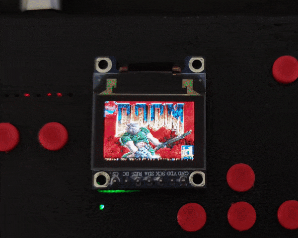

Doom for LiteOS
---------------

This directory contains a version of Doom to be used with LiteOS
(install LiteOS first, instructions [here](https://github.com/BrunoLevy/learn-fpga/tree/master/LiteX/software/LiteOS)).

Compile the programs: 
```
$ make
```
- Then copy `doom.elf` to the SDCard.
- Download [`DOOM1.WAD`](https://doomwiki.org/wiki/DOOM1.WAD) and copy it to the SDCard.

Connect a screen to the HDMI connector of the ULX3S

Connect to the SoC (`lxterm
/dev/ttyUSBnnn`), and start the program:
```
liteOS> run doom.elf
```

It will display a demo of the game. The game is not playable yet (routines to 
handle user input are not there yet).




SSD1331 OLED
------------

The Makefile also compiles `doom_oled.elf`, that you can use if you
have an SSD1331 installed on your ULX3S (note: make sure you synthesized
with support of the SSD1331).

It runs on SSD1331 oled display, rendering at 320x200 and nearest
neighbor downscale to 96x64.

Lower render resolutions cause errors and crashes, this needs to be
investigated and fixed, maybe some modded source ports have fixes.


How it works
------------

It is based on [mc1-doom](https://github.com/mbitsnbites/mc1-doom), a
port of Doom for SoCs. Doom is very easy to port in general (it is why 
you will see versions running on so many different machines). In our
case, there were two diffent things to do:

- LiteX has a `libfatfs` library to access files stored on a SDCard
(great !). However, it uses an API that is different from the standard
`open()`,`read()`,`close()` one. Then I needed to create a thin
"emulation layer" [here](https://github.com/BrunoLevy/learn-fpga/blob/master/LiteX/software/Libs/lite_stdio.h).

- When you port Doom to new hardware, you need to write the code that
communicates with you (graphics, sound and user input). For graphics,
the corresponding code is
[here](https://github.com/BrunoLevy/learn-fpga/blob/master/LiteX/software/Doom/mc1-doom/src/i_video_fb.c).
It is super simple, it just converts a colormapped image to RGB (LiteX
framebuffer does not support colormapped mode). 

    
