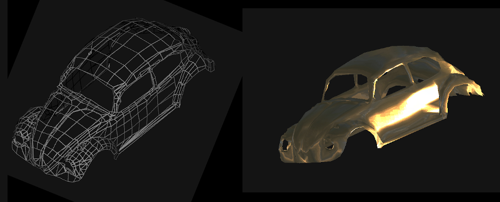

TAGL - a software rendererer
----------------------------

This directory contains TAGL, a software renderer that I wrote in the
90's (!)
(install LiteOS first, instructions [here](https://github.com/BrunoLevy/learn-fpga/tree/master/LiteX/software/LiteOS)).

Compile the programs: 
```
$ make
```
Then copy `rotate.elf` to the SDCard as well as all the files in the
`Objects` directory. Connect to the SoC (`lxterm /dev/ttyUSBnnn`), and start the program:
```
liteOS> run rotate.elf -geom vw.geom
```

It will display a car. Then you can interact with the visualization
using:

| key       | action                   |
|-----------|--------------------------|
| <shift> R | toggle rotation  X+      |
| <shift> E | toggle rotation  X-      |
| <shift> O | toggle rotation  Y+      |
| <shift> P | toggle rotation  Y-      |
| q         | quit program      -      |
| +         | zoom in                  |
| -         | zoom out                 |
| w         | toggle smooth shading    |
| d         | toggle dithering         |
| s         | toggle specular hilights |
| a         | toggle wireframe         |
| c         | toggle backface culling  |
| z         | toggle Zbuffer           |
| n         | flip normals             |


Some objects have an additional color spefication file (`.ipcol`),
then use:
```
liteOS> run rotate.elf -geom x29.geom -col x29.ipcol
```

Then you can use:

| key        | action                   |
|------------|--------------------------|
| <spacebar> | toggle color rendering   |


Some crude (no filtering) texture mapping is supported when you
specify a texture on the command line.
Then you can use:

| key        | action                                 |
|------------|----------------------------------------|
| t          | toggle texturing (in color mode only)  |
| T          | toggle normal mapping                  |


Example:
```
liteOS> run rotate.elf -geom vw.geom -tex sunset2.tga
```

Then press `<spacebar>` to toggle color mode, then `t` to toggle texture
mode, `T` to toggle normal mapping, and `R` to spin the object.

